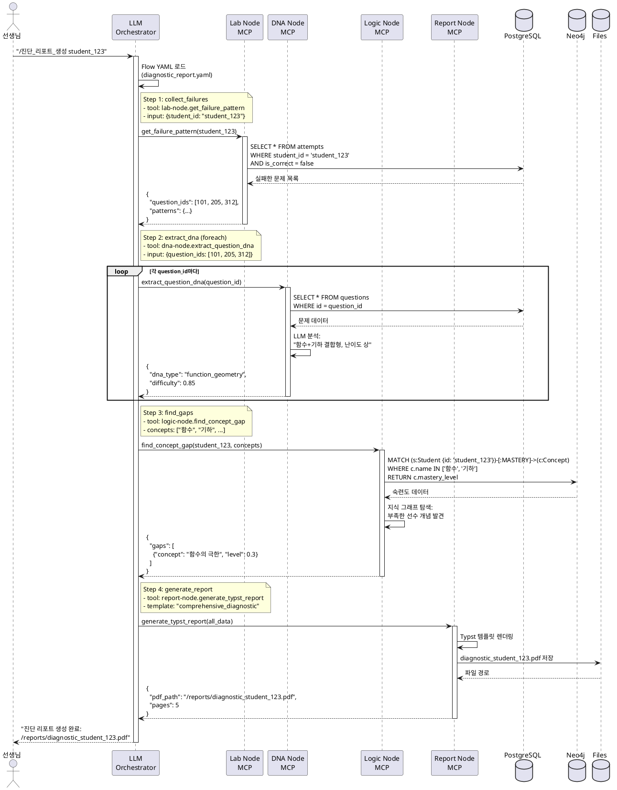

# Mathesis-Synapse: MCP 기반 자율 주행형 교육 플랫폼 설계

> Model Context Protocol + LLM Orchestrator로 구현하는 선언적 교육 아키텍처

**설계일**: 2026-01-08
**아키텍트**: Claude Sonnet 4.5
**상태**: Design Phase (구현 전)
**목표**: 기획서의 비전을 100% 구현 가능한 상세 설계로 전환

---

## 📋 Executive Summary

### 핵심 차별점

| 구분 | 기존 MSA | Mathesis-Synapse |
|------|----------|------------------|
| **통신** | REST API 직접 호출 | MCP Protocol |
| **제어** | 하드코딩된 Python 로직 | LLM Orchestrator |
| **유지보수** | 코드 수정 필요 | Flow YAML 수정 |
| **확장성** | 새 API 개발 | MCP Tool 추가 |
| **자율성** | 개발자 개입 필요 | LLM이 자율 판단 |

### 시스템 구성

```
┌─────────────────────────────────────────────────────────────┐
│                    사용자 인터페이스                          │
│              (자연어 명령어: "/진단_리포트_생성")              │
└──────────────────────┬──────────────────────────────────────┘
                       │
                       ▼
┌─────────────────────────────────────────────────────────────┐
│              🧠 LLM Orchestrator (The Brain)                 │
│         LangGraph + Claude 3.5 Sonnet / GPT-4o              │
│                                                              │
│  ┌──────────────────────────────────────────────────┐      │
│  │  Flow Interpreter: YAML → Execution Plan         │      │
│  │  Tool Router: MCP Tools 동적 호출                 │      │
│  │  State Manager: 워크플로우 상태 추적               │      │
│  └──────────────────────────────────────────────────┘      │
└───────┬──────────┬──────────┬──────────┬──────────┬────────┘
        │          │          │          │          │
        ▼          ▼          ▼          ▼          ▼
   ┌────────┐ ┌────────┐ ┌────────┐ ┌────────┐ ┌────────┐
   │ Node 1 │ │ Node 2 │ │ Node 3 │ │ Node 4 │ │ Node 5 │
   │ Logic  │ │ Q-DNA  │ │  Gen   │ │  Lab   │ │ Report │
   │ Engine │ │        │ │  Node  │ │  Node  │ │  Node  │
   └────┬───┘ └────┬───┘ └────┬───┘ └────┬───┘ └────┬───┘
        │          │          │          │          │
        ▼          ▼          ▼          ▼          ▼
   ┌────────────────────────────────────────────────────┐
   │           MCP Server (각 노드 내장)                 │
   │  - Tool Registry: MCP Tools 목록                   │
   │  - Schema Validator: 입출력 검증                   │
   │  - Error Handler: 예외 처리                        │
   └────┬───────────────────────────────────────────────┘
        │
        ▼
   ┌────────────────────────────────────────────────────┐
   │         mathesis-common (공통 라이브러리)            │
   │  - OllamaClient, ChromaHybridStore                 │
   │  - BaseCrawler, PDFGenerator, TypstWrapper         │
   └────────────────────────────────────────────────────┘
```

---

## 🏗️ 1. Architecture Principles

### 1.1 Model Context Protocol (MCP)

**MCP란?**
- Anthropic이 개발한 **AI 에이전트와 도구 간 표준 통신 프로토콜**
- OpenAPI가 REST API의 표준이라면, MCP는 **LLM Tool의 표준**
- JSON-RPC 2.0 기반

**MCP Server 구조**:
```python
# 각 노드의 MCP Server 예시
from mcp.server import Server
from mcp.server.stdio import stdio_server

app = Server("logic-engine-mcp")

@app.tool()
async def get_prerequisites(
    concept_id: str,
    depth: int = 2
) -> dict:
    """
    개념의 선수 지식 트리를 반환

    Args:
        concept_id: 개념 ID (예: "calculus_derivative")
        depth: 탐색 깊이 (기본 2단계)

    Returns:
        {
            "concept_id": "calculus_derivative",
            "prerequisites": [
                {
                    "id": "algebra_functions",
                    "title": "함수의 이해",
                    "level": 1,
                    "prerequisites": [...]
                }
            ]
        }
    """
    # Neo4j 쿼리 실행
    result = await neo4j_query(concept_id, depth)
    return result

# MCP 서버 실행
if __name__ == "__main__":
    stdio_server(app)
```

**MCP의 장점**:
1. **표준화**: 모든 LLM이 동일한 방식으로 도구 호출
2. **자동 스키마 생성**: Docstring → JSON Schema 자동 변환
3. **타입 안전성**: Pydantic 기반 입출력 검증
4. **에러 핸들링**: 표준 에러 코드 및 메시지

### 1.2 LLM Orchestrator (The Brain)

**역할**:
```
사용자 명령어 → LLM 해석 → Flow 선택 → MCP Tools 순차 호출 → 결과 통합
```

**구현 기술**: LangGraph
- **상태 그래프**: 워크플로우를 DAG(Directed Acyclic Graph)로 표현
- **조건부 분기**: LLM이 상황에 따라 다른 경로 선택
- **체크포인트**: 중간 상태 저장 및 재개 가능

**LangGraph 예시**:
```python
from langgraph.graph import StateGraph, END
from langchain_anthropic import ChatAnthropic

# 상태 정의
class WorkflowState(TypedDict):
    student_id: str
    failure_patterns: list
    dna_results: list
    concept_gaps: list
    report_path: str

# 노드 정의
async def get_failures(state: WorkflowState):
    """Lab Node에서 실패 패턴 수집"""
    result = await mcp_call("lab-node", "get_failure_pattern", {
        "student_id": state["student_id"]
    })
    return {"failure_patterns": result}

async def analyze_dna(state: WorkflowState):
    """DNA Node에서 문제 DNA 분석"""
    results = []
    for question_id in state["failure_patterns"]:
        dna = await mcp_call("dna-node", "extract_question_dna", {
            "question_id": question_id
        })
        results.append(dna)
    return {"dna_results": results}

# 그래프 구성
workflow = StateGraph(WorkflowState)
workflow.add_node("get_failures", get_failures)
workflow.add_node("analyze_dna", analyze_dna)
workflow.add_node("find_gaps", find_concept_gaps)
workflow.add_node("generate_report", create_pdf_report)

workflow.set_entry_point("get_failures")
workflow.add_edge("get_failures", "analyze_dna")
workflow.add_edge("analyze_dna", "find_gaps")
workflow.add_edge("find_gaps", "generate_report")
workflow.add_edge("generate_report", END)

app = workflow.compile()
```

### 1.3 선언적 워크플로우 (Flow YAML)

**개념**: 코드 대신 **선언적 정의**로 비즈니스 로직 작성

**예시**: `flows/diagnostic_report.yaml`
```yaml
name: "진단 리포트 생성"
description: "학생의 학습 데이터를 수집하여 PDF 진단 리포트 생성"
version: "1.0"

trigger:
  type: "command"
  pattern: "/진단_리포트_생성"
  args:
    - name: "student_id"
      type: "string"
      required: true

steps:
  - id: "collect_failures"
    tool: "lab-node.get_failure_pattern"
    input:
      student_id: "{args.student_id}"
      time_range: "last_30_days"
    output: "failures"

  - id: "extract_dna"
    tool: "dna-node.extract_question_dna"
    input:
      question_ids: "{failures.question_ids}"
    output: "dna_list"
    foreach: true  # 각 question_id마다 실행

  - id: "find_gaps"
    tool: "logic-node.find_concept_gap"
    input:
      student_id: "{args.student_id}"
      concepts: "{dna_list[*].main_concept}"
    output: "gaps"

  - id: "generate_report"
    tool: "report-node.generate_typst_report"
    input:
      student_id: "{args.student_id}"
      failures: "{failures}"
      dna_analysis: "{dna_list}"
      concept_gaps: "{gaps}"
      template: "comprehensive_diagnostic"
    output: "report"

response:
  type: "file"
  path: "{report.pdf_path}"
  message: "진단 리포트가 생성되었습니다: {report.pdf_path}"
```

**Flow 수정 시나리오**:
```yaml
# 요구사항: "연산 실수 80% 이상이면 문제 생성 대신 개념 영상 추천"

# Before (문제 생성)
- id: "generate_problem"
  tool: "gen-node.generate_picket_problem"
  input:
    gap: "{gaps[0]}"

# After (조건부 분기 추가)
- id: "check_error_type"
  tool: "dna-node.classify_error_type"
  input:
    dna_list: "{dna_list}"
  output: "error_classification"

- id: "recommend_content"
  condition: "error_classification.calculation_error_rate > 0.8"
  branches:
    - when: true
      tool: "gen-node.recommend_concept_video"
      input:
        concept: "{gaps[0].concept_id}"
    - when: false
      tool: "gen-node.generate_picket_problem"
      input:
        gap: "{gaps[0]}"
```

**코드 수정 없이 Flow만 수정** → 시스템 전체 동작 변경!

---

## 🔧 2. Technology Stack

### 2.1 Core Technologies

| 계층 | 기술 | 버전 | 용도 |
|------|------|------|------|
| **Protocol** | MCP | latest | LLM-Tool 통신 표준 |
| **Orchestration** | LangGraph | 0.3+ | 워크플로우 엔진 |
| **LLM Framework** | LangChain | 0.3+ | LLM 추상화 레이어 |
| **Backend** | FastAPI | 0.115+ | 각 노드 HTTP 서버 (보조) |
| **Python** | Python | 3.11+ | 모든 서비스 |

### 2.2 AI Models

| 용도 | 모델 | 특징 |
|------|------|------|
| **Orchestrator** | Claude 3.5 Sonnet | 복잡한 추론, Tool Use 최적화 |
| **대안 1** | GPT-4o | 빠른 응답, 비용 효율 |
| **대안 2** | Gemini 1.5 Pro | 긴 컨텍스트 (100만 토큰) |
| **로컬 추론** | Llama 3.1 (Ollama) | 개념 추출, 간단한 분류 |
| **임베딩** | nomic-embed-text | 벡터 DB용 |

### 2.3 Infrastructure

**Development**:
```
Local Machine
  ├── MCP Servers (stdio, 각 노드별 프로세스)
  ├── LLM Orchestrator (Python 프로세스)
  ├── Databases (Docker Compose)
  │   ├── Neo4j (Logic Engine, Q-Metrics)
  │   ├── PostgreSQL (Q-DNA, Lab Node)
  │   ├── ChromaDB (School Info)
  │   └── Redis (캐시)
  └── Ollama (로컬 LLM)
```

**Production** (Phase 3):
```
GCP Cloud Run (각 노드 컨테이너)
  ├── MCP Servers (HTTP SSE)
  ├── LLM Orchestrator (Cloud Run)
  ├── Cloud SQL (PostgreSQL)
  ├── Neo4j Aura (Managed)
  ├── Qdrant Cloud (Vector DB)
  └── Firestore (Flow 정의 저장)
```

### 2.4 mathesis-common 통합

**활용 모듈**:
```python
# mathesis-common/mathesis_core/

# 1. LLM Clients
from mathesis_core.llm import OllamaClient
llm = OllamaClient(model="llama3.1")
result = await llm.generate("개념 추출: {text}")

# 2. Vector Stores
from mathesis_core.db import ChromaHybridStore, HierarchicalChromaStore
store = HierarchicalChromaStore(
    collection_prefix="school_info",
    ollama_client=llm
)

# 3. Crawlers
from mathesis_core.crawlers import SchoolInfoCrawler
crawler = SchoolInfoCrawler()
data = await crawler.crawl(school_code="7001234")

# 4. Document Generators
from mathesis_core.export import TypstWrapper
typst = TypstWrapper()
pdf_path = await typst.compile(
    template="diagnostic_report.typ",
    data=report_data
)
```

**새로 추가할 모듈**:
```python
# mathesis-common/mathesis_core/mcp/

# MCP Client (Orchestrator에서 사용)
from mathesis_core.mcp import MCPClient

client = MCPClient()
await client.connect("logic-engine", transport="stdio")
result = await client.call_tool("get_prerequisites", {
    "concept_id": "calculus_derivative"
})

# MCP Server Wrapper
from mathesis_core.mcp import MCPServer

app = MCPServer("my-node")

@app.tool()
async def my_tool(param: str) -> dict:
    return {"result": param}
```

---

## 📊 3. System Components

### 3.1 Component Diagram (PlantUML)

```plantuml
@startuml
!include https://raw.githubusercontent.com/plantuml-stdlib/C4-PlantUML/master/C4_Component.puml

LAYOUT_WITH_LEGEND()

title Mathesis-Synapse Component Diagram

Container_Boundary(orchestrator, "LLM Orchestrator") {
    Component(flow_interpreter, "Flow Interpreter", "Python", "YAML → Execution Plan")
    Component(tool_router, "Tool Router", "LangGraph", "MCP Tools 호출 관리")
    Component(state_manager, "State Manager", "LangGraph", "워크플로우 상태 추적")
    Component(llm_engine, "LLM Engine", "Claude/GPT", "자연어 이해 및 추론")
}

Container_Boundary(nodes, "MCP Nodes") {
    Component(node1_mcp, "Logic Engine MCP", "MCP Server", "지식 그래프 도구")
    Component(node2_mcp, "Q-DNA MCP", "MCP Server", "문제 DNA 도구")
    Component(node3_mcp, "Gen Node MCP", "MCP Server", "콘텐츠 생성 도구")
    Component(node4_mcp, "Lab Node MCP", "MCP Server", "학생 데이터 도구")
    Component(node5_mcp, "Report Node MCP", "MCP Server", "리포트 생성 도구")
}

Container_Boundary(common, "mathesis-common") {
    Component(llm_clients, "LLM Clients", "Python", "Ollama, Anthropic")
    Component(db_adapters, "DB Adapters", "Python", "Chroma, Neo4j")
    Component(doc_generators, "Doc Generators", "Python", "Typst, PDF")
    Component(mcp_base, "MCP Base", "Python", "MCP 공통 유틸")
}

Container_Boundary(storage, "Data Storage") {
    ComponentDb(neo4j, "Neo4j", "Graph DB", "지식 그래프")
    ComponentDb(postgres, "PostgreSQL", "RDBMS", "문제, 학생 데이터")
    ComponentDb(chroma, "ChromaDB", "Vector DB", "RAG")
    ComponentDb(redis, "Redis", "Cache", "세션, 임시 데이터")
}

Rel(flow_interpreter, tool_router, "실행 계획 전달")
Rel(tool_router, state_manager, "상태 업데이트")
Rel(tool_router, llm_engine, "동적 의사결정 요청")

Rel(tool_router, node1_mcp, "MCP call", "JSON-RPC")
Rel(tool_router, node2_mcp, "MCP call", "JSON-RPC")
Rel(tool_router, node3_mcp, "MCP call", "JSON-RPC")
Rel(tool_router, node4_mcp, "MCP call", "JSON-RPC")
Rel(tool_router, node5_mcp, "MCP call", "JSON-RPC")

Rel(node1_mcp, llm_clients, "uses")
Rel(node1_mcp, db_adapters, "uses")
Rel(node2_mcp, llm_clients, "uses")
Rel(node3_mcp, doc_generators, "uses")
Rel(node5_mcp, doc_generators, "uses")

Rel(node1_mcp, neo4j, "reads/writes")
Rel(node2_mcp, postgres, "reads/writes")
Rel(node4_mcp, postgres, "reads/writes")

@enduml
```

### 3.2 Node Overview

| Node | 도메인 | MCP Tools (3개) | Database | 특이사항 |
|------|--------|-----------------|----------|----------|
| **Node 1** | 지식 그래프 | get_prerequisites, find_concept_gap, visualize_knowledge_map | Neo4j + PostgreSQL | GROBID 논문 파싱 |
| **Node 2** | 문제 은행 | extract_question_dna, find_similar_dna_problems, tag_new_problem | PostgreSQL (ltree) | BKT/IRT 알고리즘 |
| **Node 3** | 콘텐츠 생성 | generate_picket_problem, create_explanation_step, render_math_latex | - (Stateless) | LaTeX 렌더링 |
| **Node 4** | 학생 관리 | update_student_heatmap, log_activity, get_failure_pattern | PostgreSQL | 히트맵 시각화 |
| **Node 5** | 리포트 생성 | generate_typst_report, create_growth_chart, synthesize_diagnostic_insight | - (Stateless) | Typst PDF 생성 |
| **Node 6** | 학교 정보 | (기존 REST API 유지) | ChromaDB | RAG 시스템 |

---

## 🔄 4. Workflow Examples

### 4.1 Sequence Diagram: "/진단_리포트_생성"



### 4.2 실시간 워크플로우 수정 시나리오

**상황**: 선생님이 "앞으로 오답 분석 시, 연산 실수 DNA가 80% 이상이면 문제 생성 대신 개념 영상을 먼저 추천해줘."

**Before**: `flows/weakness_targeting.yaml`
```yaml
steps:
  - id: "analyze_weakness"
    tool: "dna-node.extract_question_dna"
    # ...

  - id: "generate_content"
    tool: "gen-node.generate_picket_problem"  # 항상 문제 생성
    input:
      gap: "{gaps[0]}"
```

**After**: 조건부 분기 추가
```yaml
steps:
  - id: "analyze_weakness"
    tool: "dna-node.extract_question_dna"
    output: "dna"

  - id: "classify_error"
    tool: "dna-node.classify_error_type"
    input:
      dna: "{dna}"
    output: "error_type"

  - id: "recommend_content"
    condition:
      field: "error_type.calculation_error_rate"
      operator: ">"
      value: 0.8
    branches:
      - when: true
        tool: "gen-node.recommend_concept_video"
        input:
          concept: "{dna.main_concept}"
          focus: "calculation_practice"
      - when: false
        tool: "gen-node.generate_picket_problem"
        input:
          gap: "{gaps[0]}"
```

**결과**:
- ✅ **코드 수정 없음**
- ✅ Flow YAML만 수정
- ✅ 시스템 재배포 불필요
- ✅ 즉시 적용

---

## 🗃️ 5. Data Architecture

### 5.1 Database Schema

**Node 1 (Logic Engine) - Neo4j**:
```cypher
// 개념 노드
CREATE (c:Concept {
  id: "calculus_derivative",
  title: "미분",
  description: "...",
  level: 3,
  curriculum_code: "MAT_12_01"
})

// 선수 관계
CREATE (prerequisite:Concept {id: "algebra_functions"})
CREATE (c)-[:PREREQUISITE {weight: 0.9}]->(prerequisite)

// 학생 숙련도
CREATE (s:Student {id: "student_123"})
CREATE (s)-[:MASTERY {level: 0.75, updated_at: datetime()}]->(c)
```

**Node 2 (Q-DNA) - PostgreSQL**:
```sql
-- 문제 테이블
CREATE TABLE questions (
    id SERIAL PRIMARY KEY,
    content TEXT NOT NULL,
    dna_type VARCHAR(50),  -- "function_geometry", "algebra_pure", ...
    difficulty FLOAT,       -- 0.0 ~ 1.0
    tags TEXT[],
    curriculum_path ltree,  -- '수학.미적분.미분.도함수'
    created_at TIMESTAMP DEFAULT NOW()
);

-- DNA 유사도 인덱스
CREATE INDEX idx_dna_type ON questions USING gin(to_tsvector('korean', dna_type));

-- 학생 응답 이력
CREATE TABLE attempts (
    id SERIAL PRIMARY KEY,
    student_id VARCHAR(50) NOT NULL,
    question_id INT REFERENCES questions(id),
    is_correct BOOLEAN,
    response_time INT,  -- 초
    error_type VARCHAR(50),  -- "calculation", "concept", "careless"
    created_at TIMESTAMP DEFAULT NOW()
);
```

**Node 4 (Lab Node) - PostgreSQL**:
```sql
-- 학생 히트맵 (개념별 숙련도)
CREATE TABLE student_heatmap (
    student_id VARCHAR(50),
    concept_id VARCHAR(100),
    mastery_level FLOAT,  -- 0.0 ~ 1.0 (BKT 알고리즘 결과)
    attempts_count INT,
    last_updated TIMESTAMP DEFAULT NOW(),
    PRIMARY KEY (student_id, concept_id)
);

-- 학습 활동 로그
CREATE TABLE activity_logs (
    id SERIAL PRIMARY KEY,
    student_id VARCHAR(50),
    activity_type VARCHAR(50),  -- "question_attempt", "video_watch", "concept_review"
    metadata JSONB,
    created_at TIMESTAMP DEFAULT NOW()
);

CREATE INDEX idx_activity_student ON activity_logs(student_id, created_at DESC);
```

### 5.2 MCP Tool Input/Output Schemas

**Node 1: Logic Engine**

```typescript
// Tool 1: get_prerequisites
interface GetPrerequisitesInput {
  concept_id: string;        // "calculus_derivative"
  depth?: number;            // 탐색 깊이 (기본 2)
  include_mastery?: boolean; // 학생 숙련도 포함 여부
}

interface GetPrerequisitesOutput {
  concept_id: string;
  prerequisites: Array<{
    id: string;
    title: string;
    level: number;  // 선수 관계 깊이
    weight: number; // 중요도 (0.0 ~ 1.0)
    prerequisites?: Array<...>; // 재귀 구조
  }>;
}

// Tool 2: find_concept_gap
interface FindConceptGapInput {
  student_id: string;
  target_concept: string;  // 목표 개념
}

interface FindConceptGapOutput {
  student_id: string;
  target_concept: string;
  gaps: Array<{
    concept_id: string;
    concept_title: string;
    current_mastery: number;  // 현재 숙련도
    required_mastery: number; // 필요 숙련도
    gap_score: number;        // 갭 크기
    priority: "high" | "medium" | "low";
  }>;
  learning_path: string[];  // 추천 학습 순서
}

// Tool 3: visualize_knowledge_map
interface VisualizeKnowledgeMapInput {
  student_id: string;
  concept_ids: string[];
  format?: "svg" | "png" | "graphml";
}

interface VisualizeKnowledgeMapOutput {
  image_path: string;
  metadata: {
    total_concepts: number;
    mastered_concepts: number;
    gap_concepts: number;
  };
}
```

**Node 2: Q-DNA**

```typescript
// Tool 1: extract_question_dna
interface ExtractQuestionDNAInput {
  question_id: number;
}

interface ExtractQuestionDNAOutput {
  question_id: number;
  dna_type: string;  // "function_geometry", "algebra_pure"
  main_concept: string;
  sub_concepts: string[];
  difficulty: number;  // 0.0 ~ 1.0
  cognitive_level: "remember" | "understand" | "apply" | "analyze" | "evaluate" | "create";
  estimated_time: number;  // 초
  tags: string[];
}

// Tool 2: find_similar_dna_problems
interface FindSimilarDNAProblemsInput {
  reference_dna: string;  // "function_geometry"
  difficulty_range?: [number, number];  // [0.6, 0.9]
  limit?: number;
}

interface FindSimilarDNAProblemsOutput {
  similar_problems: Array<{
    question_id: number;
    similarity_score: number;  // 코사인 유사도
    dna_type: string;
    difficulty: number;
  }>;
}

// Tool 3: tag_new_problem
interface TagNewProblemInput {
  question_content: string;
  image_url?: string;  // OCR용
}

interface TagNewProblemOutput {
  question_id: number;
  auto_tags: string[];
  suggested_dna: string;
  confidence: number;
}
```

**Node 3: Gen Node**

```typescript
// Tool 1: generate_picket_problem
interface GeneratePicketProblemInput {
  target_concept: string;
  difficulty: number;
  student_level: number;  // 학생 현재 수준
  avoid_patterns?: string[];  // 피해야 할 유형
}

interface GeneratePicketProblemOutput {
  problem_text: string;
  solution_steps: Array<{
    step_number: number;
    description: string;
    latex?: string;
  }>;
  hints: string[];
  estimated_difficulty: number;
}

// Tool 2: create_explanation_step
interface CreateExplanationStepInput {
  concept: string;
  student_error: string;  // 학생이 한 실수
  target_age: number;
}

interface CreateExplanationStepOutput {
  explanation: string;
  examples: string[];
  practice_problems: Array<{
    text: string;
    answer: string;
  }>;
}

// Tool 3: render_math_latex
interface RenderMathLatexInput {
  latex_code: string;
  format?: "png" | "svg";
  dpi?: number;
}

interface RenderMathLatexOutput {
  image_path: string;
  width: number;
  height: number;
}
```

**Node 4: Lab Node**

```typescript
// Tool 1: update_student_heatmap
interface UpdateStudentHeatmapInput {
  student_id: string;
  concept_id: string;
  attempt_result: boolean;  // 정답 여부
}

interface UpdateStudentHeatmapOutput {
  student_id: string;
  concept_id: string;
  old_mastery: number;
  new_mastery: number;  // BKT 알고리즘 적용 후
  confidence: number;
}

// Tool 2: log_activity
interface LogActivityInput {
  student_id: string;
  activity_type: string;
  metadata: Record<string, any>;
}

interface LogActivityOutput {
  activity_id: number;
  logged_at: string;  // ISO datetime
}

// Tool 3: get_failure_pattern
interface GetFailurePatternInput {
  student_id: string;
  time_range?: string;  // "last_7_days", "last_30_days"
  min_difficulty?: number;
}

interface GetFailurePatternOutput {
  student_id: string;
  total_attempts: number;
  failed_attempts: number;
  failure_rate: number;
  question_ids: number[];
  error_distribution: {
    calculation: number;
    concept: number;
    careless: number;
  };
  weak_concepts: string[];
}
```

**Node 5: Report Node**

```typescript
// Tool 1: generate_typst_report
interface GenerateTypstReportInput {
  student_id: string;
  template: "comprehensive_diagnostic" | "weekly_summary" | "monthly_progress";
  data: {
    failures?: any;
    dna_analysis?: any;
    concept_gaps?: any;
    growth_metrics?: any;
  };
  output_format?: "pdf" | "png";
}

interface GenerateTypstReportOutput {
  pdf_path: string;
  pages: number;
  file_size: number;  // bytes
  preview_image?: string;
}

// Tool 2: create_growth_chart
interface CreateGrowthChartInput {
  student_id: string;
  metric: "mastery" | "accuracy" | "response_time";
  time_range: string;  // "last_90_days"
  concepts?: string[];  // 특정 개념만
}

interface CreateGrowthChartOutput {
  chart_path: string;  // SVG/PNG
  data_points: Array<{
    date: string;
    value: number;
  }>;
  trend: "increasing" | "stable" | "decreasing";
  trend_coefficient: number;
}

// Tool 3: synthesize_diagnostic_insight
interface SynthesizeDiagnosticInsightInput {
  student_id: string;
  analysis_data: {
    failures: any;
    gaps: any;
    growth: any;
  };
}

interface SynthesizeDiagnosticInsightOutput {
  summary: string;  // LLM 생성 요약
  key_findings: string[];
  recommendations: Array<{
    priority: "high" | "medium" | "low";
    action: string;
    reasoning: string;
  }>;
  next_steps: string[];
}
```

---

## 🚀 6. Implementation Roadmap

### Phase 1: Foundation (2주)

**Week 1**: MCP Server 구축
- [ ] mathesis-common에 MCP Base 추가
  - `mathesis_core/mcp/server.py`
  - `mathesis_core/mcp/client.py`
- [ ] Node 1 MCP Server 구현
  - `get_prerequisites`, `find_concept_gap`, `visualize_knowledge_map`
- [ ] Node 2 MCP Server 구현
  - `extract_question_dna`, `find_similar_dna_problems`, `tag_new_problem`

**Week 2**: Orchestrator 프로토타입
- [ ] LangGraph 기본 워크플로우
- [ ] Flow YAML 파서
- [ ] MCP Client 통합
- [ ] 단순 테스트: "/진단_리포트_생성" 실행

### Phase 2: Expansion (3주)

**Week 3-4**: 나머지 노드 구현
- [ ] Node 3 (Gen Node) MCP Tools
- [ ] Node 4 (Lab Node) MCP Tools
- [ ] Node 5 (Report Node) MCP Tools

**Week 5**: 복잡한 워크플로우
- [ ] 조건부 분기 (if-else)
- [ ] 반복 (foreach)
- [ ] 에러 핸들링 및 재시도

### Phase 3: Production (4주)

**Week 6-7**: 고급 기능
- [ ] 자연어 명령어 파싱 (LLM)
- [ ] Flow 동적 생성
- [ ] 워크플로우 체크포인트 및 재개

**Week 8-9**: 운영 준비
- [ ] 모니터링 (LangSmith)
- [ ] 에러 추적 (Sentry)
- [ ] 성능 최적화
- [ ] 문서화 완성

---

## 📈 7. Success Metrics

### 기술 지표

| 지표 | 목표 | 측정 방법 |
|------|------|----------|
| **MCP Tool 응답 시간** | < 500ms (P95) | Prometheus |
| **워크플로우 성공률** | > 95% | LangSmith |
| **LLM Orchestrator 정확도** | > 90% (올바른 Tool 선택) | 수동 평가 |
| **Flow 수정 후 적용 시간** | < 1분 | 자동 테스트 |

### 비즈니스 지표

| 지표 | 목표 |
|------|------|
| **새 워크플로우 추가 시간** | 코드 개발 대비 90% 감소 |
| **유지보수 비용** | 기존 대비 70% 감소 |
| **기능 확장성** | MCP Tool 추가만으로 가능 |

---

## 📚 8. References

### MCP Resources
- [Anthropic MCP Documentation](https://modelcontextprotocol.io/)
- [MCP Python SDK](https://github.com/modelcontextprotocol/python-sdk)
- [MCP Specification](https://spec.modelcontextprotocol.io/)

### LangGraph Resources
- [LangGraph Documentation](https://langchain-ai.github.io/langgraph/)
- [LangGraph Examples](https://github.com/langchain-ai/langgraph/tree/main/examples)

### Related Patterns
- [SAGA Pattern](https://microservices.io/patterns/data/saga.html) - 분산 트랜잭션
- [Event Sourcing](https://martinfowler.com/eaaDev/EventSourcing.html) - 워크플로우 이력
- [CQRS](https://martinfowler.com/bliki/CQRS.html) - 읽기/쓰기 분리

---

**Next Steps**:
1. 각 노드별 상세 Technical Overview 작성
2. UML 다이어그램 추가 (클래스, 시퀀스, 배포)
3. MCP Tools 프로토타입 구현

---

**마지막 업데이트**: 2026-01-08
**문서 버전**: 1.0
**승인자**: 김성환
**다음 리뷰**: Phase 1 완료 후
