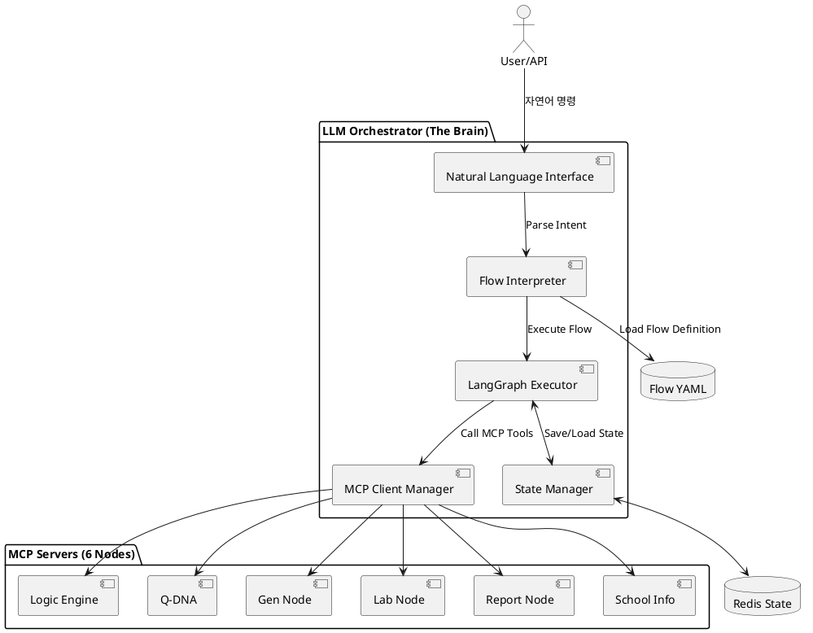
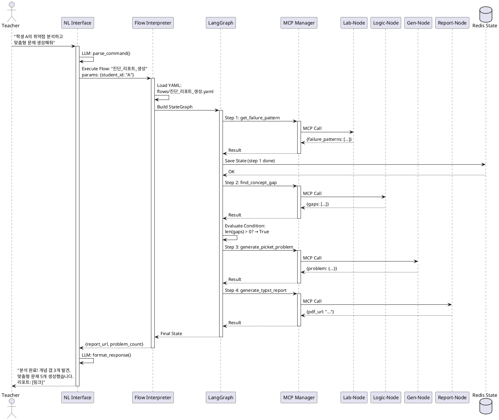

# LLM Orchestrator (The Brain) - 중앙 제어 시스템

## 개요

**LLM Orchestrator**는 Mathesis-Synapse의 두뇌로, **자연어 명령어**를 받아 6개 MCP 노드를 조율하여 복잡한 교육 워크플로우를 실행하는 중앙 제어 시스템입니다. LangGraph 기반의 **State Graph** 엔진으로 구현되며, YAML로 정의된 **선언적 Flow**를 해석하여 동적으로 실행합니다.

### 핵심 개념

**"자연어 → 워크플로우 → MCP Tools 호출"**

```
사용자: "학생 A의 취약점을 분석하고 맞춤형 문제를 생성해줘"
         ↓
Orchestrator: Flow 해석 및 실행 계획 수립
         ↓
1. Lab-Node.get_failure_pattern(student_A)
2. Logic-Node.find_concept_gap(student_A)
3. Gen-Node.generate_picket_problem(concepts=[...])
         ↓
결과: 개인화된 학습 리포트 + 문제 세트
```

### 핵심 역할
- **자연어 이해**: 사용자 명령을 구조화된 워크플로우로 변환
- **Flow 실행**: YAML 정의 → LangGraph State Graph → MCP Tools 호출
- **Tool 라우팅**: 18개 MCP Tools 중 적합한 Tool 자동 선택
- **State 관리**: 멀티스텝 워크플로우의 중간 상태 추적
- **에러 복구**: 실패한 단계 재시도, 대체 경로 탐색

### 기술 스택
- **워크플로우 엔진**: LangGraph (LangChain)
- **LLM**: Claude 3.5 Sonnet (Anthropic) 또는 GPT-4o (OpenAI)
- **MCP 클라이언트**: Anthropic MCP SDK (Python)
- **Flow 정의**: YAML (declarative workflows)
- **상태 관리**: LangGraph StateGraph + Redis (persistent state)
- **스케줄링**: Celery (주기적 Flow 실행)

---

## 아키텍처

### 1. 전체 구조



### 2. LangGraph State Graph 구조

```python
from langgraph.graph import StateGraph, END
from typing import TypedDict, Annotated, List, Dict, Any
import operator

# 1. State 정의
class OrchestratorState(TypedDict):
    # 입력
    user_command: str
    student_id: str

    # 워크플로우 상태
    current_step: str
    completed_steps: Annotated[List[str], operator.add]

    # 중간 결과 (각 노드 호출 결과 저장)
    failure_patterns: Dict[str, Any]
    concept_gaps: List[Dict[str, Any]]
    generated_problems: List[Dict[str, Any]]
    report_url: str

    # 메타데이터
    flow_name: str
    execution_id: str
    error_log: Annotated[List[str], operator.add]

# 2. Node Functions (각 단계의 실제 로직)
async def analyze_failures(state: OrchestratorState) -> OrchestratorState:
    """Lab-Node를 호출하여 학생 실패 패턴 분석"""
    result = await mcp_call(
        server="lab-node-mcp",
        tool="get_failure_pattern",
        params={"student_id": state["student_id"]}
    )

    return {
        **state,
        "failure_patterns": result,
        "completed_steps": ["analyze_failures"]
    }

async def find_gaps(state: OrchestratorState) -> OrchestratorState:
    """Logic-Node를 호출하여 개념 갭 찾기"""
    result = await mcp_call(
        server="logic-engine-mcp",
        tool="find_concept_gap",
        params={
            "student_id": state["student_id"],
            "threshold": 0.5
        }
    )

    return {
        **state,
        "concept_gaps": result["gaps"],
        "completed_steps": ["find_gaps"]
    }

async def generate_problems(state: OrchestratorState) -> OrchestratorState:
    """Gen-Node를 호출하여 맞춤형 문제 생성"""
    target_concepts = [gap["concept_id"] for gap in state["concept_gaps"][:3]]

    result = await mcp_call(
        server="gen-node-mcp",
        tool="generate_picket_problem",
        params={
            "student_id": state["student_id"],
            "target_concept": target_concepts[0],
            "bridge_to_concept": target_concepts[1] if len(target_concepts) > 1 else None
        }
    )

    return {
        **state,
        "generated_problems": [result],
        "completed_steps": ["generate_problems"]
    }

async def create_report(state: OrchestratorState) -> OrchestratorState:
    """Report-Node를 호출하여 진단 리포트 생성"""
    result = await mcp_call(
        server="report-node-mcp",
        tool="generate_typst_report",
        params={
            "student_id": state["student_id"],
            "report_type": "diagnostic",
            "start_date": (datetime.now() - timedelta(days=30)).isoformat(),
            "end_date": datetime.now().isoformat()
        }
    )

    return {
        **state,
        "report_url": result["pdf_url"],
        "completed_steps": ["create_report"]
    }

# 3. Conditional Routing (조건부 분기)
def should_generate_problems(state: OrchestratorState) -> str:
    """개념 갭이 있으면 문제 생성, 없으면 바로 리포트"""
    if len(state["concept_gaps"]) > 0:
        return "generate_problems"
    else:
        return "create_report"

# 4. StateGraph 구성
workflow = StateGraph(OrchestratorState)

# Nodes 추가
workflow.add_node("analyze_failures", analyze_failures)
workflow.add_node("find_gaps", find_gaps)
workflow.add_node("generate_problems", generate_problems)
workflow.add_node("create_report", create_report)

# Edges 추가 (실행 순서)
workflow.set_entry_point("analyze_failures")
workflow.add_edge("analyze_failures", "find_gaps")
workflow.add_conditional_edges(
    "find_gaps",
    should_generate_problems,
    {
        "generate_problems": "generate_problems",
        "create_report": "create_report"
    }
)
workflow.add_edge("generate_problems", "create_report")
workflow.add_edge("create_report", END)

# 5. Compile and Run
app = workflow.compile()

# 실행
final_state = await app.ainvoke({
    "user_command": "학생 A의 취약점을 분석하고 맞춤형 문제를 생성해줘",
    "student_id": "student_123",
    "completed_steps": [],
    "error_log": []
})
```

---

## Flow YAML 정의 시스템

### YAML 스키마

```yaml
flow:
  name: "진단_리포트_생성"
  description: "학생의 학습 데이터를 종합하여 진단 리포트 생성"
  version: "1.0"

  # 입력 파라미터
  inputs:
    - name: student_id
      type: string
      required: true
    - name: period_days
      type: int
      default: 30

  # 워크플로우 단계
  steps:
    - id: get_failures
      name: "실패 패턴 분석"
      mcp_call:
        server: lab-node-mcp
        tool: get_failure_pattern
        params:
          student_id: $inputs.student_id
          start_date: $date_utils.days_ago($inputs.period_days)
          end_date: $date_utils.now()
      output: failure_data

    - id: find_gaps
      name: "개념 갭 탐색"
      mcp_call:
        server: logic-engine-mcp
        tool: find_concept_gap
        params:
          student_id: $inputs.student_id
          threshold: 0.5
      output: concept_gaps
      depends_on: [get_failures]

    - id: generate_problems
      name: "맞춤형 문제 생성"
      condition: "len($concept_gaps.gaps) > 0"  # 조건부 실행
      mcp_call:
        server: gen-node-mcp
        tool: generate_picket_problem
        params:
          student_id: $inputs.student_id
          target_concept: $concept_gaps.gaps[0].concept_id
          bridge_to_concept: $concept_gaps.gaps[1].concept_id
      output: problems
      depends_on: [find_gaps]

    - id: create_report
      name: "리포트 생성"
      mcp_call:
        server: report-node-mcp
        tool: generate_typst_report
        params:
          student_id: $inputs.student_id
          report_type: "diagnostic"
          start_date: $date_utils.days_ago($inputs.period_days)
          end_date: $date_utils.now()
      output: report
      depends_on: [find_gaps, generate_problems]

  # 최종 출력
  outputs:
    report_url: $report.pdf_url
    problem_count: $len($problems)
    concept_gaps_found: $len($concept_gaps.gaps)
```

### Flow Interpreter 구현

```python
import yaml
from typing import Dict, Any, List
from jinja2 import Template

class FlowInterpreter:
    """
    YAML Flow 정의를 LangGraph StateGraph로 변환
    """

    def __init__(self, flow_yaml_path: str):
        with open(flow_yaml_path, 'r', encoding='utf-8') as f:
            self.flow_def = yaml.safe_load(f)

        self.graph = StateGraph(self._build_state_schema())

    def _build_state_schema(self) -> type:
        """Flow 정의에서 State 스키마 자동 생성"""
        # inputs + outputs + 모든 step의 output을 필드로 가지는 TypedDict 생성
        fields = {}

        # Inputs
        for inp in self.flow_def['flow']['inputs']:
            fields[inp['name']] = Any

        # Step outputs
        for step in self.flow_def['flow']['steps']:
            if 'output' in step:
                fields[step['output']] = Any

        # 메타 필드
        fields['completed_steps'] = Annotated[List[str], operator.add]
        fields['error_log'] = Annotated[List[str], operator.add]

        return TypedDict('DynamicState', fields)

    async def _create_step_node(self, step_def: Dict[str, Any]):
        """YAML step 정의 → LangGraph node function"""
        async def step_node(state: dict) -> dict:
            # 1. 조건 검사
            if 'condition' in step_def:
                if not self._evaluate_condition(step_def['condition'], state):
                    return {**state, "completed_steps": [f"{step_def['id']}_skipped"]}

            # 2. 파라미터 해석 (변수 치환)
            params = self._resolve_params(step_def['mcp_call']['params'], state)

            # 3. MCP 호출
            try:
                result = await mcp_call(
                    server=step_def['mcp_call']['server'],
                    tool=step_def['mcp_call']['tool'],
                    params=params
                )

                # 4. 결과 저장
                output_key = step_def.get('output', f"{step_def['id']}_result")
                return {
                    **state,
                    output_key: result,
                    "completed_steps": [step_def['id']]
                }

            except Exception as e:
                logger.error(f"Step {step_def['id']} failed: {e}")
                return {
                    **state,
                    "error_log": [f"{step_def['id']}: {str(e)}"]
                }

        return step_node

    def _resolve_params(self, params: Dict[str, Any], state: dict) -> Dict[str, Any]:
        """
        파라미터 내 변수 치환
        예: $inputs.student_id → state["student_id"]
            $concept_gaps.gaps[0] → state["concept_gaps"]["gaps"][0]
        """
        resolved = {}
        for key, value in params.items():
            if isinstance(value, str) and value.startswith('$'):
                # 변수 경로 파싱 (예: $concept_gaps.gaps[0].concept_id)
                resolved[key] = self._eval_path(value[1:], state)
            else:
                resolved[key] = value
        return resolved

    def _eval_path(self, path: str, state: dict) -> Any:
        """
        경로 문자열을 실제 값으로 변환
        예: "concept_gaps.gaps[0].concept_id" → state["concept_gaps"]["gaps"][0]["concept_id"]
        """
        # 간단 구현 (실제로는 더 robust한 파서 필요)
        import re
        parts = re.split(r'\.|\[|\]', path)
        parts = [p for p in parts if p]  # 빈 문자열 제거

        current = state
        for part in parts:
            if part.isdigit():
                current = current[int(part)]
            else:
                current = current[part]
        return current

    def _evaluate_condition(self, condition: str, state: dict) -> bool:
        """
        조건 문자열 평가
        예: "len($concept_gaps.gaps) > 0"
        """
        # $변수를 실제 값으로 치환
        resolved_condition = condition
        for match in re.finditer(r'\$([a-zA-Z_][a-zA-Z0-9_\.[\]]*)', condition):
            var_path = match.group(1)
            value = self._eval_path(var_path, state)
            resolved_condition = resolved_condition.replace(match.group(0), repr(value))

        # 안전한 평가 (eval 사용 시 보안 주의!)
        try:
            return eval(resolved_condition, {"len": len}, {})
        except Exception as e:
            logger.warning(f"Condition evaluation failed: {e}")
            return False

    async def build_graph(self) -> StateGraph:
        """YAML → LangGraph 변환"""
        # 1. 모든 step을 node로 추가
        for step in self.flow_def['flow']['steps']:
            node_func = await self._create_step_node(step)
            self.graph.add_node(step['id'], node_func)

        # 2. depends_on을 edge로 변환
        entry_steps = []
        for step in self.flow_def['flow']['steps']:
            if 'depends_on' not in step or len(step['depends_on']) == 0:
                entry_steps.append(step['id'])
            else:
                for dep in step['depends_on']:
                    self.graph.add_edge(dep, step['id'])

        # 3. Entry point 설정 (의존성 없는 첫 step)
        if len(entry_steps) == 1:
            self.graph.set_entry_point(entry_steps[0])
        else:
            # 여러 진입점이 있으면 dummy start node 생성
            async def start_node(state):
                return state
            self.graph.add_node("_start", start_node)
            self.graph.set_entry_point("_start")
            for entry in entry_steps:
                self.graph.add_edge("_start", entry)

        # 4. 마지막 step → END
        last_step = self.flow_def['flow']['steps'][-1]['id']
        self.graph.add_edge(last_step, END)

        return self.graph.compile()
```

---

## MCP Client Manager

### MCP 서버 연결 및 Tool 호출

```python
from mcp import ClientSession, StdioServerParameters
from mcp.client.stdio import stdio_client
from typing import Dict, Any
import logging

logger = logging.getLogger(__name__)

class MCPClientManager:
    """
    6개 MCP 서버 연결 및 Tool 호출 관리
    """

    def __init__(self):
        self.servers: Dict[str, ClientSession] = {}
        self.tool_registry: Dict[str, Dict[str, Any]] = {}  # {server: {tool_name: tool_schema}}

    async def connect_all_servers(self):
        """모든 MCP 서버에 연결"""
        server_configs = {
            "logic-engine-mcp": {"command": "python", "args": ["nodes/node1_logic_engine/server.py"]},
            "q-dna-mcp": {"command": "python", "args": ["nodes/node2_q_dna/server.py"]},
            "gen-node-mcp": {"command": "python", "args": ["nodes/node3_gen_node/server.py"]},
            "lab-node-mcp": {"command": "python", "args": ["nodes/node4_lab_node/server.py"]},
            "report-node-mcp": {"command": "python", "args": ["nodes/node5_report_node/server.py"]},
            "school-info-mcp": {"command": "python", "args": ["nodes/node6_school_info/server.py"]},
        }

        for server_name, config in server_configs.items():
            try:
                server_params = StdioServerParameters(
                    command=config["command"],
                    args=config["args"]
                )

                # MCP 클라이언트 생성 및 연결
                async with stdio_client(server_params) as (read, write):
                    async with ClientSession(read, write) as session:
                        await session.initialize()

                        # Tool 목록 가져오기
                        tools_result = await session.list_tools()

                        self.servers[server_name] = session
                        self.tool_registry[server_name] = {
                            tool.name: tool for tool in tools_result.tools
                        }

                        logger.info(f"Connected to {server_name}: {len(tools_result.tools)} tools")

            except Exception as e:
                logger.error(f"Failed to connect to {server_name}: {e}")

    async def call_tool(
        self,
        server_name: str,
        tool_name: str,
        params: Dict[str, Any]
    ) -> Dict[str, Any]:
        """
        MCP Tool 호출
        """
        if server_name not in self.servers:
            raise ValueError(f"Server {server_name} not connected")

        if tool_name not in self.tool_registry.get(server_name, {}):
            raise ValueError(f"Tool {tool_name} not found in {server_name}")

        session = self.servers[server_name]

        try:
            result = await session.call_tool(tool_name, arguments=params)

            logger.info(f"✓ {server_name}.{tool_name} succeeded")

            return result.content[0].text if result.content else {}

        except Exception as e:
            logger.error(f"✗ {server_name}.{tool_name} failed: {e}")
            raise

    def get_all_tools(self) -> List[Dict[str, Any]]:
        """
        전체 Tool 목록 반환 (LLM이 Tool을 선택할 수 있도록)
        """
        all_tools = []
        for server_name, tools in self.tool_registry.items():
            for tool_name, tool_schema in tools.items():
                all_tools.append({
                    "server": server_name,
                    "name": tool_name,
                    "description": tool_schema.description,
                    "input_schema": tool_schema.inputSchema
                })
        return all_tools

# Global instance
mcp_manager = MCPClientManager()

# Helper function
async def mcp_call(server: str, tool: str, params: Dict[str, Any]) -> Dict[str, Any]:
    """Shorthand for MCP tool calls"""
    return await mcp_manager.call_tool(server, tool, params)
```

---

## Natural Language Interface (자연어 → Flow)

### LLM 기반 Intent Parsing

```python
from anthropic import Anthropic
import json

class NaturalLanguageInterface:
    """
    사용자의 자연어 명령을 Flow 실행으로 변환
    """

    def __init__(self, anthropic_api_key: str):
        self.client = Anthropic(api_key=anthropic_api_key)
        self.available_flows = self._load_all_flows()
        self.available_tools = mcp_manager.get_all_tools()

    def _load_all_flows(self) -> List[Dict[str, Any]]:
        """모든 Flow YAML 로드"""
        import glob
        flows = []
        for yaml_path in glob.glob("flows/*.yaml"):
            with open(yaml_path, 'r', encoding='utf-8') as f:
                flow = yaml.safe_load(f)
                flows.append({
                    "name": flow['flow']['name'],
                    "description": flow['flow']['description'],
                    "path": yaml_path
                })
        return flows

    async def parse_command(self, user_command: str, context: Dict[str, Any] = None) -> Dict[str, Any]:
        """
        자연어 명령 → Flow 선택 + 파라미터 추출
        """
        system_prompt = f"""
당신은 교육 플랫폼 Mathesis-Synapse의 AI 오케스트레이터입니다.
사용자의 자연어 명령을 분석하여 적절한 워크플로우를 선택하고 파라미터를 추출하세요.

## 사용 가능한 Flows
{json.dumps(self.available_flows, ensure_ascii=False, indent=2)}

## 사용 가능한 MCP Tools (18개)
{json.dumps([{"server": t["server"], "name": t["name"], "description": t["description"]} for t in self.available_tools], ensure_ascii=False, indent=2)}

## 응답 형식 (JSON)
{{
    "intent": "flow_name" 또는 "direct_tool_call",
    "flow_name": "진단_리포트_생성" (intent가 flow일 경우),
    "tool_calls": [  (intent가 direct_tool_call일 경우)
        {{"server": "lab-node-mcp", "tool": "get_failure_pattern", "params": {{...}}}}
    ],
    "parameters": {{
        "student_id": "...",
        ...
    }},
    "reasoning": "왜 이 Flow/Tool을 선택했는지 설명"
}}

사용자 명령에 학생 ID가 없으면 context에서 가져오세요.
"""

        response = self.client.messages.create(
            model="claude-3-5-sonnet-20241022",
            max_tokens=2000,
            system=system_prompt,
            messages=[
                {
                    "role": "user",
                    "content": f"명령: {user_command}\n\nContext: {json.dumps(context, ensure_ascii=False)}"
                }
            ]
        )

        # JSON 파싱
        result_text = response.content[0].text

        # JSON 블록 추출 (```json ... ``` 형태 처리)
        import re
        json_match = re.search(r'```json\s*(.*?)\s*```', result_text, re.DOTALL)
        if json_match:
            result_text = json_match.group(1)

        try:
            parsed = json.loads(result_text)
            return parsed
        except json.JSONDecodeError as e:
            logger.error(f"Failed to parse LLM response: {e}")
            return {
                "intent": "error",
                "error": f"LLM response parsing failed: {result_text}"
            }

    async def execute_command(self, user_command: str, context: Dict[str, Any] = None) -> Dict[str, Any]:
        """
        자연어 명령 → Flow 실행 → 결과 반환
        """
        # 1. Intent 파싱
        parsed = await self.parse_command(user_command, context)

        if parsed["intent"] == "error":
            return parsed

        # 2. Flow 실행
        if parsed["intent"] == "flow_name":
            flow_name = parsed["flow_name"]
            flow_yaml = next((f["path"] for f in self.available_flows if f["name"] == flow_name), None)

            if not flow_yaml:
                return {"error": f"Flow {flow_name} not found"}

            # Flow 실행
            interpreter = FlowInterpreter(flow_yaml)
            graph = await interpreter.build_graph()

            result = await graph.ainvoke(parsed["parameters"])
            return result

        # 3. Direct Tool Call 실행
        elif parsed["intent"] == "direct_tool_call":
            results = []
            for tool_call in parsed["tool_calls"]:
                result = await mcp_call(
                    server=tool_call["server"],
                    tool=tool_call["tool"],
                    params=tool_call["params"]
                )
                results.append(result)

            return {"results": results}
```

---

## 시퀀스 다이어그램

### 전체 실행 플로우



---

## 주요 Flow 예시

### 1. 진단_리포트_생성.yaml

```yaml
flow:
  name: "진단_리포트_생성"
  description: "학생의 학습 데이터를 종합하여 진단 리포트 생성"

  inputs:
    - name: student_id
      type: string
      required: true
    - name: period_days
      type: int
      default: 30

  steps:
    - id: get_failures
      mcp_call:
        server: lab-node-mcp
        tool: get_failure_pattern
        params:
          student_id: $inputs.student_id
      output: failure_data

    - id: find_gaps
      mcp_call:
        server: logic-engine-mcp
        tool: find_concept_gap
        params:
          student_id: $inputs.student_id
          threshold: 0.5
      output: concept_gaps

    - id: create_report
      mcp_call:
        server: report-node-mcp
        tool: generate_typst_report
        params:
          student_id: $inputs.student_id
          report_type: "diagnostic"
      output: report
      depends_on: [find_gaps]

  outputs:
    report_url: $report.pdf_url
```

### 2. 맞춤형_문제_생성.yaml

```yaml
flow:
  name: "맞춤형_문제_생성"
  description: "학생의 취약 개념에 맞는 문제를 자동 생성"

  inputs:
    - name: student_id
      type: string
    - name: problem_count
      type: int
      default: 5

  steps:
    - id: get_heatmap
      mcp_call:
        server: lab-node-mcp
        tool: update_student_heatmap
        params:
          student_id: $inputs.student_id
      output: heatmap

    - id: find_weak_concepts
      action: python
      code: |
        weak_concepts = [
            concept_id
            for concept_id, mastery in $heatmap.heatmap_data.items()
            if mastery < 0.5
        ][:3]
        return {"weak_concepts": weak_concepts}
      output: weak_concepts

    - id: generate_problems_loop
      action: foreach
      items: $weak_concepts.weak_concepts
      steps:
        - id: gen_problem
          mcp_call:
            server: gen-node-mcp
            tool: generate_picket_problem
            params:
              student_id: $inputs.student_id
              target_concept: $item
              difficulty_adjustment: 0.1
          output: problem
      output: all_problems

  outputs:
    problems: $all_problems
    count: $len($all_problems)
```

### 3. 학교_정보_기반_수업_준비.yaml

```yaml
flow:
  name: "학교_정보_기반_수업_준비"
  description: "학교의 교육 계획서를 분석하여 수업 준비 자료 생성"

  inputs:
    - name: school_code
      type: string
    - name: grade
      type: int
    - name: topic
      type: string

  steps:
    - id: query_school_plan
      mcp_call:
        server: school-info-mcp
        tool: query_school_info
        params:
          question: "$inputs.grade학년 $inputs.topic 단원의 평가 계획은?"
          school_code: $inputs.school_code
          year: 2025
      output: school_plan

    - id: get_prerequisites
      mcp_call:
        server: logic-engine-mcp
        tool: get_prerequisites
        params:
          concept_id: $inputs.topic
          depth: 2
      output: prereqs

    - id: find_similar_problems
      mcp_call:
        server: q-dna-mcp
        tool: find_similar_dna_problems
        params:
          target_dna:
            concepts: [$inputs.topic]
            difficulty: 3
            problem_type: "서술형"
          limit: 10
      output: problems

  outputs:
    school_evaluation_plan: $school_plan.answer
    prerequisite_concepts: $prereqs.prerequisite_tree
    practice_problems: $problems.results
```

---

## 에러 처리 및 복구

### Retry Logic

```python
from tenacity import retry, stop_after_attempt, wait_exponential

@retry(
    stop=stop_after_attempt(3),
    wait=wait_exponential(multiplier=1, min=2, max=10)
)
async def mcp_call_with_retry(server: str, tool: str, params: Dict[str, Any]) -> Dict[str, Any]:
    """
    MCP 호출 실패 시 exponential backoff로 재시도
    """
    return await mcp_manager.call_tool(server, tool, params)
```

### Fallback Strategy

```yaml
# Flow YAML에서 fallback 정의
steps:
  - id: get_prerequisites
    mcp_call:
      server: logic-engine-mcp
      tool: get_prerequisites
      params:
        concept_id: $inputs.concept
    output: prereqs
    on_error:
      action: fallback
      fallback_value:
        prerequisite_tree: []
        message: "선수 지식 조회 실패"
```

---

## 모니터링 및 로깅

### Observability

```python
from opentelemetry import trace
from opentelemetry.sdk.trace import TracerProvider
from opentelemetry.sdk.trace.export import BatchSpanProcessor
from opentelemetry.exporter.jaeger import JaegerExporter

# OpenTelemetry 설정
tracer_provider = TracerProvider()
jaeger_exporter = JaegerExporter(
    agent_host_name="localhost",
    agent_port=6831,
)
tracer_provider.add_span_processor(BatchSpanProcessor(jaeger_exporter))
trace.set_tracer_provider(tracer_provider)

tracer = trace.get_tracer(__name__)

# Instrumentation
async def execute_flow_with_tracing(flow_name: str, params: Dict[str, Any]):
    with tracer.start_as_current_span(f"flow.{flow_name}") as span:
        span.set_attribute("flow.name", flow_name)
        span.set_attribute("params", json.dumps(params))

        try:
            result = await execute_flow(flow_name, params)
            span.set_attribute("status", "success")
            return result
        except Exception as e:
            span.set_attribute("status", "error")
            span.record_exception(e)
            raise
```

---

## 성능 최적화

### 1. 병렬 실행

```yaml
# 독립적인 단계를 병렬로 실행
steps:
  - id: parallel_analysis
    action: parallel
    tasks:
      - id: get_failures
        mcp_call:
          server: lab-node-mcp
          tool: get_failure_pattern
      - id: get_school_info
        mcp_call:
          server: school-info-mcp
          tool: get_school_metadata
    output: parallel_results
```

### 2. 캐싱

```python
from functools import lru_cache
import hashlib

@lru_cache(maxsize=100)
async def cached_mcp_call(server: str, tool: str, params_hash: str):
    """
    동일한 파라미터로의 MCP 호출 결과를 캐싱
    """
    # Redis 캐시 체크
    cache_key = f"mcp:{server}:{tool}:{params_hash}"
    cached = await redis.get(cache_key)
    if cached:
        return json.loads(cached)

    # 실제 호출
    result = await mcp_manager.call_tool(server, tool, json.loads(params))

    # 캐시 저장 (1시간 TTL)
    await redis.setex(cache_key, 3600, json.dumps(result))
    return result

# 사용
params_hash = hashlib.md5(json.dumps(params, sort_keys=True).encode()).hexdigest()
result = await cached_mcp_call(server, tool, params_hash)
```

---

## API 엔드포인트

### FastAPI 통합

```python
from fastapi import FastAPI, BackgroundTasks
from pydantic import BaseModel

app = FastAPI(title="Mathesis Orchestrator API")

class ExecuteCommandRequest(BaseModel):
    command: str
    student_id: Optional[str] = None
    context: Optional[Dict[str, Any]] = None

class ExecuteCommandResponse(BaseModel):
    execution_id: str
    status: str  # "running" | "completed" | "failed"
    result: Optional[Dict[str, Any]] = None

@app.post("/api/v1/execute", response_model=ExecuteCommandResponse)
async def execute_command(req: ExecuteCommandRequest, background_tasks: BackgroundTasks):
    """
    자연어 명령 실행
    """
    execution_id = str(uuid.uuid4())

    # 백그라운드에서 실행
    background_tasks.add_task(
        run_command_async,
        execution_id,
        req.command,
        req.context
    )

    return ExecuteCommandResponse(
        execution_id=execution_id,
        status="running"
    )

@app.get("/api/v1/executions/{execution_id}")
async def get_execution_status(execution_id: str):
    """
    실행 상태 조회
    """
    state = await redis.hgetall(f"execution:{execution_id}")
    return {
        "execution_id": execution_id,
        "status": state.get("status", "unknown"),
        "result": json.loads(state.get("result", "{}"))
    }
```

---

## 확장 가능성

- **멀티모달 입력**: 이미지, 음성 명령 지원
- **Human-in-the-Loop**: 중요 단계에서 사용자 확인 요청
- **Flow 자동 생성**: LLM이 Flow YAML 자동 작성
- **A/B 테스트**: Flow 버전별 성능 비교
- **분산 실행**: Kubernetes 기반 Scale-out

---

**생성 일시**: 2026-01-08
**문서 버전**: 1.0
**담당 컴포넌트**: LLM Orchestrator (The Brain)
**관련 문서**: 00_MCP_SYSTEM_DESIGN.md, All NODE documents
