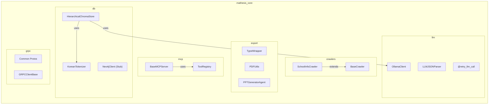
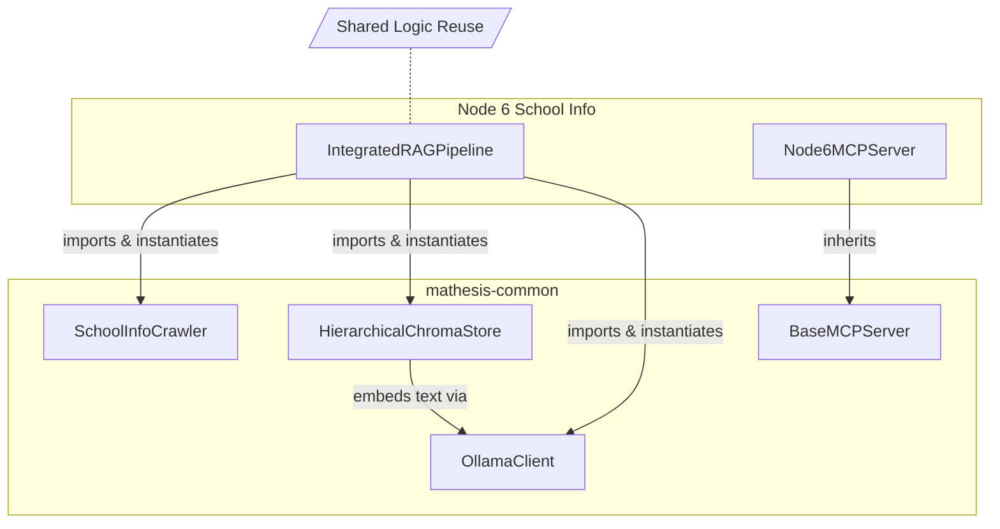
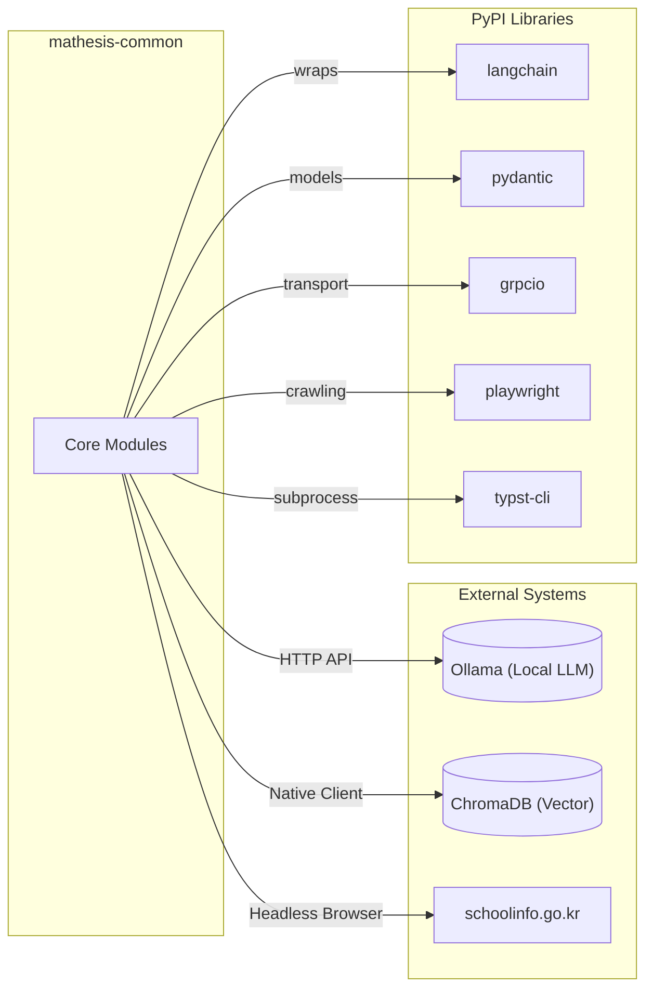

# Mathesis Common Library Diagrams

## 1. 🏗️ Internal Components (Library Diagram)
`mathesis-common` is a shared library providing standardized utilities for all nodes. It is **not** a server itself, but a toolkit imported by Nodes.

## 2. 🔌 Service Usage Diagram (Flowchart)
This diagram illustrates how a typical Node (e.g., Node 6) imports and utilizes multiple services from `mathesis-common` to build its logic.

*Example: Node 6 utilizing Common Services*

## 3. 📦 External Dependency Diagram
This diagram shows the external Python libraries and Systems that `mathesis-common` bridges to.

