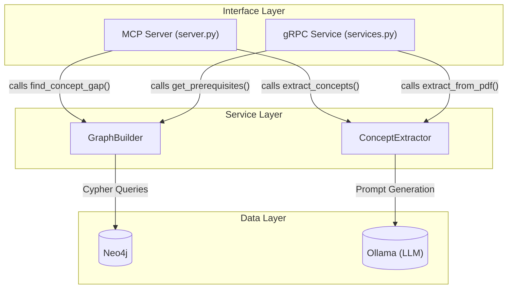
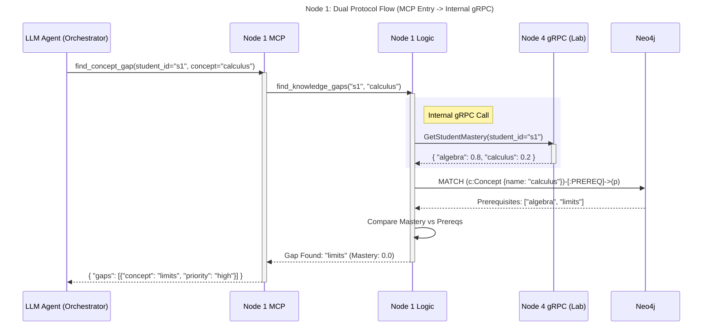
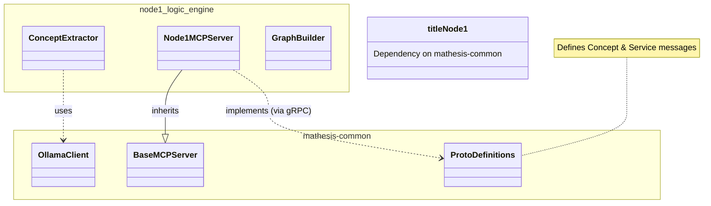

# Node 1 (Logic Engine) Architecture Diagrams

## 1. 🏗️ Internal Architecture (Component Diagram)
This diagram illustrates how the **MCP Server** and **gRPC Service** interfaces co-exist within Node 1, sharing the same underlying `GraphBuilder` and `ConceptExtractor` logic.

## 2. 🔗 Dual Protocol Sequence Diagram
This diagram shows the flow where the Orchestrator uses **MCP** to request a gap analysis, while Node 1 internally uses **gRPC** (hypothetically, if it needed to fetch data from another node, e.g., checking if the concept exists in a global registry or ensuring student mastery from Node 4).

*Scenario: "Identify Concept Gaps for Student"*

## 3. 📦 Dependency & Reuse Diagram
This diagram highlights how Node 1 relies on `mathesis-common` for core utilities while maintaining its own specific implementations.

