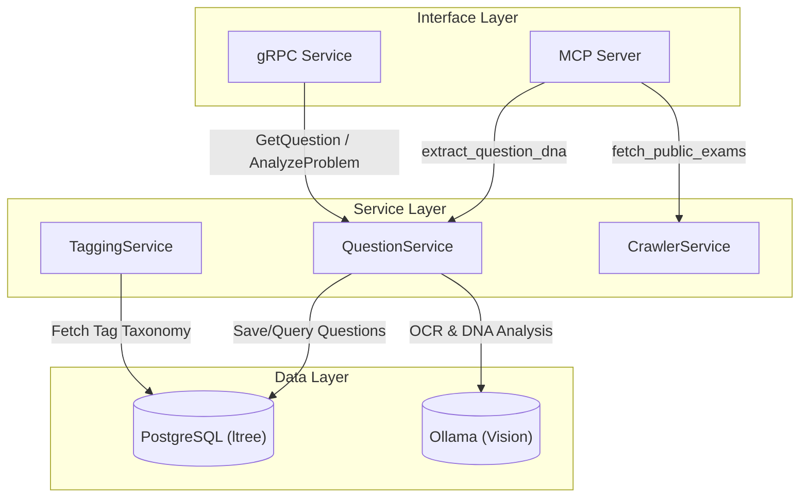
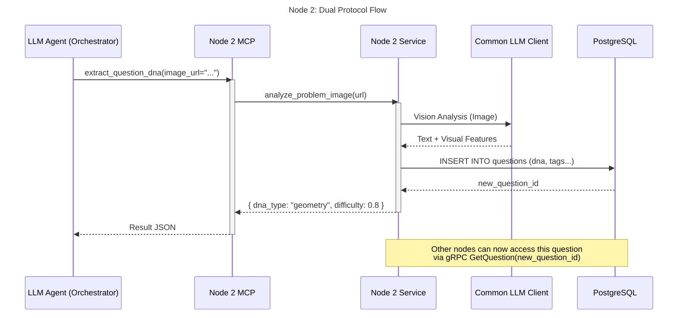
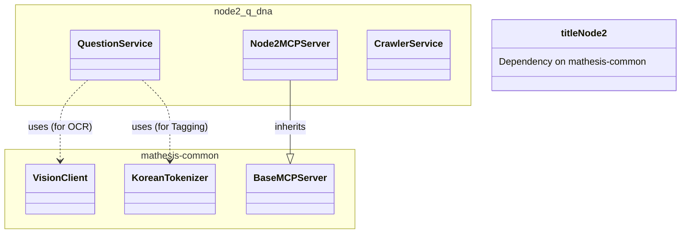

# Node 2 (Q-DNA) Architecture Diagrams

## 1. 🏗️ Internal Architecture (Component Diagram)
Node 2 handles Question DNA analysis. It exposes DNA extraction to Agents via MCP and allows other nodes (like Gen Node) to fetch question data via gRPC.

## 2. 🔗 Dual Protocol Sequence Diagram
*Scenario: "Analyze Problem Image and Save DNA"*

## 3. 📦 Dependency & Reuse Diagram

