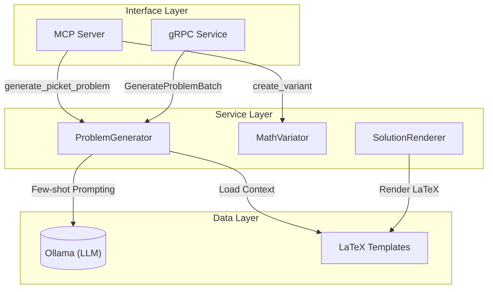
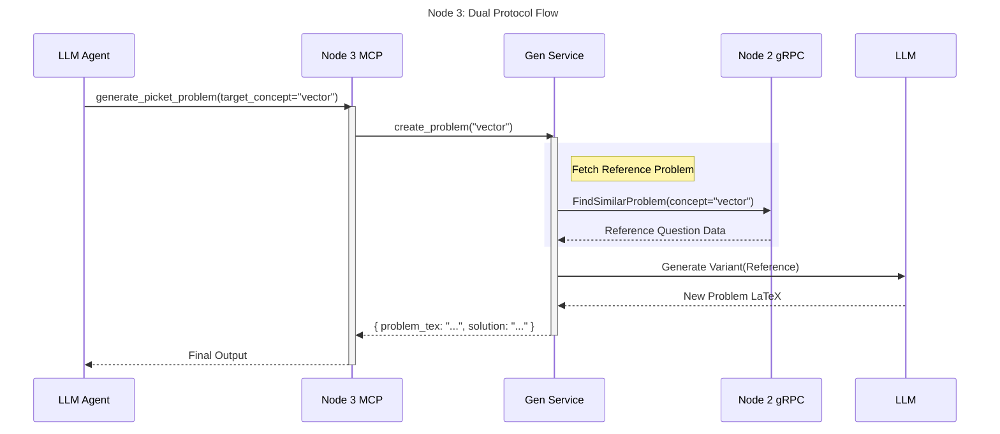
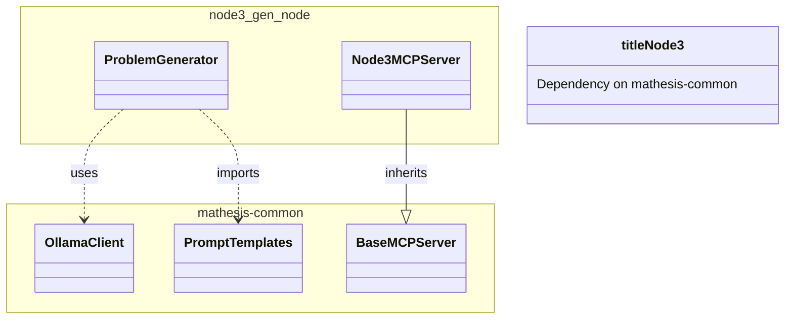

# Node 3 (Gen Node) Architecture Diagrams

## 1. 🏗️ Internal Architecture (Component Diagram)
Node 3 is responsible for generative content (problems, explanations). It heavily relies on LLM prompts and potentially Python computation tools (SymPy) for verification.

## 2. 🔗 Dual Protocol Sequence Diagram
*Scenario: "Generate Personalized Problem"*

## 3. 📦 Dependency & Reuse Diagram

