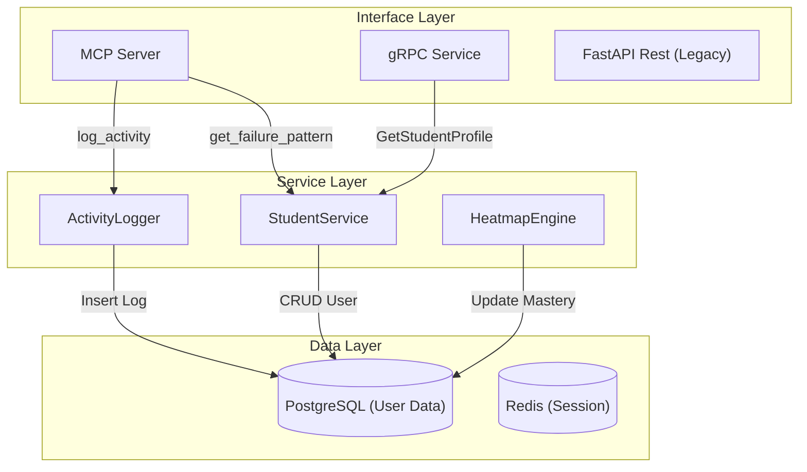
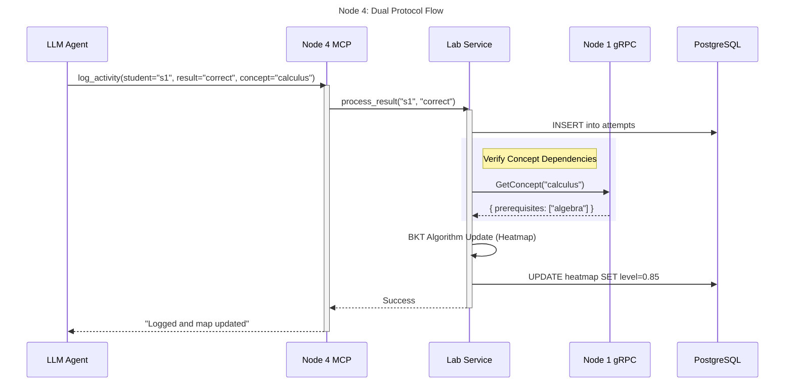
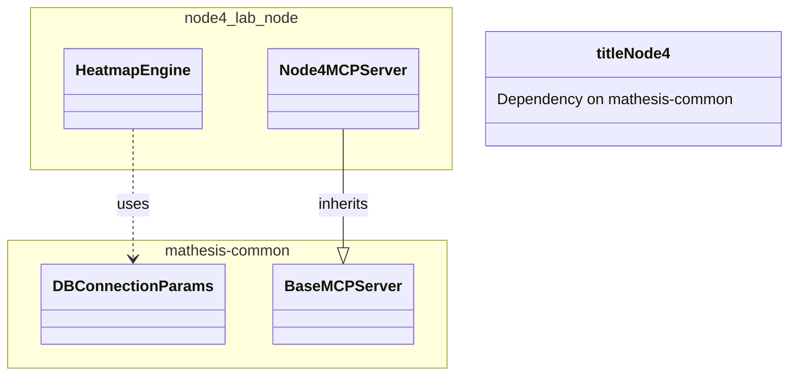

# Node 4 (Lab Node) Architecture Diagrams

## 1. 🏗️ Internal Architecture (Component Diagram)
Node 4 manages execution data (student logs, LMS features). It is the primary "Write" node for student activity.

## 2. 🔗 Dual Protocol Sequence Diagram
*Scenario: "Update Student Mastery after Test"*

## 3. 📦 Dependency & Reuse Diagram

