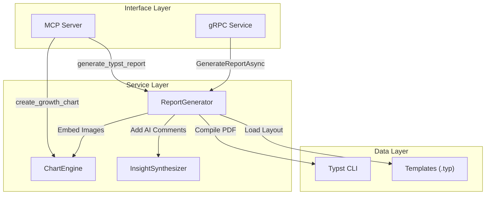
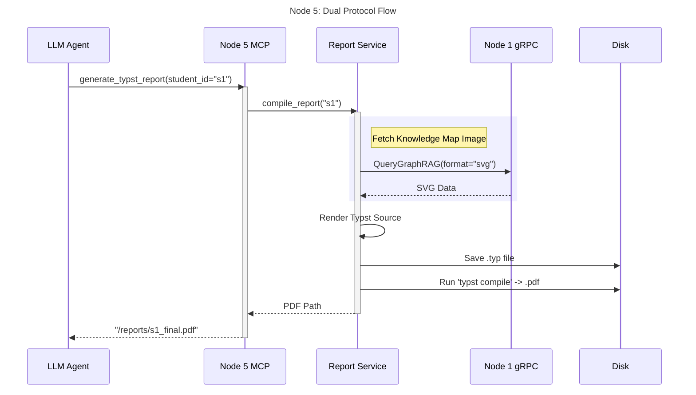
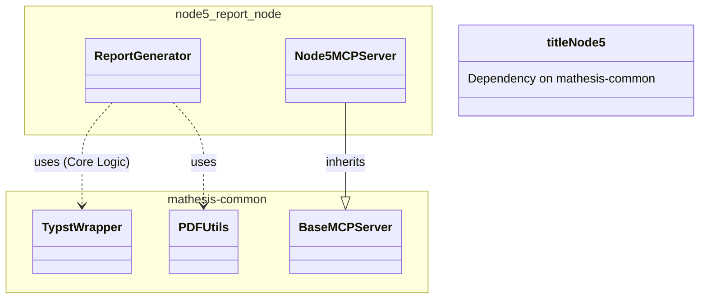

# Node 5 (Report Node) Architecture Diagrams

## 1. 🏗️ Internal Architecture (Component Diagram)
Node 5 generates high-quality PDF reports. It acts as a standard MCP server for generation tools and uses `mathesis-common`'s Typst wrapper.

## 2. 🔗 Dual Protocol Sequence Diagram
*Scenario: "Generate Comprehensive Report"*

## 3. 📦 Dependency & Reuse Diagram

