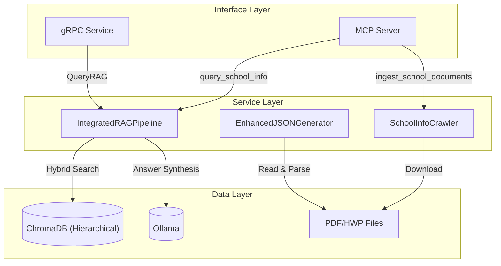
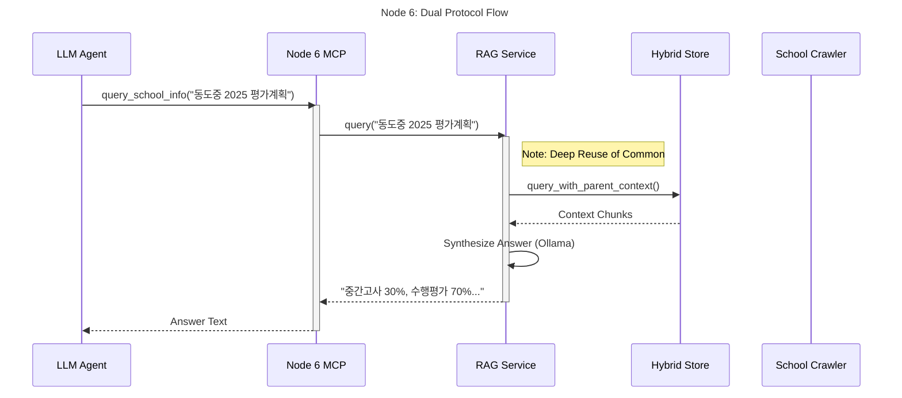
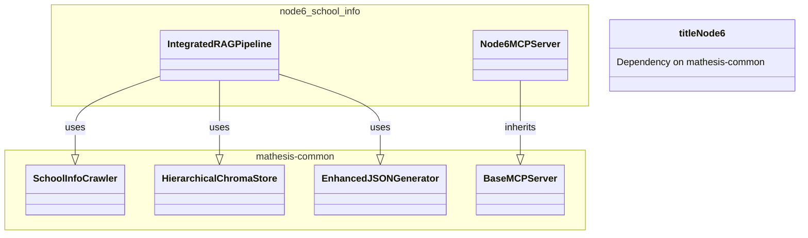

# Node 6 (School Info) Architecture Diagrams

## 1. 🏗️ Internal Architecture (Component Diagram)
Node 6 provides School Information via RAG. It crawls data, builds an enhanced vector index, and serves queries.

## 2. 🔗 Dual Protocol Sequence Diagram
*Scenario: "Query School Evaluation Plan"*

## 3. 📦 Dependency & Reuse Diagram

