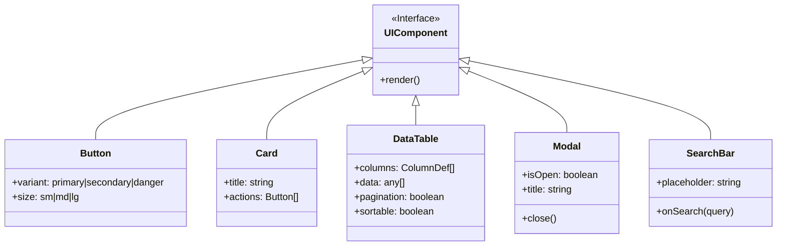

# Common Frontend Documentation

## UI Components & Design System

### 1. Common UI Architecture

#### 1.1 App Shell Layout (Component Structure)
The application uses a persistent sidebar navigation with a dynamic main content area.

```mermaid
graph TD
    App[App Container] --> Sidebar[Sidebar Navigation]
    App --> Main[Main Content Area]
    
    subgraph Sidebar [Navigation]
        Logo[Logo / Brand]
        Nav0[Node 0: Student Hub]
        Nav1[Node 1: Logic Engine]
        Nav2[Node 2: Q-DNA]
        Nav3[Node 3: Generator]
        Nav4[Node 4: Virtual Lab]
        Nav5[Node 5: Report]
        Nav6[Node 6: School Info]
        Settings[Settings]
    end

    subgraph Main [Content Area]
        Header[Top Bar / Header]
        Breadcrumbs[Breadcrumbs]
        UserMenu[User Profile]
        Context[Context Switcher (School/Class)]
        
        PageContent[Page Content (Router View)]
    end

    Sidebar --> Logo
    Sidebar --> Nav0
    Sidebar --> Nav1
    Sidebar --> Nav2
    Sidebar --> Nav3
    Sidebar --> Nav4
    Sidebar --> Nav5
    Sidebar --> Nav6
    Sidebar --> Settings
    
    Main --> Header
    Header --> Breadcrumbs
    Header --> Context
    Header --> UserMenu
    Main --> PageContent
```

#### 1.2 Common Design System Components
Atomic components used across all nodes.


