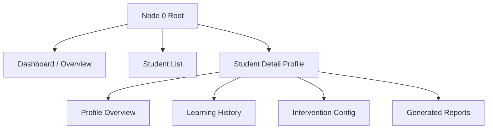
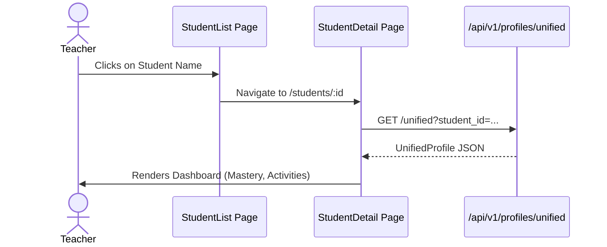
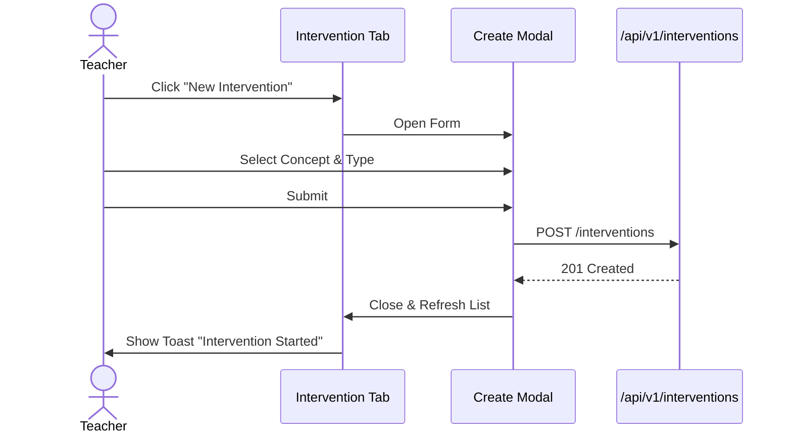

# Node 0: Student Hub - Frontend Architecture

## 1. Information Architecture (IA)

Structure of the module's navigation and page hierarchy.



## 2. User Flows

### 2.1 Viewing a Student's Unified Profile



### 2.2 Creating a Learning Intervention



## 3. Component Architecture

### 3.1 Page Components
- `StudentDashboardPage`: Main entry point.
- `StudentListPage`: Table view of all students.
- `StudentDetailPage`: Parent for tab views.

### 3.2 Feature Components (Atomic)
- `StudentCard`: Summary card.
- `MasteryRadarChart`: Visualization of weak/strong areas (uses Recharts/Chart.js).
- `ActivityTimeline`: List of recent actions.
- `InterventionList`: Interactive list of active interventions.

### 3.3 Props Interface (Example)

```typescript
interface StudentDetailProps {
  studentId: string;
}

interface InterventionListProps {
  interventions: Intervention[];
  onCancel: (id: string) => void;
}
```

## 4. State Management

### 4.1 Server State (React Query)
- `useStudent(id)`: Fetches `GET /students/:id`
- `useUnifiedProfile(id)`: Fetches `GET /profiles/unified`
- `useInterventions(studentId)`: Fetches `GET /interventions`

### 4.2 Local State
- `selectedTab`: Controls current view in Detail Page.
- `isCreateModalOpen`: Controls visibility of intervention form.

## 5. Directory Structure

```
node0/
├── pages/
│   ├── Dashboard.tsx
│   ├── StudentList.tsx
│   └── StudentDetail.tsx
├── components/
│   ├── StudentCard.tsx
│   ├── MasteryRadar.tsx
│   ├── InterventionForm.tsx
│   └── ...
├── hooks/
│   ├── useStudent.ts
│   └── useIntervention.ts
└── types/
    └── index.ts
```
