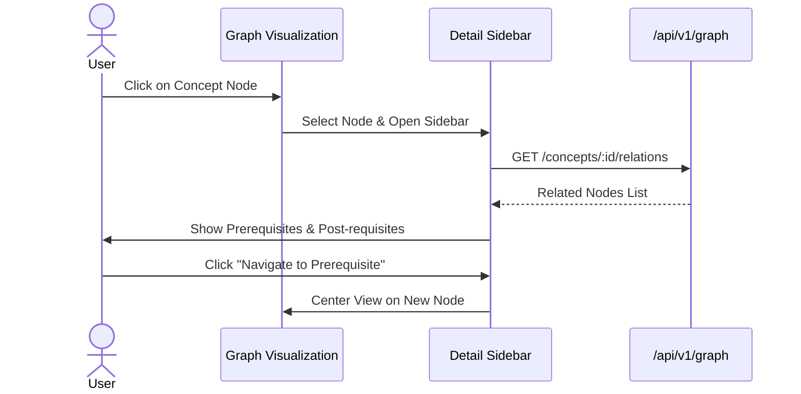

# Node 1: Logic Engine - Frontend Architecture

## 1. Information Architecture (IA)

```mermaid
graph TD
    Root[Node 1 Root] --> GraphView[Knowledge Graph Explorer]
    Root --> ConceptDetail[Concept/Node Details]
    Root --> Editor[Graph Editor (Admin)]
```

## 2. User Flows

### 2.1 Exploring Related Concepts



## 3. Component Architecture

### 3.1 Components
- `GraphCanvas`: Wrapper around D3.js / Cytoscape.js.
- `NodeInspector`: Sidebar showing node metadata.
- `MapToolbar`: Controls for zoom, filter, layout.

## 4. State Management

- **Graph State**: Complex local state (nodes positions, selection) managed via context or library-specific store.
- **Server State**: Graph data fetched via React Query (lazy loading nodes).

## 5. Directory Structure
```
node1/
├── components/
│   ├── GraphCanvas/
│   ├── NodeInspector.tsx
│   └── Toolbar.tsx
├── hooks/
│   └── useGraphData.ts
└── pages/
    └── Explorer.tsx
```
