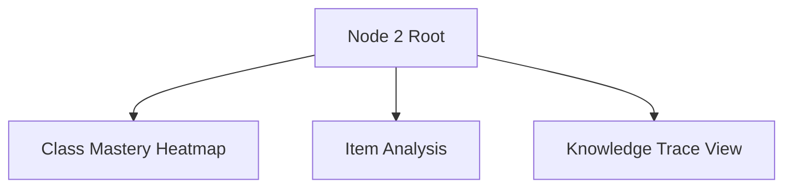
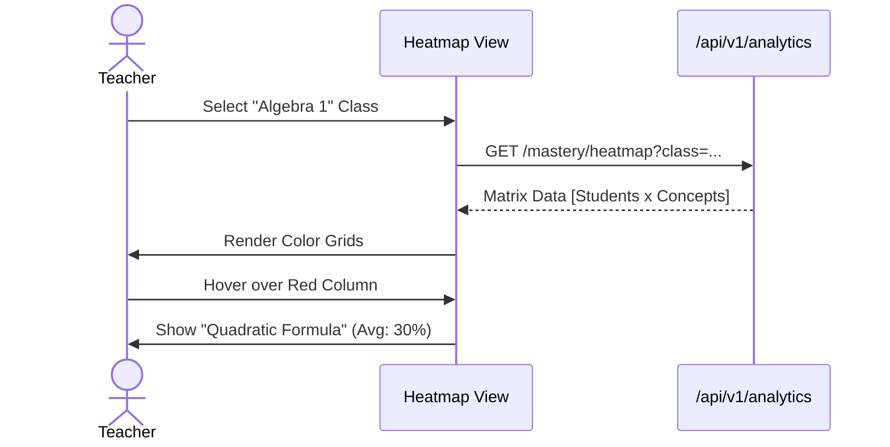

# Node 2: Q-DNA - Frontend Architecture

## 1. Information Architecture (IA)



## 2. User Flows

### 2.1 Analyzing Class Weaknesses



## 3. Component Architecture

### 3.1 Components
- `HeatmapGrid`: SVG/Canvas based grid renderer.
- `TraceGraph`: Line chart showing mastery over time (BKT/DKT).
- `ItemCard`: Display of a specific question item with stats.

## 4. State Management
- **Analytics Data**: Heavily dependent on React Query with caching.
- **Filters**: Local state for time ranges, student groups.

## 5. Directory Structure
```
node2/
├── components/
│   ├── Heatmap/
│   ├── TraceGraph.tsx
│   └── ItemCard.tsx
├── hooks/
│   └── useAnalytics.ts
└── pages/
    ├── MasteryView.tsx
    └── ItemAnalysis.tsx
```
