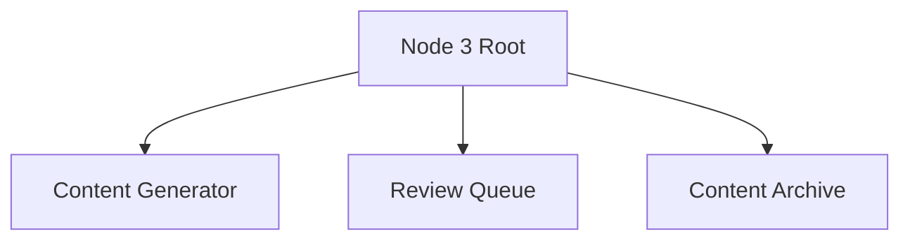
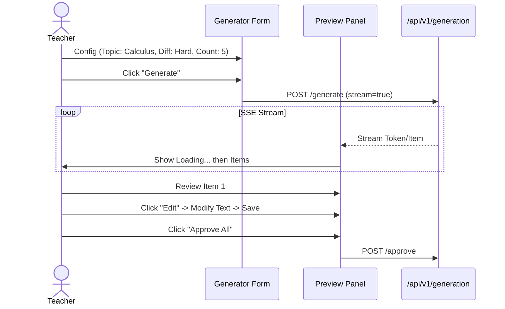

# Node 3: Gen Node - Frontend Architecture

## 1. Information Architecture (IA)



## 2. User Flows

### 2.1 Generating Problems with Human-in-the-Loop



## 3. Component Architecture

### 3.1 Components
- `GenerationConfigForm`: Complex form with concept selectors.
- `StreamPreview`: Handles SSE/WebSocket data for real-time generation.
- `ItemEditor`: WYSIWYG editor for math content (LaTeX support).

## 4. State Management
- **Streaming State**: Custom hook to handle SSE connection and buffering.
- **Form State**: React Hook Form for validation.

## 5. Directory Structure
```
node3/
├── components/
│   ├── ConfigForm.tsx
│   ├── StreamPreview.tsx
│   └── ItemEditor.tsx
├── hooks/
│   └── useGenerationStream.ts
└── pages/
    └── GeneratorPage.tsx
```
