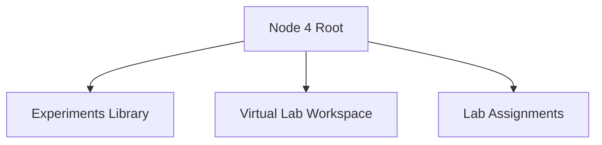
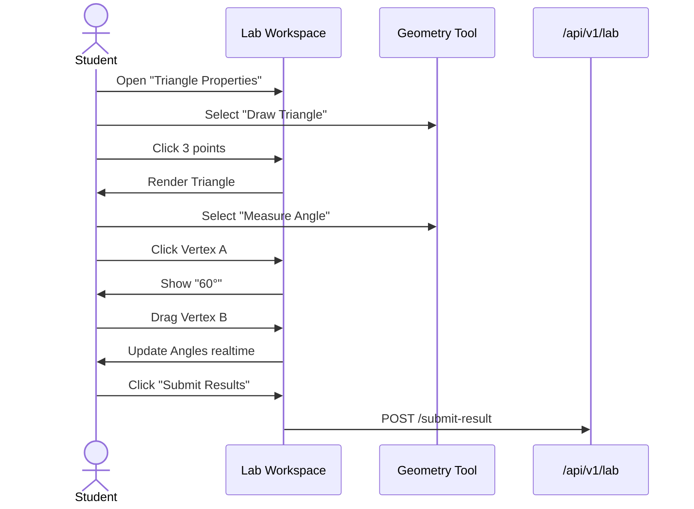

# Node 4: Lab Node - Frontend Architecture

## 1. Information Architecture (IA)



## 2. User Flows

### 2.1 Performing a Geometry Experiment



## 3. Component Architecture

### 3.1 Components
- `CanvasWorkspace`: The core interactive area (HTML5 Canvas/WebGL).
- `ToolPalette`: Floating toolbar.
- `StepGuide`: Tutorial overlay.

## 4. State Management
- **Canvas State**: **Crucial**. Needs high-performance state (not just React state). Possibly Redux or a specialized history stack (undo/redo).
- **Session State**: Tracking time spent, steps completed.

## 5. Directory Structure
```
node4/
├── components/
│   ├── Canvas/
│   │   ├── Renderer.ts
│   │   └── InteractionLayer.tsx
│   ├── ToolPalette.tsx
│   └── Console.tsx
├── hooks/
│   └── useLabSession.ts
└── pages/
    └── LabWorkspace.tsx
```
