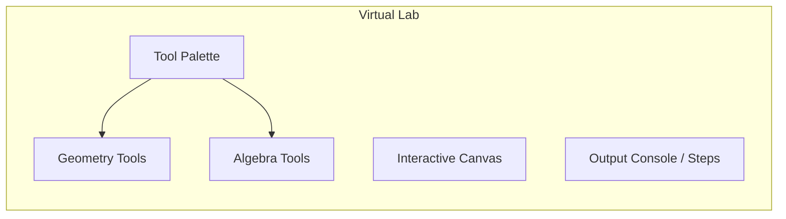

# Node 4: Lab Node Frontend

Interactive simulation interface.

## Wireframes

### 6.1 Lab Workspace

```mermaid
graph LR
    subgraph LabUI [Virtual Lab]
        Tools[Tool Palette]
        Tools --> GeoTools[Geometry Tools]
        Tools --> AlgTools[Algebra Tools]
        
        Workspace[Interactive Canvas]
        
        Console[Output Console / Steps]
    end
```
