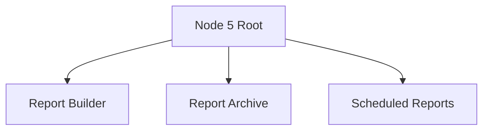
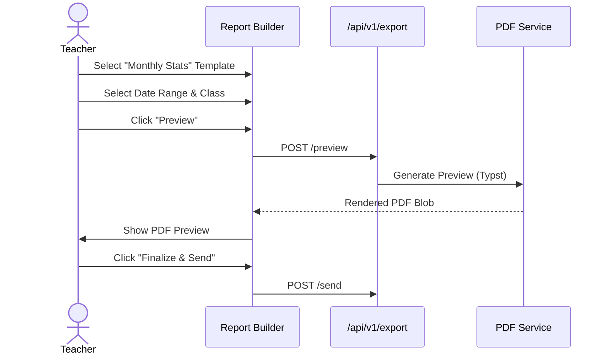

# Node 5: Report Node - Frontend Architecture

## 1. Information Architecture (IA)



## 2. User Flows

### 2.1 Generating a School Report



## 3. Component Architecture

### 3.1 Components
- `ReportDesigner`: Drag-and-drop or section toggler for templates.
- `PDFViewer`: Canvas-based PDF renderer (e.g., pdf.js).
- `SchedulerForm`: Cron-like UI for recurring reports.

## 4. State Management
- **Preview State**: Blob URLs, loading status.
- **Form State**: Complex configuration for report parameters.

## 5. Directory Structure
```
node5/
├── components/
│   ├── ReportDesigner/
│   ├── PDFViewer.tsx
│   └── Scheduler.tsx
├── hooks/
│   └── useReportPreview.ts
└── pages/
    └── ReportBuilder.tsx
```
