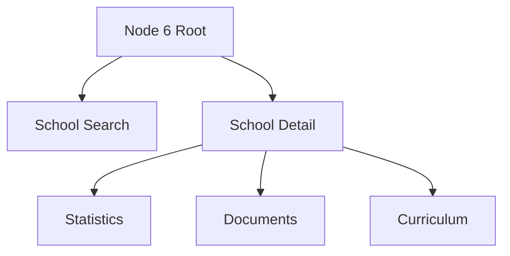
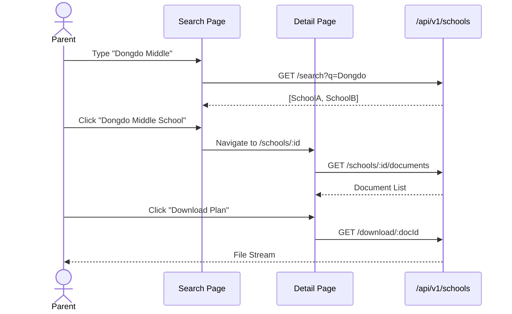

# Node 6: School Info - Frontend Architecture

## 1. Information Architecture (IA)



## 2. User Flows

### 2.1 Downloading School Documents



## 3. Component Architecture

### 3.1 Components
- `SchoolSearchInput`: Autocomplete search bar.
- `DocumentList`: Grid/List view of files with icons.
- `StatCard`: Visualizing school metrics (e.g., student counts).

## 4. State Management
- **Search State**: Query string, filters, pagination.
- **Cache**: React Query for school details (rarely changes).

## 5. Directory Structure
```
node6/
├── components/
│   ├── SearchBar.tsx
│   ├── DocumentList.tsx
│   └── FilterPanel.tsx
├── hooks/
│   └── useSchoolSearch.ts
└── pages/
    ├── SearchPage.tsx
    └── SchoolDetail.tsx
```
