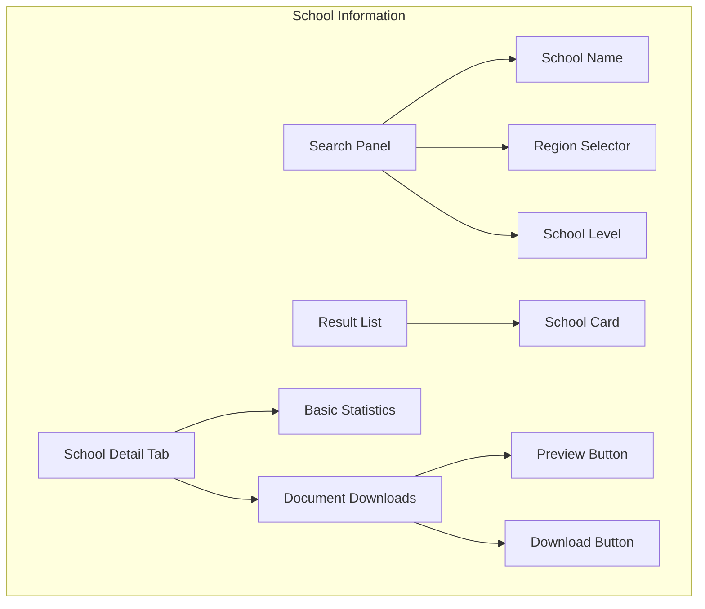

# Node 6: School Info Frontend

School information and document management.

## Wireframes

### 8.1 School Search Dashboard

```mermaid
graph TD
    subgraph SchoolInfoUI [School Information]
        SearchPanel[Search Panel]
        SearchPanel --> NameInput[School Name]
        SearchPanel --> RegionSel[Region Selector]
        SearchPanel --> LevelSel[School Level]
        
        ResultPanel[Result List]
        ResultPanel --> SchoolCard[School Card]
        
        DetailView[School Detail Tab]
        DetailView --> BasicStat[Basic Statistics]
        DetailView --> DocList[Document Downloads]
        DocList --> Preview[Preview Button]
        DocList --> Download[Download Button]
    end
```
