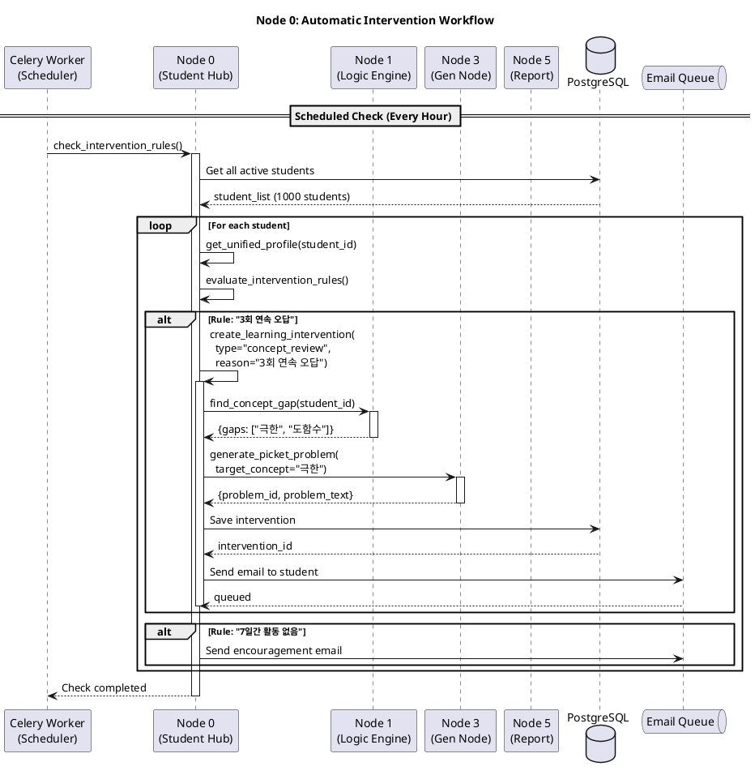

```plantuml
@startuml
title Node 0: Student Hub Class Diagram

package "API Layer" {
    class StudentHubAPI {
        +create_student(data): Student
        +get_student(id): Student
        +update_student(id, data): Student
        +delete_student(id): bool
    }
}

package "MCP Server Layer" {
    class StudentHubMCPServer {
        +get_unified_profile(input): UnifiedProfile
        +create_learning_intervention(input): Intervention
        +schedule_periodic_task(input): Schedule
        +get_class_analytics(input): Analytics
    }
}

package "Core Business Logic" {
    class StudentManager {
        -db: PostgreSQLRepository
        +create_student(data): Student
        +get_student(id): Student
        +update_student(id, data): Student
        +delete_student(id): bool
        +search_students(filters): List[Student]
    }

    class ProfileAggregator {
        -mcp_manager: MCPClientManager
        -cache: RedisClient
        +get_unified_profile(student_id, sections): UnifiedProfile
        -fetch_mastery_data(student_id): dict
        -fetch_activities(student_id): dict
        -fetch_reports(student_id): dict
        +invalidate_cache(student_id): void
    }

    class LearningPathOrchestrator {
        -db: PostgreSQLRepository
        -mcp_manager: MCPClientManager
        +create_learning_path(student_id, target_concepts): LearningPath
        +update_progress(student_id, progress): void
        +get_next_milestone(student_id): str
        -analyze_concept_gaps(student_id): List[Gap]
        -generate_personalized_plan(gaps): LearningPath
    }

    class InterventionEngine {
        -db: PostgreSQLRepository
        -mcp_manager: MCPClientManager
        -rules: List[InterventionRule]
        +create_intervention(student_id, type, reason): Intervention
        +check_intervention_rules(student_id, profile): List[Intervention]
        +execute_intervention(intervention_id): dict
        -evaluate_rule(rule, profile): bool
    }

    class AnalyticsEngine {
        -db: PostgreSQLRepository
        -mcp_manager: MCPClientManager
        +get_class_analytics(class_id, metrics): Analytics
        +get_school_dashboard(school_code): Dashboard
        +calculate_mastery_trend(students, period): List[Point]
        -aggregate_student_data(students): dict
    }
}

package "MCP Client Layer" {
    class MCPClientManager {
        -clients: Dict[str, ClientSession]
        +connect_all(): void
        +call_tool(server, tool, params): dict
        +get_all_tools(): List[ToolInfo]
        -retry_on_failure(func): decorator
    }
}

package "Background Workers" {
    class CeleryWorkers {
        +generate_weekly_report(student_id): void
        +update_learning_plan(student_id): void
        +check_interventions_hourly(): void
        +send_notification(recipients, message): void
    }
}

package "Data Layer" {
    class PostgreSQLRepository {
        -engine: SQLAlchemy.Engine
        +get_student(id): Student
        +insert_student(data): str
        +get_learning_path(student_id): LearningPath
        +insert_intervention(data): str
        +get_schedules(filters): List[Schedule]
    }

    class RedisClient {
        +get(key): str
        +set(key, value, ttl): void
        +hset(key, field, value): void
        +xadd(stream, data): void
    }
}

' Relationships
StudentHubAPI --> StudentManager: uses
StudentHubMCPServer --> ProfileAggregator: uses
StudentHubMCPServer --> LearningPathOrchestrator: uses
StudentHubMCPServer --> InterventionEngine: uses
StudentHubMCPServer --> AnalyticsEngine: uses

ProfileAggregator --> MCPClientManager: uses
ProfileAggregator --> RedisClient: uses
LearningPathOrchestrator --> MCPClientManager: uses
LearningPathOrchestrator --> PostgreSQLRepository: uses
InterventionEngine --> MCPClientManager: uses
InterventionEngine --> PostgreSQLRepository: uses
AnalyticsEngine --> MCPClientManager: uses
AnalyticsEngine --> PostgreSQLRepository: uses

StudentManager --> PostgreSQLRepository: uses

CeleryWorkers --> InterventionEngine: calls
CeleryWorkers --> LearningPathOrchestrator: calls

@enduml
```

# Node 0: Student Hub - 학생 통합 관리 및 오케스트레이션 마스터 노드

> 학생 중심의 통합 데이터 관리 플랫폼이자, 교육 워크플로우 자동화를 담당하는 Mathesis 플랫폼의 마스터 노드

**작성일**: 2026-01-09
**버전**: 1.0
**상태**: Design Phase
**Port**: 8000 (FastAPI), stdio (MCP Server + Client)

---

## 📋 목차

1. [개요](#1-개요)
2. [아키텍처](#2-아키텍처)
3. [MCP Tools 명세](#3-mcp-tools-명세)
4. [데이터베이스 스키마](#4-데이터베이스-스키마)
5. [시퀀스 다이어그램](#5-시퀀스-다이어그램)
6. [클래스 다이어그램](#6-클래스-다이어그램)
7. [구현 가이드](#7-구현-가이드)
8. [워크플로우 예시](#8-워크플로우-예시)

---

## 1. 개요

### 1.1 목적

**Student Hub (Node 0)**는 Mathesis-Synapse 플랫폼의 **중추 신경계(Central Nervous System)**로서, 다음 세 가지 핵심 역할을 수행합니다:

1. **Single Source of Truth**: 학생 마스터 데이터의 단일 진실 공급원
2. **Data Aggregation Hub**: 모든 노드의 학생 관련 데이터를 통합한 360도 뷰 제공
3. **Education Workflow Orchestrator**: 학생별 맞춤형 학습 경로 및 자동 개입 시스템

**핵심 가치**:
- 🎯 **학생 중심 설계**: 모든 데이터와 워크플로우가 학생을 중심으로 조직됨
- 🔗 **크로스 노드 통합**: Node 1-6의 데이터를 실시간으로 집계 및 분석
- 🤖 **자동화된 교육 개입**: 학습 패턴 기반 자동 알림, 문제 생성, 리포트 생성
- 📊 **통합 대시보드**: 학생/학부모/교사를 위한 통합 인터페이스

### 1.2 주요 기능

| 카테고리 | 기능 | MCP Tool |
|---------|------|----------|
| **학생 관리** | 학생 CRUD 및 마스터 데이터 관리 | `create_student`, `get_student`, `update_student` |
| **통합 프로필** | 모든 노드 데이터를 집계한 360도 학생 뷰 | `get_unified_profile` |
| **학습 경로** | 개인화된 학습 경로 생성 및 관리 | `create_learning_path`, `update_learning_progress` |
| **자동 개입** | 조건 기반 자동 액션 (알림, 문제 생성, 리포트) | `create_intervention`, `check_intervention_rules` |
| **스케줄링** | 주기적 리포트 및 학습 계획 생성 | `schedule_periodic_task` |
| **분석 & 대시보드** | 학급/학년/학교 단위 통계 및 인사이트 | `get_class_analytics`, `get_school_dashboard` |

### 1.3 기술 스택

| 계층 | 기술 | 용도 |
|------|------|------|
| **Framework** | FastAPI | REST API 서버 |
| **MCP** | Server + Client | 다른 노드 호출 + 외부에서 호출 받음 |
| **Database** | PostgreSQL 14+ | 학생 마스터 데이터, 학습 경로, 개입 규칙 |
| **Cache** | Redis | 실시간 데이터 캐싱, 이벤트 스트림 |
| **Scheduler** | Celery + Redis | 주기적 작업 (리포트 생성, 학습 계획 갱신) |
| **Task Queue** | Celery | 비동기 작업 (데이터 집계, 알림 발송) |
| **Notification** | Email (SMTP), SMS (계획) | 학생/학부모/교사 알림 |

---

## 2. 아키텍처

### 2.1 시스템 구조

```
┌─────────────────────────────────────────────────────────────┐
│                    External Clients                          │
│      (Teacher Portal, Student App, Parent App)               │
└───────────────────────────┬─────────────────────────────────┘
                            │ REST API
                            │
         ┌──────────────────▼──────────────────┐
         │    Node 0: Student Hub (Port 8000)  │
         │                                      │
         │  ┌────────────────────────────────┐ │
         │  │  API Layer (FastAPI)           │ │
         │  │  - REST Endpoints              │ │
         │  │  - WebSocket (real-time)       │ │
         │  └────────────────────────────────┘ │
         │                                      │
         │  ┌────────────────────────────────┐ │
         │  │  MCP Server Layer              │ │
         │  │  - get_unified_profile         │ │
         │  │  - create_learning_path        │ │
         │  │  - create_intervention         │ │
         │  │  - get_class_analytics         │ │
         │  └────────────────────────────────┘ │
         │                                      │
         │  ┌────────────────────────────────┐ │
         │  │  Core Business Logic           │ │
         │  │  - StudentManager              │ │
         │  │  - ProfileAggregator           │ │
         │  │  - LearningPathOrchestrator    │ │
         │  │  - InterventionEngine          │ │
         │  │  - AnalyticsEngine             │ │
         │  └────────────────────────────────┘ │
         │                                      │
         │  ┌────────────────────────────────┐ │
         │  │  MCP Client Manager            │ │
         │  │  (다른 노드 호출)                │ │
         │  └────────────────────────────────┘ │
         │                                      │
         │  ┌────────────────────────────────┐ │
         │  │  Background Workers (Celery)   │ │
         │  │  - Periodic Report Generation  │ │
         │  │  - Weekly Learning Plan Update │ │
         │  │  - Intervention Rule Checker   │ │
         │  └────────────────────────────────┘ │
         └──────┬───────────────────┬──────────┘
                │                   │
       ┌────────▼────────┐   ┌─────▼──────┐
       │   PostgreSQL    │   │   Redis    │
       │  - students     │   │  - cache   │
       │  - learning_    │   │  - events  │
       │    paths        │   │  - queues  │
       │  - interventions│   │            │
       └─────────────────┘   └────────────┘
                │
    ┌───────────┼───────────┬───────────┬──────────┬───────────┐
    │           │           │           │          │           │
┌───▼──┐   ┌───▼──┐   ┌───▼──┐   ┌───▼───┐  ┌──▼───┐   ┌──▼────┐
│Node1 │   │Node2 │   │Node3 │   │Node4  │  │Node5 │   │Node6  │
│Logic │   │Q-DNA │   │Gen   │   │Lab    │  │Report│   │School │
└──────┘   └──────┘   └──────┘   └───────┘  └──────┘   └───────┘
```

### 2.2 데이터 흐름

#### 학생 등록 → 초기 진단 → 학습 경로 생성

```
1. Teacher creates student via API
   POST /api/v1/students

   ↓

2. Node 0 stores master data + broadcasts event
   Event: "StudentCreated" {student_id, grade, school_code}

   ↓

3. Other nodes initialize student data:
   - Node 2 (Q-DNA): Initialize BKT parameters
   - Node 4 (Lab): Create heatmap entry

   ↓

4. Student takes diagnostic test (via Node 2)
   → BKT updates mastery levels
   → Node 2 notifies Node 0: "MasteryUpdated"

   ↓

5. Node 0 triggers auto workflow:
   a. MCP call → Node 1: find_concept_gap()
   b. MCP call → Node 3: generate_picket_problem() × 5
   c. MCP call → Node 5: generate_diagnostic_report()

   ↓

6. Node 0 creates learning path and sends notification
   → Email to student: "환영합니다! 맞춤형 학습 계획이 준비되었습니다."
```

### 2.3 MCP 역할: Server + Client

**Node 0은 유일하게 MCP Server와 Client 역할을 동시에 수행:**

- **MCP Server**: 외부(Teacher Portal, LLM Orchestrator)에게 Tools 제공
  - `get_unified_profile`, `create_intervention`, etc.

- **MCP Client**: 다른 노드(Node 1-6) 호출
  - Node 1: `find_concept_gap`
  - Node 2: `get_student_mastery`
  - Node 3: `generate_picket_problem`
  - Node 4: `get_failure_pattern`
  - Node 5: `generate_typst_report`
  - Node 6: `query_school_info`

---

## 3. MCP Tools 명세

### 3.1 Tool: `get_unified_profile`

**목적**: 학생의 통합 프로필 조회 (모든 노드 데이터 집계)

**Input Schema**:
```python
class GetUnifiedProfileInput(BaseModel):
    student_id: str = Field(..., description="학생 ID")
    include_sections: List[str] = Field(
        default=["basic", "mastery", "activities", "reports", "learning_path"],
        description="포함할 섹션 목록"
    )
    time_range: Optional[str] = Field(
        default="last_30_days",
        description="활동 데이터 조회 기간"
    )
```

**Output Schema**:
```python
class MasterySummary(BaseModel):
    average: float
    strong_concepts: List[str]
    weak_concepts: List[str]
    total_attempts: int
    recent_trend: str  # "improving" | "stable" | "declining"

class LearningPathStatus(BaseModel):
    current_stage: str
    next_milestone: str
    progress_percentage: float
    estimated_completion_date: Optional[str]

class UnifiedProfile(BaseModel):
    # Basic Info (from Node 0)
    student_id: str
    name: str
    grade: int
    school_code: str
    school_name: str
    created_at: str

    # Mastery Data (from Node 2 + Node 4)
    mastery_summary: MasterySummary
    heatmap_data: Dict[str, float]  # {concept_id: mastery_level}

    # Recent Activities (from Node 4)
    recent_activities: List[Dict[str, Any]]
    total_study_hours: float
    last_active_date: str

    # Reports (from Node 5)
    reports: List[Dict[str, Any]]
    last_report_url: Optional[str]

    # Learning Path (from Node 0)
    learning_path: LearningPathStatus

    # Interventions (from Node 0)
    active_interventions: List[Dict[str, Any]]
    intervention_history_count: int
```

**구현 예시**:
```python
@app.tool()
async def get_unified_profile(
    student_id: str,
    include_sections: List[str] = ["basic", "mastery", "activities", "reports", "learning_path"],
    time_range: str = "last_30_days"
) -> dict:
    """
    학생의 통합 프로필 조회 (모든 노드 데이터 집계)
    """
    profile = {}

    # 1. Basic Info (Node 0 DB)
    if "basic" in include_sections:
        student = await db.get_student(student_id)
        profile["student_id"] = student["id"]
        profile["name"] = student["name"]
        profile["grade"] = student["grade"]
        profile["school_code"] = student["school_code"]
        profile["created_at"] = student["created_at"].isoformat()

    # 2. Mastery Data (병렬 호출)
    if "mastery" in include_sections:
        mastery_task = mcp_call("q-dna-mcp", "get_student_mastery", {
            "student_id": student_id
        })
        heatmap_task = mcp_call("lab-node-mcp", "get_student_heatmap", {
            "student_id": student_id
        })

        mastery_result, heatmap_result = await asyncio.gather(mastery_task, heatmap_task)

        profile["mastery_summary"] = {
            "average": mastery_result["average_mastery"],
            "strong_concepts": [c for c, m in heatmap_result["heatmap"].items() if m >= 0.8],
            "weak_concepts": [c for c, m in heatmap_result["heatmap"].items() if m < 0.5],
            "total_attempts": mastery_result["total_attempts"],
            "recent_trend": calculate_trend(heatmap_result["history"])
        }
        profile["heatmap_data"] = heatmap_result["heatmap"]

    # 3. Recent Activities (Node 4)
    if "activities" in include_sections:
        activities_result = await mcp_call("lab-node-mcp", "get_recent_activities", {
            "student_id": student_id,
            "time_range": time_range,
            "limit": 20
        })
        profile["recent_activities"] = activities_result["activities"]
        profile["total_study_hours"] = activities_result["total_hours"]
        profile["last_active_date"] = activities_result["last_activity_date"]

    # 4. Reports (Node 5)
    if "reports" in include_sections:
        reports = await db.get_student_reports(student_id, limit=5)
        profile["reports"] = reports
        profile["last_report_url"] = reports[0]["pdf_url"] if reports else None

    # 5. Learning Path (Node 0 DB)
    if "learning_path" in include_sections:
        learning_path = await db.get_active_learning_path(student_id)
        if learning_path:
            profile["learning_path"] = {
                "current_stage": learning_path["current_stage"],
                "next_milestone": learning_path["next_milestone"],
                "progress_percentage": learning_path["progress"],
                "estimated_completion_date": learning_path["estimated_completion"]
            }

    return profile
```

---

### 3.2 Tool: `create_learning_intervention`

**목적**: 학생 상태 기반 자동 개입 생성

**Input Schema**:
```python
class InterventionType(str, Enum):
    CONCEPT_REVIEW = "concept_review"        # 개념 복습 필요
    EASIER_PROBLEMS = "easier_problems"      # 난이도 낮춤
    VIDEO_LESSON = "video_lesson"            # 영상 학습 권장
    TEACHER_ALERT = "teacher_alert"          # 교사에게 알림
    ENCOURAGEMENT = "encouragement"          # 격려 메시지

class CreateInterventionInput(BaseModel):
    student_id: str
    trigger: str = Field(
        description="개입 트리거",
        example="auto" | "manual" | "scheduled"
    )
    intervention_type: InterventionType
    reason: str = Field(
        description="개입 사유",
        example="3회 연속 오답, 7일간 활동 없음"
    )
    metadata: Dict[str, Any] = Field(
        default={},
        description="추가 컨텍스트 (취약 개념, 실패율 등)"
    )
```

**Output Schema**:
```python
class InterventionAction(BaseModel):
    action_type: str  # "generate_problems", "send_video", "notify_teacher"
    params: Dict[str, Any]
    scheduled_at: Optional[str]
    status: str  # "pending" | "executed" | "failed"

class CreateInterventionOutput(BaseModel):
    intervention_id: str
    student_id: str
    intervention_type: str
    actions: List[InterventionAction]
    created_at: str
    executed_at: Optional[str]
    result: Optional[Dict[str, Any]]
```

**구현 예시**:
```python
@app.tool()
async def create_learning_intervention(
    student_id: str,
    trigger: str,
    intervention_type: InterventionType,
    reason: str,
    metadata: Dict[str, Any] = {}
) -> dict:
    """
    학생 상태 기반 자동 개입 생성
    """
    intervention_id = f"int_{student_id}_{int(time.time())}"

    actions = []

    # 1. 개입 유형에 따른 액션 정의
    if intervention_type == InterventionType.CONCEPT_REVIEW:
        # 취약 개념에 대한 영상 및 문제 생성
        weak_concepts = metadata.get("weak_concepts", [])

        for concept in weak_concepts[:2]:  # 상위 2개
            # 개념 영상 링크 조회
            video_action = {
                "action_type": "send_video",
                "params": {"concept_id": concept, "video_type": "review"},
                "status": "pending"
            }
            actions.append(video_action)

            # 복습 문제 생성
            problem_action = {
                "action_type": "generate_problems",
                "params": {
                    "mcp_server": "gen-node-mcp",
                    "tool": "generate_picket_problem",
                    "tool_params": {
                        "student_id": student_id,
                        "target_concept": concept,
                        "difficulty_adjustment": -0.2  # 약간 쉽게
                    }
                },
                "status": "pending"
            }
            actions.append(problem_action)

    elif intervention_type == InterventionType.EASIER_PROBLEMS:
        # 현재 학습 중인 개념의 쉬운 문제 추천
        current_concept = metadata.get("current_concept")
        action = {
            "action_type": "recommend_problems",
            "params": {
                "mcp_server": "q-dna-mcp",
                "tool": "find_similar_dna_problems",
                "tool_params": {
                    "target_dna": current_concept,
                    "difficulty_range": [0.3, 0.5],  # 쉬운 난이도
                    "limit": 10
                }
            },
            "status": "pending"
        }
        actions.append(action)

    elif intervention_type == InterventionType.TEACHER_ALERT:
        # 교사에게 알림
        action = {
            "action_type": "notify_teacher",
            "params": {
                "student_id": student_id,
                "alert_type": "struggling",
                "message": reason,
                "metadata": metadata
            },
            "status": "pending"
        }
        actions.append(action)

    # 2. DB에 저장
    await db.insert_intervention({
        "intervention_id": intervention_id,
        "student_id": student_id,
        "trigger": trigger,
        "intervention_type": intervention_type.value,
        "reason": reason,
        "metadata": metadata,
        "actions": actions,
        "created_at": datetime.now()
    })

    # 3. 액션 실행 (비동기)
    await execute_intervention_actions.delay(intervention_id, actions)

    return {
        "intervention_id": intervention_id,
        "student_id": student_id,
        "intervention_type": intervention_type.value,
        "actions": actions,
        "created_at": datetime.now().isoformat(),
        "executed_at": None,
        "result": None
    }
```

---

### 3.3 Tool: `schedule_periodic_task`

**목적**: 주기적 작업 스케줄링 (리포트 생성, 학습 계획 갱신)

**Input Schema**:
```python
class TaskType(str, Enum):
    WEEKLY_REPORT = "weekly_report"
    MONTHLY_REPORT = "monthly_report"
    LEARNING_PLAN_UPDATE = "learning_plan_update"
    INTERVENTION_CHECK = "intervention_check"

class SchedulePeriodicTaskInput(BaseModel):
    student_id: str
    task_type: TaskType
    schedule: str = Field(
        description="Cron expression",
        example="0 9 * * MON"  # 매주 월요일 9시
    )
    enabled: bool = Field(default=True)
    recipients: List[str] = Field(
        default=[],
        description="알림 수신자 이메일 목록"
    )
    params: Dict[str, Any] = Field(
        default={},
        description="작업별 추가 파라미터"
    )
```

**Output Schema**:
```python
class SchedulePeriodicTaskOutput(BaseModel):
    schedule_id: str
    student_id: str
    task_type: str
    schedule: str  # Cron expression
    next_run: str  # ISO datetime
    enabled: bool
    created_at: str
```

**구현 예시**:
```python
from celery import Celery
from celery.schedules import crontab

@app.tool()
async def schedule_periodic_task(
    student_id: str,
    task_type: TaskType,
    schedule: str,
    enabled: bool = True,
    recipients: List[str] = [],
    params: Dict[str, Any] = {}
) -> dict:
    """
    주기적 작업 스케줄링
    """
    schedule_id = f"sched_{student_id}_{task_type.value}_{int(time.time())}"

    # 1. Cron 표현식 파싱
    cron_parts = schedule.split()
    cron_schedule = crontab(
        minute=cron_parts[0],
        hour=cron_parts[1],
        day_of_week=cron_parts[4] if len(cron_parts) > 4 else '*'
    )

    # 2. Celery Beat 스케줄 등록
    if task_type == TaskType.WEEKLY_REPORT:
        celery_app.conf.beat_schedule[schedule_id] = {
            'task': 'tasks.generate_weekly_report',
            'schedule': cron_schedule,
            'args': (student_id, recipients, params)
        }

    elif task_type == TaskType.LEARNING_PLAN_UPDATE:
        celery_app.conf.beat_schedule[schedule_id] = {
            'task': 'tasks.update_learning_plan',
            'schedule': cron_schedule,
            'args': (student_id, params)
        }

    # 3. DB에 저장
    next_run = calculate_next_run(cron_schedule)
    await db.insert_schedule({
        "schedule_id": schedule_id,
        "student_id": student_id,
        "task_type": task_type.value,
        "schedule": schedule,
        "next_run": next_run,
        "enabled": enabled,
        "recipients": recipients,
        "params": params,
        "created_at": datetime.now()
    })

    return {
        "schedule_id": schedule_id,
        "student_id": student_id,
        "task_type": task_type.value,
        "schedule": schedule,
        "next_run": next_run.isoformat(),
        "enabled": enabled,
        "created_at": datetime.now().isoformat()
    }
```

---

### 3.4 Tool: `get_class_analytics`

**목적**: 학급/학년/학교 단위 통계 및 인사이트

**Input Schema**:
```python
class AnalyticsScope(str, Enum):
    CLASS = "class"
    GRADE = "grade"
    SCHOOL = "school"

class AnalyticsMetric(str, Enum):
    AVERAGE_MASTERY = "average_mastery"
    COMPLETION_RATE = "completion_rate"
    WEAK_CONCEPTS = "weak_concepts"
    TOP_PERFORMERS = "top_performers"
    STRUGGLING_STUDENTS = "struggling_students"

class GetClassAnalyticsInput(BaseModel):
    scope: AnalyticsScope
    scope_id: str = Field(
        description="학급 ID, 학년, 또는 학교 코드",
        example="8-3" | "8" | "B100000662"
    )
    metrics: List[AnalyticsMetric] = Field(
        default=[AnalyticsMetric.AVERAGE_MASTERY, AnalyticsMetric.WEAK_CONCEPTS]
    )
    time_range: str = Field(
        default="last_30_days"
    )
```

**Output Schema**:
```python
class StudentPerformance(BaseModel):
    student_id: str
    name: str
    average_mastery: float
    rank: int

class ConceptDistribution(BaseModel):
    concept_id: str
    concept_name: str
    average_mastery: float
    struggling_student_count: int

class GetClassAnalyticsOutput(BaseModel):
    scope: str
    scope_id: str
    student_count: int

    # Metrics
    average_mastery: Optional[float]
    completion_rate: Optional[float]

    # Lists
    top_performers: Optional[List[StudentPerformance]]
    struggling_students: Optional[List[StudentPerformance]]
    weak_concepts: Optional[List[ConceptDistribution]]

    # Time series
    mastery_trend: Optional[List[Dict[str, Any]]]  # [{date, value}, ...]
```

---

## 4. 데이터베이스 스키마

### 4.1 PostgreSQL Schema

**학생 마스터 테이블**:
```sql
CREATE TABLE students (
    id VARCHAR(64) PRIMARY KEY,
    name VARCHAR(100) NOT NULL,
    grade INT NOT NULL CHECK (grade BETWEEN 1 AND 12),
    school_code VARCHAR(16) NOT NULL,

    -- 학부모 정보
    parent_name VARCHAR(100),
    parent_email VARCHAR(255),
    parent_phone VARCHAR(20),

    -- 계정 정보
    email VARCHAR(255) UNIQUE,
    status VARCHAR(20) DEFAULT 'active',  -- 'active', 'inactive', 'graduated'

    -- 메타데이터
    metadata JSONB DEFAULT '{}',
    created_at TIMESTAMP DEFAULT NOW(),
    updated_at TIMESTAMP DEFAULT NOW(),

    FOREIGN KEY (school_code) REFERENCES schools(school_code)
);

CREATE INDEX idx_students_school ON students(school_code);
CREATE INDEX idx_students_grade ON students(grade);
CREATE INDEX idx_students_status ON students(status);
```

**학습 경로 테이블**:
```sql
CREATE TABLE learning_paths (
    id SERIAL PRIMARY KEY,
    student_id VARCHAR(64) NOT NULL,

    -- 경로 정보
    path_name VARCHAR(200),
    current_stage VARCHAR(100),
    next_milestone VARCHAR(200),
    progress FLOAT DEFAULT 0.0 CHECK (progress BETWEEN 0 AND 1),

    -- 목표
    target_concepts TEXT[],  -- 목표로 하는 개념 ID 리스트
    estimated_completion DATE,

    -- 상태
    is_active BOOLEAN DEFAULT TRUE,
    created_at TIMESTAMP DEFAULT NOW(),
    updated_at TIMESTAMP DEFAULT NOW(),
    completed_at TIMESTAMP,

    FOREIGN KEY (student_id) REFERENCES students(id) ON DELETE CASCADE
);

CREATE INDEX idx_learning_paths_student ON learning_paths(student_id, is_active);
```

**개입 테이블**:
```sql
CREATE TABLE interventions (
    intervention_id VARCHAR(64) PRIMARY KEY,
    student_id VARCHAR(64) NOT NULL,

    -- 개입 정보
    trigger VARCHAR(50) NOT NULL,  -- 'auto', 'manual', 'scheduled'
    intervention_type VARCHAR(50) NOT NULL,
    reason TEXT NOT NULL,
    metadata JSONB DEFAULT '{}',

    -- 액션
    actions JSONB NOT NULL,  -- [{action_type, params, status}, ...]

    -- 실행 상태
    status VARCHAR(20) DEFAULT 'pending',  -- 'pending', 'executing', 'completed', 'failed'
    created_at TIMESTAMP DEFAULT NOW(),
    executed_at TIMESTAMP,
    result JSONB,

    FOREIGN KEY (student_id) REFERENCES students(id) ON DELETE CASCADE
);

CREATE INDEX idx_interventions_student ON interventions(student_id, created_at DESC);
CREATE INDEX idx_interventions_status ON interventions(status);
```

**스케줄 테이블**:
```sql
CREATE TABLE schedules (
    schedule_id VARCHAR(64) PRIMARY KEY,
    student_id VARCHAR(64) NOT NULL,

    -- 스케줄 정보
    task_type VARCHAR(50) NOT NULL,
    schedule VARCHAR(100) NOT NULL,  -- Cron expression
    next_run TIMESTAMP NOT NULL,

    -- 수신자
    recipients TEXT[],

    -- 파라미터
    params JSONB DEFAULT '{}',

    -- 상태
    enabled BOOLEAN DEFAULT TRUE,
    created_at TIMESTAMP DEFAULT NOW(),
    last_run TIMESTAMP,
    run_count INT DEFAULT 0,

    FOREIGN KEY (student_id) REFERENCES students(id) ON DELETE CASCADE
);

CREATE INDEX idx_schedules_student ON schedules(student_id);
CREATE INDEX idx_schedules_next_run ON schedules(next_run) WHERE enabled = TRUE;
```

**학교 마스터 테이블** (Node 6과 공유):
```sql
CREATE TABLE schools (
    school_code VARCHAR(16) PRIMARY KEY,
    school_name VARCHAR(100) NOT NULL,
    address TEXT,
    phone VARCHAR(20),
    school_type VARCHAR(20),  -- '초등학교', '중학교', '고등학교'
    region VARCHAR(50),
    created_at TIMESTAMP DEFAULT NOW()
);
```

---

## 5. 시퀀스 다이어그램

### 5.1 통합 프로필 조회

```plantuml
@startuml
title Node 0: get_unified_profile 시퀀스

actor "Teacher Portal" as Teacher
participant "Node 0\n(Student Hub)" as N0
participant "Node 2\n(Q-DNA)" as N2
participant "Node 4\n(Lab)" as N4
participant "Node 5\n(Report)" as N5
database "PostgreSQL" as DB
database "Redis Cache" as Redis

Teacher -> N0: MCP Call: get_unified_profile(\n  student_id="student_123")
activate N0

N0 -> Redis: 1. Check cache
Redis --> N0: cache_miss

N0 -> DB: 2. Get student basic info
activate DB
DB --> N0: {name, grade, school_code}
deactivate DB

== Parallel Data Aggregation ==

par Parallel MCP Calls
    N0 -> N2: get_student_mastery(student_123)
    activate N2
    N2 --> N0: {average: 0.75, total_attempts: 150}
    deactivate N2
and
    N0 -> N4: get_student_heatmap(student_123)
    activate N4
    N4 --> N0: {heatmap: {"concept1": 0.8, ...}}
    deactivate N4
and
    N0 -> N4: get_recent_activities(student_123)
    activate N4
    N4 --> N0: {activities: [...], total_hours: 12.5}
    deactivate N4
end

N0 -> DB: 3. Get learning path
activate DB
DB --> N0: {current_stage, progress, next_milestone}
deactivate DB

N0 -> N0: 4. Aggregate all data\n→ UnifiedProfile

N0 -> Redis: 5. Cache result (TTL 300s)
Redis --> N0: cached

N0 --> Teacher: UnifiedProfile{\n  mastery_summary,\n  recent_activities,\n  learning_path,\n  ...\n}
deactivate N0

@enduml
```

### 5.2 자동 개입 플로우



---

## 6. 클래스 다이어그램



---

## 7. 구현 가이드

### 7.1 프로젝트 구조

```
node0_student_hub/
├── main.py                     # FastAPI 진입점
├── mcp_server.py               # MCP Server 진입점
├── config.py                   # 설정 파일
├── requirements.txt
│
├── api/                        # REST API Layer
│   ├── __init__.py
│   ├── students.py             # 학생 CRUD
│   ├── profiles.py             # 통합 프로필
│   ├── interventions.py        # 개입 관리
│   └── analytics.py            # 분석 API
│
├── mcp_tools/                  # MCP Tools
│   ├── __init__.py
│   ├── get_unified_profile.py
│   ├── create_intervention.py
│   ├── schedule_task.py
│   └── get_analytics.py
│
├── core/                       # Core Business Logic
│   ├── __init__.py
│   ├── student_manager.py
│   ├── profile_aggregator.py
│   ├── learning_path_orchestrator.py
│   ├── intervention_engine.py
│   └── analytics_engine.py
│
├── mcp_client/                 # MCP Client (다른 노드 호출)
│   ├── __init__.py
│   ├── manager.py
│   └── connections.py
│
├── workers/                    # Celery Workers
│   ├── __init__.py
│   ├── celery_app.py
│   ├── report_tasks.py
│   ├── intervention_tasks.py
│   └── notification_tasks.py
│
├── repositories/               # Data Layer
│   ├── __init__.py
│   ├── postgres_repo.py
│   └── redis_client.py
│
├── models/                     # Data Models
│   ├── __init__.py
│   ├── student.py
│   ├── learning_path.py
│   ├── intervention.py
│   └── schemas.py
│
├── utils/                      # Utilities
│   ├── __init__.py
│   ├── cron_parser.py
│   ├── notification.py
│   └── validators.py
│
└── tests/                      # Tests
    ├── test_api.py
    ├── test_mcp_tools.py
    ├── test_core_logic.py
    └── test_workers.py
```

### 7.2 환경 변수 설정

```env
# Node 0 Configuration
NODE0_PORT=8000
NODE0_HOST=0.0.0.0

# Database
POSTGRES_HOST=localhost
POSTGRES_PORT=5432
POSTGRES_DB=student_hub
POSTGRES_USER=mathesis
POSTGRES_PASSWORD=your_password

# Redis
REDIS_HOST=localhost
REDIS_PORT=6379
REDIS_DB=0

# Celery
CELERY_BROKER_URL=redis://localhost:6379/1
CELERY_RESULT_BACKEND=redis://localhost:6379/2

# MCP Servers (Node 1-6)
NODE1_MCP_COMMAND=python
NODE1_MCP_ARGS=../node1_logic_engine/mcp_server.py

NODE2_MCP_COMMAND=python
NODE2_MCP_ARGS=../node2_q_dna/mcp_server.py

# ... (Node 3-6 동일)

# Email
SMTP_HOST=smtp.gmail.com
SMTP_PORT=587
SMTP_USER=notifications@mathesis.com
SMTP_PASSWORD=your_password

# Logging
LOG_LEVEL=INFO
LOG_FILE=/var/log/mathesis/node0.log
```

---

## 8. 워크플로우 예시

### 8.1 신규 학생 온보딩 워크플로우

```yaml
# workflows/student_onboarding.yaml
workflow:
  name: "신규_학생_온보딩"
  description: "새 학생 등록 → 초기 진단 → 학습 경로 생성"
  trigger: "student_created"

  steps:
    - id: initialize_nodes
      name: "다른 노드에 학생 데이터 초기화"
      action: parallel
      tasks:
        - mcp_call:
            server: q-dna-mcp
            tool: initialize_student_bkt
            params:
              student_id: $event.student_id
              initial_mastery: 0.5

        - mcp_call:
            server: lab-node-mcp
            tool: create_student_heatmap
            params:
              student_id: $event.student_id

      output: initialization_results

    - id: send_diagnostic_test
      name: "초기 진단 테스트 발송"
      action: notification
      params:
        type: email
        to: $event.student_email
        subject: "환영합니다! 초기 진단 테스트를 시작하세요"
        template: "diagnostic_test_invitation"
        data:
          student_name: $event.student_name
          test_url: "https://mathesis.com/diagnostic"

      output: notification_sent

    - id: wait_for_test_completion
      name: "진단 테스트 완료 대기"
      action: wait_for_event
      event_type: "diagnostic_test_completed"
      timeout: "7 days"

      output: test_results

    - id: analyze_and_create_path
      name: "결과 분석 및 학습 경로 생성"
      depends_on: [wait_for_test_completion]
      action: sequential
      steps:
        - id: find_gaps
          mcp_call:
            server: logic-engine-mcp
            tool: find_concept_gap
            params:
              student_id: $event.student_id
              threshold: 0.5
          output: concept_gaps

        - id: create_path
          action: python
          code: |
            from core.learning_path_orchestrator import LearningPathOrchestrator
            orchestrator = LearningPathOrchestrator()
            path = await orchestrator.create_learning_path(
                student_id=$event.student_id,
                target_concepts=[gap['concept_id'] for gap in $concept_gaps.gaps]
            )
            return {"learning_path": path}
          output: learning_path

        - id: generate_initial_problems
          mcp_call:
            server: gen-node-mcp
            tool: generate_picket_problem
            params:
              student_id: $event.student_id
              target_concept: $concept_gaps.gaps[0].concept_id
              count: 5
          output: initial_problems

      output: onboarding_complete

    - id: send_welcome_email
      name: "환영 이메일 및 학습 계획 발송"
      depends_on: [analyze_and_create_path]
      action: notification
      params:
        type: email
        to: $event.student_email
        subject: "맞춤형 학습 계획이 준비되었습니다!"
        template: "welcome_with_learning_plan"
        data:
          student_name: $event.student_name
          learning_path: $learning_path
          initial_problems_count: $len($initial_problems)

  outputs:
    onboarding_status: "completed"
    learning_path_id: $learning_path.id
    initial_problems_count: $len($initial_problems)
```

### 8.2 주간 리포트 자동 생성 워크플로우

```yaml
# workflows/weekly_report_generation.yaml
workflow:
  name: "주간_리포트_자동_생성"
  description: "매주 월요일 학생별 주간 학습 리포트 자동 생성 및 발송"
  trigger: "cron: 0 9 * * MON"

  inputs:
    - name: student_id
      type: string
      required: true

  steps:
    - id: collect_weekly_data
      name: "지난 주 학습 데이터 수집"
      action: parallel
      tasks:
        - mcp_call:
            server: lab-node-mcp
            tool: get_failure_pattern
            params:
              student_id: $inputs.student_id
              time_range: "last_7_days"
          output: failure_data

        - mcp_call:
            server: q-dna-mcp
            tool: get_student_mastery
            params:
              student_id: $inputs.student_id
          output: mastery_data

      output: weekly_data

    - id: generate_report
      name: "리포트 생성"
      depends_on: [collect_weekly_data]
      mcp_call:
        server: report-node-mcp
        tool: generate_typst_report
        params:
          student_id: $inputs.student_id
          report_type: "weekly"
          start_date: $date_utils.days_ago(7)
          end_date: $date_utils.now()

      output: report

    - id: send_to_student_and_parent
      name: "학생 및 학부모에게 리포트 발송"
      depends_on: [generate_report]
      action: notification
      params:
        type: email
        to: [$student.email, $student.parent_email]
        subject: "주간 학습 리포트 - {{student_name}}"
        template: "weekly_report"
        attachments:
          - url: $report.pdf_url
            filename: "weekly_report.pdf"

  outputs:
    report_url: $report.pdf_url
    sent_to: [$student.email, $student.parent_email]
```

---

## 9. 성능 고려사항

### 9.1 캐싱 전략

```python
# 통합 프로필 캐싱
CACHE_TTL = {
    "unified_profile": 300,      # 5분
    "mastery_summary": 600,       # 10분
    "recent_activities": 180,     # 3분
    "class_analytics": 1800       # 30분
}

# Redis 캐시 키 패턴
CACHE_KEYS = {
    "profile": "student:{student_id}:profile",
    "mastery": "student:{student_id}:mastery",
    "analytics": "class:{class_id}:analytics:{date}"
}
```

### 9.2 비동기 처리

```python
# 무거운 작업은 Celery로 비동기 처리
@celery_app.task
async def aggregate_profile_async(student_id: str):
    """
    통합 프로필 집계를 백그라운드에서 실행
    """
    profile = await profile_aggregator.get_unified_profile(student_id)
    await redis.set(f"student:{student_id}:profile", json.dumps(profile), ex=300)
    return profile
```

### 9.3 데이터베이스 최적화

```sql
-- 자주 조회되는 쿼리 인덱스
CREATE INDEX idx_interventions_student_status ON interventions(student_id, status)
    WHERE status IN ('pending', 'executing');

CREATE INDEX idx_learning_paths_active ON learning_paths(student_id, is_active)
    WHERE is_active = TRUE;

-- Materialized View (통계)
CREATE MATERIALIZED VIEW student_statistics AS
SELECT
    s.id AS student_id,
    COUNT(DISTINCT lp.id) AS total_learning_paths,
    COUNT(DISTINCT i.intervention_id) AS total_interventions,
    AVG(lp.progress) AS average_progress
FROM students s
LEFT JOIN learning_paths lp ON s.id = lp.student_id
LEFT JOIN interventions i ON s.id = i.student_id
GROUP BY s.id;

-- 매일 새벽 갱신
CREATE INDEX ON student_statistics(student_id);
REFRESH MATERIALIZED VIEW CONCURRENTLY student_statistics;
```

---

## 10. 보안 고려사항

### 10.1 데이터 접근 제어

```python
# 학생 데이터 접근 권한 체크
class DataAccessControl:
    @staticmethod
    async def check_student_access(user_id: str, student_id: str, action: str) -> bool:
        """
        사용자가 학생 데이터에 접근할 권한이 있는지 확인
        """
        # 1. 자기 자신
        if user_id == student_id:
            return True

        # 2. 학부모
        student = await db.get_student(student_id)
        if user_id == student.parent_id:
            return True

        # 3. 담당 교사
        if await is_teacher_of_student(user_id, student_id):
            return True

        # 4. 관리자
        if await is_admin(user_id):
            return True

        return False
```

### 10.2 개인정보 마스킹

```python
# 학급 통계에서 개인 식별 정보 제거
def anonymize_student_data(students: List[Student]) -> List[AnonymizedStudent]:
    """
    학생 이름을 익명화 (예: "학생 A", "학생 B")
    """
    return [
        AnonymizedStudent(
            id=f"student_{chr(65 + idx)}",  # A, B, C, ...
            mastery=s.mastery,
            rank=idx + 1
        )
        for idx, s in enumerate(students)
    ]
```

---

## 11. 확장 가능성

- **멀티테넌시**: 학교별 독립 DB 스키마 지원
- **실시간 알림**: WebSocket을 통한 실시간 학습 상태 업데이트
- **모바일 앱 지원**: REST API + Push Notification
- **AI 코칭**: LLM 기반 학습 조언 챗봇 통합
- **학부모 포털**: 자녀 학습 현황 실시간 모니터링
- **교사 대시보드**: 학급 전체 현황 한눈에 보기

---

**생성 일시**: 2026-01-09
**문서 버전**: 1.0
**담당 노드**: Node 0 (Student Hub)
**관련 문서**: 01_MSA_ARCHITECTURE.md, LLM_ORCHESTRATOR.md, NODE1-6 문서
