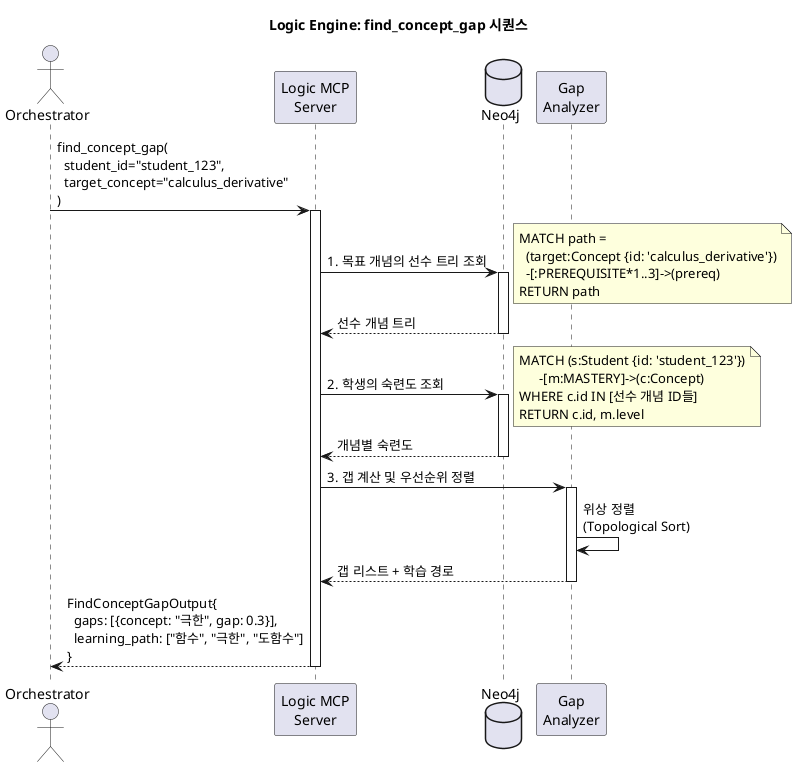
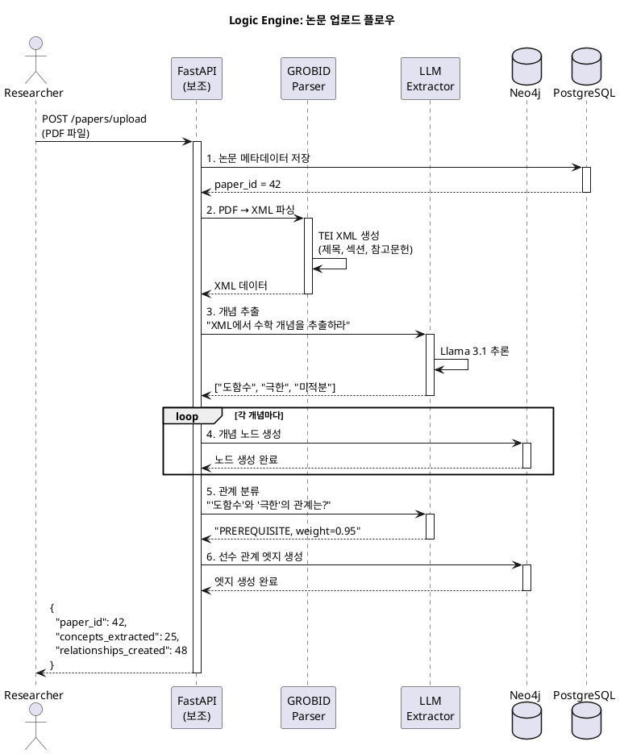
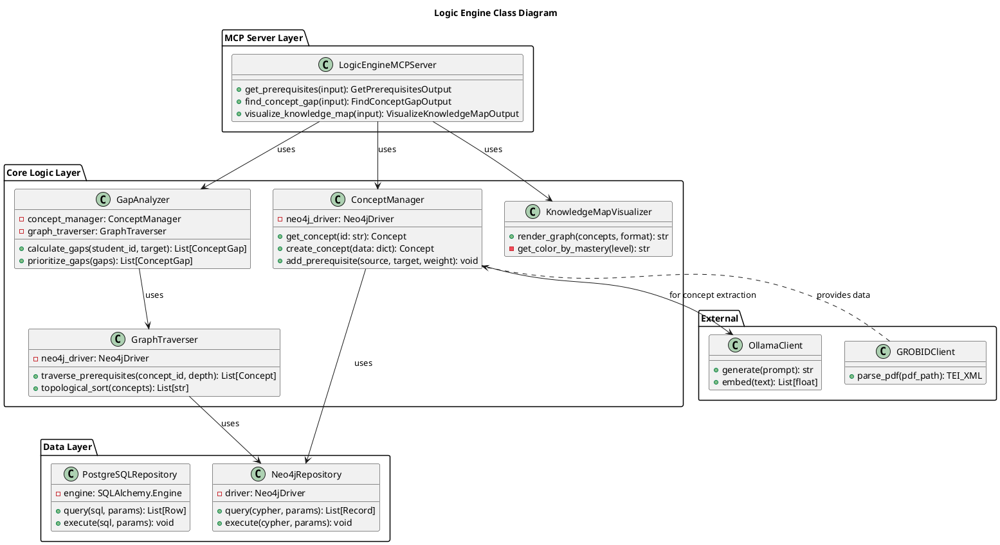

# Node 1: Logic Engine - 교육 이론 지식 그래프 엔진

> MCP Tools를 통해 지식 그래프 탐색, 선수 학습 추적, 개념 갭 분석을 제공하는 교육 이론 엔진

**작성일**: 2026-01-08
**버전**: 1.0
**상태**: Design Phase
**Port**: 8001 (FastAPI), stdio (MCP)

---

## 📋 목차

1. [개요](#1-개요)
2. [아키텍처](#2-아키텍처)
3. [MCP Tools 명세](#3-mcp-tools-명세)
4. [데이터베이스 스키마](#4-데이터베이스-스키마)
5. [시퀀스 다이어그램](#5-시퀀스-다이어그램)
6. [클래스 다이어그램](#6-클래스-다이어그램)
7. [구현 가이드](#7-구현-가이드)
8. [테스트 시나리오](#8-테스트-시나리오)

---

## 1. 개요

### 1.1 목적

**Logic Engine**은 교육 이론(Educational Theory)을 **실행 가능한 지식 그래프**로 변환하여, LLM Orchestrator가 학생의 학습 경로를 과학적으로 설계할 수 있도록 지원합니다.

**핵심 가치**:
- 📚 **학술 논문 자동 파싱**: GROBID를 사용하여 PDF → 구조화된 개념 추출
- 🌳 **선수 학습 관계 관리**: "미분을 배우려면 먼저 극한을 알아야 함" 같은 지식 의존성
- 🔍 **개념 갭 분석**: 학생의 현재 숙련도와 목표 개념 사이의 격차 식별
- 📊 **GraphRAG**: 지식 그래프 기반 질의응답

### 1.2 주요 기능

| 기능 | 설명 | MCP Tool |
|------|------|----------|
| **선수 지식 조회** | 특정 개념을 배우기 위해 필요한 선행 지식 트리 반환 | `get_prerequisites` |
| **개념 갭 분석** | 학생의 목표 개념 대비 부족한 지식 식별 | `find_concept_gap` |
| **지식 맵 시각화** | 학생 중심의 지식 그래프를 이미지로 렌더링 | `visualize_knowledge_map` |

### 1.3 기술 스택

| 계층 | 기술 | 용도 |
|------|------|------|
| **MCP Server** | `mcp` Python SDK | LLM과의 Tool 통신 |
| **Graph DB** | Neo4j 5.x | 개념 및 선수 관계 저장 |
| **Metadata DB** | PostgreSQL 14 | 논문 메타데이터, 사용자 숙련도 |
| **LLM** | Ollama (Llama 3.1) | 개념 추출, 관계 분류 |
| **Paper Parser** | GROBID | 학술 논문 구조 분석 |
| **Visualization** | Graphviz, Cytoscape.js | 지식 그래프 렌더링 |

---

## 2. 아키텍처

### 2.1 시스템 구조

```
┌─────────────────────────────────────────────────────────┐
│                  LLM Orchestrator                        │
│        (MCP Client를 통해 Logic Engine 호출)              │
└───────────────────────┬─────────────────────────────────┘
                        │ MCP Protocol (stdio/HTTP)
                        │
         ┌──────────────▼──────────────┐
         │   Logic Engine MCP Server   │
         │                             │
         │  ┌─────────────────────┐   │
         │  │ Tool: get_prerequisites │
         │  │ Tool: find_concept_gap  │
         │  │ Tool: visualize_map     │
         │  └─────────────────────┘   │
         │                             │
         │  ┌─────────────────────┐   │
         │  │  Core Logic Layer   │   │
         │  │  - Concept Manager  │   │
         │  │  - Graph Traverser  │   │
         │  │  - Gap Analyzer     │   │
         │  └─────────────────────┘   │
         └──────┬────────────┬─────────┘
                │            │
       ┌────────▼────┐  ┌───▼─────────┐
       │   Neo4j     │  │  PostgreSQL │
       │  (Graph DB) │  │  (Metadata) │
       └─────────────┘  └─────────────┘
                │
         ┌──────▼──────┐
         │   GROBID    │
         │ (논문 파싱)  │
         └─────────────┘
```

### 2.2 데이터 흐름

**논문 업로드 → 지식 그래프 구축**:
```
1. PDF Upload
   ↓
2. GROBID Parser: PDF → XML (제목, 섹션, 참고문헌 추출)
   ↓
3. LLM Concept Extractor: XML → 개념 리스트
   ↓
4. Relation Classifier: 개념 간 관계 분류 (선수, 동등, 하위)
   ↓
5. Neo4j Graph Builder: 개념 노드 및 엣지 생성
```

**개념 갭 분석 요청**:
```
1. Orchestrator: find_concept_gap(student_123, "미분")
   ↓
2. Neo4j Query: 학생의 현재 숙련도 조회
   ↓
3. Graph Traversal: "미분"의 선수 개념 트리 탐색
   ↓
4. Gap Calculation: 부족한 개념 및 우선순위 계산
   ↓
5. Return: [{concept: "극한", gap_score: 0.7}, ...]
```

---

## 3. MCP Tools 명세

### 3.1 Tool: `get_prerequisites`

**목적**: 특정 개념의 선수 지식 트리를 재귀적으로 반환

**Input Schema**:
```python
class GetPrerequisitesInput(BaseModel):
    concept_id: str = Field(
        description="개념 ID (예: 'calculus_derivative')",
        example="calculus_derivative"
    )
    depth: int = Field(
        default=2,
        description="탐색 깊이 (1=직접 선수만, 2=선수의 선수까지)",
        ge=1,
        le=5
    )
    include_mastery: bool = Field(
        default=False,
        description="학생 숙련도 포함 여부 (student_id 필요)"
    )
    student_id: Optional[str] = Field(
        default=None,
        description="학생 ID (include_mastery=True일 때 필수)"
    )
```

**Output Schema**:
```python
class PrerequisiteNode(BaseModel):
    id: str
    title: str
    level: int  # 선수 관계 깊이 (1=직접 선수)
    weight: float  # 중요도 (0.0 ~ 1.0)
    mastery: Optional[float]  # 학생 숙련도 (include_mastery=True일 때)
    prerequisites: List['PrerequisiteNode'] = []  # 재귀 구조

class GetPrerequisitesOutput(BaseModel):
    concept_id: str
    concept_title: str
    total_prerequisites: int
    prerequisites: List[PrerequisiteNode]
```

**Cypher Query 예시**:
```cypher
MATCH path = (target:Concept {id: $concept_id})-[:PREREQUISITE*1..2]->(prereq:Concept)
OPTIONAL MATCH (student:Student {id: $student_id})-[m:MASTERY]->(prereq)
RETURN
  prereq.id AS id,
  prereq.title AS title,
  length(path) AS level,
  relationship.weight AS weight,
  m.level AS mastery
ORDER BY level, weight DESC
```

**사용 예시**:
```python
# Orchestrator에서 호출
result = await mcp_client.call_tool("logic-engine", "get_prerequisites", {
    "concept_id": "calculus_derivative",
    "depth": 2,
    "include_mastery": True,
    "student_id": "student_123"
})

# 결과:
{
    "concept_id": "calculus_derivative",
    "concept_title": "도함수의 정의",
    "total_prerequisites": 5,
    "prerequisites": [
        {
            "id": "calculus_limit",
            "title": "극한의 개념",
            "level": 1,
            "weight": 0.95,
            "mastery": 0.65,  # 학생의 현재 숙련도
            "prerequisites": [
                {
                    "id": "algebra_functions",
                    "title": "함수의 이해",
                    "level": 2,
                    "weight": 0.90,
                    "mastery": 0.80,
                    "prerequisites": []
                }
            ]
        }
    ]
}
```

---

### 3.2 Tool: `find_concept_gap`

**목적**: 학생의 목표 개념 대비 부족한 지식을 우선순위와 함께 반환

**Input Schema**:
```python
class FindConceptGapInput(BaseModel):
    student_id: str = Field(
        description="학생 ID",
        example="student_123"
    )
    target_concept: str = Field(
        description="목표 개념 ID",
        example="calculus_derivative"
    )
    min_gap_threshold: float = Field(
        default=0.3,
        description="최소 갭 임계값 (0.3 이상인 것만 반환)",
        ge=0.0,
        le=1.0
    )
```

**Output Schema**:
```python
class ConceptGap(BaseModel):
    concept_id: str
    concept_title: str
    current_mastery: float  # 현재 숙련도 (0.0 ~ 1.0)
    required_mastery: float  # 필요 숙련도
    gap_score: float  # required - current
    priority: Literal["high", "medium", "low"]
    blocking: bool  # True면 이 개념이 막고 있는 상태

class FindConceptGapOutput(BaseModel):
    student_id: str
    target_concept: str
    target_mastery: float  # 목표 개념의 현재 숙련도
    gaps: List[ConceptGap]
    learning_path: List[str]  # 추천 학습 순서 (개념 ID)
    estimated_study_hours: float
```

**알고리즘**:
```python
async def find_concept_gap(student_id: str, target_concept: str):
    # 1. 목표 개념의 선수 지식 트리 가져오기
    prereqs = await get_prerequisites(target_concept, depth=3,
                                       include_mastery=True,
                                       student_id=student_id)

    # 2. 각 선수 개념의 갭 계산
    gaps = []
    for prereq in flatten_tree(prereqs):
        required_mastery = 0.8  # 기본 필요 숙련도
        current_mastery = prereq.mastery or 0.0
        gap = required_mastery - current_mastery

        if gap > min_gap_threshold:
            priority = "high" if gap > 0.5 else "medium" if gap > 0.3 else "low"
            blocking = is_blocking(prereq, target_concept)

            gaps.append(ConceptGap(
                concept_id=prereq.id,
                current_mastery=current_mastery,
                required_mastery=required_mastery,
                gap_score=gap,
                priority=priority,
                blocking=blocking
            ))

    # 3. 위상 정렬 (Topological Sort)로 학습 순서 결정
    learning_path = topological_sort(gaps)

    # 4. 예상 학습 시간 계산
    estimated_hours = sum(gap.gap_score * 5 for gap in gaps)  # 갭 0.1당 30분

    return FindConceptGapOutput(
        student_id=student_id,
        target_concept=target_concept,
        gaps=gaps,
        learning_path=learning_path,
        estimated_study_hours=estimated_hours
    )
```

**사용 예시**:
```python
result = await mcp_client.call_tool("logic-engine", "find_concept_gap", {
    "student_id": "student_123",
    "target_concept": "calculus_derivative"
})

# 결과:
{
    "student_id": "student_123",
    "target_concept": "calculus_derivative",
    "target_mastery": 0.45,
    "gaps": [
        {
            "concept_id": "calculus_limit",
            "concept_title": "극한의 개념",
            "current_mastery": 0.50,
            "required_mastery": 0.80,
            "gap_score": 0.30,
            "priority": "high",
            "blocking": true
        },
        {
            "concept_id": "algebra_functions",
            "concept_title": "함수의 이해",
            "current_mastery": 0.75,
            "required_mastery": 0.80,
            "gap_score": 0.05,
            "priority": "low",
            "blocking": false
        }
    ],
    "learning_path": ["algebra_functions", "calculus_limit", "calculus_derivative"],
    "estimated_study_hours": 2.5
}
```

---

### 3.3 Tool: `visualize_knowledge_map`

**목적**: 학생 중심의 지식 그래프를 시각화 (PNG/SVG/Cytoscape JSON)

**Input Schema**:
```python
class VisualizeKnowledgeMapInput(BaseModel):
    student_id: str
    concept_ids: List[str] = Field(
        description="시각화할 개념 ID 리스트 (비어있으면 전체)"
    )
    format: Literal["png", "svg", "cytoscape_json"] = "png"
    highlight_gaps: bool = Field(
        default=True,
        description="갭이 있는 개념을 빨간색으로 강조"
    )
    max_concepts: int = Field(
        default=50,
        description="최대 표시 개념 수"
    )
```

**Output Schema**:
```python
class VisualizeKnowledgeMapOutput(BaseModel):
    image_path: str  # 파일 경로
    format: str
    metadata: dict = {
        "total_concepts": int,
        "mastered_concepts": int,
        "gap_concepts": int,
        "average_mastery": float
    }
```

**구현**:
```python
async def visualize_knowledge_map(input: VisualizeKnowledgeMapInput):
    # 1. Neo4j에서 서브그래프 추출
    cypher = """
    MATCH (s:Student {id: $student_id})-[m:MASTERY]->(c:Concept)
    WHERE c.id IN $concept_ids OR size($concept_ids) = 0
    OPTIONAL MATCH (c)-[r:PREREQUISITE]->(p:Concept)
    RETURN c, m, r, p
    LIMIT $max_concepts
    """

    result = await neo4j_query(cypher, {...})

    # 2. Graphviz로 렌더링
    dot = graphviz.Digraph()

    for concept in result:
        color = get_color_by_mastery(concept.mastery)
        dot.node(concept.id, concept.title, color=color)

    for edge in result:
        dot.edge(edge.source, edge.target)

    # 3. 파일 저장
    output_path = f"/tmp/knowledge_map_{student_id}.{format}"
    dot.render(output_path, format=format)

    return VisualizeKnowledgeMapOutput(
        image_path=output_path,
        format=format,
        metadata={...}
    )
```

---

## 4. 데이터베이스 스키마

### 4.1 Neo4j Schema

**개념 노드 (Concept)**:
```cypher
CREATE (c:Concept {
  id: "calculus_derivative",           // PK
  title: "도함수의 정의",
  description: "함수의 순간 변화율...",
  curriculum_code: "MAT_12_01_02",    // 교육과정 코드
  level: 3,                            // 난이도 레벨 (1~5)
  estimated_hours: 4.5,                // 학습 예상 시간
  created_at: datetime(),
  updated_at: datetime()
})
```

**선수 관계 (PREREQUISITE)**:
```cypher
CREATE (derivative:Concept {id: "calculus_derivative"})
CREATE (limit:Concept {id: "calculus_limit"})
CREATE (derivative)-[:PREREQUISITE {
  weight: 0.95,          // 중요도 (0.0 ~ 1.0)
  type: "strong",        // "strong" | "weak" | "recommended"
  created_by: "expert"   // 누가 정의했는지
}]->(limit)
```

**학생 숙련도 (MASTERY)**:
```cypher
CREATE (s:Student {id: "student_123"})
CREATE (c:Concept {id: "calculus_limit"})
CREATE (s)-[:MASTERY {
  level: 0.65,           // 숙련도 (0.0 ~ 1.0, BKT 알고리즘 결과)
  attempts: 15,          // 시도 횟수
  last_updated: datetime(),
  confidence: 0.8        // 예측 신뢰도
}]->(c)
```

**인덱스**:
```cypher
CREATE INDEX concept_id_idx FOR (c:Concept) ON (c.id);
CREATE INDEX student_id_idx FOR (s:Student) ON (s.id);
CREATE INDEX curriculum_code_idx FOR (c:Concept) ON (c.curriculum_code);
```

### 4.2 PostgreSQL Schema

**논문 메타데이터**:
```sql
CREATE TABLE papers (
    id SERIAL PRIMARY KEY,
    title TEXT NOT NULL,
    authors TEXT[],
    publication_year INT,
    doi VARCHAR(255),
    pdf_path TEXT,
    grobid_xml_path TEXT,
    processed_at TIMESTAMP DEFAULT NOW()
);

CREATE INDEX idx_papers_year ON papers(publication_year);
CREATE INDEX idx_papers_doi ON papers(doi);
```

**추출된 개념 캐시**:
```sql
CREATE TABLE extracted_concepts (
    id SERIAL PRIMARY KEY,
    paper_id INT REFERENCES papers(id),
    concept_text TEXT,
    confidence FLOAT,  -- LLM 추출 신뢰도
    created_at TIMESTAMP DEFAULT NOW()
);
```

---

## 5. 시퀀스 다이어그램

### 5.1 개념 갭 분석 플로우



### 5.2 논문 파싱 → 지식 그래프 구축



---

## 6. 클래스 다이어그램



---

## 7. 구현 가이드

### 7.1 프로젝트 구조

```
node1_logic_engine/
├── mcp_server.py              # MCP 서버 진입점
├── core/
│   ├── concept_manager.py     # 개념 CRUD
│   ├── graph_traverser.py     # 그래프 탐색
│   ├── gap_analyzer.py        # 갭 분석 알고리즘
│   └── visualizer.py          # 지식 맵 렌더링
├── repositories/
│   ├── neo4j_repo.py
│   └── postgres_repo.py
├── models/
│   ├── schemas.py             # Pydantic 모델
│   └── cypher_queries.py      # Cypher 쿼리 모음
├── tools/
│   ├── get_prerequisites.py
│   ├── find_concept_gap.py
│   └── visualize_knowledge_map.py
└── tests/
    ├── test_mcp_tools.py
    └── test_gap_analyzer.py
```

### 7.2 MCP Server 구현

**`mcp_server.py`**:
```python
from mcp.server import Server
from mcp.server.stdio import stdio_server
from tools.get_prerequisites import GetPrerequisitesTool
from tools.find_concept_gap import FindConceptGapTool
from tools.visualize_knowledge_map import VisualizeKnowledgeMapTool

app = Server("logic-engine")

# Tool 등록
app.add_tool(GetPrerequisitesTool())
app.add_tool(FindConceptGapTool())
app.add_tool(VisualizeKnowledgeMapTool())

if __name__ == "__main__":
    # stdio 모드로 실행 (LLM Orchestrator와 통신)
    stdio_server(app)
```

**`tools/get_prerequisites.py`**:
```python
from mcp.server import Tool
from core.concept_manager import ConceptManager
from models.schemas import GetPrerequisitesInput, GetPrerequisitesOutput

class GetPrerequisitesTool(Tool):
    name = "get_prerequisites"
    description = "특정 개념의 선수 지식 트리를 재귀적으로 반환"

    def __init__(self):
        self.concept_manager = ConceptManager()

    async def execute(self, input: GetPrerequisitesInput) -> GetPrerequisitesOutput:
        # 1. Neo4j에서 선수 트리 조회
        prereqs = await self.concept_manager.get_prerequisites_tree(
            concept_id=input.concept_id,
            depth=input.depth
        )

        # 2. 학생 숙련도 포함 (옵션)
        if input.include_mastery and input.student_id:
            prereqs = await self.concept_manager.attach_mastery(
                prereqs,
                input.student_id
            )

        return GetPrerequisitesOutput(
            concept_id=input.concept_id,
            total_prerequisites=len(flatten(prereqs)),
            prerequisites=prereqs
        )
```

### 7.3 mathesis-common 통합

```python
# core/concept_manager.py
from mathesis_core.llm import OllamaClient
from mathesis_core.db import Neo4jClient

class ConceptManager:
    def __init__(self):
        self.llm = OllamaClient(model="llama3.1")
        self.neo4j = Neo4jClient(uri="bolt://localhost:7687")

    async def extract_concepts_from_text(self, text: str) -> List[str]:
        """LLM을 사용하여 텍스트에서 개념 추출"""
        prompt = f"""
        다음 텍스트에서 수학 개념을 추출하세요:

        {text}

        형식: ["개념1", "개념2", ...]
        """
        result = await self.llm.generate(prompt)
        return json.loads(result)
```

---

## 8. 테스트 시나리오

### 8.1 단위 테스트

```python
# tests/test_gap_analyzer.py
import pytest
from core.gap_analyzer import GapAnalyzer

@pytest.mark.asyncio
async def test_find_concept_gap_basic():
    analyzer = GapAnalyzer()

    result = await analyzer.calculate_gaps(
        student_id="test_student",
        target_concept="calculus_derivative"
    )

    assert len(result.gaps) > 0
    assert result.gaps[0].gap_score > 0
    assert result.learning_path[0] in ["algebra_functions", "calculus_limit"]
```

### 8.2 통합 테스트

```python
# tests/test_mcp_tools.py
import pytest
from mcp.client import MCPClient

@pytest.mark.asyncio
async def test_get_prerequisites_e2e():
    client = MCPClient()
    await client.connect("logic-engine", transport="stdio")

    result = await client.call_tool("get_prerequisites", {
        "concept_id": "calculus_derivative",
        "depth": 2,
        "include_mastery": True,
        "student_id": "student_123"
    })

    assert result["concept_id"] == "calculus_derivative"
    assert len(result["prerequisites"]) > 0
    assert result["prerequisites"][0]["mastery"] is not None
```

---

## 9. 운영 고려사항

### 9.1 성능 최적화

| 최적화 항목 | 방법 |
|------------|------|
| **Neo4j 쿼리** | 인덱스 추가, Cypher 최적화 |
| **캐싱** | Redis에 자주 조회되는 선수 트리 캐싱 |
| **배치 처리** | 여러 개념의 갭을 한 번에 계산 |

### 9.2 모니터링

```python
# Prometheus 메트릭
from prometheus_client import Counter, Histogram

tool_calls = Counter('logic_engine_tool_calls', 'MCP Tool 호출 수', ['tool_name'])
query_duration = Histogram('logic_engine_query_duration', 'Neo4j 쿼리 시간')

@query_duration.time()
async def get_prerequisites_tree(...):
    tool_calls.labels(tool_name='get_prerequisites').inc()
    # ...
```

---

**다음 문서**: [Node 2: Q-DNA Technical Overview](./NODE2_Q_DNA.md)
