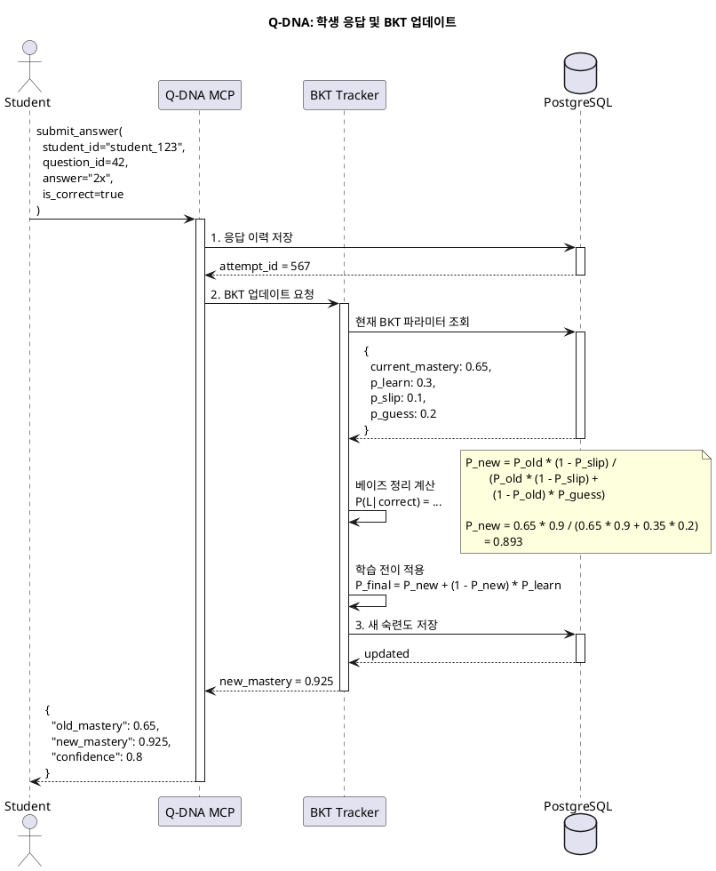
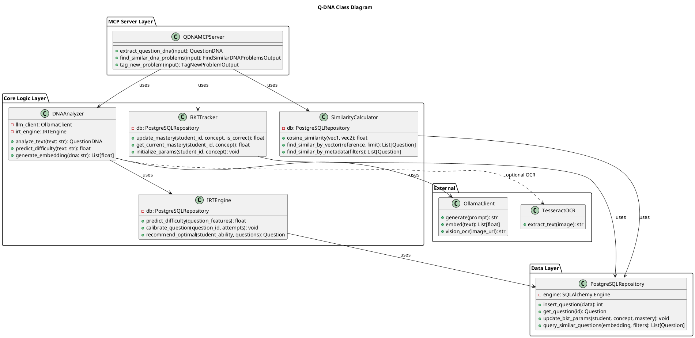

# Node 2: Q-DNA - 지능형 문제 은행 & 학습 추적 엔진

> 문제의 "유전자(DNA)"를 분석하고, BKT/IRT 알고리즘으로 학생의 숙련도를 추적하는 적응형 문제 추천 시스템

**작성일**: 2026-01-08
**버전**: 1.0
**상태**: Design Phase
**Port**: 8002 (FastAPI), stdio (MCP)

---

## 📋 목차

1. [개요](#1-개요)
2. [아키텍처](#2-아키텍처)
3. [MCP Tools 명세](#3-mcp-tools-명세)
4. [데이터베이스 스키마](#4-데이터베이스-스키마)
5. [BKT/IRT 알고리즘](#5-bktirt-알고리즘)
6. [시퀀스 다이어그램](#6-시퀀스-다이어그램)
7. [클래스 다이어그램](#7-클래스-다이어그램)
8. [구현 가이드](#8-구현-가이드)

---

## 1. 개요

### 1.1 목적

**Q-DNA (Question DNA)**는 문제를 단순한 텍스트가 아닌, **유전자 정보를 가진 생명체**처럼 취급합니다. 각 문제는 고유한 "DNA"(유형, 난이도, 개념 조합)를 가지며, 이를 기반으로 유사 문제 검색, 자동 태깅, 적응형 추천이 이루어집니다.

**핵심 가치**:
- 🧬 **문제 DNA 추출**: "함수+기하 결합형, 난이도 상" 같은 메타 정보
- 📊 **BKT (Bayesian Knowledge Tracing)**: 학생의 개념별 숙련도를 확률적으로 추적
- 🎯 **IRT (Item Response Theory)**: 학생 실력과 문제 난이도를 매칭하여 최적의 문제 추천
- 🔍 **유사 문제 검색**: DNA 기반 벡터 유사도 검색

### 1.2 주요 기능

| 기능 | 설명 | MCP Tool |
|------|------|----------|
| **문제 DNA 분석** | 문제의 유형, 난이도, 개념, 인지 수준 자동 추출 | `extract_question_dna` |
| **유사 문제 검색** | DNA 유사도 기반 문제 추천 | `find_similar_dna_problems` |
| **자동 태깅** | 새 문제 업로드 시 자동으로 태그 및 메타데이터 생성 | `tag_new_problem` |

### 1.3 기술 스택

| 계층 | 기술 | 용도 |
|------|------|------|
| **MCP Server** | `mcp` Python SDK | LLM과의 Tool 통신 |
| **Database** | PostgreSQL 14+ (ltree, JSONB) | 문제, 응답 이력 저장 |
| **OCR** | Tesseract + Ollama Vision | 이미지 문제 텍스트 추출 |
| **LLM** | Ollama (Llama 3.2 Vision, Llama 3.1) | DNA 분석, 유사도 판단 |
| **Vectorization** | nomic-embed-text | DNA 임베딩 |
| **Algorithms** | BKT (pyBKT), IRT (py-irt) | 학습 추적 및 난이도 측정 |

---

## 2. 아키텍처

### 2.1 시스템 구조

```
┌─────────────────────────────────────────────────────────┐
│                  LLM Orchestrator                        │
│         (MCP Client를 통해 Q-DNA 호출)                    │
└───────────────────────┬─────────────────────────────────┘
                        │ MCP Protocol
                        │
         ┌──────────────▼──────────────┐
         │      Q-DNA MCP Server       │
         │                             │
         │  ┌─────────────────────┐   │
         │  │ Tool: extract_dna   │   │
         │  │ Tool: find_similar  │   │
         │  │ Tool: tag_new       │   │
         │  └─────────────────────┘   │
         │                             │
         │  ┌─────────────────────┐   │
         │  │  Core Logic Layer   │   │
         │  │  - DNA Analyzer     │   │
         │  │  - BKT Tracker      │   │
         │  │  - IRT Engine       │   │
         │  │  - Similarity Calc  │   │
         │  └─────────────────────┘   │
         └──────┬──────────────────────┘
                │
       ┌────────▼────────┐
       │   PostgreSQL    │
       │  - questions    │
       │  - attempts     │
       │  - students     │
       │  - bkt_params   │
       └─────────────────┘
                │
         ┌──────▼─────┐
         │  Ollama    │
         │ (Vision +  │
         │ Embedding) │
         └────────────┘
```

### 2.2 데이터 흐름

**문제 업로드 → DNA 추출**:
```
1. Image/Text Upload
   ↓
2. OCR (Tesseract + Ollama Vision): 이미지 → 텍스트
   ↓
3. LLM DNA Analyzer: 텍스트 → DNA
   {
     "dna_type": "function_geometry",
     "main_concept": "도함수",
     "sub_concepts": ["극한", "접선"],
     "difficulty": 0.78,
     "cognitive_level": "apply"
   }
   ↓
4. Vector Embedding: DNA → 512-dim vector
   ↓
5. PostgreSQL 저장 (JSONB + ltree + pgvector)
```

**학생 응답 → BKT 업데이트**:
```
1. Student submits answer (correct/incorrect)
   ↓
2. BKT Tracker: P(知) 업데이트
   P(知|correct) = P(知) * P(correct|知) / P(correct)
   ↓
3. PostgreSQL: student_mastery 테이블 갱신
   ↓
4. Return: 새로운 숙련도 및 자신감
```

---

## 3. MCP Tools 명세

### 3.1 Tool: `extract_question_dna`

**목적**: 문제의 "유전자 정보"를 LLM으로 추출

**Input Schema**:
```python
class ExtractQuestionDNAInput(BaseModel):
    question_id: Optional[int] = Field(
        default=None,
        description="기존 문제 ID (DB에서 가져오기)"
    )
    question_text: Optional[str] = Field(
        default=None,
        description="문제 텍스트 (직접 제공)"
    )
    question_image_url: Optional[str] = Field(
        default=None,
        description="문제 이미지 URL (OCR 필요)"
    )
    include_embedding: bool = Field(
        default=True,
        description="DNA 벡터 임베딩 포함 여부"
    )
```

**Output Schema**:
```python
class QuestionDNA(BaseModel):
    question_id: Optional[int]
    dna_type: str  # "function_geometry", "algebra_pure", "word_problem"
    main_concept: str  # "도함수"
    sub_concepts: List[str]  # ["극한", "접선"]
    difficulty: float  # 0.0 ~ 1.0 (IRT 기준)
    cognitive_level: Literal[
        "remember",      # Bloom's Taxonomy Level 1
        "understand",    # Level 2
        "apply",         # Level 3
        "analyze",       # Level 4
        "evaluate",      # Level 5
        "create"         # Level 6
    ]
    estimated_time: int  # 초
    tags: List[str]
    embedding: Optional[List[float]] = None  # 512-dim vector
    confidence: float  # LLM 추출 신뢰도
```

**구현 로직**:
```python
async def extract_question_dna(input: ExtractQuestionDNAInput) -> QuestionDNA:
    # 1. 문제 텍스트 확보
    if input.question_id:
        text = await db.get_question_text(input.question_id)
    elif input.question_text:
        text = input.question_text
    elif input.question_image_url:
        text = await ocr_image(input.question_image_url)  # Ollama Vision
    else:
        raise ValueError("question_id, question_text, 또는 question_image_url 중 하나 필요")

    # 2. LLM으로 DNA 추출
    prompt = f"""
    다음 문제를 분석하여 JSON 형식으로 DNA를 추출하세요:

    {text}

    출력 형식:
    {{
        "dna_type": "...",
        "main_concept": "...",
        "sub_concepts": [...],
        "cognitive_level": "...",
        "estimated_time": ...
    }}
    """
    llm_result = await ollama_client.generate(prompt)
    dna_data = json.loads(llm_result)

    # 3. 난이도 예측 (IRT 모델)
    difficulty = await irt_engine.predict_difficulty(text, dna_data)

    # 4. 벡터 임베딩
    if input.include_embedding:
        dna_text = f"{dna_data['dna_type']} {dna_data['main_concept']} {' '.join(dna_data['sub_concepts'])}"
        embedding = await ollama_client.embed(dna_text)
    else:
        embedding = None

    return QuestionDNA(
        question_id=input.question_id,
        dna_type=dna_data["dna_type"],
        main_concept=dna_data["main_concept"],
        sub_concepts=dna_data["sub_concepts"],
        difficulty=difficulty,
        cognitive_level=dna_data["cognitive_level"],
        estimated_time=dna_data["estimated_time"],
        tags=generate_tags(dna_data),
        embedding=embedding,
        confidence=0.85  # LLM 신뢰도 (추후 calibration)
    )
```

---

### 3.2 Tool: `find_similar_dna_problems`

**목적**: DNA 유사도 기반 문제 검색 (벡터 유사도 + 메타데이터 필터링)

**Input Schema**:
```python
class FindSimilarDNAProblemsInput(BaseModel):
    reference_dna: Union[str, int] = Field(
        description="참조 DNA (dna_type 문자열 또는 question_id)"
    )
    difficulty_range: Optional[Tuple[float, float]] = Field(
        default=None,
        description="난이도 범위 (예: [0.6, 0.9])"
    )
    exclude_concepts: List[str] = Field(
        default=[],
        description="제외할 개념 (학생이 이미 마스터한 개념)"
    )
    min_similarity: float = Field(
        default=0.7,
        description="최소 유사도 (코사인 유사도)"
    )
    limit: int = Field(default=10, ge=1, le=50)
```

**Output Schema**:
```python
class SimilarProblem(BaseModel):
    question_id: int
    similarity_score: float  # 코사인 유사도 (0.0 ~ 1.0)
    dna_type: str
    main_concept: str
    difficulty: float
    question_preview: str  # 첫 100자

class FindSimilarDNAProblemsOutput(BaseModel):
    reference_dna: str
    total_found: int
    similar_problems: List[SimilarProblem]
```

**구현 (pgvector 활용)**:
```sql
-- PostgreSQL + pgvector 확장
SELECT
    q.id,
    q.dna_type,
    q.main_concept,
    q.difficulty,
    LEFT(q.content, 100) AS question_preview,
    1 - (q.dna_embedding <=> $reference_embedding) AS similarity  -- 코사인 유사도
FROM questions q
WHERE
    1 - (q.dna_embedding <=> $reference_embedding) >= $min_similarity
    AND q.difficulty BETWEEN $min_diff AND $max_diff
    AND NOT (q.main_concept = ANY($exclude_concepts))
ORDER BY q.dna_embedding <=> $reference_embedding
LIMIT $limit;
```

---

### 3.3 Tool: `tag_new_problem`

**목적**: 새 문제 업로드 시 자동으로 DNA 추출 및 DB 저장

**Input Schema**:
```python
class TagNewProblemInput(BaseModel):
    question_content: str
    question_image_url: Optional[str] = None
    answer: Optional[str] = None
    source: str = Field(default="manual_upload")
```

**Output Schema**:
```python
class TagNewProblemOutput(BaseModel):
    question_id: int
    auto_tags: List[str]
    suggested_dna: QuestionDNA
    confidence: float
    warnings: List[str]  # 예: "이미지가 흐릿함", "수식 인식 불확실"
```

**플로우**:
```python
async def tag_new_problem(input: TagNewProblemInput):
    # 1. OCR (이미지 있을 경우)
    if input.question_image_url:
        ocr_text = await ollama_vision_ocr(input.question_image_url)
        full_text = f"{input.question_content}\n{ocr_text}"
    else:
        full_text = input.question_content

    # 2. DNA 추출
    dna = await extract_question_dna(
        ExtractQuestionDNAInput(question_text=full_text, include_embedding=True)
    )

    # 3. DB 저장
    question_id = await db.insert_question({
        "content": full_text,
        "dna_type": dna.dna_type,
        "main_concept": dna.main_concept,
        "sub_concepts": dna.sub_concepts,
        "difficulty": dna.difficulty,
        "dna_embedding": dna.embedding,
        "source": input.source,
        "answer": input.answer
    })

    # 4. 자동 태그 생성
    auto_tags = [
        dna.dna_type,
        dna.main_concept,
        f"difficulty_{int(dna.difficulty * 10)}",
        dna.cognitive_level
    ]

    return TagNewProblemOutput(
        question_id=question_id,
        auto_tags=auto_tags,
        suggested_dna=dna,
        confidence=dna.confidence,
        warnings=[]
    )
```

---

## 4. 데이터베이스 스키마

### 4.1 PostgreSQL Schema

**문제 테이블**:
```sql
CREATE EXTENSION IF NOT EXISTS ltree;
CREATE EXTENSION IF NOT EXISTS pgvector;

CREATE TABLE questions (
    id SERIAL PRIMARY KEY,
    content TEXT NOT NULL,
    answer TEXT,

    -- DNA 메타데이터
    dna_type VARCHAR(50),            -- "function_geometry", "algebra_pure"
    main_concept VARCHAR(100),       -- "도함수"
    sub_concepts TEXT[],             -- ["극한", "접선"]
    cognitive_level VARCHAR(20),     -- "apply", "analyze"
    difficulty FLOAT CHECK (difficulty BETWEEN 0 AND 1),

    -- 교육과정 경로 (ltree)
    curriculum_path ltree,           -- '수학.미적분.미분.도함수'

    -- 벡터 임베딩 (pgvector)
    dna_embedding vector(512),       -- nomic-embed-text 512-dim

    -- 메타데이터
    tags TEXT[],
    estimated_time INT,              -- 초
    source VARCHAR(50),              -- "manual_upload", "crawled", "generated"
    created_at TIMESTAMP DEFAULT NOW(),
    updated_at TIMESTAMP DEFAULT NOW()
);

-- 인덱스
CREATE INDEX idx_questions_dna_type ON questions(dna_type);
CREATE INDEX idx_questions_concept ON questions(main_concept);
CREATE INDEX idx_questions_difficulty ON questions(difficulty);
CREATE INDEX idx_questions_curriculum ON questions USING gist(curriculum_path);
CREATE INDEX idx_questions_embedding ON questions USING ivfflat (dna_embedding vector_cosine_ops);
```

**학생 응답 이력**:
```sql
CREATE TABLE attempts (
    id SERIAL PRIMARY KEY,
    student_id VARCHAR(50) NOT NULL,
    question_id INT REFERENCES questions(id),

    -- 응답 데이터
    is_correct BOOLEAN NOT NULL,
    student_answer TEXT,
    response_time INT,               -- 초
    attempt_number INT DEFAULT 1,    -- 재시도 횟수

    -- 에러 분류 (LLM 분석 결과)
    error_type VARCHAR(50),          -- "calculation", "concept", "careless"
    error_detail TEXT,

    -- BKT 업데이트용
    pre_mastery FLOAT,               -- 시도 전 숙련도
    post_mastery FLOAT,              -- 시도 후 숙련도

    created_at TIMESTAMP DEFAULT NOW()
);

CREATE INDEX idx_attempts_student ON attempts(student_id, created_at DESC);
CREATE INDEX idx_attempts_question ON attempts(question_id);
```

**BKT 파라미터**:
```sql
CREATE TABLE bkt_parameters (
    id SERIAL PRIMARY KEY,
    student_id VARCHAR(50),
    concept VARCHAR(100),

    -- BKT 4대 파라미터
    p_init FLOAT,          -- P(L0): 초기 학습 확률
    p_learn FLOAT,         -- P(T): 전이(학습) 확률
    p_slip FLOAT,          -- P(S): 실수(slip) 확률
    p_guess FLOAT,         -- P(G): 추측(guess) 확률

    -- 현재 상태
    current_mastery FLOAT, -- P(L): 현재 숙련도
    attempts_count INT,
    last_updated TIMESTAMP DEFAULT NOW(),

    PRIMARY KEY (student_id, concept)
);
```

**IRT 파라미터 (문제별)**:
```sql
CREATE TABLE irt_parameters (
    question_id INT PRIMARY KEY REFERENCES questions(id),

    -- IRT 3PL 모델
    discrimination FLOAT,  -- a: 변별도 (문제가 실력 차이를 얼마나 잘 구분하는가)
    difficulty FLOAT,      -- b: 난이도 (-3 ~ 3, 0이 평균)
    guessing FLOAT,        -- c: 추측 확률 (0.0 ~ 0.25)

    -- 메타데이터
    calibration_count INT DEFAULT 0,  -- 캘리브레이션 횟수
    last_calibrated TIMESTAMP
);
```

---

## 5. BKT/IRT 알고리즘

### 5.1 BKT (Bayesian Knowledge Tracing)

**목적**: 학생의 **개념별 숙련도**를 확률적으로 추적

**수식**:
```
P(L_n) = P(L_{n-1}) + (1 - P(L_{n-1})) * P(T)  # 학습 후
P(C) = P(L) * (1 - P(S)) + (1 - P(L)) * P(G)   # 정답 확률

# 베이즈 정리로 역산
P(L|correct) = P(L) * (1 - P(S)) / P(C)
P(L|incorrect) = P(L) * P(S) / (1 - P(C))
```

**파라미터**:
- `P(L0)`: 초기 숙련도 (예: 0.1 = 10%)
- `P(T)`: 한 문제 풀고 학습할 확률 (예: 0.3 = 30%)
- `P(S)`: 알면서도 실수할 확률 (예: 0.1 = 10%)
- `P(G)`: 모르면서 추측으로 맞출 확률 (예: 0.2 = 20%)

**구현**:
```python
from pyBKT import BKT

class BKTTracker:
    def __init__(self):
        self.model = BKT()

    async def update_mastery(
        self,
        student_id: str,
        concept: str,
        is_correct: bool
    ) -> float:
        # 1. 현재 BKT 파라미터 로드
        params = await db.get_bkt_params(student_id, concept)
        current_mastery = params["current_mastery"]

        # 2. 베이즈 업데이트
        if is_correct:
            new_mastery = (
                current_mastery * (1 - params["p_slip"])
                / (current_mastery * (1 - params["p_slip"]) + (1 - current_mastery) * params["p_guess"])
            )
        else:
            new_mastery = (
                current_mastery * params["p_slip"]
                / (current_mastery * params["p_slip"] + (1 - current_mastery) * (1 - params["p_guess"]))
            )

        # 3. 학습 전이 (Learning Transition)
        new_mastery = new_mastery + (1 - new_mastery) * params["p_learn"]

        # 4. DB 저장
        await db.update_bkt_params(student_id, concept, new_mastery)

        return new_mastery
```

### 5.2 IRT (Item Response Theory)

**목적**: 문제의 **난이도**와 학생의 **실력**을 동일 척도에서 측정

**3PL 모델**:
```
P(correct | θ, a, b, c) = c + (1 - c) / (1 + exp(-a * (θ - b)))

θ: 학생 실력 (-3 ~ 3)
a: 문제 변별도 (0.5 ~ 2.5)
b: 문제 난이도 (-3 ~ 3)
c: 추측 확률 (0.0 ~ 0.25)
```

**최적 문제 추천**:
```python
def recommend_optimal_question(student_ability: float, questions: List[Question]):
    """
    Information Function을 최대화하는 문제 선택
    I(θ) = a^2 * P(θ) * (1 - P(θ))
    """
    max_info = -1
    best_question = None

    for q in questions:
        p = irt_3pl(student_ability, q.discrimination, q.difficulty, q.guessing)
        info = q.discrimination ** 2 * p * (1 - p)

        if info > max_info:
            max_info = info
            best_question = q

    return best_question
```

---

## 6. 시퀀스 다이어그램

### 6.1 문제 DNA 분석 플로우

```plantuml
@startuml
title Q-DNA: extract_question_dna 시퀀스

actor Orchestrator
participant "Q-DNA MCP" as MCP
participant "OCR Engine" as OCR
participant "DNA Analyzer" as DNA
participant "IRT Engine" as IRT
participant "Ollama" as LLM
database PostgreSQL

Orchestrator -> MCP: extract_question_dna(\n  question_image_url="https://..."
)
activate MCP

MCP -> OCR: 1. 이미지 → 텍스트 변환
activate OCR
OCR -> LLM: Ollama Vision\n(llama3.2-vision)
LLM --> OCR: "f(x) = x^2의 도함수를 구하시오"
OCR --> MCP: 텍스트
deactivate OCR

MCP -> DNA: 2. LLM으로 DNA 분석
activate DNA
DNA -> LLM: Ollama (llama3.1)\n"다음 문제의 DNA를 추출..."
LLM --> DNA: {\n  "dna_type": "calculus",\n  "main_concept": "도함수"\n}
DNA --> MCP: DNA 메타데이터
deactivate DNA

MCP -> IRT: 3. 난이도 예측
activate IRT
IRT -> PostgreSQL: 유사 문제의 IRT 파라미터 조회
PostgreSQL --> IRT: difficulty 분포
IRT --> MCP: difficulty = 0.65
deactivate IRT

MCP -> LLM: 4. DNA 벡터 임베딩
activate LLM
LLM --> MCP: 512-dim vector
deactivate LLM

MCP --> Orchestrator: QuestionDNA{\n  dna_type: "calculus",\n  difficulty: 0.65,\n  embedding: [...]\n}
deactivate MCP

@enduml
```

### 6.2 학생 응답 → BKT 업데이트



---

## 7. 클래스 다이어그램



---

## 8. 구현 가이드

### 8.1 프로젝트 구조

```
node2_q_dna/
├── mcp_server.py
├── core/
│   ├── dna_analyzer.py        # DNA 추출
│   ├── bkt_tracker.py         # BKT 알고리즘
│   ├── irt_engine.py          # IRT 알고리즘
│   └── similarity_calc.py     # 유사도 계산
├── repositories/
│   └── postgres_repo.py
├── models/
│   ├── schemas.py
│   └── sql_queries.py
├── tools/
│   ├── extract_question_dna.py
│   ├── find_similar_dna_problems.py
│   └── tag_new_problem.py
└── tests/
    ├── test_bkt.py
    └── test_irt.py
```

### 8.2 mathesis-common 통합

```python
# core/dna_analyzer.py
from mathesis_core.llm import OllamaClient

class DNAAnalyzer:
    def __init__(self):
        self.llm = OllamaClient(model="llama3.1")
        self.vision_llm = OllamaClient(model="llama3.2-vision")

    async def analyze_from_image(self, image_url: str) -> QuestionDNA:
        # 1. Vision LLM으로 OCR
        text = await self.vision_llm.generate(
            prompt="이미지의 수학 문제를 정확히 텍스트로 변환하세요",
            images=[image_url]
        )

        # 2. 텍스트 기반 DNA 분석
        return await self.analyze_text(text)
```

---

**다음 문서**: [Node 3: Gen Node Technical Overview](./NODE3_GEN_NODE.md)
