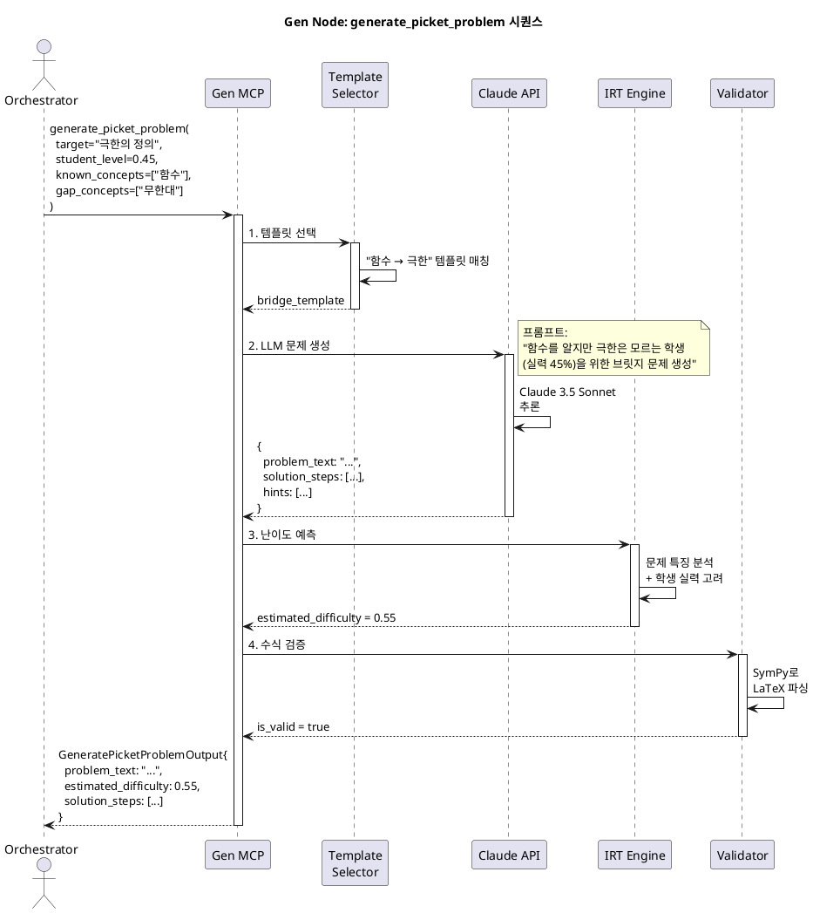
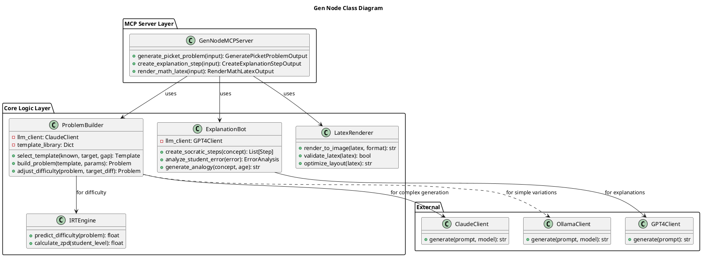

# Node 3: Gen Node - 적응형 콘텐츠 생성 엔진

> 학생의 약점을 정밀 타격하는 맞춤형 문제, 단계별 설명, LaTeX 수식 렌더링을 제공하는 교육 콘텐츠 생성기

**작성일**: 2026-01-08
**버전**: 1.0
**상태**: Design Phase
**Port**: 8003 (FastAPI), stdio (MCP)

---

## 📋 목차

1. [개요](#1-개요)
2. [아키텍처](#2-아키텍처)
3. [MCP Tools 명세](#3-mcp-tools-명세)
4. [콘텐츠 생성 전략](#4-콘텐츠-생성-전략)
5. [시퀀스 다이어그램](#5-시퀀스-다이어그램)
6. [클래스 다이어그램](#6-클래스-다이어그램)
7. [구현 가이드](#7-구현-가이드)

---

## 1. 개요

### 1.1 목적

**Gen Node**는 Mathesis-Synapse의 "콘텐츠 공장"입니다. LLM Orchestrator의 요청에 따라 학생의 약점을 정밀 타격하는 **브릿지 문제**(Picket Problem)를 생성하고, 개념 이해를 돕는 **단계별 설명**을 제공하며, **LaTeX 수식을 PNG/SVG로 렌더링**합니다.

**핵심 가치**:
- 🎯 **적응형 문제 생성**: 학생의 현재 수준과 목표 개념 사이를 연결하는 문제
- 📖 **소크라테스식 설명**: 답을 직접 알려주지 않고 질문으로 유도
- 🖼️ **LaTeX 렌더링**: 수식을 아름다운 이미지로 변환
- 🔄 **난이도 조절**: IRT 기반 동적 난이도 조정

### 1.2 주요 기능

| 기능 | 설명 | MCP Tool |
|------|------|----------|
| **브릿지 문제 생성** | 학생의 갭을 메우는 맞춤형 문제 생성 | `generate_picket_problem` |
| **단계별 설명 생성** | 개념을 단계적으로 이해시키는 가이드 | `create_explanation_step` |
| **LaTeX 렌더링** | LaTeX → PNG/SVG 변환 | `render_math_latex` |

### 1.3 기술 스택

| 계층 | 기술 | 용도 |
|------|------|------|
| **MCP Server** | `mcp` Python SDK | LLM과의 Tool 통신 |
| **LLM** | Claude 3.5 Sonnet / GPT-4o | 문제 생성, 설명 작성 |
| **Local LLM** | Ollama (Qwen 2.5) | 간단한 변형 문제 생성 |
| **LaTeX Engine** | MathJax, KaTeX, `matplotlib` | 수식 렌더링 |
| **Validation** | SymPy | 수식 검증 |

---

## 2. 아키텍처

### 2.1 시스템 구조

```
┌─────────────────────────────────────────────────────────┐
│                  LLM Orchestrator                        │
│         "학생 A의 극한 개념 갭을 메우는 문제 생성"          │
└───────────────────────┬─────────────────────────────────┘
                        │ MCP Protocol
                        │
         ┌──────────────▼──────────────┐
         │     Gen Node MCP Server     │
         │                             │
         │  ┌─────────────────────┐   │
         │  │ generate_picket     │   │
         │  │ create_explanation  │   │
         │  │ render_math_latex   │   │
         │  └─────────────────────┘   │
         │                             │
         │  ┌─────────────────────┐   │
         │  │ Content Generators  │   │
         │  │ - Problem Builder   │   │
         │  │ - Explanation Bot   │   │
         │  │ - LaTeX Renderer    │   │
         │  └─────────────────────┘   │
         └──────┬──────────────────────┘
                │
       ┌────────┴────────┐
       │  LLM Clients    │
       │  - Claude API   │
       │  - GPT-4o API   │
       │  - Ollama       │
       └─────────────────┘
```

### 2.2 문제 생성 파이프라인

```
1. Orchestrator Request:
   {
     "target_concept": "극한의 정의",
     "student_level": 0.45,
     "gap_concepts": ["함수 이해", "무한대 개념"]
   }
   ↓
2. Problem Template Selection:
   - "함수 → 극한" 브릿지 템플릿 선택
   ↓
3. LLM Generation:
   - Claude 3.5 Sonnet으로 문제 생성
   - 프롬프트: "함수를 알지만 극한은 모르는 학생을 위한 문제"
   ↓
4. Difficulty Calibration:
   - IRT 모델로 예상 난이도 계산
   - 학생 실력(0.45)보다 약간 높게(0.55) 조정
   ↓
5. Validation:
   - SymPy로 수식 검증
   - 문제 중복 체크
   ↓
6. Return:
   {
     "problem_text": "...",
     "solution_steps": [...],
     "hints": [...],
     "estimated_difficulty": 0.55
   }
```

---

## 3. MCP Tools 명세

### 3.1 Tool: `generate_picket_problem`

**목적**: 학생의 지식 갭을 메우는 "브릿지 문제" 생성

**브릿지 문제란?**
- 학생이 **알고 있는 개념 A**와 **목표 개념 B** 사이를 연결
- 예: A="함수 이해", B="극한" → 브릿지 문제="함수 값의 변화 관찰"

**Input Schema**:
```python
class GeneratePicketProblemInput(BaseModel):
    target_concept: str = Field(
        description="목표 개념 (예: '극한의 정의')"
    )
    difficulty: float = Field(
        default=0.5,
        description="목표 난이도 (0.0 ~ 1.0)",
        ge=0.0,
        le=1.0
    )
    student_level: float = Field(
        description="학생 현재 실력 (BKT 숙련도)"
    )
    known_concepts: List[str] = Field(
        default=[],
        description="학생이 이미 알고 있는 개념들"
    )
    gap_concepts: List[str] = Field(
        default=[],
        description="학생이 부족한 개념들"
    )
    avoid_patterns: List[str] = Field(
        default=[],
        description="피해야 할 문제 유형"
    )
    language: str = Field(default="ko", description="문제 언어")
```

**Output Schema**:
```python
class ProblemStep(BaseModel):
    step_number: int
    description: str
    latex: Optional[str] = None

class GeneratePicketProblemOutput(BaseModel):
    problem_id: Optional[int]  # DB 저장 시 할당
    problem_text: str
    problem_latex: Optional[str]
    solution_steps: List[ProblemStep]
    hints: List[str]
    estimated_difficulty: float
    required_time: int  # 초
    cognitive_level: str
    dna_type: str  # 생성된 문제의 DNA
```

**구현 로직**:
```python
async def generate_picket_problem(input: GeneratePicketProblemInput):
    # 1. 템플릿 선택
    template = select_bridge_template(
        known=input.known_concepts,
        target=input.target_concept,
        gap=input.gap_concepts
    )

    # 2. LLM 프롬프트 구성
    prompt = f"""
    # 역할
    당신은 수학 교육 전문가입니다.

    # 학생 정보
    - 현재 실력: {input.student_level * 100:.0f}%
    - 알고 있는 개념: {', '.join(input.known_concepts)}
    - 부족한 개념: {', '.join(input.gap_concepts)}
    - 목표 개념: {input.target_concept}

    # 요청
    위 학생이 목표 개념을 이해하도록 돕는 "브릿지 문제"를 생성하세요.

    ## 조건
    1. 학생이 알고 있는 개념에서 시작
    2. 목표 개념으로 자연스럽게 유도
    3. 난이도: {input.difficulty * 100:.0f}%
    4. 추측으로 풀 수 없는 문제
    5. 단계별 풀이 포함

    ## 출력 형식 (JSON)
    {{
        "problem_text": "...",
        "solution_steps": [
            {{"step": 1, "description": "...", "latex": "..."}},
            ...
        ],
        "hints": ["힌트1", "힌트2"],
        "cognitive_level": "apply"
    }}
    """

    # 3. Claude API 호출
    response = await claude_client.generate(
        prompt,
        model="claude-3-5-sonnet-20241022",
        temperature=0.7
    )
    problem_data = json.loads(response)

    # 4. 난이도 보정 (IRT)
    estimated_difficulty = await irt_engine.predict_difficulty(
        problem_text=problem_data["problem_text"],
        student_level=input.student_level
    )

    # 5. 수식 검증
    if problem_data.get("problem_latex"):
        is_valid = validate_latex(problem_data["problem_latex"])
        if not is_valid:
            # 재생성 또는 LaTeX 제거
            problem_data["problem_latex"] = None

    return GeneratePicketProblemOutput(
        problem_text=problem_data["problem_text"],
        problem_latex=problem_data.get("problem_latex"),
        solution_steps=[
            ProblemStep(**step) for step in problem_data["solution_steps"]
        ],
        hints=problem_data["hints"],
        estimated_difficulty=estimated_difficulty,
        required_time=int(estimated_difficulty * 300),  # 난이도 * 5분
        cognitive_level=problem_data["cognitive_level"],
        dna_type=f"bridge_{input.target_concept}"
    )
```

---

### 3.2 Tool: `create_explanation_step`

**목적**: 개념을 단계적으로 이해시키는 **소크라테스식 설명** 생성

**소크라테스식 교수법**:
- 답을 직접 알려주지 않음
- 질문을 통해 학생 스스로 깨닫게 유도
- 예: "도함수가 뭔가요?" → "함수 값이 변하는 속도를 어떻게 재면 될까요?"

**Input Schema**:
```python
class CreateExplanationStepInput(BaseModel):
    concept: str = Field(description="설명할 개념")
    student_error: Optional[str] = Field(
        default=None,
        description="학생이 한 실수 (틀린 답변)"
    )
    target_age: int = Field(
        default=16,
        description="학생 나이 (언어 수준 조절)"
    )
    explanation_style: str = Field(
        default="socratic",
        description="설명 스타일 (socratic, direct, analogy)"
    )
```

**Output Schema**:
```python
class ExplanationStep(BaseModel):
    step_number: int
    question: Optional[str]  # 소크라테스식 질문
    explanation: str
    example: Optional[str]
    visual_aid: Optional[str]  # 다이어그램 경로

class CreateExplanationStepOutput(BaseModel):
    concept: str
    steps: List[ExplanationStep]
    practice_problems: List[dict]
    related_concepts: List[str]
```

**구현**:
```python
async def create_explanation_step(input: CreateExplanationStepInput):
    # 1. 학생 오류 분석 (제공된 경우)
    error_analysis = None
    if input.student_error:
        error_analysis = await analyze_error(input.student_error)

    # 2. LLM 프롬프트
    prompt = f"""
    # 역할
    소크라테스식 교수법을 사용하는 수학 선생님

    # 개념
    {input.concept}

    # 학생 정보
    - 나이: {input.target_age}세
    - 틀린 답변: {input.student_error or "없음"}

    # 요청
    위 개념을 {input.explanation_style} 방식으로 설명하세요.

    ## 조건
    1. 3-5단계로 나누기
    2. 각 단계는 질문 → 설명 → 예시 구조
    3. 학생이 스스로 깨닫도록 유도
    4. 구체적인 예시 포함

    ## 출력 (JSON)
    {{
        "steps": [
            {{
                "step": 1,
                "question": "...",
                "explanation": "...",
                "example": "..."
            }},
            ...
        ],
        "practice_problems": [
            {{"text": "...", "answer": "..."}}
        ]
    }}
    """

    response = await gpt4o_client.generate(prompt)
    data = json.loads(response)

    return CreateExplanationStepOutput(
        concept=input.concept,
        steps=[ExplanationStep(**step) for step in data["steps"]],
        practice_problems=data["practice_problems"],
        related_concepts=extract_related_concepts(input.concept)
    )
```

---

### 3.3 Tool: `render_math_latex`

**목적**: LaTeX 수식을 PNG/SVG 이미지로 렌더링

**Input Schema**:
```python
class RenderMathLatexInput(BaseModel):
    latex_code: str = Field(
        description="LaTeX 수식",
        example=r"\frac{d}{dx}(x^2) = 2x"
    )
    format: Literal["png", "svg"] = "png"
    dpi: int = Field(default=300, description="해상도")
    font_size: int = Field(default=12)
    background: str = Field(default="transparent")
```

**Output Schema**:
```python
class RenderMathLatexOutput(BaseModel):
    image_path: str
    width: int
    height: int
    format: str
```

**구현 (matplotlib 사용)**:
```python
import matplotlib.pyplot as plt
import matplotlib

matplotlib.use('Agg')  # GUI 없이 사용

async def render_math_latex(input: RenderMathLatexInput):
    fig = plt.figure(figsize=(10, 2))
    fig.patch.set_alpha(0 if input.background == "transparent" else 1)

    # LaTeX 렌더링
    text = fig.text(
        0.5, 0.5,
        f"${input.latex_code}$",
        fontsize=input.font_size,
        ha='center',
        va='center'
    )

    # 이미지 저장
    output_path = f"/tmp/latex_{hash(input.latex_code)}.{input.format}"
    plt.savefig(
        output_path,
        dpi=input.dpi,
        bbox_inches='tight',
        transparent=(input.background == "transparent"),
        format=input.format
    )
    plt.close()

    # 이미지 크기 가져오기
    from PIL import Image
    img = Image.open(output_path)
    width, height = img.size

    return RenderMathLatexOutput(
        image_path=output_path,
        width=width,
        height=height,
        format=input.format
    )
```

---

## 4. 콘텐츠 생성 전략

### 4.1 브릿지 문제 템플릿

**템플릿 라이브러리**:
```python
BRIDGE_TEMPLATES = {
    ("functions", "limits"): {
        "template": "함수 f(x)가 주어질 때, x가 특정 값에 가까워질 때 f(x)의 값 관찰",
        "examples": [
            "f(x) = (x^2 - 1)/(x - 1)에서 x→1일 때",
            "f(x) = sin(x)/x에서 x→0일 때"
        ]
    },
    ("limits", "derivatives"): {
        "template": "함수의 평균 변화율에서 순간 변화율로 전환",
        "examples": [
            "f(x) = x^2에서 [1, 1+h]의 평균 변화율 → h→0",
        ]
    }
}
```

### 4.2 난이도 조절 전략

**ZPD (Zone of Proximal Development)** 기반:
```python
def calculate_optimal_difficulty(student_level: float) -> float:
    """
    비고츠키의 근접 발달 영역 이론
    학생이 도전적이면서도 달성 가능한 난이도
    """
    ZPD_OFFSET = 0.1  # 현재 실력보다 10% 높게
    return min(student_level + ZPD_OFFSET, 1.0)
```

---

## 5. 시퀀스 다이어그램

### 5.1 브릿지 문제 생성 플로우



---

## 6. 클래스 다이어그램



---

## 7. 구현 가이드

### 7.1 프로젝트 구조

```
node3_gen_node/
├── mcp_server.py
├── core/
│   ├── problem_builder.py
│   ├── explanation_bot.py
│   ├── latex_renderer.py
│   └── template_library.py
├── models/
│   └── schemas.py
├── tools/
│   ├── generate_picket_problem.py
│   ├── create_explanation_step.py
│   └── render_math_latex.py
└── tests/
    ├── test_problem_generation.py
    └── test_latex_rendering.py
```

### 7.2 LLM 클라이언트 통합

```python
# core/problem_builder.py
from anthropic import Anthropic

class ProblemBuilder:
    def __init__(self):
        self.claude = Anthropic(api_key=os.getenv("ANTHROPIC_API_KEY"))

    async def build_problem(self, template, params):
        response = await self.claude.messages.create(
            model="claude-3-5-sonnet-20241022",
            max_tokens=2000,
            temperature=0.7,
            messages=[{
                "role": "user",
                "content": self._construct_prompt(template, params)
            }]
        )
        return json.loads(response.content[0].text)
```

---

**다음 문서**: [Node 4: Lab Node Technical Overview](./NODE4_LAB_NODE.md)
