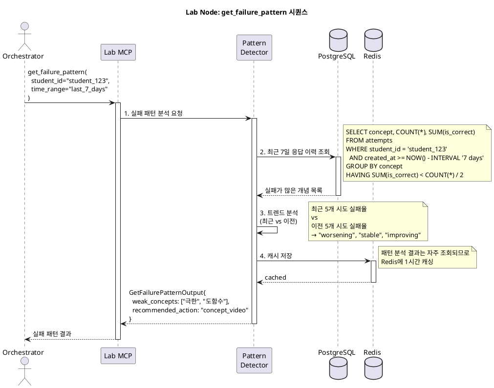
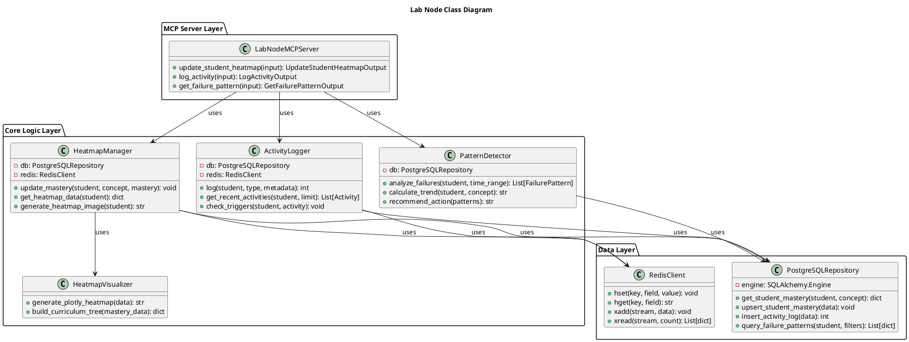

# Node 4: Lab Node - 학생 관리 및 학습 데이터 추적 엔진

> 학생의 학습 활동을 실시간으로 추적하고, 개념별 히트맵을 생성하며, 실패 패턴을 분석하는 교육 데이터 플랫폼

**작성일**: 2026-01-08
**버전**: 1.0
**상태**: Design Phase
**Port**: 8004 (FastAPI), stdio (MCP)

---

## 📋 목차

1. [개요](#1-개요)
2. [아키텍처](#2-아키텍처)
3. [MCP Tools 명세](#3-mcp-tools-명세)
4. [히트맵 시각화](#4-히트맵-시각화)
5. [시퀀스 다이어그램](#5-시퀀스-다이어그램)
6. [클래스 다이어그램](#6-클래스-다이어그램)
7. [구현 가이드](#7-구현-가이드)

---

## 1. 개요

### 1.1 목적

**Lab Node**는 Mathesis-Synapse의 "관제 센터"입니다. 모든 학생의 학습 활동을 실시간으로 기록하고, 개념별 숙련도를 **히트맵**으로 시각화하며, 반복되는 **실패 패턴**을 감지하여 Orchestrator가 적절한 개입을 할 수 있도록 지원합니다.

**핵심 가치**:
- 📊 **학습 히트맵**: 개념별 숙련도를 색상으로 표현 (빨강=약함, 초록=강함)
- 🔍 **실패 패턴 분석**: "함수 문제를 반복적으로 틀림" 같은 패턴 감지
- 📝 **활동 로그**: 모든 학습 활동 기록 (문제 풀이, 영상 시청, 개념 복습)
- 🎯 **개입 트리거**: 특정 조건 충족 시 Orchestrator에 이벤트 발생

### 1.2 주요 기능

| 기능 | 설명 | MCP Tool |
|------|------|----------|
| **히트맵 업데이트** | 학생의 개념별 숙련도 갱신 (BKT 연동) | `update_student_heatmap` |
| **활동 로깅** | 모든 학습 활동 기록 | `log_activity` |
| **실패 패턴 조회** | 학생의 최근 실패 패턴 분석 | `get_failure_pattern` |

### 1.3 기술 스택

| 계층 | 기술 | 용도 |
|------|------|------|
| **MCP Server** | `mcp` Python SDK | LLM과의 Tool 통신 |
| **Database** | PostgreSQL 14+ | 학생 데이터, 활동 로그, 히트맵 |
| **Visualization** | Plotly, Seaborn | 히트맵 이미지 생성 |
| **Caching** | Redis | 실시간 활동 데이터 캐싱 |

---

## 2. 아키텍처

### 2.1 시스템 구조

```
┌─────────────────────────────────────────────────────────┐
│                  LLM Orchestrator                        │
│         "학생의 실패 패턴 분석 요청"                       │
└───────────────────────┬─────────────────────────────────┘
                        │ MCP Protocol
                        │
         ┌──────────────▼──────────────┐
         │    Lab Node MCP Server      │
         │                             │
         │  ┌─────────────────────┐   │
         │  │ update_heatmap      │   │
         │  │ log_activity        │   │
         │  │ get_failure_pattern │   │
         │  └─────────────────────┘   │
         │                             │
         │  ┌─────────────────────┐   │
         │  │ Core Logic Layer    │   │
         │  │ - Heatmap Manager   │   │
         │  │ - Activity Logger   │   │
         │  │ - Pattern Detector  │   │
         │  └─────────────────────┘   │
         └──────┬──────────────────────┘
                │
       ┌────────▼────────┐
       │   PostgreSQL    │
       │  - students     │
       │  - heatmap      │
       │  - activity_log │
       └─────┬───────────┘
             │
       ┌─────▼─────┐
       │   Redis   │
       │  (Cache)  │
       └───────────┘
```

### 2.2 히트맵 업데이트 플로우

```
1. 학생이 문제 풀이 완료
   ↓
2. Q-DNA: BKT로 숙련도 계산 → P(도함수) = 0.75
   ↓
3. Orchestrator: Lab-Node.update_student_heatmap()
   ↓
4. Lab Node:
   - PostgreSQL에 새 숙련도 저장
   - Redis 캐시 갱신
   - 히트맵 이미지 재생성 (Plotly)
   ↓
5. Return: {old_mastery: 0.65, new_mastery: 0.75}
```

---

## 3. MCP Tools 명세

### 3.1 Tool: `update_student_heatmap`

**목적**: 학생의 개념별 숙련도를 업데이트하고 히트맵 재생성

**Input Schema**:
```python
class UpdateStudentHeatmapInput(BaseModel):
    student_id: str
    concept_id: str
    attempt_result: bool = Field(
        description="정답 여부"
    )
    mastery_level: Optional[float] = Field(
        default=None,
        description="명시적 숙련도 (BKT 결과). None이면 자동 계산"
    )
    confidence: float = Field(
        default=0.8,
        description="숙련도 예측 신뢰도"
    )
```

**Output Schema**:
```python
class UpdateStudentHeatmapOutput(BaseModel):
    student_id: str
    concept_id: str
    old_mastery: float
    new_mastery: float
    mastery_change: float  # new - old
    confidence: float
    updated_at: str  # ISO datetime
```

**구현**:
```python
async def update_student_heatmap(input: UpdateStudentHeatmapInput):
    # 1. 현재 숙련도 조회
    current = await db.get_student_mastery(
        input.student_id,
        input.concept_id
    )
    old_mastery = current.get("mastery_level", 0.0) if current else 0.0

    # 2. 새 숙련도 계산 (명시적 값 또는 자동 계산)
    if input.mastery_level is not None:
        new_mastery = input.mastery_level
    else:
        # BKT 간단 버전 (실제는 Q-DNA에서 계산)
        if input.attempt_result:
            new_mastery = old_mastery + (1 - old_mastery) * 0.3
        else:
            new_mastery = old_mastery * 0.8

    # 3. DB 저장
    await db.upsert_student_mastery({
        "student_id": input.student_id,
        "concept_id": input.concept_id,
        "mastery_level": new_mastery,
        "attempts_count": current.get("attempts_count", 0) + 1 if current else 1,
        "last_updated": datetime.now()
    })

    # 4. Redis 캐시 갱신
    await redis.hset(
        f"heatmap:{input.student_id}",
        input.concept_id,
        new_mastery
    )

    return UpdateStudentHeatmapOutput(
        student_id=input.student_id,
        concept_id=input.concept_id,
        old_mastery=old_mastery,
        new_mastery=new_mastery,
        mastery_change=new_mastery - old_mastery,
        confidence=input.confidence,
        updated_at=datetime.now().isoformat()
    )
```

---

### 3.2 Tool: `log_activity`

**목적**: 학생의 모든 학습 활동을 시계열로 기록

**Input Schema**:
```python
class LogActivityInput(BaseModel):
    student_id: str
    activity_type: str = Field(
        description="활동 유형",
        example="question_attempt"
    )
    metadata: dict = Field(
        description="활동 메타데이터 (JSONB)",
        example={
            "question_id": 42,
            "is_correct": True,
            "time_spent": 120
        }
    )
    session_id: Optional[str] = Field(
        default=None,
        description="세션 ID (연속 활동 그룹화)"
    )
```

**Output Schema**:
```python
class LogActivityOutput(BaseModel):
    activity_id: int
    student_id: str
    activity_type: str
    logged_at: str  # ISO datetime
```

**활동 유형**:
```python
ACTIVITY_TYPES = {
    "question_attempt": "문제 풀이 시도",
    "video_watch": "개념 영상 시청",
    "concept_review": "개념 복습",
    "hint_request": "힌트 요청",
    "explanation_view": "해설 보기",
    "practice_set_start": "연습 세트 시작",
    "practice_set_complete": "연습 세트 완료"
}
```

**구현**:
```python
async def log_activity(input: LogActivityInput):
    # 1. DB 삽입
    activity_id = await db.insert_activity_log({
        "student_id": input.student_id,
        "activity_type": input.activity_type,
        "metadata": input.metadata,
        "session_id": input.session_id,
        "created_at": datetime.now()
    })

    # 2. Redis 스트림 (실시간 이벤트)
    await redis.xadd(
        f"activity_stream:{input.student_id}",
        {
            "type": input.activity_type,
            "metadata": json.dumps(input.metadata)
        },
        maxlen=1000  # 최근 1000개만 유지
    )

    # 3. 이벤트 트리거 (조건 충족 시)
    await check_intervention_triggers(input.student_id, input.activity_type)

    return LogActivityOutput(
        activity_id=activity_id,
        student_id=input.student_id,
        activity_type=input.activity_type,
        logged_at=datetime.now().isoformat()
    )
```

---

### 3.3 Tool: `get_failure_pattern`

**목적**: 학생의 최근 실패 패턴을 분석하여 약점 식별

**Input Schema**:
```python
class GetFailurePatternInput(BaseModel):
    student_id: str
    time_range: str = Field(
        default="last_7_days",
        description="분석 기간 (last_7_days, last_30_days, all)"
    )
    min_difficulty: float = Field(
        default=0.0,
        description="최소 난이도 (쉬운 문제 제외)"
    )
    group_by: str = Field(
        default="concept",
        description="그룹화 기준 (concept, dna_type, cognitive_level)"
    )
```

**Output Schema**:
```python
class FailurePattern(BaseModel):
    group_key: str  # 개념 ID 또는 DNA 타입
    total_attempts: int
    failed_attempts: int
    failure_rate: float
    avg_difficulty: float
    recent_trend: str  # "worsening", "stable", "improving"

class GetFailurePatternOutput(BaseModel):
    student_id: str
    analysis_period: str
    total_attempts: int
    total_failures: int
    overall_failure_rate: float
    patterns: List[FailurePattern]
    weak_concepts: List[str]
    recommended_action: str  # "review", "easier_problems", "concept_video"
```

**구현**:
```python
async def get_failure_pattern(input: GetFailurePatternInput):
    # 1. 기간 파싱
    time_filter = parse_time_range(input.time_range)

    # 2. PostgreSQL 쿼리
    query = """
    SELECT
        q.{group_by} AS group_key,
        COUNT(*) AS total_attempts,
        SUM(CASE WHEN NOT a.is_correct THEN 1 ELSE 0 END) AS failed_attempts,
        AVG(q.difficulty) AS avg_difficulty
    FROM attempts a
    JOIN questions q ON a.question_id = q.id
    WHERE a.student_id = $1
      AND a.created_at >= $2
      AND q.difficulty >= $3
    GROUP BY q.{group_by}
    HAVING SUM(CASE WHEN NOT a.is_correct THEN 1 ELSE 0 END) > 0
    ORDER BY failed_attempts DESC
    """.format(group_by=input.group_by)

    results = await db.query(query, input.student_id, time_filter, input.min_difficulty)

    # 3. 패턴 분석
    patterns = []
    for row in results:
        failure_rate = row["failed_attempts"] / row["total_attempts"]

        # 트렌드 분석 (최근 5개 vs 이전 5개)
        trend = await analyze_trend(input.student_id, row["group_key"])

        patterns.append(FailurePattern(
            group_key=row["group_key"],
            total_attempts=row["total_attempts"],
            failed_attempts=row["failed_attempts"],
            failure_rate=failure_rate,
            avg_difficulty=row["avg_difficulty"],
            recent_trend=trend
        ))

    # 4. 약점 개념 추출 (실패율 > 50%)
    weak_concepts = [p.group_key for p in patterns if p.failure_rate > 0.5]

    # 5. 추천 액션 결정
    if len(weak_concepts) > 3:
        recommended_action = "review"  # 기초 개념 복습
    elif max((p.avg_difficulty for p in patterns), default=0) > 0.8:
        recommended_action = "easier_problems"  # 쉬운 문제부터
    else:
        recommended_action = "concept_video"  # 개념 영상

    return GetFailurePatternOutput(
        student_id=input.student_id,
        analysis_period=input.time_range,
        total_attempts=sum(p.total_attempts for p in patterns),
        total_failures=sum(p.failed_attempts for p in patterns),
        overall_failure_rate=sum(p.failed_attempts for p in patterns) / sum(p.total_attempts for p in patterns),
        patterns=patterns,
        weak_concepts=weak_concepts,
        recommended_action=recommended_action
    )
```

---

## 4. 히트맵 시각화

### 4.1 히트맵 생성 (Plotly)

```python
import plotly.graph_objects as go

async def generate_heatmap_image(student_id: str) -> str:
    # 1. 학생의 모든 개념 숙련도 조회
    mastery_data = await db.get_student_heatmap(student_id)

    # 2. 교육과정 트리 구조로 변환
    tree = build_curriculum_tree(mastery_data)
    # 예: {"미적분": {"도함수": 0.75, "적분": 0.45}, "대수": {...}}

    # 3. Plotly Heatmap
    concepts = list(tree.keys())
    subconcepts = []
    values = []

    for concept, subs in tree.items():
        subconcepts.extend(subs.keys())
        values.extend(subs.values())

    fig = go.Figure(data=go.Heatmap(
        z=[values],
        x=subconcepts,
        y=concepts,
        colorscale=[
            [0, 'red'],      # 0.0: 빨강 (약함)
            [0.5, 'yellow'], # 0.5: 노랑 (중간)
            [1, 'green']     # 1.0: 초록 (강함)
        ],
        colorbar=dict(title="숙련도")
    ))

    fig.update_layout(
        title=f"학습 히트맵: {student_id}",
        xaxis_title="세부 개념",
        yaxis_title="대분류"
    )

    # 4. 이미지 저장
    output_path = f"/tmp/heatmap_{student_id}.png"
    fig.write_image(output_path)

    return output_path
```

---

## 5. 시퀀스 다이어그램

### 5.1 실패 패턴 조회 플로우



---

## 6. 클래스 다이어그램



---

## 7. 구현 가이드

### 7.1 프로젝트 구조

```
node4_lab_node/
├── mcp_server.py
├── core/
│   ├── heatmap_manager.py
│   ├── activity_logger.py
│   ├── pattern_detector.py
│   └── heatmap_visualizer.py
├── repositories/
│   ├── postgres_repo.py
│   └── redis_client.py
├── models/
│   └── schemas.py
├── tools/
│   ├── update_student_heatmap.py
│   ├── log_activity.py
│   └── get_failure_pattern.py
└── tests/
    ├── test_heatmap.py
    └── test_pattern_detection.py
```

### 7.2 Redis 스트림 활용

```python
# core/activity_logger.py
import redis.asyncio as redis

class ActivityLogger:
    def __init__(self):
        self.redis = redis.Redis(host='localhost', port=6379)

    async def log_to_stream(self, student_id: str, activity: dict):
        """실시간 활동 스트림"""
        stream_key = f"activity_stream:{student_id}"
        await self.redis.xadd(
            stream_key,
            activity,
            maxlen=1000  # 최근 1000개만 유지
        )

    async def get_recent_activities(self, student_id: str, count: int = 10):
        """최근 활동 조회"""
        stream_key = f"activity_stream:{student_id}"
        entries = await self.redis.xrevrange(stream_key, count=count)
        return [entry[1] for entry in entries]
```

---

**다음 문서**: [Node 5: Report Node Technical Overview](./NODE5_REPORT_NODE.md)
