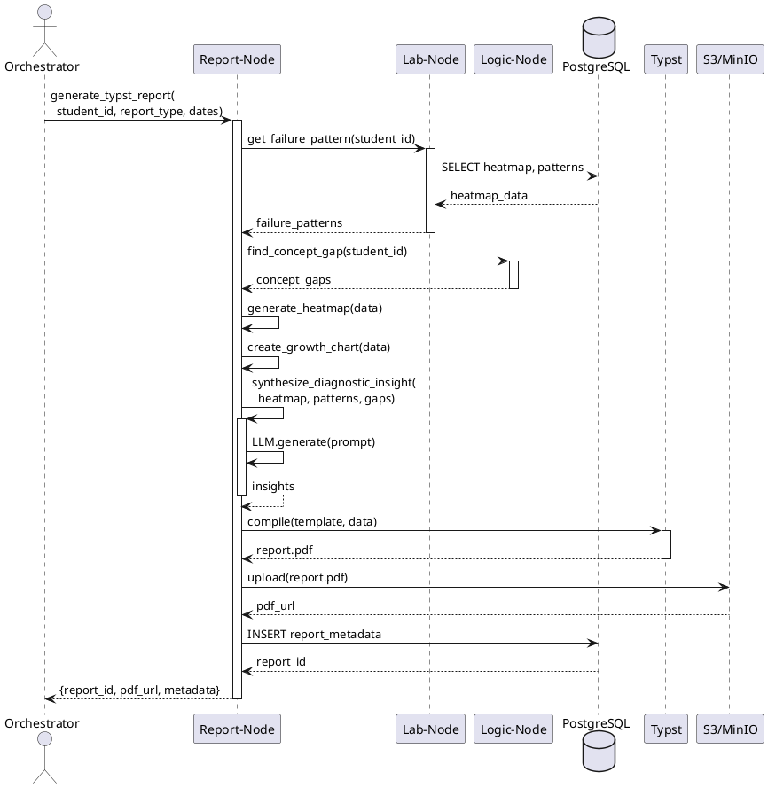
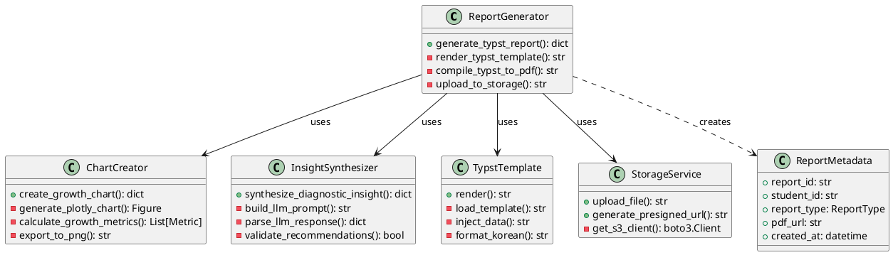

# Node 5: Report-Node (진단 리포트 생성 엔진)

## 개요

**Report-Node**는 학습자의 학습 데이터를 종합하여 **고품질 PDF 진단 리포트**를 자동 생성하는 MCP Server입니다. 단순한 성적표가 아닌, **학습 패턴 분석**, **개념 숙련도 히트맵**, **성장 곡선**, **AI 기반 진단 소견**을 포함하는 종합 리포트를 생성합니다.

### 핵심 역할
- **Typst 기반 고품질 PDF 생성**: LaTeX보다 빠르고 현대적인 조판 시스템
- **시각화 자동 생성**: Plotly/Matplotlib 기반 성장 차트, 히트맵
- **AI 진단 소견**: LLM을 활용한 개인화된 학습 조언 생성
- **다중 리포트 유형**: 주간 리포트, 월간 리포트, 진단 리포트, 모의고사 분석 리포트

### 기술 스택
- **조판 엔진**: Typst (Rust 기반, LaTeX 대체)
- **시각화**: Plotly, Matplotlib, Seaborn
- **LLM**: Ollama (Llama 3.1 70B) via mathesis-common
- **DB**: PostgreSQL (리포트 메타데이터, 히스토리)
- **캐시**: Redis (생성 중인 리포트 상태 추적)
- **파일 저장**: MinIO (S3 호환) 또는 로컬 파일시스템

---

## MCP Tools 명세

### 1. `generate_typst_report`

학생의 학습 데이터를 기반으로 Typst 템플릿을 렌더링하여 PDF 리포트를 생성합니다.

#### Input Schema

```python
from pydantic import BaseModel, Field
from typing import List, Dict, Optional
from datetime import datetime
from enum import Enum

class ReportType(str, Enum):
    WEEKLY = "weekly"          # 주간 학습 리포트
    MONTHLY = "monthly"        # 월간 종합 리포트
    DIAGNOSTIC = "diagnostic"  # 진단 평가 리포트
    MOCK_EXAM = "mock_exam"    # 모의고사 분석 리포트

class GenerateReportInput(BaseModel):
    student_id: str = Field(..., description="학생 고유 ID")
    report_type: ReportType = Field(..., description="리포트 유형")
    start_date: datetime = Field(..., description="분석 시작 날짜")
    end_date: datetime = Field(..., description="분석 종료 날짜")
    include_sections: List[str] = Field(
        default=["summary", "heatmap", "growth_chart", "insights", "recommendations"],
        description="포함할 섹션 목록"
    )
    language: str = Field(default="ko", description="리포트 언어 (ko/en)")
```

#### Output Schema

```python
class ReportMetadata(BaseModel):
    generation_time: float  # 생성 소요 시간 (초)
    page_count: int
    file_size_kb: int
    sections_included: List[str]

class GenerateReportOutput(BaseModel):
    report_id: str = Field(..., description="생성된 리포트 고유 ID")
    pdf_url: str = Field(..., description="PDF 다운로드 URL (S3/MinIO)")
    typst_source_url: Optional[str] = Field(None, description="Typst 소스 파일 URL (디버그용)")
    metadata: ReportMetadata
    preview_summary: str = Field(..., description="리포트 요약 (첫 페이지 텍스트)")
    generated_at: datetime
```

#### 구현 예시

```python
@app.tool()
async def generate_typst_report(
    student_id: str,
    report_type: ReportType,
    start_date: datetime,
    end_date: datetime,
    include_sections: List[str] = ["summary", "heatmap", "growth_chart", "insights"],
    language: str = "ko"
) -> dict:
    """
    학생 학습 데이터를 종합하여 Typst PDF 리포트 생성
    """
    # 1. Lab Node에서 학생 데이터 수집
    lab_data = await mcp_call("lab-node-mcp", "get_failure_pattern", {
        "student_id": student_id,
        "start_date": start_date.isoformat(),
        "end_date": end_date.isoformat()
    })

    # 2. Logic Node에서 개념 갭 분석
    concept_gaps = await mcp_call("logic-engine-mcp", "find_concept_gap", {
        "student_id": student_id,
        "threshold": 0.5
    })

    # 3. 시각화 생성 (히트맵, 성장 차트)
    heatmap_path = await generate_heatmap(lab_data["heatmap_data"])
    growth_chart_path = await create_growth_chart_internal(
        student_id, start_date, end_date
    )

    # 4. AI 진단 소견 생성
    diagnostic_insight = await synthesize_diagnostic_insight_internal(
        student_id=student_id,
        heatmap_data=lab_data["heatmap_data"],
        failure_patterns=lab_data["failure_patterns"],
        concept_gaps=concept_gaps["gaps"]
    )

    # 5. Typst 템플릿 렌더링
    typst_source = render_typst_template(
        report_type=report_type,
        student_name=await get_student_name(student_id),
        period=f"{start_date.date()} ~ {end_date.date()}",
        sections={
            "summary": lab_data["summary_stats"],
            "heatmap_image": heatmap_path,
            "growth_chart_image": growth_chart_path,
            "insights": diagnostic_insight["insights"],
            "recommendations": diagnostic_insight["recommendations"]
        },
        language=language
    )

    # 6. Typst → PDF 컴파일
    report_id = f"report_{student_id}_{int(time.time())}"
    pdf_path = await compile_typst_to_pdf(typst_source, report_id)

    # 7. S3/MinIO 업로드
    pdf_url = await upload_to_storage(pdf_path, f"reports/{report_id}.pdf")

    # 8. DB에 메타데이터 저장
    await save_report_metadata(report_id, student_id, report_type, pdf_url)

    return {
        "report_id": report_id,
        "pdf_url": pdf_url,
        "metadata": {
            "generation_time": time.time() - start_time,
            "page_count": count_pdf_pages(pdf_path),
            "file_size_kb": os.path.getsize(pdf_path) // 1024,
            "sections_included": include_sections
        },
        "preview_summary": extract_first_page_text(pdf_path),
        "generated_at": datetime.now().isoformat()
    }
```

---

### 2. `create_growth_chart`

학생의 시간대별 학습 성장 추이를 시각화한 차트를 생성합니다.

#### Input Schema

```python
class ChartType(str, Enum):
    LINE = "line"              # 시계열 선 그래프
    AREA = "area"              # 면적 차트
    RADAR = "radar"            # 영역별 레이더 차트
    WATERFALL = "waterfall"    # 폭포수 차트 (누적 성장)

class CreateGrowthChartInput(BaseModel):
    student_id: str = Field(..., description="학생 고유 ID")
    start_date: datetime
    end_date: datetime
    chart_type: ChartType = Field(default=ChartType.LINE, description="차트 유형")
    metrics: List[str] = Field(
        default=["mastery_avg", "questions_solved", "study_time_hours"],
        description="추적할 메트릭 목록"
    )
    compare_with: Optional[List[str]] = Field(
        None,
        description="비교할 다른 학생 ID들 (익명 처리)"
    )
    width: int = Field(default=800, description="차트 너비 (px)")
    height: int = Field(default=600, description="차트 높이 (px)")
```

#### Output Schema

```python
class GrowthMetric(BaseModel):
    name: str  # 메트릭 이름
    current_value: float
    start_value: float
    growth_rate: float  # 성장률 (%)
    trend: str  # "improving" | "stable" | "declining"

class CreateGrowthChartOutput(BaseModel):
    chart_url: str = Field(..., description="생성된 차트 이미지 URL (PNG)")
    svg_url: Optional[str] = Field(None, description="SVG 버전 URL (선택적)")
    metrics_summary: List[GrowthMetric]
    peak_date: datetime = Field(..., description="최고 성과 날짜")
    low_date: datetime = Field(..., description="최저 성과 날짜")
    average_weekly_growth: float = Field(..., description="주간 평균 성장률 (%)")
```

#### 구현 예시

```python
import plotly.graph_objects as go
import pandas as pd

@app.tool()
async def create_growth_chart(
    student_id: str,
    start_date: datetime,
    end_date: datetime,
    chart_type: ChartType = ChartType.LINE,
    metrics: List[str] = ["mastery_avg"],
    compare_with: Optional[List[str]] = None,
    width: int = 800,
    height: int = 600
) -> dict:
    """
    학생의 시간대별 성장 추이 차트 생성
    """
    # 1. DB에서 시계열 데이터 조회
    query = """
        SELECT
            date_trunc('day', activity_date) as date,
            AVG(mastery) as mastery_avg,
            COUNT(*) as questions_solved,
            SUM(time_spent_sec) / 3600.0 as study_time_hours
        FROM student_activities
        WHERE student_id = $1
          AND activity_date BETWEEN $2 AND $3
        GROUP BY date_trunc('day', activity_date)
        ORDER BY date
    """
    data = await db.fetch(query, student_id, start_date, end_date)
    df = pd.DataFrame(data)

    # 2. Plotly 차트 생성
    fig = go.Figure()

    for metric in metrics:
        if metric in df.columns:
            fig.add_trace(go.Scatter(
                x=df['date'],
                y=df[metric],
                mode='lines+markers',
                name=METRIC_NAMES_KO.get(metric, metric),
                line=dict(width=3)
            ))

    # 3. 비교 대상 추가 (익명)
    if compare_with:
        for idx, other_id in enumerate(compare_with):
            other_data = await db.fetch(query, other_id, start_date, end_date)
            other_df = pd.DataFrame(other_data)
            fig.add_trace(go.Scatter(
                x=other_df['date'],
                y=other_df['mastery_avg'],
                mode='lines',
                name=f'학생 {chr(65 + idx)}',  # A, B, C...
                line=dict(dash='dash', width=2),
                opacity=0.5
            ))

    # 4. 레이아웃 설정
    fig.update_layout(
        title=f'학습 성장 추이 ({start_date.date()} ~ {end_date.date()})',
        xaxis_title='날짜',
        yaxis_title='메트릭 값',
        width=width,
        height=height,
        template='plotly_white',
        font=dict(family='Noto Sans KR', size=12)
    )

    # 5. 이미지 저장 및 업로드
    chart_id = f"growth_{student_id}_{int(time.time())}"
    png_path = f"/tmp/{chart_id}.png"
    fig.write_image(png_path, format='png', scale=2)
    chart_url = await upload_to_storage(png_path, f"charts/{chart_id}.png")

    # 6. 메트릭 요약 계산
    metrics_summary = []
    for metric in metrics:
        if metric in df.columns:
            current = df[metric].iloc[-1]
            start = df[metric].iloc[0]
            growth_rate = ((current - start) / start * 100) if start > 0 else 0

            metrics_summary.append({
                "name": metric,
                "current_value": float(current),
                "start_value": float(start),
                "growth_rate": round(growth_rate, 2),
                "trend": "improving" if growth_rate > 5 else "stable" if growth_rate > -5 else "declining"
            })

    return {
        "chart_url": chart_url,
        "metrics_summary": metrics_summary,
        "peak_date": df.loc[df['mastery_avg'].idxmax(), 'date'].isoformat(),
        "low_date": df.loc[df['mastery_avg'].idxmin(), 'date'].isoformat(),
        "average_weekly_growth": round(df['mastery_avg'].pct_change().mean() * 100, 2)
    }
```

---

### 3. `synthesize_diagnostic_insight`

LLM을 활용하여 학생의 학습 데이터를 분석하고 개인화된 진단 소견을 생성합니다.

#### Input Schema

```python
class DiagnosticContext(BaseModel):
    weak_concepts: List[Dict[str, Any]]  # 취약 개념 목록
    strong_concepts: List[Dict[str, Any]]  # 강점 개념 목록
    recent_activities: List[Dict[str, Any]]  # 최근 학습 활동
    failure_patterns: List[str]  # 실패 패턴 (Lab Node에서)

class SynthesizeInsightInput(BaseModel):
    student_id: str = Field(..., description="학생 고유 ID")
    heatmap_data: Dict[str, float] = Field(..., description="개념별 숙련도 맵")
    failure_patterns: List[str] = Field(..., description="실패 패턴 목록")
    concept_gaps: List[Dict[str, Any]] = Field(..., description="개념 갭 목록")
    study_habits: Dict[str, Any] = Field(..., description="학습 습관 데이터 (시간대, 집중도 등)")
    target_exam: Optional[str] = Field(None, description="목표 시험 (수능/모의고사 등)")
```

#### Output Schema

```python
class DiagnosticInsight(BaseModel):
    overall_assessment: str = Field(..., description="전반적 평가 (200자 내외)")
    strengths: List[str] = Field(..., description="강점 목록 (3~5개)")
    weaknesses: List[str] = Field(..., description="약점 목록 (3~5개)")
    root_cause_analysis: str = Field(..., description="학습 어려움의 근본 원인 분석")

class ActionableRecommendation(BaseModel):
    priority: int = Field(..., ge=1, le=5, description="우선순위 (1=최고)")
    action: str = Field(..., description="구체적 행동 지침")
    expected_impact: str = Field(..., description="예상 효과")
    timeline: str = Field(..., description="권장 기간 (예: '1주일', '2주간')")

class SynthesizeInsightOutput(BaseModel):
    insights: DiagnosticInsight
    recommendations: List[ActionableRecommendation]
    personalized_message: str = Field(..., description="학생에게 전달할 격려 메시지")
    next_milestone: str = Field(..., description="다음 목표 설정 제안")
```

#### 구현 예시

```python
from mathesis_common.llm_client import OllamaClient

@app.tool()
async def synthesize_diagnostic_insight(
    student_id: str,
    heatmap_data: Dict[str, float],
    failure_patterns: List[str],
    concept_gaps: List[Dict[str, Any]],
    study_habits: Dict[str, Any],
    target_exam: Optional[str] = None
) -> dict:
    """
    LLM 기반 학습 진단 소견 및 맞춤형 조언 생성
    """
    # 1. 데이터 전처리 및 컨텍스트 구성
    weak_concepts = [
        {"concept": k, "mastery": v}
        for k, v in heatmap_data.items()
        if v < 0.5
    ]
    strong_concepts = [
        {"concept": k, "mastery": v}
        for k, v in heatmap_data.items()
        if v >= 0.8
    ]

    # 2. LLM 프롬프트 생성
    prompt = f"""
당신은 교육 전문가입니다. 다음 학생의 학습 데이터를 분석하여 진단 소견을 작성해주세요.

## 학생 데이터
- 취약 개념 (숙련도 < 0.5): {weak_concepts[:5]}
- 강점 개념 (숙련도 ≥ 0.8): {strong_concepts[:5]}
- 실패 패턴: {failure_patterns}
- 개념 갭: {[gap['title'] for gap in concept_gaps[:3]]}
- 학습 습관: 주로 {study_habits.get('peak_hour', 'N/A')}시에 공부, 평균 집중도 {study_habits.get('avg_focus', 'N/A')}

## 작성 지침
1. 전반적 평가: 학생의 현재 학습 상태를 객관적이고 긍정적으로 평가 (200자)
2. 강점 3가지: 구체적 근거와 함께
3. 약점 3가지: 비판이 아닌 개선 기회로 표현
4. 근본 원인: 약점의 패턴을 분석하여 근본 원인 도출
5. 실행 가능한 조언 5가지: 우선순위 순, 구체적 행동 지침

JSON 형식으로 응답:
{{
    "overall_assessment": "...",
    "strengths": ["...", "...", "..."],
    "weaknesses": ["...", "...", "..."],
    "root_cause_analysis": "...",
    "recommendations": [
        {{"priority": 1, "action": "...", "expected_impact": "...", "timeline": "..."}},
        ...
    ],
    "personalized_message": "...",
    "next_milestone": "..."
}}
"""

    # 3. Ollama LLM 호출
    ollama = OllamaClient(model="llama3.1:70b")
    response = await ollama.generate(prompt, temperature=0.7)

    # 4. JSON 파싱 및 검증
    result = json.loads(response)

    # 5. DB에 저장 (히스토리 추적)
    await db.execute("""
        INSERT INTO diagnostic_insights (student_id, insights, recommendations, created_at)
        VALUES ($1, $2, $3, NOW())
    """, student_id, result['insights'], result['recommendations'])

    return result
```

---

## Typst 템플릿 예시

```typst
#import "@preview/charged-ieee:0.1.0": ieee

#show: ieee.with(
  title: "학습 진단 리포트",
  authors: (
    (
      name: "#student_name",
      department: [수학 영역],
      organization: [Mathesis-Synapse],
    ),
  ),
  paper-size: "a4",
  bibliography-file: none,
)

= 분석 기간
#period_start ~ #period_end

= 전반적 평가
#overall_assessment

= 개념 숙련도 히트맵
#image("heatmap.png", width: 100%)

= 성장 추이
#image("growth_chart.png", width: 100%)

= 강점
#for strength in strengths [
  - #strength
]

= 개선 기회
#for weakness in weaknesses [
  - #weakness
]

= 맞춤형 학습 조언
#for rec in recommendations [
  == 우선순위 #rec.priority: #rec.action
  - 예상 효과: #rec.expected_impact
  - 권장 기간: #rec.timeline
]

= 다음 목표
#next_milestone
```

---

## UML 다이어그램

### 1. 시퀀스 다이어그램: 리포트 생성 파이프라인



### 2. 클래스 다이어그램



---

## 데이터베이스 스키마

### PostgreSQL: 리포트 메타데이터

```sql
CREATE TABLE reports (
    report_id VARCHAR(64) PRIMARY KEY,
    student_id VARCHAR(32) NOT NULL,
    report_type VARCHAR(20) NOT NULL,  -- 'weekly', 'monthly', 'diagnostic', 'mock_exam'

    -- 기간
    start_date DATE NOT NULL,
    end_date DATE NOT NULL,

    -- 파일 정보
    pdf_url TEXT NOT NULL,
    typst_source_url TEXT,
    file_size_kb INT,
    page_count INT,

    -- 메타데이터
    sections_included TEXT[],  -- 포함된 섹션 목록
    generation_time_sec FLOAT,
    language VARCHAR(5) DEFAULT 'ko',

    -- 타임스탬프
    created_at TIMESTAMP DEFAULT NOW(),

    FOREIGN KEY (student_id) REFERENCES students(id)
);

CREATE INDEX idx_reports_student ON reports(student_id, created_at DESC);
CREATE INDEX idx_reports_type ON reports(report_type, created_at DESC);

-- 진단 소견 히스토리
CREATE TABLE diagnostic_insights (
    id SERIAL PRIMARY KEY,
    student_id VARCHAR(32) NOT NULL,

    -- 진단 내용
    insights JSONB NOT NULL,  -- DiagnosticInsight 객체
    recommendations JSONB NOT NULL,  -- List[ActionableRecommendation]

    -- 메타데이터
    llm_model VARCHAR(50),
    prompt_tokens INT,
    created_at TIMESTAMP DEFAULT NOW(),

    FOREIGN KEY (student_id) REFERENCES students(id)
);

CREATE INDEX idx_insights_student ON diagnostic_insights(student_id, created_at DESC);
```

---

## 주요 기능 구현

### 1. Typst PDF 컴파일

```python
import subprocess
import tempfile

async def compile_typst_to_pdf(typst_source: str, report_id: str) -> str:
    """
    Typst 소스를 PDF로 컴파일
    """
    with tempfile.NamedTemporaryFile(mode='w', suffix='.typ', delete=False) as f:
        f.write(typst_source)
        typst_path = f.name

    pdf_path = f"/tmp/{report_id}.pdf"

    # Typst CLI 실행
    result = subprocess.run(
        ['typst', 'compile', typst_path, pdf_path],
        capture_output=True,
        text=True
    )

    if result.returncode != 0:
        raise Exception(f"Typst compilation failed: {result.stderr}")

    os.unlink(typst_path)  # 임시 파일 삭제
    return pdf_path
```

### 2. 히트맵 생성 (Plotly)

```python
import plotly.express as px

async def generate_heatmap(heatmap_data: Dict[str, float]) -> str:
    """
    개념별 숙련도 히트맵 생성
    """
    # 개념을 대분류-중분류-소분류로 파싱
    concepts_nested = parse_concept_hierarchy(heatmap_data)

    # 히트맵 데이터 준비
    df = pd.DataFrame([
        {"대분류": cat1, "중분류": cat2, "숙련도": mastery}
        for cat1, subcats in concepts_nested.items()
        for cat2, mastery in subcats.items()
    ])

    # Plotly 히트맵
    fig = px.density_heatmap(
        df,
        x="대분류",
        y="중분류",
        z="숙련도",
        color_continuous_scale="RdYlGn",
        range_color=[0, 1],
        title="개념 숙련도 히트맵"
    )

    fig.update_layout(
        font=dict(family='Noto Sans KR', size=14),
        width=1000,
        height=600
    )

    heatmap_path = f"/tmp/heatmap_{int(time.time())}.png"
    fig.write_image(heatmap_path, scale=2)

    return heatmap_path
```

---

## 통합 예시

### Orchestrator Flow YAML

```yaml
flows:
  generate_monthly_report:
    name: "월간 종합 리포트 생성"
    trigger: "cron: 0 0 1 * *"  # 매월 1일 자정

    steps:
      - id: get_all_students
        action: query_db
        query: "SELECT id FROM students WHERE active = true"
        output: student_list

      - id: generate_reports
        action: parallel_foreach
        items: $student_list
        steps:
          - id: create_report
            mcp_call:
              server: report-node-mcp
              tool: generate_typst_report
              params:
                student_id: $item.id
                report_type: "monthly"
                start_date: $prev_month_start
                end_date: $prev_month_end

          - id: send_email
            action: email
            to: $item.email
            subject: "월간 학습 리포트가 도착했어요!"
            body: "리포트 확인: $create_report.pdf_url"
```

---

## 성능 최적화

### 1. 리포트 캐싱 전략

```python
# Redis 캐시 키: report:{student_id}:{report_type}:{date_hash}
async def get_cached_report(student_id: str, report_type: str, dates: tuple) -> Optional[str]:
    date_hash = hashlib.md5(f"{dates[0]}{dates[1]}".encode()).hexdigest()[:8]
    cache_key = f"report:{student_id}:{report_type}:{date_hash}"

    cached_url = await redis.get(cache_key)
    if cached_url:
        # 24시간 이내 생성된 리포트는 재사용
        return cached_url
    return None
```

### 2. 병렬 차트 생성

```python
import asyncio

async def generate_all_charts(student_id: str, data: dict) -> dict:
    """
    모든 차트를 병렬로 생성
    """
    tasks = [
        generate_heatmap(data["heatmap_data"]),
        create_growth_chart_internal(student_id, data["start_date"], data["end_date"]),
        generate_radar_chart(data["domain_scores"])
    ]

    results = await asyncio.gather(*tasks)
    return {
        "heatmap_url": results[0],
        "growth_chart_url": results[1],
        "radar_chart_url": results[2]
    }
```

---

## 보안 고려사항

1. **PDF 접근 제어**: S3 presigned URL로 24시간 제한
2. **개인정보 익명화**: 비교 대상 학생은 "학생 A, B, C"로 표시
3. **LLM 프롬프트 인젝션 방지**: 사용자 입력 sanitize
4. **Typst 샌드박스**: Typst 컴파일 시 파일 시스템 접근 제한

---

## 확장 가능성

- **다국어 리포트**: 영어, 일본어 템플릿 추가
- **인터랙티브 리포트**: HTML/React 기반 웹 리포트
- **음성 리포트**: TTS로 리포트 내용 읽어주기
- **학부모 버전**: 학부모용 요약 리포트 자동 생성
- **비교 리포트**: 또래 학생들과의 익명 비교 분석

---

**생성 일시**: 2026-01-08
**문서 버전**: 1.0
**담당 노드**: Report-Node (MCP Server)
**관련 문서**: NODE4_LAB_NODE.md, NODE1_LOGIC_ENGINE.md
