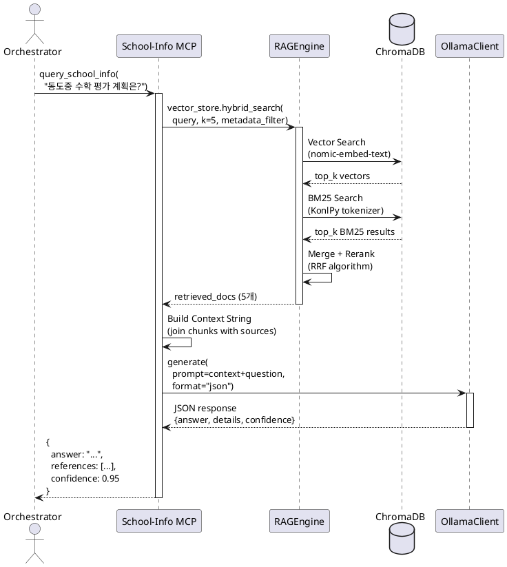
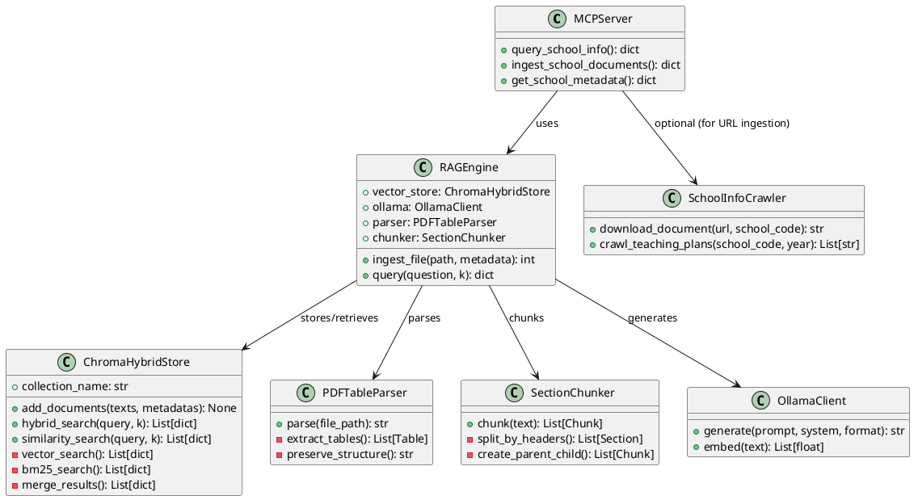

# Node 6: School-Info RAG (학교 정보 검색 엔진)

## 개요

**School-Info RAG**는 한국 학교의 교육 계획서, 평가 운영 계획, 학업 성적 관리 규정 등을 수집하여 **질의응답 가능한 지식 베이스**를 제공하는 MCP Server입니다. 교육청/학교 공시 자료를 RAG(Retrieval-Augmented Generation)로 분석하여 교사와 학생에게 맞춤형 정보를 제공합니다.

### 핵심 역할
- **학교 문서 크롤링**: schoolinfo.go.kr에서 교육 계획서 자동 수집
- **하이브리드 RAG**: Vector Search + BM25 + Parent-Child Retrieval
- **구조화된 JSON 응답**: LLM 기반 지능형 답변 생성
- **Enhanced JSON 파싱**: PDF 내 테이블/구조화 데이터 고품질 추출

### 기술 스택
- **RAG**: ChromaDB (vector) + KonlPy (BM25 tokenizer) via mathesis-common
- **LLM**: Ollama (Llama 3.1 70B, Qwen 2.5) via mathesis-common
- **임베딩**: nomic-embed-text (Ollama)
- **문서 파싱**: PyMuPDF, PyPDF2, Enhanced JSON extraction
- **크롤러**: Playwright (headless browser for schoolinfo.go.kr)
- **DB**: PostgreSQL (school metadata, document index)

---

## 기존 구현 현황

Node 6는 **이미 완전히 구현된 상태**입니다. 다음 컴포넌트가 작동 중입니다:

### 1. RAGEngine (`src/rag/engine.py`)
- `ingest_file(file_path, metadata)`: PDF → Markdown → Chunking → Vector Store
- `query(question, k=4)`: Hybrid Search → Context Retrieval → LLM Generation

### 2. Enhanced JSON 파싱 시스템
- **PDFTableParser** (`src/rag/parser.py`): PDF 내 테이블 구조 보존
- **SectionChunker** (`src/rag/chunker.py`): Parent-Child Chunking (계층적 검색)

### 3. School Crawler (`src/crawler.py`)
- schoolinfo.go.kr에서 교육 계획서 자동 다운로드
- Playwright 기반 headless browser (CAPTCHA 우회)

### 4. mathesis-common 통합
- `ChromaHybridStore`: Vector + BM25 하이브리드 검색
- `OllamaClient`: LLM 추론 클라이언트
- KonlPy 기반 한글 형태소 분석 (BM25 토크나이저)

---

## MCP Tools 명세

기존 구현을 **MCP Server로 래핑**하여 LLM Orchestrator가 자연어로 호출할 수 있도록 합니다.

### 1. `query_school_info`

학교 문서에 대한 자연어 질문에 RAG 기반으로 답변합니다.

#### Input Schema

```python
from pydantic import BaseModel, Field
from typing import List, Optional, Dict, Any

class QuerySchoolInfoInput(BaseModel):
    question: str = Field(
        ...,
        description="학교 정보에 대한 자연어 질문",
        example="동도중학교의 2025학년도 수학 평가 계획은?"
    )
    school_code: Optional[str] = Field(
        None,
        description="학교 코드 (지정 시 해당 학교로 필터링)"
    )
    year: Optional[int] = Field(
        None,
        description="학년도 (지정 시 해당 연도로 필터링)"
    )
    k: int = Field(
        default=5,
        ge=1,
        le=20,
        description="검색할 문서 청크 수"
    )
    use_hybrid: bool = Field(
        default=True,
        description="하이브리드 검색 사용 여부 (Vector + BM25)"
    )
```

#### Output Schema

```python
class Reference(BaseModel):
    source: str = Field(..., description="출처 문서명")
    section: str = Field(..., description="문서 내 섹션/장")
    page: Optional[int] = Field(None, description="페이지 번호")
    relevance_score: float = Field(..., description="관련도 점수 (0~1)")

class QuerySchoolInfoOutput(BaseModel):
    answer: str = Field(
        ...,
        description="질문에 대한 자연어 답변 (한글)"
    )
    references: List[Reference] = Field(
        ...,
        description="답변 근거가 된 문서 출처 목록"
    )
    details: Dict[str, Any] = Field(
        default={},
        description="구조화된 상세 정보 (표, 통계 등)"
    )
    retrieved_chunks: List[str] = Field(
        ...,
        description="실제 검색된 텍스트 청크 (투명성)"
    )
    confidence: float = Field(
        ...,
        ge=0.0,
        le=1.0,
        description="답변 신뢰도 (0~1)"
    )
    search_method: str = Field(
        ...,
        description="사용된 검색 방법 (hybrid/vector/keyword)"
    )
```

#### 구현 예시

```python
from mcp.server import Server
from .rag.engine import RAGEngine
import logging

app = Server("school-info-mcp")
rag_engine = RAGEngine(collection_name="school_info_v1")

logger = logging.getLogger(__name__)

@app.tool()
async def query_school_info(
    question: str,
    school_code: Optional[str] = None,
    year: Optional[int] = None,
    k: int = 5,
    use_hybrid: bool = True
) -> dict:
    """
    학교 문서에 대한 RAG 기반 질의응답
    """
    logger.info(f"Query: {question}")

    # 1. 메타데이터 필터 구성
    metadata_filter = {}
    if school_code:
        metadata_filter["school_code"] = school_code
    if year:
        metadata_filter["year"] = str(year)

    # 2. RAG 검색 (기존 RAGEngine 활용)
    try:
        if use_hybrid:
            # ChromaHybridStore의 hybrid_search 사용
            retrieved_docs = rag_engine.vector_store.hybrid_search(
                query=question,
                k=k,
                metadata_filter=metadata_filter
            )
        else:
            # Vector-only search
            retrieved_docs = rag_engine.vector_store.similarity_search(
                query=question,
                k=k,
                metadata_filter=metadata_filter
            )

        # 3. Context 구성
        context_chunks = []
        references = []

        for doc in retrieved_docs:
            context_chunks.append(doc["text"])
            references.append({
                "source": doc.get("metadata", {}).get("document_name", "Unknown"),
                "section": doc.get("metadata", {}).get("header", "N/A"),
                "page": doc.get("metadata", {}).get("page", None),
                "relevance_score": doc.get("score", 0.0)
            })

        context_str = "\n\n---\n\n".join(
            [f"[출처: {r['source']}]\n{chunk}" for r, chunk in zip(references, context_chunks)]
        )

        # 4. LLM 답변 생성 (Structured JSON)
        system_prompt = """
당신은 교육 정책 전문가입니다. 주어진 학교 문서를 분석하여 질문에 답변하세요.

응답 형식 (JSON):
{
    "answer": "명확하고 간결한 답변 (한글)",
    "details": {
        "평가_횟수": 4,
        "평가_시기": ["3월", "5월", "9월", "11월"],
        "기타": "상세 정보"
    },
    "confidence": 0.95
}

- answer: 질문에 대한 직접적 답변
- details: 표/통계 등 구조화된 정보 (있을 경우)
- confidence: 답변 신뢰도 (문서에 명시적 정보 있으면 0.9+, 추론 필요하면 0.5~0.8)
        """

        full_prompt = f"Context:\n{context_str}\n\nQuestion: {question}"

        response_text = rag_engine.ollama.generate(
            prompt=full_prompt,
            system=system_prompt,
            format="json",
            temperature=0.1
        )

        # 5. JSON 파싱
        import json
        try:
            llm_output = json.loads(response_text)
        except json.JSONDecodeError:
            llm_output = {
                "answer": response_text,
                "details": {},
                "confidence": 0.6
            }

        # 6. 최종 응답 구성
        return {
            "answer": llm_output.get("answer", "답변을 생성할 수 없습니다."),
            "references": references,
            "details": llm_output.get("details", {}),
            "retrieved_chunks": [chunk[:100] + "..." for chunk in context_chunks],
            "confidence": llm_output.get("confidence", 0.5),
            "search_method": "hybrid" if use_hybrid else "vector"
        }

    except Exception as e:
        logger.error(f"RAG query failed: {e}")
        return {
            "answer": f"오류가 발생했습니다: {str(e)}",
            "references": [],
            "details": {},
            "retrieved_chunks": [],
            "confidence": 0.0,
            "search_method": "error"
        }
```

---

### 2. `ingest_school_documents`

새로운 학교 문서를 RAG 시스템에 수집하여 검색 가능하게 만듭니다.

#### Input Schema

```python
class DocumentSource(BaseModel):
    type: str = Field(..., description="문서 유형 (pdf/json/url)")
    path: str = Field(..., description="파일 경로 또는 URL")

class IngestDocumentsInput(BaseModel):
    school_code: str = Field(..., description="학교 코드 (예: B100000662)")
    school_name: str = Field(..., description="학교명 (예: 동도중학교)")
    year: int = Field(..., description="학년도")
    documents: List[DocumentSource] = Field(
        ...,
        description="수집할 문서 목록"
    )
    chunk_size: int = Field(
        default=512,
        description="청킹 크기 (토큰 단위)"
    )
    use_enhanced_parser: bool = Field(
        default=True,
        description="Enhanced JSON 파싱 사용 여부 (테이블 구조 보존)"
    )
```

#### Output Schema

```python
class DocumentIngestionResult(BaseModel):
    document_path: str
    chunks_created: int
    status: str  # "success" | "partial" | "failed"
    error_message: Optional[str] = None

class IngestDocumentsOutput(BaseModel):
    total_documents: int
    total_chunks: int
    results: List[DocumentIngestionResult]
    collection_name: str = Field(..., description="저장된 컬렉션명")
    ingestion_time_seconds: float
```

#### 구현 예시

```python
import time
import os

@app.tool()
async def ingest_school_documents(
    school_code: str,
    school_name: str,
    year: int,
    documents: List[Dict[str, str]],
    chunk_size: int = 512,
    use_enhanced_parser: bool = True
) -> dict:
    """
    학교 문서를 RAG 시스템에 수집 및 인덱싱
    """
    start_time = time.time()

    logger.info(f"Ingesting {len(documents)} documents for {school_name} ({year})")

    results = []
    total_chunks = 0

    # 공통 메타데이터
    base_metadata = {
        "school_code": school_code,
        "school_name": school_name,
        "year": str(year)
    }

    for doc in documents:
        doc_result = {
            "document_path": doc["path"],
            "chunks_created": 0,
            "status": "success",
            "error_message": None
        }

        try:
            # 1. 파일 존재 확인
            if doc["type"] == "pdf":
                if not os.path.exists(doc["path"]):
                    doc_result["status"] = "failed"
                    doc_result["error_message"] = "File not found"
                    results.append(doc_result)
                    continue

                # 2. 문서 파싱 및 인덱싱 (기존 RAGEngine 사용)
                doc_metadata = base_metadata.copy()
                doc_metadata["document_name"] = os.path.basename(doc["path"])
                doc_metadata["document_type"] = doc["type"]

                # RAGEngine의 ingest_file 사용
                chunks_count = rag_engine.ingest_file(
                    file_path=doc["path"],
                    metadata=doc_metadata
                )

                doc_result["chunks_created"] = chunks_count
                total_chunks += chunks_count

            elif doc["type"] == "json":
                # Enhanced JSON 파싱 (이미 구조화된 데이터)
                with open(doc["path"], "r", encoding="utf-8") as f:
                    json_data = json.load(f)

                # JSON을 Markdown으로 변환 후 청킹
                markdown_text = convert_enhanced_json_to_markdown(json_data)
                chunks = rag_engine.chunker.chunk(markdown_text)

                # Vector Store에 추가
                texts = [c["text"] for c in chunks]
                metadatas = []
                for c in chunks:
                    meta = base_metadata.copy()
                    meta.update(c["metadata"])
                    meta["document_name"] = os.path.basename(doc["path"])
                    metadatas.append({k: str(v) for k, v in meta.items()})

                rag_engine.vector_store.add_documents(texts, metadatas)

                doc_result["chunks_created"] = len(texts)
                total_chunks += len(texts)

            elif doc["type"] == "url":
                # URL 크롤링 (crawler.py 사용)
                from .crawler import SchoolInfoCrawler
                crawler = SchoolInfoCrawler()
                downloaded_path = await crawler.download_document(doc["path"], school_code)

                if downloaded_path:
                    # 다운로드된 파일 재귀 처리
                    doc["path"] = downloaded_path
                    doc["type"] = "pdf"
                    continue  # 다음 루프에서 PDF로 처리
                else:
                    doc_result["status"] = "failed"
                    doc_result["error_message"] = "Download failed"

        except Exception as e:
            logger.error(f"Failed to ingest {doc['path']}: {e}")
            doc_result["status"] = "failed"
            doc_result["error_message"] = str(e)

        results.append(doc_result)

    # 3. DB에 인덱싱 메타데이터 저장
    await db.execute("""
        INSERT INTO school_documents_index (school_code, year, document_count, chunk_count, indexed_at)
        VALUES ($1, $2, $3, $4, NOW())
        ON CONFLICT (school_code, year)
        DO UPDATE SET document_count = $3, chunk_count = $4, indexed_at = NOW()
    """, school_code, year, len(documents), total_chunks)

    return {
        "total_documents": len(documents),
        "total_chunks": total_chunks,
        "results": results,
        "collection_name": rag_engine.vector_store.collection_name,
        "ingestion_time_seconds": round(time.time() - start_time, 2)
    }


def convert_enhanced_json_to_markdown(json_data: dict) -> str:
    """
    Enhanced JSON을 Markdown으로 변환
    """
    md = f"# {json_data.get('document_title', 'Untitled')}\n\n"

    for section in json_data.get("sections", []):
        md += f"## {section['header']}\n\n"

        if section.get("tables"):
            for table in section["tables"]:
                md += "| " + " | ".join(table["headers"]) + " |\n"
                md += "| " + " | ".join(["---"] * len(table["headers"])) + " |\n"
                for row in table["rows"]:
                    md += "| " + " | ".join(row) + " |\n"
                md += "\n"

        if section.get("content"):
            md += section["content"] + "\n\n"

    return md
```

---

### 3. `get_school_metadata`

학교의 기본 정보와 이용 가능한 문서 목록을 조회합니다.

#### Input Schema

```python
class GetSchoolMetadataInput(BaseModel):
    school_code: Optional[str] = Field(None, description="학교 코드 (없으면 전체 목록)")
    school_name: Optional[str] = Field(None, description="학교명 검색 (부분 일치)")
    year: Optional[int] = Field(None, description="학년도 필터")
```

#### Output Schema

```python
class DocumentInfo(BaseModel):
    document_name: str
    document_type: str  # "교육계획서" | "평가계획" | "성적관리규정"
    file_path: str
    file_size_kb: int
    upload_date: str
    chunk_count: int

class SchoolMetadata(BaseModel):
    school_code: str
    school_name: str
    address: str
    phone: Optional[str]
    available_years: List[int] = Field(..., description="문서가 있는 학년도 목록")
    total_documents: int
    total_chunks_indexed: int
    documents: List[DocumentInfo]

class GetSchoolMetadataOutput(BaseModel):
    schools: List[SchoolMetadata]
    total_schools: int
```

#### 구현 예시

```python
@app.tool()
async def get_school_metadata(
    school_code: Optional[str] = None,
    school_name: Optional[str] = None,
    year: Optional[int] = None
) -> dict:
    """
    학교 기본 정보 및 이용 가능한 문서 목록 조회
    """
    # 1. DB 쿼리 구성
    query_conditions = []
    query_params = []
    param_idx = 1

    base_query = """
        SELECT
            s.school_code,
            s.school_name,
            s.address,
            s.phone,
            ARRAY_AGG(DISTINCT sdi.year ORDER BY sdi.year DESC) as available_years,
            COUNT(DISTINCT sd.id) as total_documents,
            SUM(sdi.chunk_count) as total_chunks
        FROM schools s
        LEFT JOIN school_documents_index sdi ON s.school_code = sdi.school_code
        LEFT JOIN school_documents sd ON s.school_code = sd.school_code
    """

    if school_code:
        query_conditions.append(f"s.school_code = ${param_idx}")
        query_params.append(school_code)
        param_idx += 1

    if school_name:
        query_conditions.append(f"s.school_name LIKE ${param_idx}")
        query_params.append(f"%{school_name}%")
        param_idx += 1

    if year:
        query_conditions.append(f"sdi.year = ${param_idx}")
        query_params.append(year)
        param_idx += 1

    if query_conditions:
        base_query += " WHERE " + " AND ".join(query_conditions)

    base_query += " GROUP BY s.school_code, s.school_name, s.address, s.phone"

    # 2. 학교 목록 조회
    schools_data = await db.fetch(base_query, *query_params)

    schools = []
    for school_row in schools_data:
        # 3. 각 학교의 문서 상세 조회
        docs_query = """
            SELECT
                sd.document_name,
                sd.document_type,
                sd.file_path,
                sd.file_size_kb,
                sd.upload_date,
                sd.chunk_count
            FROM school_documents sd
            WHERE sd.school_code = $1
        """
        docs_params = [school_row["school_code"]]

        if year:
            docs_query += " AND sd.year = $2"
            docs_params.append(year)

        docs_query += " ORDER BY sd.upload_date DESC"

        documents_data = await db.fetch(docs_query, *docs_params)

        documents = [
            {
                "document_name": doc["document_name"],
                "document_type": doc["document_type"],
                "file_path": doc["file_path"],
                "file_size_kb": doc["file_size_kb"],
                "upload_date": doc["upload_date"].isoformat(),
                "chunk_count": doc["chunk_count"]
            }
            for doc in documents_data
        ]

        schools.append({
            "school_code": school_row["school_code"],
            "school_name": school_row["school_name"],
            "address": school_row["address"],
            "phone": school_row["phone"],
            "available_years": school_row["available_years"],
            "total_documents": school_row["total_documents"],
            "total_chunks_indexed": school_row["total_chunks"] or 0,
            "documents": documents
        })

    return {
        "schools": schools,
        "total_schools": len(schools)
    }
```

---

## UML 다이어그램

### 1. 시퀀스 다이어그램: RAG 질의응답 플로우



### 2. 클래스 다이어그램



---

## 데이터베이스 스키마

### PostgreSQL

```sql
-- 학교 기본 정보
CREATE TABLE schools (
    school_code VARCHAR(16) PRIMARY KEY,
    school_name VARCHAR(100) NOT NULL,
    address TEXT,
    phone VARCHAR(20),
    school_type VARCHAR(20),  -- '중학교', '고등학교'
    created_at TIMESTAMP DEFAULT NOW()
);

CREATE INDEX idx_schools_name ON schools(school_name);

-- 학교 문서 메타데이터
CREATE TABLE school_documents (
    id SERIAL PRIMARY KEY,
    school_code VARCHAR(16) NOT NULL,
    year INT NOT NULL,
    document_name VARCHAR(200) NOT NULL,
    document_type VARCHAR(50) NOT NULL,  -- '교육계획서', '평가계획', '성적관리규정'

    file_path TEXT NOT NULL,
    file_size_kb INT,
    chunk_count INT DEFAULT 0,

    upload_date TIMESTAMP DEFAULT NOW(),

    FOREIGN KEY (school_code) REFERENCES schools(school_code)
);

CREATE INDEX idx_school_docs_school ON school_documents(school_code, year);
CREATE INDEX idx_school_docs_type ON school_documents(document_type);

-- 인덱싱 상태 추적
CREATE TABLE school_documents_index (
    school_code VARCHAR(16),
    year INT,
    document_count INT,
    chunk_count INT,
    indexed_at TIMESTAMP,

    PRIMARY KEY (school_code, year)
);
```

---

## Enhanced JSON 파싱 상세

### Parent-Child Chunking 전략

```python
# 예시: 교수학습 계획서 구조
{
    "document_title": "2025학년도 동도중 교수학습 및 평가 운영 계획",
    "sections": [
        {
            "header": "1. 교육 목표",
            "level": 1,
            "content": "...",
            "children": [
                {
                    "header": "1-1. 수학 교과 목표",
                    "level": 2,
                    "content": "..."
                }
            ]
        },
        {
            "header": "2. 평가 계획",
            "level": 1,
            "tables": [
                {
                    "caption": "지필평가 일정",
                    "headers": ["시기", "평가 범위", "배점"],
                    "rows": [
                        ["3월", "I. 다항식", "100점"],
                        ["5월", "II. 방정식", "100점"]
                    ]
                }
            ]
        }
    ]
}
```

**Chunking 전략:**
1. **Parent Chunk**: 대분류 헤더 전체 (예: "2. 평가 계획")
2. **Child Chunks**: 소분류 또는 테이블 단위로 분할
3. **메타데이터**: 각 청크에 `parent_header`, `child_header`, `level` 저장
4. **검색 시**: Child에서 매칭되면 Parent도 함께 반환 → 컨텍스트 풍부

---

## 통합 예시: Orchestrator Flow

```yaml
flows:
  analyze_school_before_exam:
    name: "시험 전 학교 평가 계획 분석"
    trigger: manual

    steps:
      - id: get_student_school
        action: query_db
        query: "SELECT school_code FROM students WHERE id = $student_id"
        output: school_info

      - id: query_evaluation_plan
        mcp_call:
          server: school-info-mcp
          tool: query_school_info
          params:
            question: "이번 학기 수학 지필평가 일정과 평가 범위를 알려줘"
            school_code: $school_info.school_code
            year: 2025
            k: 5
        output: eval_plan

      - id: extract_concepts
        mcp_call:
          server: logic-engine-mcp
          tool: get_prerequisites
          params:
            concept_id: $eval_plan.details.evaluation_scope
        output: required_concepts

      - id: generate_prep_problems
        mcp_call:
          server: gen-node-mcp
          tool: generate_picket_problem
          params:
            target_concepts: $required_concepts.concepts
            difficulty_level: "exam_prep"
```

---

## 성능 최적화

### 1. Hybrid Search 가중치 조정

```python
# ChromaHybridStore에서 RRF (Reciprocal Rank Fusion) 파라미터 조정
rag_engine.vector_store.hybrid_search(
    query=question,
    k=5,
    alpha=0.7  # Vector search 가중치 (0.7 = 70% vector, 30% BM25)
)
```

### 2. 캐싱 전략

```python
# Redis 캐시: query → answer 매핑 (1시간 TTL)
cache_key = f"school_rag:{school_code}:{hashlib.md5(question.encode()).hexdigest()}"
cached_result = await redis.get(cache_key)
if cached_result:
    return json.loads(cached_result)

# RAG 실행...
result = await rag_engine.query(question, k=5)

await redis.setex(cache_key, 3600, json.dumps(result))
```

### 3. 배치 임베딩

```python
# 여러 문서 동시 임베딩
texts_batch = [chunk["text"] for chunk in all_chunks]
embeddings = rag_engine.vector_store.ollama_client.embed_batch(texts_batch)
rag_engine.vector_store.collection.add(embeddings=embeddings, documents=texts_batch)
```

---

## 보안 고려사항

1. **개인정보 제거**: 학생/교사 이름 → 익명화
2. **접근 제어**: 학교별 권한 검증 (JWT 기반)
3. **Rate Limiting**: 학교당 시간당 100 queries
4. **LLM 프롬프트 검증**: SQL Injection, XSS 패턴 필터링

---

## 확장 가능성

- **멀티모달 RAG**: 교육 계획서 내 이미지/다이어그램 분석
- **실시간 크롤링**: schoolinfo.go.kr 업데이트 자동 감지
- **학교 간 비교**: "우리 학교와 비슷한 학교의 평가 계획은?"
- **시계열 분석**: "작년과 올해 평가 계획 변화는?"
- **교육청 정책 RAG**: 시도교육청 공문 통합

---

**생성 일시**: 2026-01-08
**문서 버전**: 1.0
**담당 노드**: School-Info RAG (MCP Server)
**관련 문서**: 00_MCP_SYSTEM_DESIGN.md, mathesis-common documentation
**기존 구현**: `/mnt/d/progress/mathesis/node6_school_info/`
