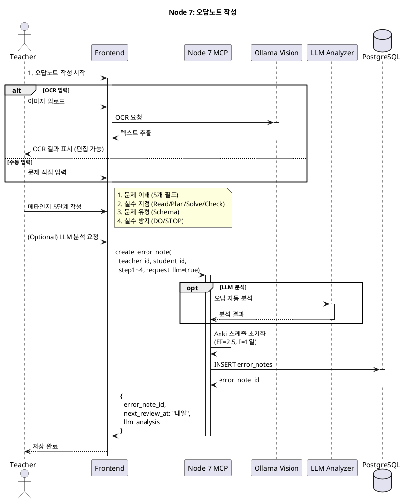
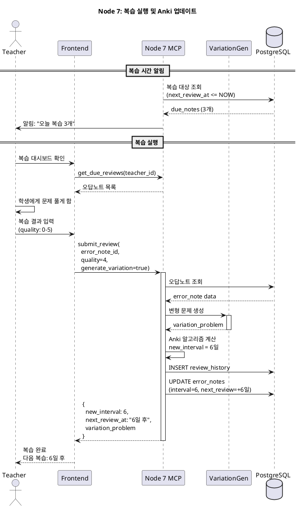
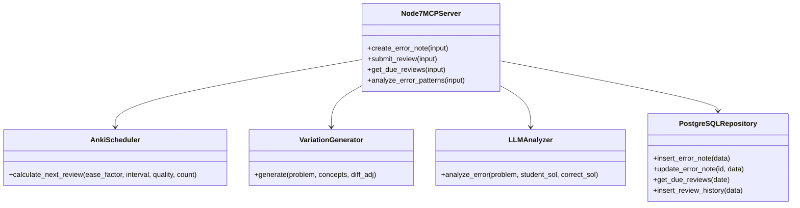

# Node 7: Error Note System - 선생님 전용 메타인지 오답노트 & Anki 복습 시스템

> 메타인지 프레임워크로 오답을 구조화하고, Anki 간격 반복 알고리즘으로 최적 복습 시점을 자동 계산하는 선생님 전용 시스템

**작성일**: 2026-01-09
**최종 업데이트**: 2026-01-10
**버전**: 2.0 - ⭐ Refactored with mathesis_core
**상태**: ✅ Production (mathesis_core 통합 완료)
**Port**: 8007 (FastAPI), stdio (MCP)

---

## 📋 목차

1. [개요](#1-개요)
2. [아키텍처](#2-아키텍처)
3. [MCP Tools 명세](#3-mcp-tools-명세)
4. [데이터베이스 스키마](#4-데이터베이스-스키마)
5. [Anki 알고리즘](#5-anki-알고리즘)
6. [LLM 변형 문제 생성](#6-llm-변형-문제-생성)
7. [시퀀스 다이어그램](#7-시퀀스-다이어그램)
8. [클래스 다이어그램](#8-클래스-다이어그램)
9. [구현 가이드](#9-구현-가이드)

---

## 1. 개요

### 1.1 목적

**Error Note System (Node 7)**은 선생님이 학생들의 오답을 **메타인지 프레임워크**로 체계적으로 분석하고, **Anki 간격 반복 알고리즘**으로 최적의 복습 스케줄을 자동 관리하는 시스템입니다.

**핵심 가치**:
- 🧑‍🏫 **선생님 중심**: 여러 학생의 오답노트를 통합 관리
- 🧠 **메타인지 분석**: 5단계 프레임워크로 오답 원인 구조화
  1. 문제 이해
  2. 실수 지점 (Read/Plan/Solve/Check)
  3. 문제 유형 Schema
  4. 실수 방지 DO/STOP
- 📅 **Anki 스케줄링**: SuperMemo SM-2 알고리즘으로 복습 시점 자동 계산
- 🔄 **LLM 변형 문제**: 복습 시 유사 문제 자동 생성
- 📬 **자동 알림**: 복습 시간이 되면 선생님에게 알림

### 1.2 주요 기능

| 기능 | 설명 | MCP Tool |
|------|------|----------|
| **오답노트 생성** | OCR 또는 수동 입력으로 오답 등록 | `create_error_note` |
| **메타인지 분석** | 5단계 프레임워크 구조화 입력 | `create_error_note` |
| **복습 실행** | 복습 결과 제출 및 Anki 업데이트 | `submit_review` |
| **변형 문제 생성** | LLM으로 유사 문제 자동 생성 | `generate_variation_problem` |
| **복습 대상 조회** | 오늘 복습할 오답노트 목록 | `get_due_reviews` |
| **패턴 분석** | 학생별 오답 패턴 분석 | `analyze_error_patterns` |
| **선생님 알림** | 복습 시간 알림 (Celery 백그라운드) | N/A (자동) |

### 1.3 기술 스택

| 계층 | 기술 | 용도 |
|------|------|------|
| **MCP Server** | `mcp` Python SDK | LLM과의 Tool 통신 |
| **Database** | PostgreSQL 14+ | 오답노트, 복습 이력 저장 |
| **Core Modules** | `mathesis_core` ⭐ | Vision, Analysis, Generation 통합 모듈 |
| **Error Analysis** | mathesis_core.analysis.DNAAnalyzer | 문제 개념 추출 + LLMAnalyzer (오답 분석) |
| **Problem Variation** | mathesis_core.generation.ProblemGenerator | Twin/Variation 문제 자동 생성 |
| **LLM** | mathesis_core.llm.LLMClient (Ollama) | 오답 분석, 변형 문제 생성 |
| **Scheduler** | Celery + Redis | 선생님 알림 스케줄링 |
| **Algorithm** | Anki SM-2 | 간격 반복 학습 스케줄 |

---

## 2. 아키텍처

### 2.1 시스템 구조

```
┌─────────────────────────────────────────────────────────┐
│                  Teacher Portal (Frontend)               │
│           (오답노트 작성, 복습 대시보드)                    │
└───────────────────────┬─────────────────────────────────┘
                        │ REST API / MCP
                        │
         ┌──────────────▼──────────────┐
         │  Node 7: Error Note System  │
         │                             │
         │  ┌─────────────────────┐   │
         │  │ MCP Server          │   │
         │  │ - create_error_note │   │
         │  │ - submit_review     │   │
         │  │ - get_due_reviews   │   │
         │  └─────────────────────┘   │
         │                             │
         │  ┌─────────────────────┐   │
         │  │ Core Logic          │   │
         │  │ - AnkiScheduler     │   │
         │  │ - VariationGen      │   │
         │  │ - LLMAnalyzer       │   │
         │  └─────────────────────┘   │
         │                             │
         │  ┌─────────────────────┐   │
         │  │ Celery Workers      │   │
         │  │ - Daily Notification│   │
         │  └─────────────────────┘   │
         └──────┬──────────────────────┘
                │
       ┌────────▼────────┐
       │   PostgreSQL    │
       │  - error_notes  │
       │  - review_      │
       │    history      │
       │  - teacher_     │
       │    notifications│
       └─────────────────┘
                │
         ┌──────▼─────┐
         │  Ollama    │
         │ (Vision +  │
         │  LLM)      │
         └────────────┘
```

### 2.2 데이터 흐름

**오답노트 작성 → 복습 → 변형 문제 생성**:
```
1. 선생님이 오답노트 작성
   - OCR 업로드 또는 수동 입력
   - 메타인지 5단계 프레임워크 작성
   ↓
2. Anki 스케줄 초기화
   - ease_factor = 2.5
   - interval = 1일
   - next_review_at = 내일
   ↓
3. DB 저장
   ↓
4. (다음날) Celery Worker가 복습 대상 감지
   ↓
5. 선생님에게 알림
   - "오늘 복습 대상: 김철수 3개, 이영희 2개"
   ↓
6. 선생님이 복습 실행
   - 학생에게 문제 다시 풀게 함
   - quality (0-5) 입력
   ↓
7. LLM이 변형 문제 생성
   - 원본 문제 기반 유사 문제 생성
   ↓
8. Anki 알고리즘 재계산
   - 새로운 interval 계산 (예: 6일 후)
   - next_review_at 업데이트
   ↓
9. 반복 (6일 후 다시 알림)
```

---

## 2.3 mathesis_core 통합 아키텍처 ⭐

**Node 7은 mathesis_core 모듈을 통합하여 강력한 오답 분석 및 변형 문제 생성 기능을 제공합니다:**

```
┌─────────────────────────────────────────────────────────┐
│              Node 7: Error Note System                   │
│                                                          │
│  ┌────────────────────────────────────────────────┐    │
│  │         Core Logic Layer                        │    │
│  │  - LLMAnalyzer (오답 분석 + DNA 통합)          │    │
│  │  - VariationGenerator (변형 문제 생성)         │    │
│  │  - AnkiScheduler (복습 스케줄링)               │    │
│  └────────────────────────────────────────────────┘    │
│                        │                                 │
│                        │ uses                            │
│                        ▼                                 │
│  ┌────────────────────────────────────────────────┐    │
│  │         mathesis_core Modules                   │    │
│  │  ┌──────────────────────────────────────────┐  │    │
│  │  │ Analysis Module                           │  │    │
│  │  │  - DNAAnalyzer                            │  │    │
│  │  │    • analyze() → concepts extraction     │  │    │
│  │  │    • Used by LLMAnalyzer for context     │  │    │
│  │  └──────────────────────────────────────────┘  │    │
│  │  ┌──────────────────────────────────────────┐  │    │
│  │  │ Generation Module                         │  │    │
│  │  │  - ProblemGenerator                       │  │    │
│  │  │    • generate_variation()                 │  │    │
│  │  │    • generate_twin()                      │  │    │
│  │  │    • Used by VariationGenerator           │  │    │
│  │  └──────────────────────────────────────────┘  │    │
│  │  ┌──────────────────────────────────────────┐  │    │
│  │  │ LLM Module                                │  │    │
│  │  │  - LLMClient (Ollama integration)        │  │    │
│  │  │  - LLMJSONParser (safe parsing)          │  │    │
│  │  └──────────────────────────────────────────┘  │    │
│  └────────────────────────────────────────────────┘    │
└─────────────────────────────────────────────────────────┘
```

**통합 성과:**
- ✅ **LLMAnalyzer 강화**: DNAAnalyzer로 개념 자동 추출 → 오답 분석 시 컨텍스트 제공
- ✅ **VariationGenerator**: ProblemGenerator 활용으로 Twin/Variation 생성
- ✅ **코드 재사용**: Node 2와 동일한 모듈 공유, 중복 제거
- ✅ **테스트 커버리지**: mathesis_core의 30개 테스트 혜택

**실제 코드 예시:**
```python
# core/llm_logic.py - LLMAnalyzer with DNAAnalyzer integration
from mathesis_core.analysis import DNAAnalyzer
from mathesis_core.llm.clients import LLMClient

class LLMAnalyzer:
    """오답 분석 - mathesis_core DNAAnalyzer 통합"""

    def __init__(self, client: LLMClient):
        self.client = client
        self.dna_analyzer = DNAAnalyzer(client)  # ⭐ DNA 분석 통합

    async def analyze_error(
        self,
        problem_text: str,
        student_solution: str,
        correct_solution: str
    ) -> Dict[str, Any]:
        # 1. DNA 분석으로 문제 개념 추출
        dna = await self.dna_analyzer.analyze(problem_text)
        concepts = [tag["tag"] for tag in dna.get("tags", [])
                    if tag.get("type") == "concept"]

        # 2. 개념 정보를 활용한 오답 분석
        prompt = f"""문제의 관련 개념: {", ".join(concepts)}
        학생 풀이를 분석하여 어떤 개념이 부족한지 판단하세요..."""

        result = await self.client.generate(prompt, format="json")
        result["concepts_involved"] = concepts  # DNA 개념 포함
        return result
```

```python
# core/llm_logic.py - VariationGenerator with ProblemGenerator
from mathesis_core.generation import ProblemGenerator

class VariationGenerator:
    """변형 문제 생성 - mathesis_core ProblemGenerator 위임"""

    def __init__(self, client: LLMClient):
        self.generator = ProblemGenerator(client)  # ⭐ 생성 모듈 통합

    async def generate_variation(
        self,
        original_problem: str,
        concepts: List[str],
        difficulty_adjustment: float = 0.0
    ) -> Dict[str, Any]:
        # ProblemGenerator에 위임
        result = await self.generator.generate_variation(
            original_question=original_problem,
            variation_type="difficulty",
            target_level=base_difficulty + difficulty_adjustment
        )
        return result

    async def generate_twin_variation(
        self,
        original_problem: str,
        concepts: List[str]
    ) -> Dict[str, Any]:
        # Twin 문제 생성도 ProblemGenerator 활용
        result = await self.generator.generate_twin(question_dict)
        return result
```

**Node 7 고유 기능:**
- **Anki SM-2 알고리즘**: 복습 간격 자동 계산 (Node 7 전용)
- **메타인지 프레임워크**: 5단계 오답 구조화 (Node 7 전용)
- **선생님 알림 시스템**: Celery 기반 복습 알림 (Node 7 전용)

**재사용 모듈 (mathesis_core):**
- DNAAnalyzer: 문제 개념 추출
- ProblemGenerator: 변형 문제 생성
- LLMClient: LLM 통신

---

## 3. MCP Tools 명세

### 3.1 Tool: `create_error_note`

**목적**: 오답노트 생성 (OCR 또는 수동 입력)

**Input Schema**:
```python
class CreateErrorNoteInput(BaseModel):
    teacher_id: str = Field(..., description="작성하는 선생님 ID")
    student_id: str = Field(..., description="학생 ID")

    # 입력 방식
    input_method: Literal["ocr", "manual"] = Field(..., description="입력 방식")

    # OCR 입력
    original_image_url: Optional[str] = Field(
        default=None,
        description="OCR 원본 이미지 URL"
    )
    ocr_text: Optional[str] = Field(
        default=None,
        description="OCR 추출 텍스트"
    )

    # 수동 입력
    manual_text: Optional[str] = Field(
        default=None,
        description="수동 입력한 문제 텍스트"
    )

    # 메타인지 5단계 프레임워크
    step1_understanding: Dict[str, str] = Field(
        ...,
        description="1단계: 문제 이해",
        example={
            "question_summary": "함수의 극값 구하기",
            "concepts_used": "도함수, 극값",
            "student_solution": "f'(x) = 2x로 계산...",
            "correct_solution": "f'(x) = 3x^2로 계산...",
            "difference": "미분 공식 적용 오류"
        }
    )

    step2_error_point: Literal["read", "plan", "solve", "check"] = Field(
        ...,
        description="2단계: 실수 지점"
    )
    step2_error_detail: str = Field(
        ...,
        description="실수 지점 상세 설명"
    )

    step3_schema: List[str] = Field(
        ...,
        description="3단계: 문제 유형",
        example=["합치기", "비교하기"]
    )

    step4_prevention: Dict[str, List[str]] = Field(
        ...,
        description="4단계: 실수 방지",
        example={
            "do": ["단위부터 먼저 확인하기"],
            "stop": ["암산으로 계산하지 않기"]
        }
    )

    # 옵션
    question_id: Optional[int] = Field(
        default=None,
        description="Node2 문제 ID (연동 시)"
    )
    request_llm_analysis: bool = Field(
        default=False,
        description="LLM 자동 분석 요청 여부"
    )
```

**Output Schema**:
```python
class CreateErrorNoteOutput(BaseModel):
    error_note_id: int
    next_review_at: str  # ISO datetime
    ease_factor: float
    interval_days: int
    llm_analysis: Optional[Dict[str, Any]] = None
```

**구현 로직**:
```python
async def create_error_note(input: CreateErrorNoteInput) -> CreateErrorNoteOutput:
    # 1. LLM 분석 (옵션)
    llm_analysis = None
    if input.request_llm_analysis:
        problem_text = input.ocr_text or input.manual_text
        llm_analysis = await llm_analyzer.analyze_error(
            problem_text=problem_text,
            student_solution=input.step1_understanding["student_solution"],
            correct_solution=input.step1_understanding["correct_solution"]
        )

    # 2. Anki 스케줄 초기화
    ease_factor = 2.5
    interval_days = 1
    next_review_at = datetime.now() + timedelta(days=1)

    # 3. DB 저장
    error_note_id = await db.insert_error_note({
        "teacher_id": input.teacher_id,
        "student_id": input.student_id,
        "input_method": input.input_method,
        "original_image_url": input.original_image_url,
        "ocr_text": input.ocr_text,
        "manual_text": input.manual_text,
        "question_id": input.question_id,
        "step1_understanding": input.step1_understanding,
        "step2_error_point": input.step2_error_point,
        "step2_error_detail": input.step2_error_detail,
        "step3_schema": input.step3_schema,
        "step4_prevention": input.step4_prevention,
        "llm_analysis": llm_analysis,
        "ease_factor": ease_factor,
        "interval_days": interval_days,
        "next_review_at": next_review_at,
        "status": "pending"
    })

    return CreateErrorNoteOutput(
        error_note_id=error_note_id,
        next_review_at=next_review_at.isoformat(),
        ease_factor=ease_factor,
        interval_days=interval_days,
        llm_analysis=llm_analysis
    )
```

---

### 3.2 Tool: `submit_review`

**목적**: 복습 결과 제출 및 Anki 업데이트

**Input Schema**:
```python
class SubmitReviewInput(BaseModel):
    error_note_id: int
    quality: int = Field(
        ...,
        ge=0,
        le=5,
        description="Anki 척도 (0=완전 틀림, 5=완벽)"
    )
    teacher_note: Optional[str] = Field(
        default=None,
        description="선생님 메모"
    )
    generate_variation: bool = Field(
        default=True,
        description="변형 문제 생성 여부"
    )
```

**Output Schema**:
```python
class SubmitReviewOutput(BaseModel):
    review_id: int
    new_interval_days: int
    next_review_at: str  # ISO datetime
    status: str  # 'pending' | 'reviewing' | 'mastered'
    variation_problem: Optional[Dict[str, Any]] = None
```

**Anki Quality 척도**:
```
0: 완전 틀림 (전혀 기억 안 남)
1: 틀림 (힌트 봐도 모름)
2: 틀림 (힌트 보고 겨우 맞춤)
3: 맞음 (어려웠음)
4: 맞음 (적당했음)
5: 완벽 (쉬웠음)
```

**구현 로직**:
```python
async def submit_review(input: SubmitReviewInput) -> SubmitReviewOutput:
    # 1. 기존 오답노트 조회
    error_note = await db.get_error_note(input.error_note_id)

    # 2. 변형 문제 생성 (LLM)
    variation_problem = None
    if input.generate_variation:
        original_text = error_note["ocr_text"] or error_note["manual_text"]
        difficulty_adj = 0.0 if input.quality >= 4 else -0.1  # 어려웠으면 쉽게

        variation_problem = await variation_generator.generate(
            original_problem=original_text,
            concepts=error_note["step1_understanding"]["concepts_used"].split(", "),
            difficulty_adjustment=difficulty_adj
        )

    # 3. Anki 알고리즘 계산
    new_ease_factor, new_interval, next_review_at = anki_scheduler.calculate_next_review(
        ease_factor=error_note["ease_factor"],
        interval_days=error_note["interval_days"],
        quality=input.quality,
        review_count=error_note["review_count"]
    )

    # 4. 복습 이력 저장
    review_id = await db.insert_review_history({
        "error_note_id": input.error_note_id,
        "quality": input.quality,
        "teacher_note": input.teacher_note,
        "variation_problem": variation_problem,
        "ease_factor_before": error_note["ease_factor"],
        "ease_factor_after": new_ease_factor,
        "interval_before": error_note["interval_days"],
        "interval_after": new_interval,
        "next_review_before": error_note["next_review_at"],
        "next_review_after": next_review_at
    })

    # 5. 오답노트 업데이트
    new_status = "mastered" if new_interval > 90 else "reviewing"  # 3개월 이상이면 마스터
    await db.update_error_note(input.error_note_id, {
        "review_count": error_note["review_count"] + 1,
        "last_reviewed_at": datetime.now(),
        "ease_factor": new_ease_factor,
        "interval_days": new_interval,
        "next_review_at": next_review_at,
        "status": new_status
    })

    return SubmitReviewOutput(
        review_id=review_id,
        new_interval_days=new_interval,
        next_review_at=next_review_at.isoformat(),
        status=new_status,
        variation_problem=variation_problem
    )
```

---

### 3.3 Tool: `get_due_reviews`

**목적**: 오늘 복습할 오답노트 목록 조회

**Input Schema**:
```python
class GetDueReviewsInput(BaseModel):
    teacher_id: str
    date: Optional[str] = Field(
        default=None,
        description="조회 날짜 (ISO format), 기본값: 오늘"
    )
```

**Output Schema**:
```python
class DueReviewNote(BaseModel):
    error_note_id: int
    student_name: str
    question_summary: str
    error_point: str
    review_count: int
    interval_days: int
    next_review_at: str

class GetDueReviewsOutput(BaseModel):
    date: str  # ISO datetime
    total_count: int
    by_student: Dict[str, List[DueReviewNote]]
```

---

### 3.4 Tool: `analyze_error_patterns`

**목적**: 학생의 오답 패턴 분석

**Input Schema**:
```python
class AnalyzeErrorPatternsInput(BaseModel):
    student_id: str
    time_range: str = Field(
        default="last_30_days",
        description="분석 기간"
    )
```

**Output Schema**:
```python
class AnalyzeErrorPatternsOutput(BaseModel):
    student_id: str
    time_range: str
    total_errors: int
    error_point_distribution: Dict[str, int]
    /* {
        "read": 2,
        "plan": 5,
        "solve": 10,
        "check": 3
    } */
    schema_distribution: Dict[str, int]
    /* {
        "합치기": 8,
        "비교하기": 5,
        "변화하기": 3
    } */
    average_review_count: float
    most_common_error_point: str
```

---

## 4. 데이터베이스 스키마

### 4.1 PostgreSQL Schema

**오답노트 메인 테이블**:
```sql
CREATE TABLE error_notes (
    id SERIAL PRIMARY KEY,
    teacher_id VARCHAR(64) NOT NULL,
    student_id VARCHAR(64) NOT NULL REFERENCES students(id),

    -- 문제 정보
    question_id INT REFERENCES questions(id),
    question_source VARCHAR(50),

    -- 입력 방식
    input_method VARCHAR(20) NOT NULL CHECK (input_method IN ('ocr', 'manual')),
    original_image_url TEXT,
    ocr_text TEXT,
    manual_text TEXT,

    -- 메타인지 5단계 프레임워크
    step1_understanding JSONB NOT NULL,
    step2_error_point VARCHAR(20) NOT NULL CHECK (step2_error_point IN ('read', 'plan', 'solve', 'check')),
    step2_error_detail TEXT,
    step3_schema TEXT[] NOT NULL,
    step4_prevention JSONB NOT NULL,

    -- LLM 자동 분석
    llm_analysis JSONB,

    -- Anki 메타데이터
    review_count INT DEFAULT 0,
    last_reviewed_at TIMESTAMP,
    next_review_at TIMESTAMP NOT NULL,
    ease_factor FLOAT DEFAULT 2.5 CHECK (ease_factor >= 1.3),
    interval_days INT DEFAULT 1 CHECK (interval_days > 0),
    status VARCHAR(20) DEFAULT 'pending' CHECK (status IN ('pending', 'reviewing', 'mastered')),

    created_at TIMESTAMP DEFAULT NOW(),
    updated_at TIMESTAMP DEFAULT NOW(),

    CONSTRAINT check_input_data CHECK (
        (input_method = 'ocr' AND original_image_url IS NOT NULL) OR
        (input_method = 'manual' AND manual_text IS NOT NULL)
    )
);

CREATE INDEX idx_error_notes_teacher ON error_notes(teacher_id, created_at DESC);
CREATE INDEX idx_error_notes_student ON error_notes(student_id);
CREATE INDEX idx_error_notes_next_review ON error_notes(next_review_at) WHERE status != 'mastered';
CREATE INDEX idx_error_notes_error_point ON error_notes(step2_error_point);
CREATE INDEX idx_error_notes_schema ON error_notes USING GIN(step3_schema);
```

**복습 이력 테이블**:
```sql
CREATE TABLE review_history (
    id SERIAL PRIMARY KEY,
    error_note_id INT NOT NULL REFERENCES error_notes(id) ON DELETE CASCADE,
    reviewed_at TIMESTAMP DEFAULT NOW(),

    -- 복습 결과
    quality INT NOT NULL CHECK (quality BETWEEN 0 AND 5),
    response_time INT,
    teacher_note TEXT,

    -- 변형 문제
    variation_problem JSONB,

    -- Anki 업데이트 스냅샷
    ease_factor_before FLOAT,
    ease_factor_after FLOAT,
    interval_before INT,
    interval_after INT,
    next_review_before TIMESTAMP,
    next_review_after TIMESTAMP
);

CREATE INDEX idx_review_history_note ON review_history(error_note_id, reviewed_at DESC);
```

**선생님 알림 테이블**:
```sql
CREATE TABLE teacher_notifications (
    id SERIAL PRIMARY KEY,
    teacher_id VARCHAR(64) NOT NULL,
    notification_type VARCHAR(50) NOT NULL,

    title VARCHAR(200) NOT NULL,
    message TEXT NOT NULL,
    metadata JSONB,

    status VARCHAR(20) DEFAULT 'pending' CHECK (status IN ('pending', 'sent', 'read')),
    sent_at TIMESTAMP,
    read_at TIMESTAMP,

    created_at TIMESTAMP DEFAULT NOW()
);

CREATE INDEX idx_notifications_teacher ON teacher_notifications(teacher_id, status, created_at DESC);
```

---

## 5. Anki 알고리즘

### 5.1 SuperMemo SM-2 알고리즘

**핵심 변수**:
- `ease_factor` (EF): 문제의 "쉬움 정도" (초기값: 2.5, 최소값: 1.3)
- `interval_days` (I): 다음 복습까지 간격 (일 단위)
- `quality` (Q): 복습 결과 (0-5 척도)

**알고리즘**:
```python
class AnkiScheduler:
    MIN_EASE_FACTOR = 1.3
    INITIAL_EASE_FACTOR = 2.5

    def calculate_next_review(
        self,
        ease_factor: float,
        interval_days: int,
        quality: int,
        review_count: int
    ) -> Tuple[float, int, datetime]:
        """
        Returns: (new_ease_factor, new_interval_days, next_review_datetime)
        """
        # 실패 (Q < 3): 처음부터 다시
        if quality < 3:
            new_interval = 1
            new_ease_factor = max(self.MIN_EASE_FACTOR, ease_factor - 0.2)

        # 성공 (Q >= 3)
        else:
            # 첫 복습 성공
            if review_count == 0 or interval_days == 1:
                new_interval = 6
            # 두 번째 복습 성공
            elif interval_days == 6:
                new_interval = 14
            # 세 번째 이후: EF 곱하기
            else:
                new_interval = int(interval_days * ease_factor)

            # EF 조정
            new_ease_factor = ease_factor + (
                0.1 - (5 - quality) * (0.08 + (5 - quality) * 0.02)
            )
            new_ease_factor = max(self.MIN_EASE_FACTOR, new_ease_factor)

        next_review = datetime.now() + timedelta(days=new_interval)
        return new_ease_factor, new_interval, next_review
```

**예시 시나리오**:
```
초기 상태:
- EF = 2.5
- Interval = 1일

복습 1 (Q=4):
- 새 Interval = 6일
- 새 EF = 2.5 + (0.1 - 1 * 0.1) = 2.5

복습 2 (Q=5):
- 새 Interval = 14일
- 새 EF = 2.5 + 0.1 = 2.6

복습 3 (Q=4):
- 새 Interval = 14 * 2.6 = 36일
- 새 EF = 2.6 (유지)

복습 4 (Q=2, 실패):
- 새 Interval = 1일 (처음부터)
- 새 EF = 2.6 - 0.2 = 2.4
```

---

## 6. LLM 변형 문제 생성

### 6.1 변형 문제 생성 로직

```python
class VariationGenerator:
    def __init__(self):
        self.llm = OllamaClient(model="llama3.1")

    async def generate(
        self,
        original_problem: str,
        concepts: List[str],
        difficulty_adjustment: float = 0.0
    ) -> Dict[str, Any]:
        difficulty_instruction = ""
        if difficulty_adjustment < 0:
            difficulty_instruction = "약간 쉽게 조정하여"
        elif difficulty_adjustment > 0:
            difficulty_instruction = "약간 어렵게 조정하여"

        prompt = f"""
다음은 학생이 틀린 수학 문제입니다:

{original_problem}

**개념**: {', '.join(concepts)}

이 문제와 **유사한 문제를 {difficulty_instruction} 1개 생성**하세요.
단, 숫자나 상황은 바꾸되, 풀이 방법은 동일해야 합니다.

출력 형식 (JSON):
{{
  "problem_text": "변형된 문제 텍스트",
  "solution_hint": "풀이 힌트 (1-2줄)",
  "expected_answer": "예상 답안"
}}
"""

        result = await self.llm.generate(prompt, format="json")
        return {
            "problem_text": result["problem_text"],
            "solution_hint": result["solution_hint"],
            "expected_answer": result["expected_answer"],
            "generated_by": "llama3.1",
            "difficulty_adjustment": difficulty_adjustment
        }
```

---

## 7. 시퀀스 다이어그램

### 7.1 오답노트 작성 플로우



### 7.2 복습 실행 플로우



---

## 8. 클래스 다이어그램



---

## 9. 구현 가이드

### 8.1 프로젝트 구조

```
node7_error_note/
├── backend/
│   ├── main.py                    # FastAPI 서버
│   ├── mcp_server.py              # MCP 서버
│   ├── config.py
│   ├── requirements.txt
│   │
│   ├── api/
│   │   ├── error_notes.py         # 오답노트 CRUD
│   │   ├── reviews.py             # 복습 관리
│   │   └── notifications.py       # 알림 조회
│   │
│   ├── core/
│   │   ├── anki_scheduler.py     # Anki SM-2 알고리즘
│   │   ├── variation_generator.py # LLM 변형 문제 생성
│   │   └── llm_analyzer.py       # 오답 자동 분석
│   │
│   ├── repositories/
│   │   └── postgres_repo.py
│   │
│   ├── workers/
│   │   ├── celery_app.py
│   │   └── notification_tasks.py # 선생님 알림
│   │
│   └── models/
│       ├── error_note.py
│       ├── review_history.py
│       └── schemas.py
│
└── frontend/
    ├── src/
    │   ├── pages/
    │   │   ├── ErrorNoteCreate.tsx   # 오답노트 작성
    │   │   ├── ReviewDashboard.tsx   # 복습 대시보드
    │   │   └── ErrorPatterns.tsx     # 패턴 분석
    │   │
    │   ├── components/
    │   │   ├── MetaCognitiveForm.tsx # 5단계 프레임워크
    │   │   ├── OCRUploader.tsx       # OCR 업로더
    │   │   └── ReviewCard.tsx        # 복습 카드
    │   │
    │   └── services/
    │       └── errorNoteService.ts
    │
    └── package.json
```

### 9.2 mathesis_core 통합 (✅ 완료)

**Node 7은 이미 mathesis_core 모듈과 완전히 통합되었습니다.**

```python
# backend/core/llm_logic.py - ACTUAL IMPLEMENTATION
from mathesis_core.llm.clients import LLMClient
from mathesis_core.analysis import DNAAnalyzer
from mathesis_core.generation import ProblemGenerator
from mathesis_core.llm.parsers import LLMJSONParser

class LLMAnalyzer:
    """
    오답 분석 - mathesis_core DNAAnalyzer 통합
    학생 오답의 원인과 개념적 갭을 분석
    """
    def __init__(self, client: LLMClient):
        self.client = client
        self.dna_analyzer = DNAAnalyzer(client)

    async def analyze_error(
        self,
        problem_text: str,
        student_solution: str,
        correct_solution: str
    ) -> Dict[str, Any]:
        # 1. DNA 분석으로 문제 개념 추출
        try:
            dna = await self.dna_analyzer.analyze(problem_text)
            concepts = [tag["tag"] for tag in dna.get("tags", [])
                       if tag.get("type") == "concept"]
        except Exception as e:
            logger.warning(f"DNA analysis failed: {e}")
            concepts = []

        # 2. 오답 분석 (개념 정보 활용)
        prompt = f"""문제 분석 전문가로서 오답을 분석해주세요.
**관련 개념**: {", ".join(concepts) if concepts else "분석 중"}
학생이 왜 틀렸는지, 어떤 개념이 부족한지 분석하세요."""

        response = await self.client.generate(
            prompt=prompt,
            format="json",
            temperature=0.3
        )

        result = LLMJSONParser.safe_parse(response, default={...})
        result["concepts_involved"] = concepts  # DNA 개념 추가
        return result


class VariationGenerator:
    """
    변형 문제 생성 - mathesis_core ProblemGenerator 활용
    원본 문제 기반으로 Twin/Variation 생성
    """
    def __init__(self, client: LLMClient):
        self.client = client
        self.generator = ProblemGenerator(client)

    async def generate_variation(
        self,
        original_problem: str,
        concepts: List[str],
        difficulty_adjustment: float = 0.0
    ) -> Dict[str, Any]:
        """난이도 조정된 변형 문제 생성"""
        try:
            base_difficulty = 0.5
            target_difficulty = max(0.1, min(0.9,
                base_difficulty + difficulty_adjustment))

            # ProblemGenerator에 위임
            result = await self.generator.generate_variation(
                original_question=original_problem,
                variation_type="difficulty",
                target_level=target_difficulty
            )

            return {
                "problem_text": result.get("question_stem"),
                "solution_hint": result.get("changes_made"),
                "difficulty_level": target_difficulty,
                "concepts": concepts
            }
        except Exception as e:
            logger.error(f"Variation generation failed: {e}")
            return fallback_response

    async def generate_twin_variation(
        self,
        original_problem: str,
        concepts: List[str]
    ) -> Dict[str, Any]:
        """동형 문제(Twin) 생성"""
        try:
            question_dict = {
                "content_stem": original_problem,
                "answer_key": {"answer": "To be determined"}
            }

            # ProblemGenerator의 twin 생성 기능 활용
            result = await self.generator.generate_twin(question_dict)

            return {
                "problem_text": result.get("question_stem"),
                "solution_hint": result.get("solution_steps"),
                "is_twin": True
            }
        except Exception as e:
            logger.error(f"Twin generation failed: {e}")
            return fallback_response


# backend/core/anki_scheduler.py - Node 7 전용 모듈
class AnkiScheduler:
    """
    Anki SM-2 알고리즘 구현
    간격 반복 학습 스케줄 자동 계산
    """
    MIN_EASE_FACTOR = 1.3
    INITIAL_EASE_FACTOR = 2.5

    def calculate_next_review(
        self,
        ease_factor: float,
        interval_days: int,
        quality: int,
        review_count: int
    ) -> Tuple[float, int, datetime]:
        """
        다음 복습 시점 계산
        Returns: (new_ease_factor, new_interval_days, next_review_datetime)
        """
        if quality < 3:
            # 실패: 처음부터
            new_interval = 1
            new_ease_factor = max(self.MIN_EASE_FACTOR, ease_factor - 0.2)
        else:
            # 성공: 간격 증가
            if review_count == 0 or interval_days == 1:
                new_interval = 6
            elif interval_days == 6:
                new_interval = 14
            else:
                new_interval = int(interval_days * ease_factor)

            # EF 조정
            new_ease_factor = ease_factor + (
                0.1 - (5 - quality) * (0.08 + (5 - quality) * 0.02)
            )
            new_ease_factor = max(self.MIN_EASE_FACTOR, new_ease_factor)

        next_review = datetime.now() + timedelta(days=new_interval)
        return new_ease_factor, new_interval, next_review
```

**통합 요약:**
- ✅ **LLMAnalyzer**: DNAAnalyzer 통합으로 개념 기반 오답 분석
- ✅ **VariationGenerator**: ProblemGenerator로 Twin/Variation 생성
- ✅ **AnkiScheduler**: Node 7 전용 복습 스케줄링 (mathesis_core와 독립)
- ✅ **코드 재사용**: Node 2와 동일 모듈 공유, DRY 원칙 준수

### 8.3 Celery 설정

```python
# backend/workers/celery_app.py
from celery import Celery
from celery.schedules import crontab

celery_app = Celery(
    'node7',
    broker='redis://localhost:6379/1',
    backend='redis://localhost:6379/2'
)

# 매일 오전 8시: 복습 대상 알림
celery_app.conf.beat_schedule = {
    'daily-review-notifications': {
        'task': 'workers.notification_tasks.send_daily_review_notifications',
        'schedule': crontab(hour=8, minute=0),
    },
}
```

---

## 9. 확장 가능성

### 9.1 알고리즘 확장

현재 Anki SM-2를 사용하지만, 추후 다른 알고리즘으로 교체 가능:
- **SM-18** (최신 SuperMemo)
- **FSRS (Free Spaced Repetition Scheduler)**
- **수학 문제 특화 알고리즘** (개념별 가중치)

```python
class AbstractScheduler(ABC):
    @abstractmethod
    def calculate_next_review(self, ...): pass

class AnkiSM2Scheduler(AbstractScheduler):
    # 현재 구현
    pass

class FSRSScheduler(AbstractScheduler):
    # 추후 구현
    pass
```

### 9.2 Node 연동

- **Node2 (Q-DNA)**: 오답노트 → BKT 업데이트 연동
- **Node0 (Student Hub)**: 통합 프로필에 오답 패턴 포함
- **Node5 (Report)**: 오답 패턴 분석 리포트 자동 생성

---

**생성 일시**: 2026-01-09
**문서 버전**: 1.0
**담당 노드**: Node 7 (Error Note System)
**관련 문서**: NODE0_STUDENT_HUB.md, NODE2_Q_DNA.md, MATHESIS_COMMON.md
