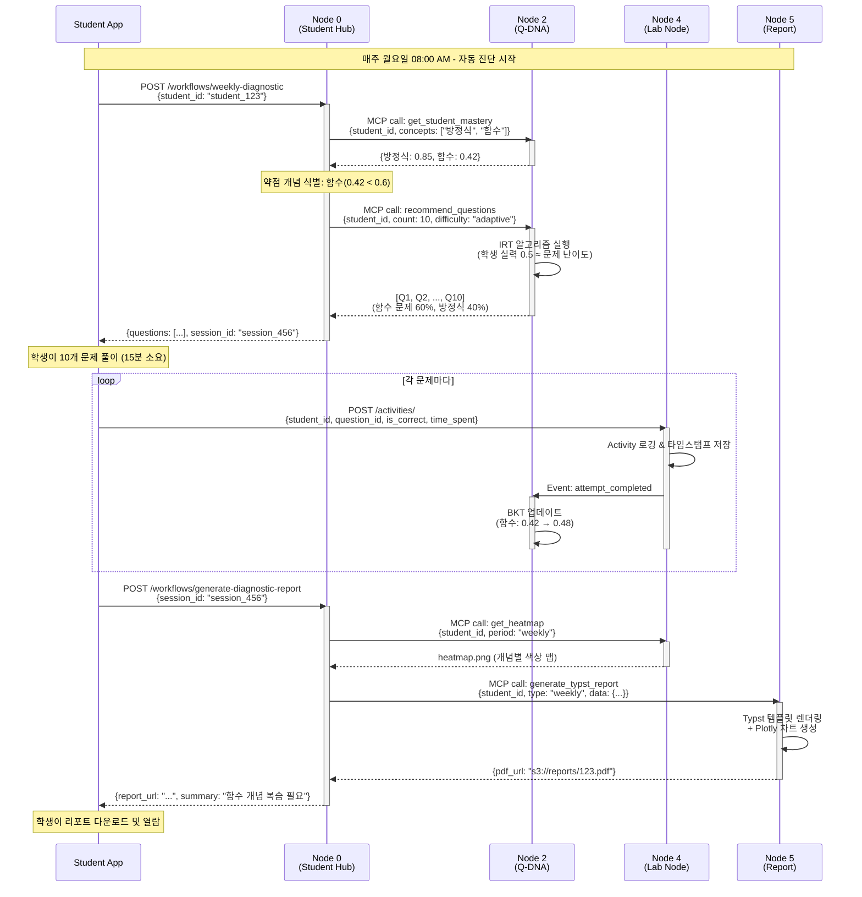

# Use Case 01: 주간 학습 진단

> 매주 월요일, 학생의 현재 숙련도를 파악하고 맞춤형 진단 문제를 제공하여 학습 방향을 설정하는 자동화 워크플로우

**작성일**: 2026-01-10
**버전**: 1.0
**관련 노드**: Node 0, Node 2, Node 4, Node 5

---

## 📋 시나리오 개요

### 상황 설명

중학교 2학년 김민수 학생은 매주 월요일 아침 학습 앱에 로그인하면, 지난주 학습 데이터를 바탕으로 자동 생성된 **주간 학습 진단 테스트**를 받게 됩니다. 이 진단은 다음 기능을 포함합니다:

- **현재 숙련도 평가**: 지난주 학습한 개념들에 대한 이해도 측정
- **약점 자동 탐지**: BKT 알고리즘으로 숙련도가 낮은 개념 식별
- **맞춤형 문제 추천**: IRT 알고리즘으로 학생 수준에 맞는 문제 10개 선정
- **즉각 피드백**: 풀이 후 실시간 정답 여부 및 해설 제공
- **진단 리포트 생성**: 숙련도 히트맵, 성장 곡선, AI 학습 조언 포함 PDF

### 사용자

- **주 사용자**: 학생 (중·고등학생)
- **보조 사용자**: 학부모 (리포트 열람), 교사 (클래스 전체 진단 현황)

### 목표

1. **학습 동기 부여**: 매주 성장을 시각적으로 확인 → 학습 지속성 향상
2. **약점 조기 발견**: 개념 이해도 하락 시 즉시 개입 → 학습 결손 방지
3. **효율적 학습**: 학생 수준에 맞는 문제만 제공 → 시간 절약
4. **데이터 기반 교육**: 교사가 클래스 전체 약점을 파악 → 수업 계획 개선

---

## 🎯 관련 노드

| Node | 역할 | 주요 작업 |
|------|------|----------|
| **Node 0 (Student Hub)** | 워크플로우 오케스트레이션 | 전체 프로세스 조정, 학생 기본 정보 제공 |
| **Node 2 (Q-DNA)** | 문제 추천 및 숙련도 추적 | BKT로 숙련도 조회, IRT로 문제 추천, 풀이 결과로 BKT 업데이트 |
| **Node 4 (Lab Node)** | 학습 활동 로깅 | 문제 풀이 활동 기록, 히트맵 업데이트 |
| **Node 5 (Report Node)** | 진단 리포트 생성 | Typst로 PDF 생성, Plotly 시각화 |

---

## 📊 데이터 플로우



---

## 🔄 상세 플로우

### Step 1: 워크플로우 시작 - 진단 테스트 요청

**API**: `POST /api/v1/workflows/weekly-diagnostic`

**Request**:
```json
{
  "student_id": "student_123",
  "curriculum_path": "중학수학.2학년.1학기",
  "include_weak_concepts": true
}
```

**Response**:
```json
{
  "workflow_id": "wf_789",
  "session_id": "session_456",
  "questions": [
    {
      "question_id": "q_001",
      "content": "다음 함수의 그래프를 그리시오: f(x) = 2x + 3",
      "difficulty": 0.5,
      "concept_tags": ["일차함수", "그래프"],
      "estimated_time_seconds": 120
    }
    // ... 9개 더
  ],
  "total_estimated_time_minutes": 15,
  "weak_concepts": ["함수"],
  "started_at": "2026-01-13T08:00:00Z"
}
```

**비즈니스 로직** (Node 0 내부):
```python
from mcp_client import MCPClientManager
from datetime import datetime, timedelta

async def start_weekly_diagnostic(student_id: str):
    mcp = MCPClientManager()

    # 1. 지난주 학습한 개념 조회
    last_week_concepts = await get_recent_concepts(
        student_id,
        since=datetime.now() - timedelta(days=7)
    )

    # 2. Node 2에서 BKT 숙련도 조회
    mastery = await mcp.call("q-dna", "get_student_mastery", {
        "student_id": student_id,
        "skill_ids": last_week_concepts
    })

    # 3. 약점 개념 식별 (threshold < 0.6)
    weak_concepts = [
        concept for concept, score in mastery.items()
        if score < 0.6
    ]

    # 4. IRT 기반 문제 추천 (약점 개념 60%, 복습 40%)
    questions = await mcp.call("q-dna", "recommend_questions", {
        "student_id": student_id,
        "count": 10,
        "weak_concepts": weak_concepts,
        "weak_ratio": 0.6
    })

    # 5. 세션 생성 (Redis 캐싱)
    session = await create_diagnostic_session(
        student_id=student_id,
        questions=questions,
        weak_concepts=weak_concepts
    )

    return session
```

---

### Step 2: 문제 풀이 및 활동 로깅

**API**: `POST /api/v1/activities/`

**Request** (각 문제마다 호출):
```json
{
  "student_id": "student_123",
  "session_id": "session_456",
  "question_id": "q_001",
  "activity_type": "problem_solving",
  "started_at": "2026-01-13T08:02:00Z",
  "completed_at": "2026-01-13T08:03:45Z",
  "time_spent_seconds": 105,
  "is_correct": true,
  "student_answer": "그래프 이미지 업로드 또는 텍스트",
  "metadata": {
    "attempt_count": 1,
    "hint_used": false
  }
}
```

**Response**:
```json
{
  "activity_id": "act_12345",
  "logged_at": "2026-01-13T08:03:46Z",
  "bkt_updated": true,
  "new_mastery": {
    "일차함수": 0.48,
    "그래프": 0.62
  }
}
```

**비즈니스 로직** (Node 4 내부):
```python
from datetime import datetime
from sqlalchemy.orm import Session

async def log_activity(db: Session, activity: ActivityCreate):
    # 1. PostgreSQL에 활동 기록
    db_activity = Activity(
        student_id=activity.student_id,
        question_id=activity.question_id,
        is_correct=activity.is_correct,
        time_spent=activity.time_spent_seconds,
        timestamp=datetime.utcnow()
    )
    db.add(db_activity)
    db.commit()

    # 2. Event 발행 (BKT 업데이트 트리거)
    await event_bus.publish("attempt_completed", {
        "student_id": activity.student_id,
        "question_id": activity.question_id,
        "is_correct": activity.is_correct,
        "concept_tags": activity.metadata.get("concept_tags", [])
    })

    # 3. Redis 캐시 업데이트 (실시간 대시보드용)
    await redis.hincrby(
        f"student:{activity.student_id}:weekly_stats",
        "total_attempts", 1
    )
    if activity.is_correct:
        await redis.hincrby(
            f"student:{activity.student_id}:weekly_stats",
            "correct_attempts", 1
        )

    return db_activity
```

---

### Step 3: BKT 숙련도 자동 업데이트

**이벤트 처리** (Node 2 내부):
```python
from pyBKT.models import Model

async def handle_attempt_completed(event: dict):
    student_id = event["student_id"]
    is_correct = event["is_correct"]
    concept_tags = event["concept_tags"]

    for concept in concept_tags:
        # 1. 현재 BKT 파라미터 로드
        bkt_params = await load_bkt_params(student_id, concept)

        # 2. BKT 모델 업데이트
        model = Model(
            prior=bkt_params.prior,
            learns=bkt_params.learns,
            forgets=bkt_params.forgets,
            slips=bkt_params.slips,
            guesses=bkt_params.guesses
        )

        # 3. 새로운 관찰 데이터로 숙련도 재계산
        new_mastery = model.predict(
            current_mastery=bkt_params.mastery,
            correct=is_correct
        )

        # 4. DB 업데이트
        await update_student_mastery(
            student_id=student_id,
            skill_id=concept,
            mastery=new_mastery,
            updated_at=datetime.utcnow()
        )

        logger.info(
            f"BKT updated: {student_id} - {concept}: "
            f"{bkt_params.mastery:.3f} → {new_mastery:.3f}"
        )
```

---

### Step 4: 진단 리포트 생성

**API**: `POST /api/v1/workflows/generate-diagnostic-report`

**Request**:
```json
{
  "session_id": "session_456",
  "include_sections": [
    "summary",
    "heatmap",
    "growth_chart",
    "weak_concepts",
    "ai_recommendations"
  ],
  "language": "ko"
}
```

**Response**:
```json
{
  "report_id": "rpt_789",
  "pdf_url": "https://s3.mathesis.ai/reports/student_123/weekly_2026W02.pdf",
  "metadata": {
    "generation_time_seconds": 3.5,
    "page_count": 4,
    "file_size_kb": 245
  },
  "preview_summary": "이번 주 전체 정답률: 70% (7/10). 함수 개념에서 어려움을 겪고 있습니다.",
  "generated_at": "2026-01-13T08:25:00Z"
}
```

**비즈니스 로직** (Node 5 내부 - Typst 리포트 생성):
```python
import subprocess
from pathlib import Path
import plotly.graph_objects as go

async def generate_weekly_report(
    student_id: str,
    session_data: dict,
    mastery_data: dict
):
    # 1. 히트맵 이미지 생성 (Plotly)
    concepts = list(mastery_data.keys())
    scores = list(mastery_data.values())

    fig = go.Figure(data=go.Heatmap(
        z=[scores],
        x=concepts,
        y=["현재 숙련도"],
        colorscale="RdYlGn",
        zmin=0,
        zmax=1
    ))
    fig.update_layout(title="개념별 숙련도 히트맵")
    heatmap_path = f"/tmp/heatmap_{student_id}.png"
    fig.write_image(heatmap_path)

    # 2. Typst 템플릿 렌더링
    typst_content = f"""
#set page(paper: "a4")
#set text(font: "Noto Sans KR", size: 11pt)

#align(center)[
  #text(size: 20pt, weight: "bold")[주간 학습 진단 리포트]
  #text(size: 14pt)[학생: {session_data['student_name']}]
  #text(size: 12pt)[기간: 2026년 1월 6일 - 1월 13일]
]

= 요약
이번 주 전체 정답률: *{session_data['accuracy']:.1%}* ({session_data['correct']}/{session_data['total']})

= 개념별 숙련도
#image("{heatmap_path}", width: 100%)

= 약점 개념
#for concept in {session_data['weak_concepts']}:
  - *{concept}*: 복습이 필요합니다.

= AI 학습 조언
{session_data['ai_advice']}
"""

    # 3. Typst → PDF 컴파일
    typst_file = f"/tmp/report_{student_id}.typ"
    Path(typst_file).write_text(typst_content)

    pdf_file = f"/tmp/report_{student_id}.pdf"
    subprocess.run([
        "typst", "compile",
        typst_file,
        pdf_file
    ], check=True)

    # 4. S3 업로드
    s3_url = await upload_to_s3(
        pdf_file,
        bucket="mathesis-reports",
        key=f"students/{student_id}/weekly_{datetime.now().strftime('%YW%V')}.pdf"
    )

    return {
        "pdf_url": s3_url,
        "page_count": 4,
        "file_size_kb": Path(pdf_file).stat().st_size // 1024
    }
```

---

## 💻 코드 예시

### Frontend - React 진단 테스트 컴포넌트

```tsx
import React, { useState, useEffect } from 'react';
import { useParams } from 'react-router-dom';
import { api } from '@/lib/api';

interface Question {
  question_id: string;
  content: string;
  difficulty: number;
  concept_tags: string[];
  estimated_time_seconds: number;
}

export const WeeklyDiagnosticTest: React.FC = () => {
  const { studentId } = useParams();
  const [questions, setQuestions] = useState<Question[]>([]);
  const [currentIndex, setCurrentIndex] = useState(0);
  const [sessionId, setSessionId] = useState<string>('');
  const [loading, setLoading] = useState(true);

  // 진단 테스트 시작
  useEffect(() => {
    const startDiagnostic = async () => {
      const response = await api.post('/workflows/weekly-diagnostic', {
        student_id: studentId,
        curriculum_path: '중학수학.2학년.1학기',
        include_weak_concepts: true
      });

      setQuestions(response.data.questions);
      setSessionId(response.data.session_id);
      setLoading(false);
    };

    startDiagnostic();
  }, [studentId]);

  // 답안 제출
  const handleSubmit = async (answer: string) => {
    const startedAt = new Date();

    // 정답 여부 판정 (서버에서 처리)
    const response = await api.post('/activities/', {
      student_id: studentId,
      session_id: sessionId,
      question_id: questions[currentIndex].question_id,
      activity_type: 'problem_solving',
      started_at: startedAt.toISOString(),
      completed_at: new Date().toISOString(),
      student_answer: answer
    });

    // 실시간 피드백 표시
    if (response.data.is_correct) {
      toast.success('정답입니다!');
    } else {
      toast.error('틀렸습니다. 해설을 확인하세요.');
    }

    // 다음 문제로 이동
    if (currentIndex < questions.length - 1) {
      setCurrentIndex(currentIndex + 1);
    } else {
      // 모든 문제 완료 → 리포트 생성
      await generateReport();
    }
  };

  // 리포트 생성
  const generateReport = async () => {
    const response = await api.post('/workflows/generate-diagnostic-report', {
      session_id: sessionId,
      include_sections: [
        'summary', 'heatmap', 'growth_chart',
        'weak_concepts', 'ai_recommendations'
      ]
    });

    // 리포트 페이지로 이동
    window.location.href = `/reports/${response.data.report_id}`;
  };

  if (loading) return <div>진단 테스트 준비 중...</div>;

  const currentQuestion = questions[currentIndex];

  return (
    <div className="container mx-auto p-8">
      <div className="mb-4 flex justify-between">
        <h2 className="text-2xl font-bold">주간 학습 진단</h2>
        <span className="text-gray-600">
          {currentIndex + 1} / {questions.length}
        </span>
      </div>

      <div className="bg-white rounded-lg shadow p-6">
        <div className="mb-4">
          <span className="text-sm text-gray-500">
            예상 소요 시간: {currentQuestion.estimated_time_seconds}초
          </span>
          <div className="flex gap-2 mt-2">
            {currentQuestion.concept_tags.map(tag => (
              <span key={tag} className="badge badge-primary">
                {tag}
              </span>
            ))}
          </div>
        </div>

        <div className="prose max-w-none mb-6">
          <p>{currentQuestion.content}</p>
        </div>

        <textarea
          className="w-full border rounded p-4 mb-4"
          rows={5}
          placeholder="답안을 입력하세요..."
          onKeyDown={(e) => {
            if (e.key === 'Enter' && e.ctrlKey) {
              handleSubmit(e.currentTarget.value);
            }
          }}
        />

        <button
          className="btn btn-primary"
          onClick={(e) => {
            const textarea = e.currentTarget.previousElementSibling as HTMLTextAreaElement;
            handleSubmit(textarea.value);
          }}
        >
          제출 (Ctrl+Enter)
        </button>
      </div>
    </div>
  );
};
```

---

## 📈 기대 효과

### 교육적 효과

1. **학습 동기 부여 강화**
   - 매주 성장을 시각적으로 확인 → 성취감 증대
   - 히트맵으로 진행 상황 직관적 파악 → 목표 설정 용이

2. **약점 조기 발견 및 개입**
   - BKT가 숙련도 하락을 감지하면 즉시 알림
   - 학습 결손이 누적되기 전에 복습 유도

3. **개인화 학습 경로**
   - IRT로 학생 수준에 맞는 문제만 제공 → 좌절감 감소
   - 약점 개념 60%, 복습 40% 비율로 균형 유지

4. **메타인지 능력 향상**
   - 리포트를 통해 "내가 무엇을 모르는지" 인식
   - AI 조언으로 구체적인 학습 방향 제시

### 시스템 효율성

1. **자동화된 워크플로우**
   - 교사가 수동으로 문제를 선정할 필요 없음
   - 매주 월요일 자동 실행 (Celery 스케줄링)

2. **데이터 기반 의사결정**
   - 클래스 전체 약점을 교사 대시보드로 제공
   - 수업 계획 시 데이터 활용 → 효과적인 교육

3. **확장성**
   - 1명의 학생이든 10,000명이든 동일한 프로세스
   - MSA 구조로 각 노드 독립 확장 가능

4. **비용 절감**
   - Ollama (로컬 LLM)로 외부 API 비용 절감
   - Typst로 빠르고 경량화된 PDF 생성

---

**Last Updated**: 2026-01-10
**Contributors**: Claude Sonnet 4.5
