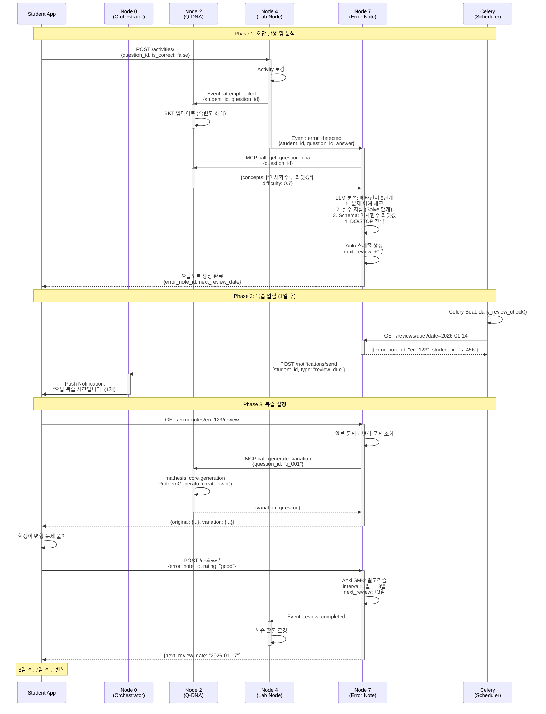

# Use Case 02: 오답 복습 플로우

> 학생이 문제를 틀렸을 때부터 메타인지 분석, Anki 스케줄링, 복습 알림, 변형 문제 생성까지 전체 오답 관리 프로세스

**작성일**: 2026-01-10
**버전**: 1.0
**관련 노드**: Node 0, Node 2, Node 4, Node 7

---

## 📋 시나리오 개요

### 상황 설명

고등학교 1학년 이지은 학생이 수학 문제를 풀던 중 "이차함수의 최댓값 구하기" 문제를 틀렸습니다. 기존 오답노트는 단순히 "틀린 문제"를 기록하는 데 그쳤지만, **Mathesis의 오답 복습 플로우**는 다음과 같은 과학적 프로세스를 자동화합니다:

1. **오답 자동 감지**: Lab Node가 활동 로그에서 `is_correct=false` 감지
2. **메타인지 분석**: 5단계 프레임워크로 "왜 틀렸는지" 구조화 (Node 7)
3. **Anki 스케줄링**: SuperMemo SM-2 알고리즘으로 최적 복습 시점 계산 (예: 1일, 3일, 7일, 14일 후)
4. **복습 알림**: Celery 백그라운드 작업으로 학생에게 푸시 알림 발송
5. **변형 문제 생성**: 복습 시 동일 개념의 유사 문제 자동 생성 (mathesis_core)
6. **복습 결과 반영**: 복습 성공 시 다음 간격 연장, 실패 시 간격 리셋

### 사용자

- **주 사용자**: 학생 (오답노트 작성 및 복습)
- **보조 사용자**: 교사 (학생별 오답 패턴 분석, 공통 오답 파악)

### 목표

1. **망각 곡선 극복**: Anki 간격 반복으로 장기 기억 형성
2. **메타인지 능력 향상**: "실수 지점", "문제 유형 Schema" 분석으로 자기 주도 학습
3. **자동화된 복습 관리**: 학생이 "언제 복습할지" 고민할 필요 없이 알림 수신
4. **변형 문제로 개념 강화**: 동일 문제 반복이 아닌, 유사 문제로 개념 일반화

---

## 🎯 관련 노드

| Node | 역할 | 주요 작업 |
|------|------|----------|
| **Node 0 (Student Hub)** | 워크플로우 조정 | 오답노트 생성 요청, 복습 알림 발송 조정 |
| **Node 2 (Q-DNA)** | 문제 정보 제공 & BKT 업데이트 | 문제 DNA 조회, 변형 문제 생성 시 Twin 요청 |
| **Node 4 (Lab Node)** | 활동 로깅 & 트리거 | 오답 이벤트 발행, 복습 활동 기록 |
| **Node 7 (Error Note)** | 오답 분석 & Anki 관리 | 메타인지 분석, Anki 스케줄링, 변형 문제 생성 |

---

## 📊 데이터 플로우



---

## 🔄 상세 플로우

### Step 1: 오답 자동 감지 및 오답노트 생성

**Trigger**: Lab Node의 활동 로그 `is_correct=false`

**API**: `POST /api/v1/error-notes/` (자동 호출)

**Request**:
```json
{
  "student_id": "student_456",
  "question_id": "q_001",
  "student_answer": "y = (x-1)^2 + 2의 최댓값은 2",
  "correct_answer": "최댓값은 없음 (아래로 볼록)",
  "attempted_at": "2026-01-13T14:30:00Z",
  "time_spent_seconds": 180,
  "metacognition_analysis": {
    "understanding_level": "문제를 이해했음",
    "error_phase": "Solve",
    "error_type": "개념 오류 (이차함수 볼록성 판단 실수)",
    "problem_schema": "이차함수 최댓값/최솟값",
    "prevention_strategy": {
      "do": ["이차항 계수 부호 먼저 확인", "그래프 개형 그려보기"],
      "stop": ["공식만 외우고 적용", "그래프 무시"]
    }
  }
}
```

**Response**:
```json
{
  "error_note_id": "en_123",
  "next_review_date": "2026-01-14T14:30:00Z",
  "anki_interval_days": 1,
  "ease_factor": 2.5,
  "created_at": "2026-01-13T14:31:00Z"
}
```

**비즈니스 로직** (Node 7 내부):
```python
from datetime import datetime, timedelta
from mathesis_core.llm import LLMClient
from mathesis_core.analysis import DNAAnalyzer

async def create_error_note(
    student_id: str,
    question_id: str,
    student_answer: str,
    correct_answer: str
):
    # 1. Node 2에서 문제 DNA 조회
    question_dna = await mcp.call("q-dna", "get_question_dna", {
        "question_id": question_id
    })

    # 2. LLM으로 메타인지 분석 (5단계)
    llm = LLMClient()
    analysis_prompt = f"""
다음 오답을 메타인지 프레임워크로 분석하세요:

문제: {question_dna['content']}
학생 답안: {student_answer}
정답: {correct_answer}

다음 5단계로 구조화:
1. 문제 이해: 학생이 문제를 올바르게 이해했는가?
2. 실수 지점: Read/Plan/Solve/Check 중 어디서 틀렸는가?
3. 문제 유형 Schema: 이 문제의 유형은?
4. 예방 전략: DO (해야 할 것) / STOP (하지 말아야 할 것)

JSON 형식으로 반환:
{{"understanding_level": "...", "error_phase": "...", ...}}
"""

    metacognition = await llm.generate(
        prompt=analysis_prompt,
        model="llama3",
        temperature=0.3,
        response_format="json"
    )

    # 3. Anki 스케줄 초기화 (SuperMemo SM-2)
    anki_params = {
        "interval": 1,  # 첫 복습: 1일 후
        "repetitions": 0,
        "ease_factor": 2.5
    }
    next_review = datetime.now() + timedelta(days=1)

    # 4. DB 저장
    error_note = ErrorNote(
        student_id=student_id,
        question_id=question_id,
        student_answer=student_answer,
        metacognition=metacognition,
        anki_interval=anki_params["interval"],
        ease_factor=anki_params["ease_factor"],
        next_review_date=next_review
    )
    db.add(error_note)
    db.commit()

    # 5. Celery 스케줄 등록
    celery_app.send_task(
        "send_review_notification",
        args=[student_id, error_note.id],
        eta=next_review  # 1일 후 실행
    )

    return error_note
```

---

### Step 2: 복습 알림 발송 (Celery 백그라운드)

**Celery Task**:
```python
from celery import Celery
from datetime import datetime

celery_app = Celery('mathesis', broker='redis://localhost:6379/0')

@celery_app.task
async def send_review_notification(student_id: str, error_note_id: str):
    """복습 시간이 되면 학생에게 푸시 알림 발송"""

    # 1. 학생 정보 조회
    student = await db.query(Student).filter(
        Student.id == student_id
    ).first()

    # 2. 오답노트 정보 조회
    error_note = await db.query(ErrorNote).filter(
        ErrorNote.id == error_note_id
    ).first()

    # 3. Push 알림 발송
    await notification_service.send_push(
        user_id=student_id,
        title="오답 복습 시간입니다!",
        body=f"'{error_note.problem_schema}' 문제를 복습하세요.",
        data={
            "type": "review_due",
            "error_note_id": error_note_id,
            "deep_link": f"mathesis://error-notes/{error_note_id}/review"
        }
    )

    # 4. 이메일 알림 (학부모 CC)
    if student.parent_email:
        await email_service.send(
            to=student.parent_email,
            subject=f"[Mathesis] {student.name} 학생의 복습 알림",
            template="review_notification",
            context={
                "student_name": student.name,
                "problem_schema": error_note.problem_schema,
                "review_url": f"https://mathesis.ai/reviews/{error_note_id}"
            }
        )

    logger.info(f"Review notification sent: {student_id} - {error_note_id}")
```

**Celery Beat 스케줄** (`celerybeat-schedule.py`):
```python
from celery.schedules import crontab

celery_app.conf.beat_schedule = {
    'check-due-reviews-every-hour': {
        'task': 'check_due_reviews',
        'schedule': crontab(minute=0),  # 매 시간 정각
    },
}

@celery_app.task
async def check_due_reviews():
    """오늘 복습할 오답노트 조회 후 알림 발송"""
    now = datetime.now()

    # 1. 오늘 복습 대상 조회
    due_reviews = await db.query(ErrorNote).filter(
        ErrorNote.next_review_date <= now,
        ErrorNote.is_mastered == False
    ).all()

    # 2. 각 오답노트마다 알림 발송
    for review in due_reviews:
        await send_review_notification.delay(
            review.student_id,
            review.id
        )

    logger.info(f"Processed {len(due_reviews)} due reviews")
```

---

### Step 3: 복습 실행 및 변형 문제 생성

**API**: `GET /api/v1/error-notes/{error_note_id}/review`

**Response**:
```json
{
  "error_note_id": "en_123",
  "original_question": {
    "question_id": "q_001",
    "content": "이차함수 y = (x-1)^2 + 2의 최댓값을 구하시오.",
    "correct_answer": "최댓값은 없음 (위로 볼록 아님)"
  },
  "variation_question": {
    "question_id": "q_twin_001",
    "content": "이차함수 y = -(x+2)^2 + 5의 최댓값을 구하시오.",
    "hint": "이차항 계수의 부호를 먼저 확인하세요."
  },
  "metacognition": {
    "error_phase": "Solve",
    "prevention_strategy": {
      "do": ["이차항 계수 부호 먼저 확인", "그래프 개형 그려보기"]
    }
  },
  "review_history": [
    {
      "reviewed_at": "2026-01-14T14:30:00Z",
      "rating": "good",
      "next_interval_days": 3
    }
  ]
}
```

**비즈니스 로직** (Node 7 - 변형 문제 생성):
```python
from mathesis_core.generation import ProblemGenerator

async def get_review_material(error_note_id: str):
    # 1. 오답노트 조회
    error_note = await db.query(ErrorNote).filter(
        ErrorNote.id == error_note_id
    ).first()

    # 2. 원본 문제 조회 (Node 2)
    original_question = await mcp.call("q-dna", "get_question", {
        "question_id": error_note.question_id
    })

    # 3. 변형 문제 생성 (mathesis_core)
    generator = ProblemGenerator()
    variation = await generator.create_twin(
        original_question=original_question["content"],
        dna={
            "concepts": original_question["concept_tags"],
            "difficulty": original_question["difficulty"],
            "type": original_question["type"]
        },
        variation_type="similar_concept"
    )

    return {
        "original_question": original_question,
        "variation_question": variation,
        "metacognition": error_note.metacognition,
        "review_history": error_note.review_history
    }
```

---

### Step 4: 복습 결과 제출 및 Anki 업데이트

**API**: `POST /api/v1/reviews/`

**Request**:
```json
{
  "error_note_id": "en_123",
  "rating": "good",
  "time_spent_seconds": 120,
  "variation_answer": "최댓값은 5 (이차항 계수가 음수이므로 위로 볼록)",
  "is_correct": true
}
```

**Response**:
```json
{
  "review_id": "rv_456",
  "anki_updated": true,
  "previous_interval_days": 1,
  "new_interval_days": 3,
  "next_review_date": "2026-01-17T14:30:00Z",
  "ease_factor": 2.6,
  "is_mastered": false
}
```

**비즈니스 로직** (Node 7 - Anki SM-2 알고리즘):
```python
def calculate_next_anki_interval(
    current_interval: int,
    ease_factor: float,
    rating: str,  # "again", "hard", "good", "easy"
    repetitions: int
) -> dict:
    """
    SuperMemo SM-2 알고리즘 구현

    rating:
    - "again": 완전히 틀림 → 간격 리셋
    - "hard": 어렵게 맞춤 → 간격 1.2배
    - "good": 정상적으로 맞춤 → 간격 2.5배
    - "easy": 쉽게 맞춤 → 간격 2.5배 + ease_factor 증가
    """

    if rating == "again":
        # 틀렸을 경우: 처음부터 다시
        new_interval = 1
        new_ease_factor = max(1.3, ease_factor - 0.2)
        new_repetitions = 0

    elif rating == "hard":
        # 어렵게 맞춤: 간격 조금만 증가
        new_interval = int(current_interval * 1.2)
        new_ease_factor = max(1.3, ease_factor - 0.15)
        new_repetitions = repetitions + 1

    elif rating == "good":
        # 정상적으로 맞춤: 표준 간격
        if repetitions == 0:
            new_interval = 1
        elif repetitions == 1:
            new_interval = 3
        else:
            new_interval = int(current_interval * ease_factor)
        new_ease_factor = ease_factor
        new_repetitions = repetitions + 1

    elif rating == "easy":
        # 쉽게 맞춤: 간격 크게 증가 + ease_factor 향상
        if repetitions == 0:
            new_interval = 3
        else:
            new_interval = int(current_interval * ease_factor * 1.3)
        new_ease_factor = ease_factor + 0.15
        new_repetitions = repetitions + 1

    # 숙련도 판정 (5회 이상 복습 + 간격 30일 이상)
    is_mastered = (new_repetitions >= 5 and new_interval >= 30)

    return {
        "interval": new_interval,
        "ease_factor": new_ease_factor,
        "repetitions": new_repetitions,
        "is_mastered": is_mastered,
        "next_review_date": datetime.now() + timedelta(days=new_interval)
    }

async def submit_review(
    error_note_id: str,
    rating: str,
    is_correct: bool
):
    # 1. 오답노트 조회
    error_note = await db.query(ErrorNote).filter(
        ErrorNote.id == error_note_id
    ).first()

    # 2. Anki 간격 재계산
    anki_result = calculate_next_anki_interval(
        current_interval=error_note.anki_interval,
        ease_factor=error_note.ease_factor,
        rating=rating if is_correct else "again",
        repetitions=error_note.repetitions
    )

    # 3. 오답노트 업데이트
    error_note.anki_interval = anki_result["interval"]
    error_note.ease_factor = anki_result["ease_factor"]
    error_note.repetitions = anki_result["repetitions"]
    error_note.next_review_date = anki_result["next_review_date"]
    error_note.is_mastered = anki_result["is_mastered"]
    db.commit()

    # 4. 복습 이력 기록
    review_log = ReviewLog(
        error_note_id=error_note_id,
        rating=rating,
        is_correct=is_correct,
        reviewed_at=datetime.now()
    )
    db.add(review_log)
    db.commit()

    # 5. 다음 복습 알림 스케줄링
    if not anki_result["is_mastered"]:
        celery_app.send_task(
            "send_review_notification",
            args=[error_note.student_id, error_note.id],
            eta=anki_result["next_review_date"]
        )

    return anki_result
```

---

## 💻 코드 예시

### Frontend - 복습 인터페이스

```tsx
import React, { useState, useEffect } from 'react';
import { useParams } from 'react-router-dom';
import { api } from '@/lib/api';

interface ReviewMaterial {
  error_note_id: string;
  original_question: any;
  variation_question: any;
  metacognition: any;
}

export const ErrorReviewPage: React.FC = () => {
  const { errorNoteId } = useParams();
  const [material, setMaterial] = useState<ReviewMaterial | null>(null);
  const [answer, setAnswer] = useState('');
  const [showOriginal, setShowOriginal] = useState(false);

  useEffect(() => {
    const fetchReviewMaterial = async () => {
      const response = await api.get(
        `/error-notes/${errorNoteId}/review`
      );
      setMaterial(response.data);
    };

    fetchReviewMaterial();
  }, [errorNoteId]);

  const handleSubmit = async (rating: string) => {
    const response = await api.post('/reviews/', {
      error_note_id: errorNoteId,
      rating,
      variation_answer: answer,
      time_spent_seconds: 120
    });

    // 다음 복습 시점 안내
    const nextDate = new Date(response.data.next_review_date);
    alert(
      `다음 복습: ${nextDate.toLocaleDateString()} ` +
      `(${response.data.new_interval_days}일 후)`
    );

    // 복습 목록으로 이동
    window.location.href = '/reviews';
  };

  if (!material) return <div>로딩 중...</div>;

  return (
    <div className="container mx-auto p-8">
      <h2 className="text-2xl font-bold mb-4">오답 복습</h2>

      {/* 메타인지 분석 표시 */}
      <div className="bg-yellow-50 p-4 rounded mb-6">
        <h3 className="font-bold mb-2">이전 분석 결과</h3>
        <ul className="list-disc list-inside">
          <li>실수 지점: {material.metacognition.error_phase}</li>
          <li>문제 유형: {material.metacognition.problem_schema}</li>
        </ul>
        <div className="mt-2">
          <strong>DO:</strong>
          <ul className="list-disc list-inside ml-4">
            {material.metacognition.prevention_strategy.do.map(
              (item: string) => <li key={item}>{item}</li>
            )}
          </ul>
        </div>
      </div>

      {/* 변형 문제 */}
      <div className="bg-white rounded shadow p-6 mb-4">
        <h3 className="font-bold mb-4">변형 문제</h3>
        <p className="text-lg mb-4">
          {material.variation_question.content}
        </p>
        {material.variation_question.hint && (
          <div className="bg-blue-50 p-3 rounded mb-4">
            <strong>힌트:</strong> {material.variation_question.hint}
          </div>
        )}
        <textarea
          className="w-full border rounded p-4 mb-4"
          rows={3}
          value={answer}
          onChange={(e) => setAnswer(e.target.value)}
          placeholder="답안을 입력하세요..."
        />
      </div>

      {/* 원본 문제 보기 (토글) */}
      <button
        className="btn btn-secondary mb-4"
        onClick={() => setShowOriginal(!showOriginal)}
      >
        {showOriginal ? '원본 문제 숨기기' : '원본 문제 보기'}
      </button>

      {showOriginal && (
        <div className="bg-gray-50 p-4 rounded mb-4">
          <h4 className="font-bold">원본 문제</h4>
          <p>{material.original_question.content}</p>
          <p className="text-green-600 mt-2">
            정답: {material.original_question.correct_answer}
          </p>
        </div>
      )}

      {/* 복습 결과 평가 버튼 */}
      <div className="flex gap-4">
        <button
          className="btn btn-error"
          onClick={() => handleSubmit('again')}
        >
          다시 틀림
        </button>
        <button
          className="btn btn-warning"
          onClick={() => handleSubmit('hard')}
        >
          어렵게 맞춤
        </button>
        <button
          className="btn btn-success"
          onClick={() => handleSubmit('good')}
        >
          정상적으로 맞춤
        </button>
        <button
          className="btn btn-primary"
          onClick={() => handleSubmit('easy')}
        >
          쉽게 맞춤
        </button>
      </div>
    </div>
  );
};
```

---

## 📈 기대 효과

### 교육적 효과

1. **장기 기억 형성**
   - Ebbinghaus 망각 곡선 극복: 최적 시점 복습으로 기억 강화
   - 5회 복습 후 간격 30일 → 장기 기억 전환

2. **메타인지 능력 향상**
   - "왜 틀렸는지" 5단계 구조화 → 자기 주도 학습 능력
   - DO/STOP 전략으로 실수 예방 습관 형성

3. **개념 일반화**
   - 변형 문제로 "특정 문제 암기"가 아닌 "개념 이해" 유도
   - Twin 문제로 다양한 상황 적용 능력 배양

4. **학습 동기 유지**
   - "복습할 것이 쌓여있다" 부담감 해소 → 자동 스케줄링
   - 복습 성공 시 간격 연장 → 성취감

### 시스템 효율성

1. **자동화된 복습 관리**
   - Celery로 알림 자동 발송 → 교사/학부모 개입 불필요
   - Anki 알고리즘으로 최적 간격 자동 계산

2. **LLM 활용 효율성**
   - mathesis_core.generation으로 변형 문제 즉시 생성
   - 메타인지 분석 자동화 → 교사의 피드백 시간 절감

3. **데이터 기반 개입**
   - 오답 패턴 분석으로 공통 약점 파악
   - 클래스 전체 오답 히트맵 → 수업 개선

4. **확장성**
   - MSA 구조로 대규모 사용자 대응
   - Celery 워커 수평 확장으로 알림 처리량 증가

---

**Last Updated**: 2026-01-10
**Contributors**: Claude Sonnet 4.5
