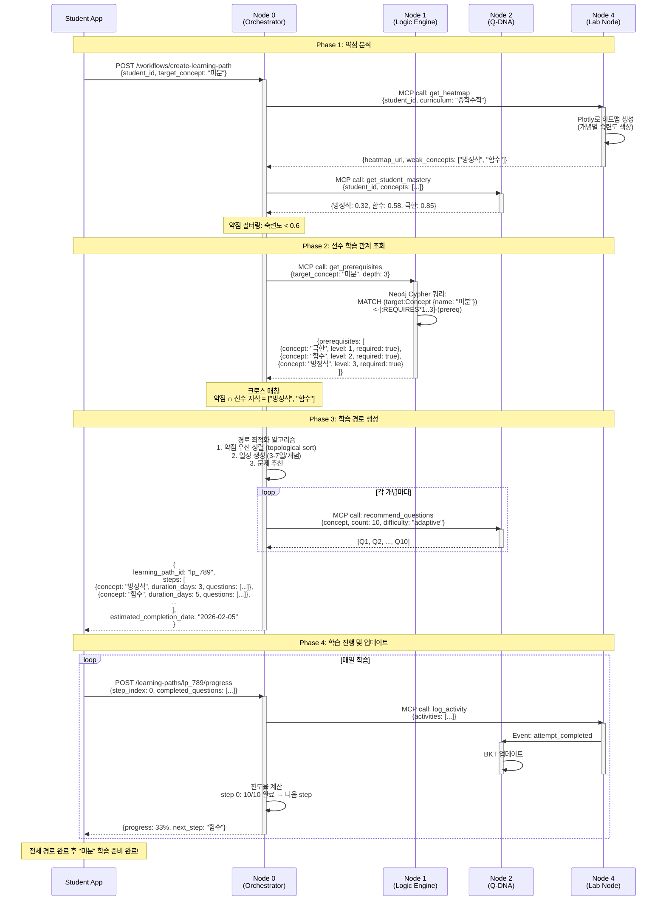

# Use Case 03: 개인화 학습 경로

> 학생의 약점을 히트맵으로 분석하고, 교육 이론을 기반으로 맞춤형 학습 경로를 자동 생성하는 AI 튜터 시스템

**작성일**: 2026-01-10
**버전**: 1.0
**관련 노드**: Node 0, Node 1, Node 2, Node 4

---

## 📋 시나리오 개요

### 상황 설명

중학교 3학년 박준호 학생은 중간고사에서 수학 점수가 낮게 나왔습니다. "미분" 단원을 배우기 전에, **Mathesis 플랫폼**은 다음과 같은 과정으로 개인화된 학습 경로를 자동 생성합니다:

1. **히트맵 분석**: Lab Node가 개념별 숙련도를 색상 맵으로 시각화
   - 🟢 녹색: 극한 (숙련도 0.85) ✅ 잘 이해
   - 🟡 노란색: 함수 (숙련도 0.58) ⚠️ 보통
   - 🔴 빨간색: 방정식 (숙련도 0.32) ❌ 약함

2. **약점 탐지**: BKT 숙련도 < 0.6인 개념 자동 식별
   - "방정식", "함수" 개념이 약함

3. **교육 이론 적용**: Logic Engine (Node 1)에서 선수 학습 관계 조회
   - "미분을 배우려면 → 함수 → 방정식 순서로 선행 학습 필요"

4. **학습 경로 생성**: Node 0 Orchestrator가 최적 경로 생성
   ```
   방정식 기초 (3일) → 일차함수 (5일) → 이차함수 (7일) → 극한 복습 (2일) → 미분 준비 완료
   ```

5. **문제 자동 배정**: 각 단계마다 IRT 기반 문제 10개 자동 추천

### 사용자

- **주 사용자**: 학생 (자기 주도 학습)
- **보조 사용자**: 교사 (학습 경로 커스터마이징), 학부모 (진도 모니터링)

### 목표

1. **학습 결손 방지**: 선수 지식 부족을 조기 발견 → 체계적 보완
2. **효율적 학습 경로**: 교육 이론 기반 최적 순서 → 시간 절약
3. **맞춤형 난이도**: IRT로 학생 수준에 맞는 문제만 제공 → 좌절감 감소
4. **시각적 진행 상황**: 히트맵으로 성장 추적 → 동기 부여

---

## 🎯 관련 노드

| Node | 역할 | 주요 작업 |
|------|------|----------|
| **Node 0 (Student Hub)** | 학습 경로 오케스트레이션 | 히트맵 조회, 경로 생성, 진도 관리 |
| **Node 1 (Logic Engine)** | 교육 이론 지식 그래프 | 선수 학습 관계, 개념 의존성 조회 (Neo4j) |
| **Node 2 (Q-DNA)** | 문제 추천 & BKT 추적 | 숙련도 조회, IRT 기반 문제 추천 |
| **Node 4 (Lab Node)** | 히트맵 생성 & 활동 로깅 | 개념별 숙련도 시각화, 약점 탐지 |

---

## 📊 데이터 플로우



---

## 🔄 상세 플로우

### Step 1: 학습 경로 생성 요청

**API**: `POST /api/v1/workflows/create-learning-path`

**Request**:
```json
{
  "student_id": "student_789",
  "target_concept": "미분",
  "curriculum_path": "중학수학.3학년",
  "deadline": "2026-02-05",
  "daily_study_minutes": 30
}
```

**Response**:
```json
{
  "learning_path_id": "lp_123",
  "target_concept": "미분",
  "weak_concepts_detected": ["방정식", "함수"],
  "steps": [
    {
      "step_index": 0,
      "concept": "방정식 기초",
      "current_mastery": 0.32,
      "target_mastery": 0.7,
      "duration_days": 3,
      "questions_count": 10,
      "estimated_time_minutes": 90
    },
    {
      "step_index": 1,
      "concept": "일차함수",
      "current_mastery": 0.58,
      "target_mastery": 0.75,
      "duration_days": 5,
      "questions_count": 15,
      "estimated_time_minutes": 150
    },
    {
      "step_index": 2,
      "concept": "이차함수",
      "current_mastery": 0.58,
      "target_mastery": 0.8,
      "duration_days": 7,
      "questions_count": 20,
      "estimated_time_minutes": 210
    },
    {
      "step_index": 3,
      "concept": "극한 복습",
      "current_mastery": 0.85,
      "target_mastery": 0.9,
      "duration_days": 2,
      "questions_count": 5,
      "estimated_time_minutes": 60
    }
  ],
  "total_duration_days": 17,
  "estimated_completion_date": "2026-01-30",
  "heatmap_url": "https://s3.mathesis.ai/heatmaps/student_789.png",
  "created_at": "2026-01-13T10:00:00Z"
}
```

**비즈니스 로직** (Node 0 내부):
```python
from typing import List, Dict
from datetime import datetime, timedelta

async def create_learning_path(
    student_id: str,
    target_concept: str,
    daily_study_minutes: int = 30
) -> Dict:
    mcp = MCPClientManager()

    # 1. 히트맵 조회 (Lab Node)
    heatmap = await mcp.call("lab-node", "get_heatmap", {
        "student_id": student_id,
        "curriculum": "중학수학"
    })

    # 2. BKT 숙련도 조회 (Q-DNA)
    mastery = await mcp.call("q-dna", "get_student_mastery", {
        "student_id": student_id,
        "skill_ids": heatmap["concepts"]
    })

    # 3. 약점 필터링 (threshold < 0.6)
    weak_concepts = {
        concept: score
        for concept, score in mastery.items()
        if score < 0.6
    }

    # 4. 선수 학습 관계 조회 (Logic Engine)
    prerequisites = await mcp.call("logic-engine", "get_prerequisites", {
        "target_concept": target_concept,
        "depth": 3
    })

    # 5. 학습 경로 생성 (위상 정렬)
    learning_steps = generate_optimal_path(
        weak_concepts=weak_concepts,
        prerequisites=prerequisites,
        target_concept=target_concept
    )

    # 6. 각 단계별 문제 추천
    for step in learning_steps:
        questions = await mcp.call("q-dna", "recommend_questions", {
            "student_id": student_id,
            "concept": step["concept"],
            "count": step["questions_count"],
            "difficulty": "adaptive"
        })
        step["questions"] = questions

    # 7. 일정 계산
    total_days = sum(step["duration_days"] for step in learning_steps)
    estimated_completion = datetime.now() + timedelta(days=total_days)

    # 8. DB 저장
    learning_path = LearningPath(
        student_id=student_id,
        target_concept=target_concept,
        steps=learning_steps,
        estimated_completion_date=estimated_completion
    )
    db.add(learning_path)
    db.commit()

    return learning_path


def generate_optimal_path(
    weak_concepts: Dict[str, float],
    prerequisites: List[Dict],
    target_concept: str
) -> List[Dict]:
    """
    위상 정렬로 학습 경로 생성

    1. 선수 지식 관계를 DAG로 구성
    2. 약점 개념을 우선순위로 정렬
    3. 각 개념별 학습 시간 추정
    """
    from collections import defaultdict, deque

    # 1. DAG 구성 (개념 → 선수 지식)
    graph = defaultdict(list)
    in_degree = defaultdict(int)

    for prereq in prerequisites:
        # "미분" ← "극한" ← "함수" ← "방정식"
        if prereq["level"] > 1:
            prev_prereq = next(
                p for p in prerequisites
                if p["level"] == prereq["level"] - 1
            )
            graph[prereq["concept"]].append(prev_prereq["concept"])
            in_degree[prev_prereq["concept"]] += 1

    # 2. 위상 정렬 (Kahn's algorithm)
    queue = deque([
        concept for concept in weak_concepts
        if in_degree[concept] == 0
    ])

    sorted_concepts = []
    while queue:
        concept = queue.popleft()
        sorted_concepts.append(concept)

        for neighbor in graph[concept]:
            in_degree[neighbor] -= 1
            if in_degree[neighbor] == 0:
                queue.append(neighbor)

    # 3. 학습 시간 추정 (숙련도 갭에 비례)
    steps = []
    for i, concept in enumerate(sorted_concepts):
        current_mastery = weak_concepts.get(concept, 0.5)
        target_mastery = 0.7 + (i * 0.05)  # 단계별로 목표 상향

        # 숙련도 갭이 클수록 더 많은 시간 할당
        mastery_gap = target_mastery - current_mastery
        duration_days = max(3, int(mastery_gap * 15))  # 0.1 갭당 1.5일
        questions_count = duration_days * 3  # 하루 3문제

        steps.append({
            "step_index": i,
            "concept": concept,
            "current_mastery": current_mastery,
            "target_mastery": target_mastery,
            "duration_days": duration_days,
            "questions_count": questions_count
        })

    return steps
```

---

### Step 2: 히트맵 생성 (Lab Node)

**API**: `GET /api/v1/heatmaps/curriculum/{student_id}`

**Response**:
```json
{
  "heatmap_url": "https://s3.mathesis.ai/heatmaps/student_789.png",
  "concepts": [
    {
      "name": "방정식",
      "mastery": 0.32,
      "color": "#FF4444",
      "status": "weak"
    },
    {
      "name": "함수",
      "mastery": 0.58,
      "color": "#FFAA44",
      "status": "moderate"
    },
    {
      "name": "극한",
      "mastery": 0.85,
      "color": "#44FF44",
      "status": "strong"
    }
  ],
  "weak_concepts": ["방정식", "함수"],
  "generated_at": "2026-01-13T10:01:00Z"
}
```

**비즈니스 로직** (Node 4 - Plotly 히트맵):
```python
import plotly.graph_objects as go
from pathlib import Path

async def generate_curriculum_heatmap(
    student_id: str,
    curriculum_path: str
) -> Dict:
    # 1. 교육과정 트리 조회
    curriculum_tree = await get_curriculum_tree(curriculum_path)

    # 2. 각 개념별 BKT 숙련도 조회 (Node 2)
    concepts = [node["name"] for node in curriculum_tree]
    mastery_data = await mcp.call("q-dna", "get_student_mastery", {
        "student_id": student_id,
        "skill_ids": concepts
    })

    # 3. 히트맵 데이터 구성
    concepts_list = []
    mastery_scores = []
    colors = []

    for concept in concepts:
        score = mastery_data.get(concept, 0.0)
        concepts_list.append(concept)
        mastery_scores.append(score)

        # 색상 매핑 (0-0.4: 빨강, 0.4-0.7: 노랑, 0.7-1.0: 초록)
        if score < 0.4:
            colors.append("#FF4444")  # 빨강
            status = "weak"
        elif score < 0.7:
            colors.append("#FFAA44")  # 노랑
            status = "moderate"
        else:
            colors.append("#44FF44")  # 초록
            status = "strong"

    # 4. Plotly 히트맵 생성
    fig = go.Figure(data=go.Heatmap(
        z=[mastery_scores],
        x=concepts_list,
        y=["숙련도"],
        colorscale=[
            [0, "#FF4444"],      # 0.0: 빨강
            [0.4, "#FFAA44"],    # 0.4: 노랑
            [0.7, "#FFFF44"],    # 0.7: 연두
            [1.0, "#44FF44"]     # 1.0: 초록
        ],
        zmin=0,
        zmax=1,
        text=[[f"{score:.2f}" for score in mastery_scores]],
        texttemplate="%{text}",
        textfont={"size": 10}
    ))

    fig.update_layout(
        title=f"개념별 숙련도 히트맵 - {student_id}",
        xaxis_title="개념",
        yaxis_title="",
        width=1200,
        height=300
    )

    # 5. 이미지 저장 및 S3 업로드
    img_path = f"/tmp/heatmap_{student_id}.png"
    fig.write_image(img_path)

    s3_url = await upload_to_s3(
        img_path,
        bucket="mathesis-heatmaps",
        key=f"students/{student_id}/curriculum.png"
    )

    # 6. 약점 개념 식별
    weak_concepts = [
        concept for concept, score in mastery_data.items()
        if score < 0.6
    ]

    return {
        "heatmap_url": s3_url,
        "concepts": [
            {
                "name": concept,
                "mastery": mastery_data[concept],
                "color": colors[i],
                "status": "weak" if mastery_data[concept] < 0.4
                         else "moderate" if mastery_data[concept] < 0.7
                         else "strong"
            }
            for i, concept in enumerate(concepts_list)
        ],
        "weak_concepts": weak_concepts
    }
```

---

### Step 3: 선수 학습 관계 조회 (Logic Engine)

**API** (MCP Tool): `get_prerequisites`

**Input**:
```json
{
  "target_concept": "미분",
  "depth": 3,
  "curriculum": "고등수학"
}
```

**Output**:
```json
{
  "target_concept": "미분",
  "prerequisites": [
    {
      "concept": "극한",
      "level": 1,
      "required": true,
      "relationship": "REQUIRES"
    },
    {
      "concept": "함수",
      "level": 2,
      "required": true,
      "relationship": "REQUIRES"
    },
    {
      "concept": "방정식",
      "level": 3,
      "required": false,
      "relationship": "HELPS"
    }
  ],
  "knowledge_graph_url": "https://s3.mathesis.ai/graphs/differential.png"
}
```

**비즈니스 로직** (Node 1 - Neo4j 쿼리):
```python
from neo4j import GraphDatabase

async def get_prerequisites(
    target_concept: str,
    depth: int = 3
) -> Dict:
    driver = GraphDatabase.driver(
        "bolt://localhost:7687",
        auth=("neo4j", "password")
    )

    # Neo4j Cypher 쿼리 (BFS로 선수 지식 탐색)
    query = """
    MATCH path = (target:Concept {name: $target_concept})
                 <-[:REQUIRES|HELPS*1..$depth]-(prereq:Concept)
    RETURN prereq.name AS concept,
           length(path) AS level,
           last(relationships(path)).type AS relationship
    ORDER BY level ASC
    """

    with driver.session() as session:
        result = session.run(query, {
            "target_concept": target_concept,
            "depth": depth
        })

        prerequisites = [
            {
                "concept": record["concept"],
                "level": record["level"],
                "required": record["relationship"] == "REQUIRES",
                "relationship": record["relationship"]
            }
            for record in result
        ]

    driver.close()

    return {
        "target_concept": target_concept,
        "prerequisites": prerequisites
    }
```

---

### Step 4: 학습 진행 업데이트

**API**: `POST /api/v1/learning-paths/{learning_path_id}/progress`

**Request**:
```json
{
  "step_index": 0,
  "completed_questions": [
    {"question_id": "q_001", "is_correct": true, "time_spent": 120},
    {"question_id": "q_002", "is_correct": true, "time_spent": 95},
    {"question_id": "q_003", "is_correct": false, "time_spent": 180}
  ]
}
```

**Response**:
```json
{
  "learning_path_id": "lp_123",
  "current_step": {
    "step_index": 0,
    "concept": "방정식 기초",
    "progress": "3/10",
    "progress_percentage": 30,
    "current_mastery": 0.38,
    "target_mastery": 0.7
  },
  "step_completed": false,
  "next_step": null,
  "overall_progress_percentage": 10,
  "updated_at": "2026-01-13T15:00:00Z"
}
```

---

## 💻 코드 예시

### Frontend - 학습 경로 대시보드

```tsx
import React, { useState, useEffect } from 'react';
import { useParams } from 'react-router-dom';
import { api } from '@/lib/api';

interface LearningPathStep {
  step_index: number;
  concept: string;
  current_mastery: number;
  target_mastery: number;
  duration_days: number;
  questions_count: number;
  completed: boolean;
}

export const LearningPathDashboard: React.FC = () => {
  const { pathId } = useParams();
  const [path, setPath] = useState<any>(null);
  const [currentStep, setCurrentStep] = useState<LearningPathStep | null>(null);

  useEffect(() => {
    const fetchPath = async () => {
      const response = await api.get(`/learning-paths/${pathId}`);
      setPath(response.data);
      setCurrentStep(
        response.data.steps.find((s: LearningPathStep) => !s.completed)
      );
    };

    fetchPath();
  }, [pathId]);

  if (!path) return <div>로딩 중...</div>;

  return (
    <div className="container mx-auto p-8">
      <div className="mb-6">
        <h2 className="text-3xl font-bold mb-2">
          학습 목표: {path.target_concept}
        </h2>
        <div className="flex gap-4 text-sm text-gray-600">
          <span>예상 완료: {path.estimated_completion_date}</span>
          <span>전체 진행률: {path.overall_progress}%</span>
        </div>
      </div>

      {/* 히트맵 */}
      <div className="bg-white rounded shadow p-4 mb-6">
        <h3 className="font-bold mb-4">현재 숙련도 히트맵</h3>
        
      </div>

      {/* 학습 경로 단계 */}
      <div className="space-y-4">
        {path.steps.map((step: LearningPathStep, index: number) => (
          <div
            key={index}
            className={`
              border rounded-lg p-6
              ${step.completed ? 'bg-green-50' : ''}
              ${currentStep?.step_index === index ? 'border-blue-500 border-2' : ''}
            `}
          >
            <div className="flex justify-between items-center mb-4">
              <div>
                <h4 className="text-xl font-bold">
                  {index + 1}. {step.concept}
                </h4>
                <span className="text-sm text-gray-600">
                  예상 {step.duration_days}일 ({step.questions_count}문제)
                </span>
              </div>
              <div>
                {step.completed ? (
                  <span className="badge badge-success">완료</span>
                ) : currentStep?.step_index === index ? (
                  <span className="badge badge-primary">진행 중</span>
                ) : (
                  <span className="badge badge-secondary">대기</span>
                )}
              </div>
            </div>

            {/* 숙련도 진행바 */}
            <div className="mb-4">
              <div className="flex justify-between text-sm mb-1">
                <span>현재 숙련도: {(step.current_mastery * 100).toFixed(0)}%</span>
                <span>목표: {(step.target_mastery * 100).toFixed(0)}%</span>
              </div>
              <div className="w-full bg-gray-200 rounded-full h-4">
                <div
                  className="bg-blue-500 h-4 rounded-full"
                  style={{
                    width: `${(step.current_mastery / step.target_mastery) * 100}%`
                  }}
                />
              </div>
            </div>

            {currentStep?.step_index === index && (
              <button
                className="btn btn-primary w-full"
                onClick={() => {
                  window.location.href = `/learning-paths/${pathId}/step/${index}`;
                }}
              >
                계속 학습하기
              </button>
            )}
          </div>
        ))}
      </div>
    </div>
  );
};
```

---

## 📈 기대 효과

### 교육적 효과

1. **체계적 학습 경로**
   - 교육 이론 기반 선수 학습 관계 → 학습 결손 방지
   - 위상 정렬로 최적 순서 자동 계산 → 효율성 극대화

2. **개인화된 난이도**
   - IRT 알고리즘으로 학생 수준 맞춤 문제 → 적절한 도전감
   - 숙련도 갭에 따라 학습 시간 자동 조정 → 과부하 방지

3. **시각적 피드백**
   - 히트맵으로 약점 직관적 파악 → 메타인지 향상
   - 진행률 실시간 업데이트 → 성취감 및 동기 부여

4. **자기 주도 학습**
   - "무엇을 공부해야 할지" 고민 불필요 → 학습 시간 집중
   - 목표 개념까지의 명확한 로드맵 → 방향성 확보

### 시스템 효율성

1. **자동화된 경로 생성**
   - Neo4j 지식 그래프로 선수 관계 자동 조회
   - 교사가 수동으로 경로 설계할 필요 없음

2. **데이터 기반 의사결정**
   - BKT 숙련도 기반 약점 탐지 → 객관적 진단
   - 히트맵으로 학급 전체 약점 파악 → 수업 계획 개선

3. **확장 가능한 아키텍처**
   - MSA 구조로 각 노드 독립 확장
   - Neo4j로 대규모 지식 그래프 관리

4. **비용 절감**
   - Ollama 로컬 LLM으로 외부 API 비용 절감
   - 자동화로 교사의 개입 시간 절약

---

**Last Updated**: 2026-01-10
**Contributors**: Claude Sonnet 4.5
