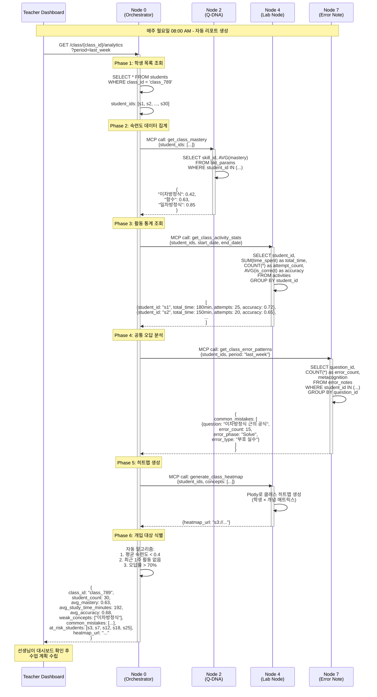

# Use Case 04: 클래스 관리 (선생님 관점)

> 선생님이 반 전체 학생의 학습 현황을 실시간으로 파악하고, 공통 약점 기반 수업 계획을 수립하는 교사 대시보드

**작성일**: 2026-01-10
**버전**: 1.0
**관련 노드**: Node 0, Node 2, Node 4, Node 7

---

## 📋 시나리오 개요

### 상황 설명

김선생님은 중학교 2학년 3반(30명)을 담당하고 있습니다. 매주 월요일 출근 후 **Mathesis 교사 대시보드**에 접속하면, 다음과 같은 통합 정보를 한눈에 확인할 수 있습니다:

1. **클래스 전체 히트맵**
   - 30명 학생의 개념별 평균 숙련도를 색상으로 시각화
   - 🔴 빨간색: "이차방정식" (평균 0.42) → 클래스 공통 약점 발견
   - 🟡 노란색: "함수" (평균 0.63)
   - 🟢 녹색: "일차방정식" (평균 0.85)

2. **학생별 학습 활동 요약**
   - 지난주 학습 시간: 평균 3.2시간 (목표: 4시간)
   - 문제 풀이 수: 평균 25문제
   - 정답률: 평균 68%

3. **공통 오답 분석**
   - "이차방정식의 근의 공식" 문제를 15명(50%)이 틀림
   - Node 7 (Error Note)에서 메타인지 분석 결과 집계:
     - 실수 지점: "Solve 단계" (70%)
     - 오류 유형: "부호 실수" (45%)

4. **개입 대상 학생**
   - 자동 알고리즘이 "학습 부진" 학생 5명 식별
   - 기준: 평균 숙련도 < 0.4 OR 최근 1주간 활동 없음

이 정보를 바탕으로 선생님은:
- 이번 주 수업에서 "이차방정식 근의 공식" 집중 강의
- 학습 부진 학생 5명에게 개별 상담 요청
- 전체 학생에게 "부호 실수 방지 체크리스트" 배포

### 사용자

- **주 사용자**: 교사 (클래스 관리, 수업 계획)
- **보조 사용자**: 학교 관리자 (학년/학교 단위 통계)

### 목표

1. **데이터 기반 수업 계획**: 학생들의 실제 약점에 맞춘 커리큘럼
2. **조기 개입**: 학습 부진 학생을 자동 탐지 → 학습 격차 해소
3. **효율적 피드백**: 공통 오답 패턴 파악 → 일괄 피드백 제공
4. **시간 절약**: 수동 집계 불필요 → 교수 활동에 집중

---

## 🎯 관련 노드

| Node | 역할 | 주요 작업 |
|------|------|----------|
| **Node 0 (Student Hub)** | 클래스 데이터 통합 & 분석 | 학생 목록 조회, 프로필 집계, 개입 대상 식별 |
| **Node 2 (Q-DNA)** | 클래스 평균 숙련도 계산 | BKT 데이터 집계, 공통 약점 개념 추출 |
| **Node 4 (Lab Node)** | 클래스 활동 통계 | 학습 시간, 문제 풀이 수, 히트맵 생성 |
| **Node 7 (Error Note)** | 공통 오답 패턴 분석 | 클래스 전체 오답노트 집계, 메타인지 패턴 추출 |

---

## 📊 데이터 플로우



---

## 🔄 상세 플로우

### Step 1: 클래스 분석 대시보드 조회

**API**: `GET /api/v1/class/{class_id}/analytics`

**Query Parameters**:
```
period=last_week
include_heatmap=true
include_error_patterns=true
include_at_risk_students=true
```

**Response**:
```json
{
  "class_id": "class_789",
  "class_name": "2학년 3반",
  "teacher_id": "teacher_kim",
  "period": {
    "start_date": "2026-01-06",
    "end_date": "2026-01-13"
  },
  "student_count": 30,
  "summary": {
    "avg_mastery": 0.63,
    "avg_study_time_minutes": 192,
    "avg_problem_count": 25,
    "avg_accuracy": 0.68,
    "total_study_hours": 96
  },
  "mastery_by_concept": [
    {
      "concept": "일차방정식",
      "avg_mastery": 0.85,
      "min_mastery": 0.65,
      "max_mastery": 0.98,
      "status": "strong"
    },
    {
      "concept": "함수",
      "avg_mastery": 0.63,
      "min_mastery": 0.35,
      "max_mastery": 0.88,
      "status": "moderate"
    },
    {
      "concept": "이차방정식",
      "avg_mastery": 0.42,
      "min_mastery": 0.15,
      "max_mastery": 0.72,
      "status": "weak"
    }
  ],
  "common_mistakes": [
    {
      "question_id": "q_123",
      "question_content": "이차방정식 x^2 + 5x + 6 = 0의 해를 구하시오.",
      "error_count": 15,
      "error_rate": 0.5,
      "metacognition": {
        "error_phase": "Solve",
        "error_type": "부호 실수",
        "prevention_strategy": "근의 공식 계산 시 (-b) 부호 확인"
      }
    },
    {
      "question_id": "q_456",
      "question_content": "함수 f(x) = 2x + 3의 역함수를 구하시오.",
      "error_count": 12,
      "error_rate": 0.4,
      "metacognition": {
        "error_phase": "Plan",
        "error_type": "개념 혼동 (역함수 정의)",
        "prevention_strategy": "x와 y 교환 후 y로 정리"
      }
    }
  ],
  "at_risk_students": [
    {
      "student_id": "s3",
      "student_name": "김민수",
      "avg_mastery": 0.38,
      "study_time_minutes": 45,
      "accuracy": 0.42,
      "risk_factors": [
        "평균 숙련도 낮음 (0.38 < 0.5)",
        "학습 시간 부족 (45분 < 120분)"
      ]
    },
    {
      "student_id": "s7",
      "student_name": "이지은",
      "avg_mastery": 0.52,
      "study_time_minutes": 0,
      "accuracy": null,
      "risk_factors": [
        "최근 1주간 활동 없음"
      ]
    }
  ],
  "heatmap_url": "https://s3.mathesis.ai/heatmaps/class_789_weekly.png",
  "generated_at": "2026-01-13T08:00:00Z"
}
```

**비즈니스 로직** (Node 0 내부):
```python
from datetime import datetime, timedelta
from typing import List, Dict

async def get_class_analytics(
    class_id: str,
    period: str = "last_week"
) -> Dict:
    mcp = MCPClientManager()

    # 1. 기간 설정
    if period == "last_week":
        end_date = datetime.now()
        start_date = end_date - timedelta(days=7)
    elif period == "last_month":
        end_date = datetime.now()
        start_date = end_date - timedelta(days=30)

    # 2. 클래스 학생 목록 조회
    students = await db.query(Student).filter(
        Student.class_id == class_id
    ).all()
    student_ids = [s.id for s in students]

    # 3. Node 2: 클래스 평균 숙련도
    class_mastery = await mcp.call("q-dna", "get_class_mastery", {
        "student_ids": student_ids
    })

    # 4. Node 4: 활동 통계
    activity_stats = await mcp.call("lab-node", "get_class_activity_stats", {
        "student_ids": student_ids,
        "start_date": start_date.isoformat(),
        "end_date": end_date.isoformat()
    })

    # 5. Node 7: 공통 오답 패턴
    error_patterns = await mcp.call("error-note", "get_class_error_patterns", {
        "student_ids": student_ids,
        "period": period
    })

    # 6. Node 4: 클래스 히트맵 생성
    heatmap = await mcp.call("lab-node", "generate_class_heatmap", {
        "student_ids": student_ids,
        "concepts": list(class_mastery.keys())
    })

    # 7. 개입 대상 학생 식별
    at_risk_students = identify_at_risk_students(
        students=students,
        mastery_data=class_mastery,
        activity_stats=activity_stats
    )

    # 8. 요약 통계 계산
    summary = {
        "avg_mastery": sum(class_mastery.values()) / len(class_mastery),
        "avg_study_time_minutes": sum(
            s["total_time"] for s in activity_stats
        ) / len(activity_stats),
        "avg_problem_count": sum(
            s["attempt_count"] for s in activity_stats
        ) / len(activity_stats),
        "avg_accuracy": sum(
            s["accuracy"] for s in activity_stats
        ) / len(activity_stats)
    }

    return {
        "class_id": class_id,
        "student_count": len(students),
        "summary": summary,
        "mastery_by_concept": class_mastery,
        "common_mistakes": error_patterns["common_mistakes"],
        "at_risk_students": at_risk_students,
        "heatmap_url": heatmap["url"]
    }


def identify_at_risk_students(
    students: List,
    mastery_data: Dict,
    activity_stats: List[Dict]
) -> List[Dict]:
    """
    개입 대상 학생 자동 식별

    기준:
    1. 평균 숙련도 < 0.4
    2. 최근 1주간 학습 시간 < 2시간
    3. 정답률 < 0.5
    """
    at_risk = []

    for student in students:
        risk_factors = []

        # 1. 숙련도 체크
        student_mastery = mastery_data.get(student.id, {})
        avg_mastery = sum(student_mastery.values()) / len(student_mastery) if student_mastery else 0

        if avg_mastery < 0.4:
            risk_factors.append(f"평균 숙련도 낮음 ({avg_mastery:.2f} < 0.4)")

        # 2. 활동 체크
        student_activity = next(
            (s for s in activity_stats if s["student_id"] == student.id),
            None
        )

        if not student_activity or student_activity["total_time"] == 0:
            risk_factors.append("최근 1주간 활동 없음")
        elif student_activity["total_time"] < 120:  # 2시간
            risk_factors.append(
                f"학습 시간 부족 ({student_activity['total_time']}분 < 120분)"
            )

        # 3. 정답률 체크
        if student_activity and student_activity["accuracy"] < 0.5:
            risk_factors.append(
                f"정답률 낮음 ({student_activity['accuracy']:.2f} < 0.5)"
            )

        if risk_factors:
            at_risk.append({
                "student_id": student.id,
                "student_name": student.name,
                "avg_mastery": avg_mastery,
                "study_time_minutes": student_activity["total_time"] if student_activity else 0,
                "accuracy": student_activity["accuracy"] if student_activity else None,
                "risk_factors": risk_factors
            })

    return at_risk
```

---

### Step 2: 클래스 히트맵 생성 (학생 × 개념 매트릭스)

**API** (MCP Tool): `generate_class_heatmap`

**Input**:
```json
{
  "student_ids": ["s1", "s2", "s3", ...],
  "concepts": ["일차방정식", "함수", "이차방정식"]
}
```

**Output**:
```json
{
  "heatmap_url": "https://s3.mathesis.ai/heatmaps/class_789_weekly.png",
  "data": [
    ["s1", 0.85, 0.72, 0.58],
    ["s2", 0.78, 0.65, 0.42],
    ["s3", 0.45, 0.38, 0.25]
  ]
}
```

**비즈니스 로직** (Node 4 - Plotly 클래스 히트맵):
```python
import plotly.graph_objects as go
import numpy as np

async def generate_class_heatmap(
    student_ids: List[str],
    concepts: List[str]
) -> Dict:
    # 1. 각 학생별 숙련도 조회
    mastery_matrix = []
    student_names = []

    for student_id in student_ids:
        student = await db.query(Student).filter(
            Student.id == student_id
        ).first()
        student_names.append(student.name)

        # Node 2에서 숙련도 조회
        mastery = await mcp.call("q-dna", "get_student_mastery", {
            "student_id": student_id,
            "skill_ids": concepts
        })

        # 개념 순서대로 정렬
        mastery_row = [mastery.get(concept, 0.0) for concept in concepts]
        mastery_matrix.append(mastery_row)

    # 2. Plotly 히트맵 생성
    fig = go.Figure(data=go.Heatmap(
        z=mastery_matrix,
        x=concepts,
        y=student_names,
        colorscale=[
            [0, "#FF4444"],      # 0.0: 빨강
            [0.4, "#FFAA44"],    # 0.4: 노랑
            [0.7, "#FFFF44"],    # 0.7: 연두
            [1.0, "#44FF44"]     # 1.0: 초록
        ],
        zmin=0,
        zmax=1,
        text=[[f"{val:.2f}" for val in row] for row in mastery_matrix],
        texttemplate="%{text}",
        textfont={"size": 8}
    ))

    fig.update_layout(
        title="클래스 전체 숙련도 히트맵",
        xaxis_title="개념",
        yaxis_title="학생",
        width=1200,
        height=800
    )

    # 3. 이미지 저장 및 S3 업로드
    img_path = f"/tmp/class_heatmap_{datetime.now().strftime('%Y%m%d')}.png"
    fig.write_image(img_path)

    s3_url = await upload_to_s3(
        img_path,
        bucket="mathesis-heatmaps",
        key=f"classes/class_789/weekly_{datetime.now().strftime('%YW%V')}.png"
    )

    return {
        "heatmap_url": s3_url,
        "data": mastery_matrix
    }
```

---

### Step 3: 공통 오답 패턴 분석

**API** (MCP Tool): `get_class_error_patterns`

**Input**:
```json
{
  "student_ids": ["s1", "s2", ...],
  "period": "last_week",
  "min_error_count": 5
}
```

**Output**:
```json
{
  "common_mistakes": [
    {
      "question_id": "q_123",
      "question_content": "이차방정식 x^2 + 5x + 6 = 0의 해를 구하시오.",
      "error_count": 15,
      "error_rate": 0.5,
      "metacognition_summary": {
        "error_phases": {
          "Solve": 10,
          "Plan": 3,
          "Check": 2
        },
        "error_types": {
          "부호 실수": 7,
          "계산 실수": 5,
          "개념 오류": 3
        },
        "common_prevention": "근의 공식에서 (-b) 부호 확인"
      }
    }
  ],
  "total_error_notes": 87,
  "analyzed_at": "2026-01-13T08:05:00Z"
}
```

**비즈니스 로직** (Node 7 - 오답 집계):
```python
from collections import Counter

async def get_class_error_patterns(
    student_ids: List[str],
    period: str = "last_week",
    min_error_count: int = 5
) -> Dict:
    # 1. 기간 설정
    if period == "last_week":
        since_date = datetime.now() - timedelta(days=7)

    # 2. 오답노트 조회
    error_notes = await db.query(ErrorNote).filter(
        ErrorNote.student_id.in_(student_ids),
        ErrorNote.created_at >= since_date
    ).all()

    # 3. 문제별 오답 빈도 집계
    question_errors = Counter()
    error_metacognition = {}

    for note in error_notes:
        question_errors[note.question_id] += 1

        if note.question_id not in error_metacognition:
            error_metacognition[note.question_id] = {
                "error_phases": Counter(),
                "error_types": Counter(),
                "prevention_strategies": []
            }

        # 메타인지 데이터 집계
        meta = note.metacognition
        error_metacognition[note.question_id]["error_phases"][meta["error_phase"]] += 1
        error_metacognition[note.question_id]["error_types"][meta["error_type"]] += 1
        error_metacognition[note.question_id]["prevention_strategies"].extend(
            meta["prevention_strategy"]["do"]
        )

    # 4. 공통 오답 추출 (min_error_count 이상)
    common_mistakes = []

    for question_id, error_count in question_errors.items():
        if error_count >= min_error_count:
            # 문제 정보 조회 (Node 2)
            question = await mcp.call("q-dna", "get_question", {
                "question_id": question_id
            })

            # 메타인지 요약
            meta_summary = error_metacognition[question_id]
            most_common_phase = meta_summary["error_phases"].most_common(1)[0][0]
            most_common_type = meta_summary["error_types"].most_common(1)[0][0]
            common_prevention = Counter(
                meta_summary["prevention_strategies"]
            ).most_common(1)[0][0]

            common_mistakes.append({
                "question_id": question_id,
                "question_content": question["content"],
                "error_count": error_count,
                "error_rate": error_count / len(student_ids),
                "metacognition_summary": {
                    "error_phases": dict(meta_summary["error_phases"]),
                    "error_types": dict(meta_summary["error_types"]),
                    "common_prevention": common_prevention
                }
            })

    # 5. 오답 빈도순 정렬
    common_mistakes.sort(key=lambda x: x["error_count"], reverse=True)

    return {
        "common_mistakes": common_mistakes,
        "total_error_notes": len(error_notes)
    }
```

---

## 💻 코드 예시

### Frontend - 교사 대시보드

```tsx
import React, { useState, useEffect } from 'react';
import { useParams } from 'react-router-dom';
import { api } from '@/lib/api';

interface ClassAnalytics {
  class_id: string;
  student_count: number;
  summary: any;
  mastery_by_concept: any[];
  common_mistakes: any[];
  at_risk_students: any[];
  heatmap_url: string;
}

export const TeacherDashboard: React.FC = () => {
  const { classId } = useParams();
  const [analytics, setAnalytics] = useState<ClassAnalytics | null>(null);
  const [selectedTab, setSelectedTab] = useState('overview');

  useEffect(() => {
    const fetchAnalytics = async () => {
      const response = await api.get(
        `/class/${classId}/analytics?period=last_week`
      );
      setAnalytics(response.data);
    };

    fetchAnalytics();
  }, [classId]);

  if (!analytics) return <div>로딩 중...</div>;

  return (
    <div className="container mx-auto p-8">
      <div className="mb-6">
        <h2 className="text-3xl font-bold mb-2">
          {analytics.class_name} 대시보드
        </h2>
        <div className="flex gap-4 text-sm text-gray-600">
          <span>학생 수: {analytics.student_count}명</span>
          <span>평균 숙련도: {(analytics.summary.avg_mastery * 100).toFixed(1)}%</span>
          <span>평균 학습 시간: {analytics.summary.avg_study_time_minutes}분</span>
        </div>
      </div>

      {/* 탭 메뉴 */}
      <div className="tabs tabs-boxed mb-6">
        <a
          className={`tab ${selectedTab === 'overview' ? 'tab-active' : ''}`}
          onClick={() => setSelectedTab('overview')}
        >
          전체 현황
        </a>
        <a
          className={`tab ${selectedTab === 'heatmap' ? 'tab-active' : ''}`}
          onClick={() => setSelectedTab('heatmap')}
        >
          히트맵
        </a>
        <a
          className={`tab ${selectedTab === 'mistakes' ? 'tab-active' : ''}`}
          onClick={() => setSelectedTab('mistakes')}
        >
          공통 오답
        </a>
        <a
          className={`tab ${selectedTab === 'at-risk' ? 'tab-active' : ''}`}
          onClick={() => setSelectedTab('at-risk')}
        >
          개입 대상
        </a>
      </div>

      {/* 전체 현황 */}
      {selectedTab === 'overview' && (
        <div className="space-y-6">
          {/* 개념별 숙련도 */}
          <div className="bg-white rounded shadow p-6">
            <h3 className="text-xl font-bold mb-4">개념별 평균 숙련도</h3>
            <div className="space-y-3">
              {analytics.mastery_by_concept.map((concept: any) => (
                <div key={concept.concept}>
                  <div className="flex justify-between mb-1">
                    <span className="font-medium">{concept.concept}</span>
                    <span className={`
                      ${concept.status === 'weak' ? 'text-red-600' : ''}
                      ${concept.status === 'moderate' ? 'text-yellow-600' : ''}
                      ${concept.status === 'strong' ? 'text-green-600' : ''}
                    `}>
                      {(concept.avg_mastery * 100).toFixed(1)}%
                    </span>
                  </div>
                  <div className="w-full bg-gray-200 rounded-full h-4">
                    <div
                      className={`
                        h-4 rounded-full
                        ${concept.status === 'weak' ? 'bg-red-500' : ''}
                        ${concept.status === 'moderate' ? 'bg-yellow-500' : ''}
                        ${concept.status === 'strong' ? 'bg-green-500' : ''}
                      `}
                      style={{ width: `${concept.avg_mastery * 100}%` }}
                    />
                  </div>
                  <div className="text-xs text-gray-500 mt-1">
                    최소: {(concept.min_mastery * 100).toFixed(0)}% /
                    최대: {(concept.max_mastery * 100).toFixed(0)}%
                  </div>
                </div>
              ))}
            </div>
          </div>

          {/* 통계 카드 */}
          <div className="grid grid-cols-4 gap-4">
            <div className="stat bg-white rounded shadow">
              <div className="stat-title">평균 학습 시간</div>
              <div className="stat-value text-primary">
                {analytics.summary.avg_study_time_minutes}분
              </div>
            </div>
            <div className="stat bg-white rounded shadow">
              <div className="stat-title">평균 문제 풀이</div>
              <div className="stat-value text-secondary">
                {analytics.summary.avg_problem_count}개
              </div>
            </div>
            <div className="stat bg-white rounded shadow">
              <div className="stat-title">평균 정답률</div>
              <div className="stat-value text-accent">
                {(analytics.summary.avg_accuracy * 100).toFixed(1)}%
              </div>
            </div>
            <div className="stat bg-white rounded shadow">
              <div className="stat-title">개입 대상</div>
              <div className="stat-value text-error">
                {analytics.at_risk_students.length}명
              </div>
            </div>
          </div>
        </div>
      )}

      {/* 히트맵 */}
      {selectedTab === 'heatmap' && (
        <div className="bg-white rounded shadow p-6">
          <h3 className="text-xl font-bold mb-4">클래스 전체 숙련도 히트맵</h3>
          
        </div>
      )}

      {/* 공통 오답 */}
      {selectedTab === 'mistakes' && (
        <div className="bg-white rounded shadow p-6">
          <h3 className="text-xl font-bold mb-4">
            공통 오답 분석 ({analytics.common_mistakes.length}개)
          </h3>
          <div className="space-y-4">
            {analytics.common_mistakes.map((mistake: any) => (
              <div key={mistake.question_id} className="border rounded p-4">
                <div className="flex justify-between mb-2">
                  <h4 className="font-bold">{mistake.question_content}</h4>
                  <span className="badge badge-error">
                    {mistake.error_count}명 ({(mistake.error_rate * 100).toFixed(0)}%)
                  </span>
                </div>
                <div className="text-sm text-gray-600">
                  <p>주요 실수 지점: {Object.keys(mistake.metacognition_summary.error_phases)[0]}</p>
                  <p>오류 유형: {Object.keys(mistake.metacognition_summary.error_types)[0]}</p>
                  <p className="text-blue-600 mt-2">
                    💡 예방 전략: {mistake.metacognition_summary.common_prevention}
                  </p>
                </div>
                <button
                  className="btn btn-sm btn-primary mt-2"
                  onClick={() => {
                    // 전체 학생에게 피드백 전송
                    alert('전체 학생에게 피드백 발송!');
                  }}
                >
                  전체 피드백 발송
                </button>
              </div>
            ))}
          </div>
        </div>
      )}

      {/* 개입 대상 */}
      {selectedTab === 'at-risk' && (
        <div className="bg-white rounded shadow p-6">
          <h3 className="text-xl font-bold mb-4">
            개입 대상 학생 ({analytics.at_risk_students.length}명)
          </h3>
          <table className="table w-full">
            <thead>
              <tr>
                <th>이름</th>
                <th>평균 숙련도</th>
                <th>학습 시간</th>
                <th>정답률</th>
                <th>위험 요인</th>
                <th>조치</th>
              </tr>
            </thead>
            <tbody>
              {analytics.at_risk_students.map((student: any) => (
                <tr key={student.student_id}>
                  <td>{student.student_name}</td>
                  <td>{(student.avg_mastery * 100).toFixed(1)}%</td>
                  <td>{student.study_time_minutes}분</td>
                  <td>
                    {student.accuracy
                      ? (student.accuracy * 100).toFixed(1) + '%'
                      : 'N/A'}
                  </td>
                  <td>
                    <ul className="list-disc list-inside text-xs">
                      {student.risk_factors.map((factor: string, i: number) => (
                        <li key={i} className="text-red-600">{factor}</li>
                      ))}
                    </ul>
                  </td>
                  <td>
                    <button
                      className="btn btn-xs btn-warning"
                      onClick={() => {
                        window.location.href = `/students/${student.student_id}/intervention`;
                      }}
                    >
                      개입 계획 수립
                    </button>
                  </td>
                </tr>
              ))}
            </tbody>
          </table>
        </div>
      )}
    </div>
  );
};
```

---

## 📈 기대 효과

### 교육적 효과

1. **데이터 기반 수업 설계**
   - 공통 약점 파악 → 수업 내용 조정
   - 공통 오답 분석 → 집중 강의 주제 선정

2. **개별화된 학생 관리**
   - 자동 알고리즘으로 개입 대상 식별
   - 학습 부진 학생 조기 발견 → 학습 격차 해소

3. **효율적 피드백**
   - 공통 오답에 대한 일괄 피드백 제공
   - 메타인지 분석으로 구체적 조언 가능

4. **학급 전체 성장 추적**
   - 주간/월간 히트맵 비교 → 성장 시각화
   - 개념별 숙련도 추이 → 교수 효과 측정

### 시스템 효율성

1. **자동화된 집계**
   - 수동 통계 작업 불필요 → 교수 활동 집중
   - 매주 자동 리포트 생성 (Celery 스케줄링)

2. **실시간 모니터링**
   - Redis 캐싱으로 대시보드 빠른 로딩
   - 활동 로그 → BKT 업데이트 → 히트맵 자동 갱신

3. **확장 가능한 분석**
   - 클래스 → 학년 → 학교 단위로 확장 가능
   - MSA 구조로 대규모 분석 처리

4. **비용 절감**
   - Ollama 로컬 LLM으로 메타인지 분석
   - Plotly 오픈소스로 시각화 비용 절감

---

**Last Updated**: 2026-01-10
**Contributors**: Claude Sonnet 4.5
