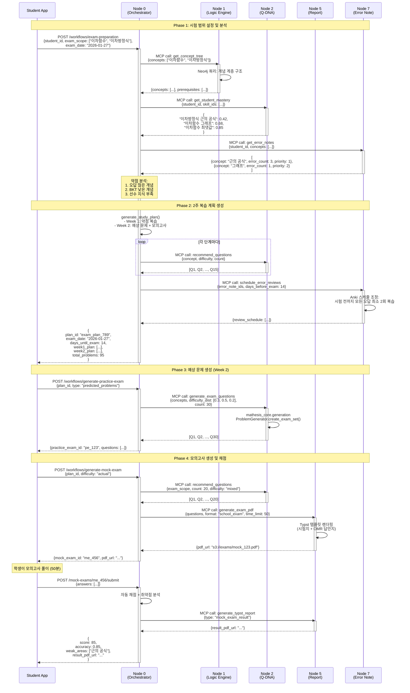

# Use Case 05: 시험 준비

> 학교 시험 2주 전, 학생의 약점 분석 기반 복습 계획 자동 생성 및 예상 문제 제공으로 효율적인 시험 대비

**작성일**: 2026-01-10
**버전**: 1.0
**관련 노드**: Node 0, Node 1, Node 2, Node 5, Node 7

---

## 📋 시나리오 개요

### 상황 설명

중학교 3학년 최수진 학생은 2주 후 중간고사(수학 범위: 이차함수, 이차방정식)를 앞두고 있습니다. **Mathesis 시험 준비 모드**를 활성화하면, 다음과 같은 맞춤형 시험 대비 플랜이 자동 생성됩니다:

1. **시험 범위 설정**
   - 선생님이 지정한 시험 범위: "중학수학.3학년.이차함수, 이차방정식"
   - 예상 시험 날짜: 2026-01-27 (2주 후)

2. **약점 우선 복습**
   - Node 2 (Q-DNA) BKT 분석 결과:
     - 이차방정식 근의 공식: 숙련도 0.42 ❌
     - 이차함수 그래프: 숙련도 0.68 ⚠️
     - 이차함수 최댓값: 숙련도 0.85 ✅
   - Node 7 (Error Note) 오답 분석:
     - "근의 공식 부호 실수" 오답노트 3건 → 복습 우선순위 1위

3. **2주 복습 계획 자동 생성**
   ```
   Week 1 (1/13-1/19):
   - Day 1-3: 이차방정식 근의 공식 집중 복습 (오답노트 3건 + 문제 15개)
   - Day 4-5: 이차함수 그래프 복습 (문제 10개)
   - Day 6-7: 통합 문제 (문제 20개)

   Week 2 (1/20-1/26):
   - Day 8-10: 예상 문제 풀이 (AI 생성 30문제)
   - Day 11-12: 모의고사 2회 (각 20문제)
   - Day 13-14: 오답 재복습 + 최종 점검
   ```

4. **AI 예상 문제 생성**
   - Node 2 (Q-DNA) + mathesis_core.generation으로 시험 범위 내 문제 자동 생성
   - 학교 기출 패턴 분석 (Node 6: School Info)
   - 난이도 분포: 쉬움(30%), 보통(50%), 어려움(20%)

5. **모의고사 생성**
   - Node 5 (Report Node)가 Typst로 실제 시험지 형식 PDF 생성
   - 시간 제한: 50분 (실전 연습)
   - 자동 채점 + 취약점 분석 리포트

### 사용자

- **주 사용자**: 학생 (시험 준비)
- **보조 사용자**: 교사 (시험 범위 설정, 클래스 전체 준비 현황), 학부모 (진행 모니터링)

### 목표

1. **효율적 시험 대비**: 약점 우선 복습으로 시간 절약
2. **과학적 복습 스케줄**: Anki + BKT 기반 최적 복습 시점 계산
3. **실전 연습**: 모의고사로 시간 관리 및 실전 감각 향상
4. **불안감 해소**: 명확한 계획 제공 → 심리적 안정감

---

## 🎯 관련 노드

| Node | 역할 | 주요 작업 |
|------|------|----------|
| **Node 0 (Student Hub)** | 시험 준비 워크플로우 조정 | 복습 계획 생성, 진행 관리, 모든 노드 통합 |
| **Node 1 (Logic Engine)** | 시험 범위 개념 트리 조회 | 시험 범위의 선수 지식 확인, 개념 관계 |
| **Node 2 (Q-DNA)** | 약점 분석 & 문제 추천 | BKT 숙련도 조회, 예상 문제 생성, Twin 문제 |
| **Node 5 (Report Node)** | 모의고사 PDF 생성 | Typst로 시험지 형식 PDF, 채점 리포트 |
| **Node 7 (Error Note)** | 오답 우선 복습 | 시험 범위 내 오답노트 조회, 복습 스케줄 |

---

## 📊 데이터 플로우



---

## 🔄 상세 플로우

### Step 1: 시험 준비 모드 활성화 및 계획 생성

**API**: `POST /api/v1/workflows/exam-preparation`

**Request**:
```json
{
  "student_id": "student_123",
  "exam_scope": ["이차함수", "이차방정식"],
  "exam_date": "2026-01-27",
  "daily_study_minutes": 60,
  "include_school_patterns": true
}
```

**Response**:
```json
{
  "plan_id": "exam_plan_789",
  "exam_date": "2026-01-27",
  "days_until_exam": 14,
  "weak_concepts": [
    {
      "concept": "이차방정식 근의 공식",
      "current_mastery": 0.42,
      "target_mastery": 0.8,
      "error_count": 3,
      "priority": 1
    },
    {
      "concept": "이차함수 그래프",
      "current_mastery": 0.68,
      "target_mastery": 0.85,
      "error_count": 1,
      "priority": 2
    }
  ],
  "study_plan": {
    "week1": {
      "focus": "약점 복습",
      "days": [
        {
          "day": 1,
          "date": "2026-01-13",
          "tasks": [
            {
              "type": "error_review",
              "concept": "이차방정식 근의 공식",
              "error_notes": ["en_1", "en_2", "en_3"],
              "estimated_minutes": 30
            },
            {
              "type": "problem_solving",
              "concept": "이차방정식 근의 공식",
              "question_count": 5,
              "estimated_minutes": 30
            }
          ]
        }
        // ... Day 2-7
      ]
    },
    "week2": {
      "focus": "예상 문제 + 모의고사",
      "days": [
        {
          "day": 8,
          "date": "2026-01-20",
          "tasks": [
            {
              "type": "predicted_problems",
              "question_count": 15,
              "estimated_minutes": 60
            }
          ]
        },
        {
          "day": 11,
          "date": "2026-01-23",
          "tasks": [
            {
              "type": "mock_exam",
              "question_count": 20,
              "time_limit_minutes": 50
            }
          ]
        }
        // ... Day 9-14
      ]
    }
  },
  "total_problems": 95,
  "estimated_study_hours": 14,
  "created_at": "2026-01-13T09:00:00Z"
}
```

**비즈니스 로직** (Node 0 내부):
```python
from datetime import datetime, timedelta
from typing import List, Dict

async def create_exam_preparation_plan(
    student_id: str,
    exam_scope: List[str],
    exam_date: str,
    daily_study_minutes: int = 60
) -> Dict:
    mcp = MCPClientManager()

    exam_date_dt = datetime.fromisoformat(exam_date)
    days_until_exam = (exam_date_dt - datetime.now()).days

    if days_until_exam < 1:
        raise ValueError("시험 날짜가 이미 지났습니다.")

    # 1. 시험 범위 개념 트리 조회 (Node 1)
    concept_tree = await mcp.call("logic-engine", "get_concept_tree", {
        "concepts": exam_scope
    })

    all_concepts = [c["name"] for c in concept_tree["concepts"]]

    # 2. BKT 숙련도 조회 (Node 2)
    mastery = await mcp.call("q-dna", "get_student_mastery", {
        "student_id": student_id,
        "skill_ids": all_concepts
    })

    # 3. 오답노트 조회 (Node 7)
    error_notes = await mcp.call("error-note", "get_error_notes", {
        "student_id": student_id,
        "concepts": all_concepts
    })

    # 4. 약점 분석 (우선순위 계산)
    weak_concepts = analyze_weak_concepts(
        mastery=mastery,
        error_notes=error_notes
    )

    # 5. 2주 복습 계획 생성
    study_plan = generate_exam_study_plan(
        weak_concepts=weak_concepts,
        days_until_exam=days_until_exam,
        daily_study_minutes=daily_study_minutes
    )

    # 6. 오답노트 복습 스케줄 조정 (Node 7)
    await mcp.call("error-note", "schedule_error_reviews", {
        "student_id": student_id,
        "error_note_ids": [en["id"] for en in error_notes],
        "days_before_exam": days_until_exam,
        "target_review_count": 2  # 시험 전까지 최소 2회 복습
    })

    # 7. DB 저장
    exam_plan = ExamPreparationPlan(
        student_id=student_id,
        exam_scope=exam_scope,
        exam_date=exam_date_dt,
        weak_concepts=weak_concepts,
        study_plan=study_plan
    )
    db.add(exam_plan)
    db.commit()

    return exam_plan


def analyze_weak_concepts(
    mastery: Dict[str, float],
    error_notes: List[Dict]
) -> List[Dict]:
    """
    약점 개념 분석 및 우선순위 계산

    우선순위 점수 = (1 - 숙련도) * 0.6 + (오답 개수 / 10) * 0.4
    """
    error_count_by_concept = {}
    for note in error_notes:
        concept = note["concept"]
        error_count_by_concept[concept] = error_count_by_concept.get(concept, 0) + 1

    weak_concepts = []

    for concept, mastery_score in mastery.items():
        if mastery_score < 0.7:  # 숙련도 70% 미만만 복습 대상
            error_count = error_count_by_concept.get(concept, 0)

            # 우선순위 점수 계산
            priority_score = (1 - mastery_score) * 0.6 + min(error_count / 10, 1.0) * 0.4

            weak_concepts.append({
                "concept": concept,
                "current_mastery": mastery_score,
                "target_mastery": min(0.85, mastery_score + 0.3),
                "error_count": error_count,
                "priority_score": priority_score
            })

    # 우선순위 내림차순 정렬
    weak_concepts.sort(key=lambda x: x["priority_score"], reverse=True)

    # 우선순위 번호 부여
    for i, concept in enumerate(weak_concepts):
        concept["priority"] = i + 1

    return weak_concepts


def generate_exam_study_plan(
    weak_concepts: List[Dict],
    days_until_exam: int,
    daily_study_minutes: int
) -> Dict:
    """
    2주 복습 계획 생성

    Week 1 (70%): 약점 집중 복습
    Week 2 (30%): 예상 문제 + 모의고사
    """
    week1_days = min(7, days_until_exam // 2)
    week2_days = days_until_exam - week1_days

    # Week 1: 약점 복습
    week1_plan = []
    for day in range(1, week1_days + 1):
        # 우선순위 높은 개념부터 순환 배정
        concept_index = (day - 1) % len(weak_concepts)
        concept = weak_concepts[concept_index]

        tasks = [
            {
                "type": "error_review",
                "concept": concept["concept"],
                "estimated_minutes": daily_study_minutes // 2
            },
            {
                "type": "problem_solving",
                "concept": concept["concept"],
                "question_count": 5,
                "estimated_minutes": daily_study_minutes // 2
            }
        ]

        week1_plan.append({
            "day": day,
            "date": (datetime.now() + timedelta(days=day - 1)).date().isoformat(),
            "tasks": tasks
        })

    # Week 2: 예상 문제 + 모의고사
    week2_plan = []
    mock_exam_days = [week1_days + 4, week1_days + 6]  # Day 11, 13에 모의고사

    for day in range(week1_days + 1, days_until_exam + 1):
        if day in mock_exam_days:
            tasks = [{
                "type": "mock_exam",
                "question_count": 20,
                "time_limit_minutes": 50
            }]
        else:
            tasks = [{
                "type": "predicted_problems",
                "question_count": 15,
                "estimated_minutes": daily_study_minutes
            }]

        week2_plan.append({
            "day": day,
            "date": (datetime.now() + timedelta(days=day - 1)).date().isoformat(),
            "tasks": tasks
        })

    return {
        "week1": {
            "focus": "약점 복습",
            "days": week1_plan
        },
        "week2": {
            "focus": "예상 문제 + 모의고사",
            "days": week2_plan
        }
    }
```

---

### Step 2: AI 예상 문제 생성

**API**: `POST /api/v1/workflows/generate-practice-exam`

**Request**:
```json
{
  "plan_id": "exam_plan_789",
  "type": "predicted_problems",
  "count": 30,
  "difficulty_distribution": {
    "easy": 0.3,
    "medium": 0.5,
    "hard": 0.2
  }
}
```

**Response**:
```json
{
  "practice_exam_id": "pe_123",
  "questions": [
    {
      "question_id": "q_gen_001",
      "content": "이차방정식 x^2 - 6x + 8 = 0의 두 근을 구하시오.",
      "difficulty": 0.3,
      "difficulty_label": "easy",
      "concept_tags": ["이차방정식", "근의 공식"],
      "generated_by": "mathesis_core.generation",
      "answer": "x = 2 또는 x = 4"
    }
    // ... 29개 더
  ],
  "generated_at": "2026-01-20T10:00:00Z"
}
```

**비즈니스 로직** (Node 2 - mathesis_core 활용):
```python
from mathesis_core.generation import ProblemGenerator

async def generate_exam_questions(
    concepts: List[str],
    count: int,
    difficulty_dist: Dict[str, float]
) -> List[Dict]:
    generator = ProblemGenerator()

    # 난이도별 문제 수 계산
    easy_count = int(count * difficulty_dist["easy"])
    medium_count = int(count * difficulty_dist["medium"])
    hard_count = count - easy_count - medium_count

    questions = []

    # 1. 쉬운 문제 생성
    for _ in range(easy_count):
        q = await generator.create_exam_question(
            concepts=concepts,
            difficulty=0.3,
            question_type="basic"
        )
        questions.append(q)

    # 2. 보통 문제 생성
    for _ in range(medium_count):
        q = await generator.create_exam_question(
            concepts=concepts,
            difficulty=0.5,
            question_type="application"
        )
        questions.append(q)

    # 3. 어려운 문제 생성
    for _ in range(hard_count):
        q = await generator.create_exam_question(
            concepts=concepts,
            difficulty=0.8,
            question_type="complex"
        )
        questions.append(q)

    # 섞기 (난이도 순서 무작위)
    import random
    random.shuffle(questions)

    return questions
```

---

### Step 3: 모의고사 생성 및 채점

**API**: `POST /api/v1/workflows/generate-mock-exam`

**Request**:
```json
{
  "plan_id": "exam_plan_789",
  "difficulty": "actual",
  "time_limit_minutes": 50,
  "question_count": 20
}
```

**Response**:
```json
{
  "mock_exam_id": "me_456",
  "exam_pdf_url": "https://s3.mathesis.ai/exams/mock_456.pdf",
  "answer_sheet_url": "https://s3.mathesis.ai/exams/mock_456_answers.pdf",
  "questions": [
    {
      "number": 1,
      "question_id": "q_001",
      "content": "...",
      "points": 5
    }
    // ... 19개 더
  ],
  "total_points": 100,
  "time_limit_minutes": 50,
  "generated_at": "2026-01-23T09:00:00Z"
}
```

**비즈니스 로직** (Node 5 - Typst 시험지 생성):
```python
import subprocess
from pathlib import Path

async def generate_mock_exam_pdf(
    questions: List[Dict],
    time_limit: int = 50
) -> Dict:
    # 1. Typst 시험지 템플릿
    typst_content = f"""
#set page(paper: "a4", margin: 2cm)
#set text(font: "Noto Sans KR", size: 11pt)

#align(center)[
  #text(size: 20pt, weight: "bold")[수학 모의고사]
  #v(0.5cm)
  #text(size: 14pt)[제한 시간: {time_limit}분 / 총점: 100점]
  #v(0.3cm)
  학년/반: __________ 번호: ______ 이름: __________
]

#v(1cm)

#set enum(numbering: "1.")
#for (i, q) in enumerate({questions}):
  #text(weight: "bold")[#(i+1). (#q["points"]점)]
  #v(0.2cm)
  #q["content"]
  #v(1.5cm)
"""

    # 2. Typst → PDF 컴파일
    typst_file = f"/tmp/mock_exam_{datetime.now().strftime('%Y%m%d%H%M%S')}.typ"
    Path(typst_file).write_text(typst_content)

    pdf_file = typst_file.replace(".typ", ".pdf")
    subprocess.run([
        "typst", "compile",
        typst_file,
        pdf_file
    ], check=True)

    # 3. 답안지 생성 (OMR 형식)
    answer_sheet_content = """
#set page(paper: "a4")
#grid(
  columns: (1fr, 1fr, 1fr, 1fr, 1fr),
  rows: auto,
  gutter: 3pt,
  ..range(1, 21).map(i => [
    #text(weight: "bold")[#i.]
    ① ② ③ ④ ⑤
  ])
)
"""
    answer_sheet_file = pdf_file.replace(".pdf", "_answers.pdf")
    Path(answer_sheet_file.replace(".pdf", ".typ")).write_text(answer_sheet_content)
    subprocess.run([
        "typst", "compile",
        answer_sheet_file.replace(".pdf", ".typ"),
        answer_sheet_file
    ], check=True)

    # 4. S3 업로드
    exam_url = await upload_to_s3(pdf_file, "mathesis-exams")
    answer_url = await upload_to_s3(answer_sheet_file, "mathesis-exams")

    return {
        "exam_pdf_url": exam_url,
        "answer_sheet_url": answer_url
    }
```

---

## 💻 코드 예시

### Frontend - 시험 준비 대시보드

```tsx
import React, { useState, useEffect } from 'react';
import { useParams } from 'react-router-dom';
import { api } from '@/lib/api';

interface ExamPlan {
  plan_id: string;
  exam_date: string;
  days_until_exam: number;
  weak_concepts: any[];
  study_plan: {
    week1: any;
    week2: any;
  };
}

export const ExamPreparationDashboard: React.FC = () => {
  const { planId } = useParams();
  const [plan, setPlan] = useState<ExamPlan | null>(null);
  const [currentDay, setCurrentDay] = useState(1);

  useEffect(() => {
    const fetchPlan = async () => {
      const response = await api.get(`/exam-plans/${planId}`);
      setPlan(response.data);

      // 현재 날짜 기준으로 Day 계산
      const startDate = new Date(response.data.created_at);
      const today = new Date();
      const daysSinceStart = Math.floor(
        (today.getTime() - startDate.getTime()) / (1000 * 60 * 60 * 24)
      );
      setCurrentDay(daysSinceStart + 1);
    };

    fetchPlan();
  }, [planId]);

  if (!plan) return <div>로딩 중...</div>;

  const allDays = [
    ...plan.study_plan.week1.days,
    ...plan.study_plan.week2.days
  ];

  const todayPlan = allDays.find(d => d.day === currentDay);

  return (
    <div className="container mx-auto p-8">
      {/* 헤더 */}
      <div className="bg-gradient-to-r from-blue-500 to-purple-600 text-white rounded-lg shadow p-6 mb-6">
        <h2 className="text-3xl font-bold mb-2">시험 준비 모드</h2>
        <div className="flex gap-6 text-lg">
          <span>D-{plan.days_until_exam}</span>
          <span>시험일: {new Date(plan.exam_date).toLocaleDateString()}</span>
          <span>진행률: {Math.round((currentDay / allDays.length) * 100)}%</span>
        </div>
      </div>

      {/* 약점 개념 */}
      <div className="bg-white rounded shadow p-6 mb-6">
        <h3 className="text-xl font-bold mb-4">약점 개념 (우선순위)</h3>
        <div className="space-y-2">
          {plan.weak_concepts.map((concept: any) => (
            <div key={concept.concept} className="flex items-center gap-4">
              <span className="badge badge-error">{concept.priority}</span>
              <span className="font-medium flex-1">{concept.concept}</span>
              <div className="flex items-center gap-2">
                <span className="text-sm text-gray-600">
                  숙련도: {(concept.current_mastery * 100).toFixed(0)}%
                </span>
                <progress
                  className="progress progress-error w-32"
                  value={concept.current_mastery}
                  max={1}
                />
              </div>
              <span className="text-sm text-red-600">
                오답 {concept.error_count}건
              </span>
            </div>
          ))}
        </div>
      </div>

      {/* 오늘의 계획 */}
      {todayPlan && (
        <div className="bg-blue-50 rounded-lg shadow p-6 mb-6">
          <h3 className="text-xl font-bold mb-4">
            오늘의 계획 (Day {currentDay})
          </h3>
          <div className="space-y-4">
            {todayPlan.tasks.map((task: any, index: number) => (
              <div key={index} className="bg-white rounded p-4">
                <div className="flex justify-between items-center mb-2">
                  <h4 className="font-bold">
                    {task.type === 'error_review' && '📝 오답 복습'}
                    {task.type === 'problem_solving' && '✍️ 문제 풀이'}
                    {task.type === 'predicted_problems' && '🎯 예상 문제'}
                    {task.type === 'mock_exam' && '📄 모의고사'}
                  </h4>
                  <span className="text-sm text-gray-600">
                    {task.estimated_minutes || task.time_limit_minutes}분
                  </span>
                </div>
                {task.concept && (
                  <p className="text-sm text-gray-600 mb-2">
                    개념: {task.concept}
                  </p>
                )}
                <button
                  className="btn btn-primary btn-sm"
                  onClick={() => {
                    if (task.type === 'mock_exam') {
                      window.location.href = `/exam-plans/${planId}/mock-exam`;
                    } else {
                      window.location.href = `/exam-plans/${planId}/day/${currentDay}`;
                    }
                  }}
                >
                  시작하기
                </button>
              </div>
            ))}
          </div>
        </div>
      )}

      {/* 전체 일정 타임라인 */}
      <div className="bg-white rounded shadow p-6">
        <h3 className="text-xl font-bold mb-4">전체 일정</h3>
        <div className="timeline timeline-vertical">
          {allDays.map((day: any) => (
            <div
              key={day.day}
              className={`timeline-item ${
                day.day === currentDay ? 'timeline-item-primary' : ''
              } ${day.day < currentDay ? 'timeline-item-success' : ''}`}
            >
              <div className="timeline-start">Day {day.day}</div>
              <div className="timeline-middle">
                {day.day < currentDay ? '✅' : day.day === currentDay ? '🔵' : '⏳'}
              </div>
              <div className="timeline-end">
                <div className="text-sm text-gray-600">{day.date}</div>
                <div className="text-xs">
                  {day.tasks.map((t: any) => t.type).join(', ')}
                </div>
              </div>
            </div>
          ))}
        </div>
      </div>
    </div>
  );
};
```

---

## 📈 기대 효과

### 교육적 효과

1. **효율적 시험 대비**
   - 약점 우선 복습 → 학습 시간 최적화
   - 과학적 복습 스케줄 (Anki + BKT) → 기억 강화

2. **실전 감각 향상**
   - 모의고사로 시간 관리 연습
   - 실제 시험지 형식 PDF → 시험 친숙도 증가

3. **불안감 해소**
   - 명확한 2주 계획 → 심리적 안정감
   - 진행률 시각화 → 성취감 및 동기 부여

4. **자기 주도 학습**
   - "무엇을 공부할지" 고민 불필요
   - 매일 구체적인 학습 과제 제시

### 시스템 효율성

1. **자동화된 계획 생성**
   - BKT + 오답노트 기반 약점 자동 탐지
   - 교사가 수동으로 계획 작성할 필요 없음

2. **AI 문제 생성**
   - mathesis_core.generation으로 무한 예상 문제
   - 학교 기출 패턴 분석 (Node 6 활용 가능)

3. **실시간 진행 추적**
   - Redis로 일일 진행률 캐싱
   - 부모/교사 대시보드에서 모니터링

4. **확장 가능한 리포트**
   - Typst로 다양한 시험 형식 지원
   - 자동 채점 + 취약점 분석 리포트

---

**Last Updated**: 2026-01-10
**Contributors**: Claude Sonnet 4.5
